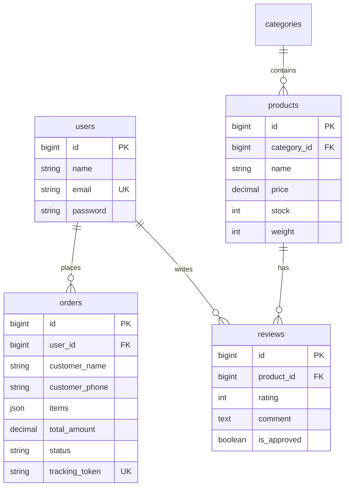

# Platform E-Commerce Ivo Karya 🚀
> *Menjembatani kesenjangan antara kapasitas produksi dan kinerja penjualan digital.*


## 📖 Pendahuluan

**Ivo Karya E-Commerce** adalah platform digital premium yang dirancang untuk memecahkan tantangan bisnis kritis bagi UMKM di Sidenreng Rappang. Secara khusus, proyek ini mengatasi disparitas antara **kapasitas produksi 50kg** Abon Ikan/Sapi dan **volume penjualan saat ini yang hanya 37kg**.

Dengan beralih dari penjualan konvensional ke etalase digital yang canggih dan otomatis, proyek ini bertujuan untuk memaksimalkan jangkauan pasar, merampingkan operasional, dan mengangkat citra merek *Ivo Karya* ke level premium.

**Pengembang**: Mustari Syahding (KS1122016)  
**Institusi**: Universitas Ichsan Sidenreng Rappang

---

## 🛠 Detail Teknologi

Dibangun di atas ekosistem **TALL Stack** yang tangguh, memastikan kinerja, skalabilitas, dan kemudahan pengembangan.

| Komponen | Teknologi | Deskripsi |
| :--- | :--- | :--- |
| **Backend Framework** | **Laravel 11** (PHP 8.2+) | Pondasi utama. Arsitektur MVC modern yang kuat dan aman. |
| **Admin Panel** | **Filament PHP v3** | Panel admin kaya fitur untuk mengelola pesanan, produk, dan pengaturan. |
| **Frontend** | **Blade + Tailwind CSS + Alpine.js** | Pengalaman imersif "Scroll-driven" yang terinspirasi dari halaman peluncuran produk Apple. |
| **Database** | **MySQL** | Basis data relasional yang andal untuk data pesanan dan produk yang terstruktur. |
| **Otomatisasi** | **Fonnte API** | Integrasi WhatsApp Gateway untuk otomatisasi penuh tagihan dan notifikasi. |

---

## ✅ Fitur Utama

### 🍎 UX ala Apple & Storytelling
Website publik menyimpang dari tata letak e-commerce datar tradisional. Menggunakan **animasi berbasis scroll**, glassmorphism (kartu kaca), dan citra resolusi tinggi untuk menceritakan kualitas "Abon Ikan Ivo Karya".

### 🤖 Otomatisasi Penuh (Integrasi Fonnte)
Pengiriman pesan manual adalah masa lalu.
- **Tagihan Otomatis**: Saat pesanan dibuat, pesan WhatsApp berisi detail pembayaran dikirim secara instan ke pelanggan.
- **Update Pengiriman**: Saat status berubah menjadi `Shipped`, nomor resi dan link pelacakan dikirim otomatis.

### 📊 Dashboard Analitik Filament
Pengambilan keputusan berbasis data.
- **Grafik Real vs Target**: Perbandingan visual penjualan aktual terhadap target produksi 50kg.
- **Tren Pendapatan**: Visualisasi kinerja bulanan.
- **Distribusi Status Pesanan**: Wawasan cepat tentang pesanan tertunda vs selesai.
- **Pertumbuhan Pelanggan**: Melacak akuisisi pengguna baru dari waktu ke waktu.

### 🔒 Fitur Privasi & Keamanan
- **Admin Entry Tersembunyi**: Tidak ada tombol "Admin Login" yang merusak pemandangan di header. Akses ditempatkan secara tersembunyi di footer untuk menjaga eksklusivitas merek.
- **Pengaturan Dinamis**: Admin dapat memperbarui nomor WhatsApp dan info Rekening Bank langsung dari dashboard tanpa menyentuh kode.
- **Pelacakan Aman**: Pesanan dilacak melalui `tracking_token` yang unik dan di-hash, memastikan pelanggan hanya bisa melihat pesanan mereka sendiri.

---

## 🛠 Rencana Pengembangan (Roadmap)

| Fitur | Status | Deskripsi |
| :--- | :--- | :--- |
| **Integrasi RajaOngkir** | 📝 Direncanakan | Perhitungan biaya pengiriman otomatis berdasarkan berat dan lokasi. |
| **Ekspor Laporan** | 📝 Direncanakan | Pembuatan laporan penjualan bulanan PDF/Excel sekali klik untuk pembukuan. |
| **Prediksi Inventaris** | 🧠 Konsep AI | Peringatan berbasis AI yang memprediksi penipisan stok berdasarkan kecepatan penjualan. |
| **PWA Support** | 📱 Direncanakan | Memungkinkan pelanggan menginstal website sebagai aplikasi mobile native. |

---

## ⚙️ Panduan Instalasi

Ikuti langkah-langkah ini untuk menjalankan proyek secara lokal.

### Prasyarat
- PHP 8.2 atau lebih tinggi
- Composer
- Node.js & NPM
- MySQL Server

### Langkah-langkah

1.  **Clone Repository**
    ```bash
    git clone https://github.com/username/website-ivo-karya.git
    cd website-ivo-karya
    ```

2.  **Install Dependencies**
    ```bash
    composer install
    npm install
    ```

3.  **Setup Environment**
    Salin file `.env.example` ke `.env` dan konfigurasikan database serta kredensial Fonnte Anda.
    ```bash
    cp .env.example .env
    php artisan key:generate
    ```
    *Catatan: Pastikan Anda mengatur `FONNTE_TOKEN` di `.env` atau melalui Pengaturan Dashboard Admin.*

4.  **Migrasi Database & Seeding**
    ```bash
    php artisan migrate --seed
    ```

5.  **Jalankan Server Development**
    Buka dua tab terminal:
    ```bash
    # Terminal 1 (Backend)
    php artisan serve

    # Terminal 2 (Frontend Assets)
    npm run dev
    ```

---

## 🏗 Arsitektur Proyek

Sistem mengikuti pola **MVC (Model-View-Controller)** standar yang ditegakkan oleh Laravel.

- **Services**: `FonnteService` mengabstraksi logika API WhatsApp, menjaga Controller tetap bersih.
- **Filament Resources**: Logika admin dikapsulasi dalam `app/Filament/`, memisahkan operasional back-office dari frontend publik.
- **Livewire Components**: Digunakan untuk elemen frontend dinamis seperti **Sistem Ulasan Produk** dan **Modal Keranjang**.

---

## 📂 Struktur Folder

```
website-ivo-karya/
├── app/
│   ├── Filament/           # Admin panel resources & widgets
│   │   ├── Resources/      # CRUD resources (Product, Order, etc.)
│   │   └── Widgets/        # Dashboard charts & stats
│   ├── Http/Controllers/
│   │   ├── Front/          # Public controllers (Home, Cart, Track)
│   │   └── Admin/          # Admin controllers (deprecated, use Filament)
│   ├── Models/             # Eloquent models
│   ├── Services/           # Business logic (FonnteService)
│   └── Livewire/           # Livewire components
├── database/
│   ├── migrations/         # Database schema
│   └── seeders/            # Sample data
├── docs/                   # 📚 Dokumentasi Lengkap
├── resources/
│   └── views/
│       ├── front/          # Public pages (catalog, cart, track)
│       ├── components/     # Reusable Blade components
│       └── layouts/        # Layout templates
├── routes/
│   ├── web.php             # Public routes
│   └── auth.php            # Authentication routes
└── public/                 # Static assets
```

---

## 🗄️ Database Schema



---

## 📚 Dokumentasi Lengkap

Dokumentasi komprehensif tersedia di folder `docs/`:

| Dokumen | Deskripsi | Link |
|:--------|:----------|:-----|
| 🎨 **Design & Arsitektur** | Diagram UML, ERD, Sequence | [DESIGN.md](docs/DESIGN.md) |
| 📊 **Panduan Admin Dashboard** | 7 halaman admin dengan flowchart | [ADMIN_DASHBOARD_GUIDE.md](docs/ADMIN_DASHBOARD_GUIDE.md) |
| 🌐 **Panduan Halaman Publik** | 8 halaman publik dengan user journey | [PUBLIC_PAGES_GUIDE.md](docs/PUBLIC_PAGES_GUIDE.md) |
| 🔒 **Keamanan Sistem** | Auth, RBAC, validasi | [SECURITY_SYSTEM.md](docs/SECURITY_SYSTEM.md) |
| 📦 **Dependencies** | Daftar library & package | [DEPENDENCIES.md](docs/DEPENDENCIES.md) |
| 🔬 **White Box Testing** | Pengujian struktural | [WHITE_BOX_TESTING.md](docs/WHITE_BOX_TESTING.md) |
| 🧪 **Black Box Testing** | Pengujian fungsional | [BLACK_BOX_TESTING.md](docs/BLACK_BOX_TESTING.md) |

---

## 🔧 Troubleshooting

<details>
<summary><strong>❌ Error: SQLSTATE Connection refused</strong></summary>

**Penyebab**: MySQL server tidak berjalan.

**Solusi**:
```bash
# Windows
net start mysql

# Linux/Mac
sudo service mysql start
```
</details>

<details>
<summary><strong>❌ Error: Class not found</strong></summary>

**Penyebab**: Autoloader belum di-refresh setelah install package.

**Solusi**:
```bash
composer dump-autoload
php artisan optimize:clear
```
</details>

<details>
<summary><strong>❌ Vite manifest not found</strong></summary>

**Penyebab**: Frontend assets belum di-compile.

**Solusi**:
```bash
npm run dev
# atau untuk production
npm run build
```
</details>

<details>
<summary><strong>❌ 419 Page Expired</strong></summary>

**Penyebab**: CSRF token expired atau session timeout.

**Solusi**:
1. Clear browser cookies
2. Atau jalankan: `php artisan cache:clear`
</details>

---

## 📄 Lisensi

Project ini dikembangkan untuk keperluan **Tugas Akhir/Skripsi**.

**Universitas Ichsan Sidenreng Rappang** © 2026

---

<p align="center">
  <br>
  Dibuat dengan ❤️ oleh <strong>Mustari Syahding</strong> untuk <strong>UMKM Indonesia</strong>.
</p>

