# 📊 Activity Diagrams - Platform E-Commerce Ivo Karya

> **Kumpulan Diagram Aktivitas untuk Setiap Halaman Sistem**

---

## 📋 Daftar Isi

### Halaman Publik
1. [Landing Page](#1-landing-page)
2. [Katalog Produk](#2-katalog-produk)
3. [Detail Produk](#3-detail-produk)
4. [Keranjang Belanja](#4-keranjang-belanja)
5. [Checkout](#5-checkout)
6. [Pelacakan Pesanan](#6-pelacakan-pesanan)
7. [Daftar Artikel](#7-daftar-artikel)
8. [Detail Artikel](#8-detail-artikel)
9. [Login](#9-login)
10. [Register](#10-register)

### Halaman Admin
11. [Dashboard Admin](#11-dashboard-admin)
12. [Manajemen Produk](#12-manajemen-produk)
13. [Manajemen Kategori](#13-manajemen-kategori)
14. [Manajemen Pesanan](#14-manajemen-pesanan)
15. [Manajemen Artikel](#15-manajemen-artikel)
16. [Moderasi Review](#16-moderasi-review)
17. [Pengaturan Sistem](#17-pengaturan-sistem)

---

## Halaman Publik

---

### 1. Landing Page

**URL:** `/`

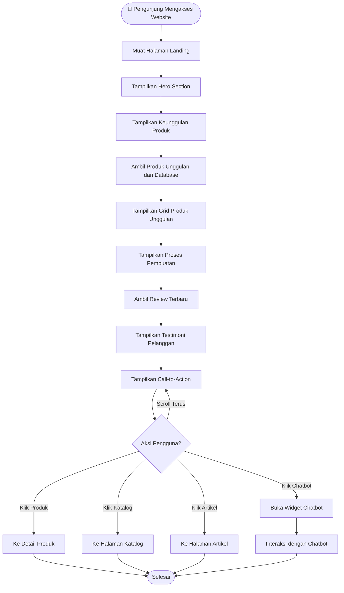

---

### 2. Katalog Produk

**URL:** `/katalog`

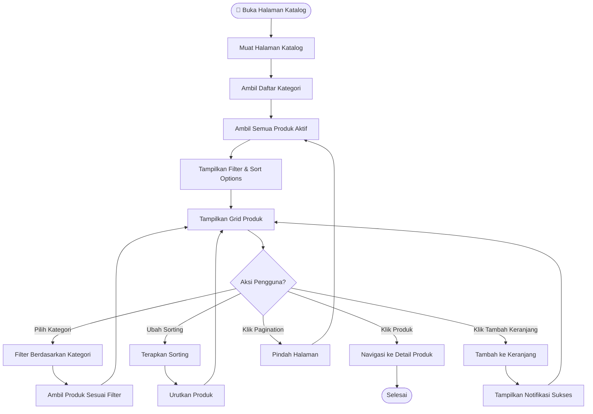

---

### 3. Detail Produk

**URL:** `/product/{slug}`

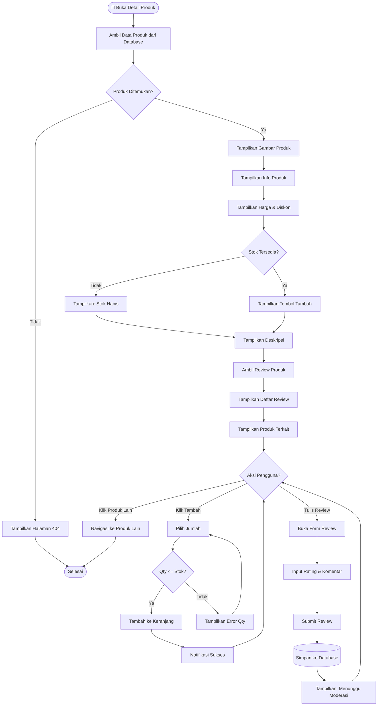

---

### 4. Keranjang Belanja

**URL:** `/cart`

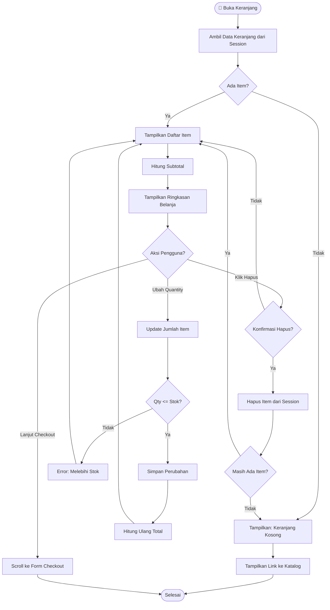

---

### 5. Checkout

**URL:** `/cart` (bagian checkout form)

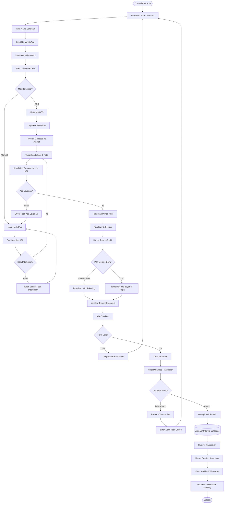

---

### 6. Pelacakan Pesanan

**URL:** `/track` dan `/order/track/{token}`

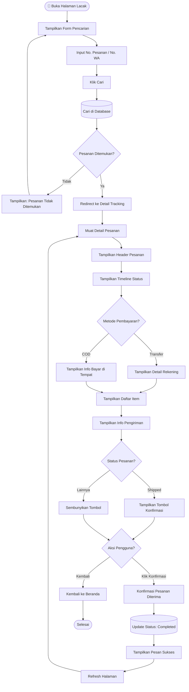

---

### 7. Daftar Artikel

**URL:** `/articles`

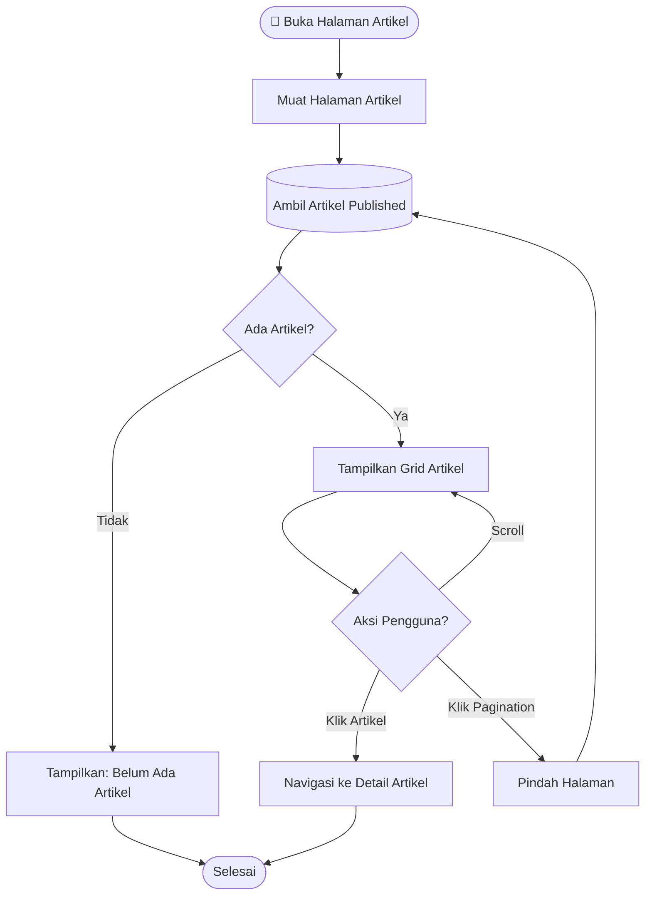

---

### 8. Detail Artikel

**URL:** `/articles/{slug}`

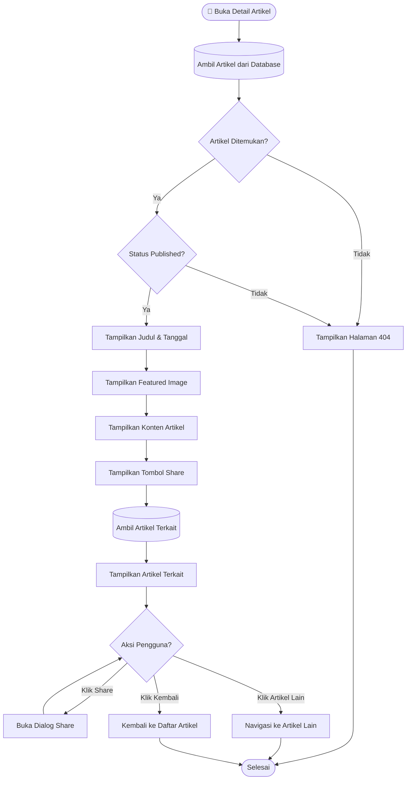

---

### 9. Login

**URL:** `/login`

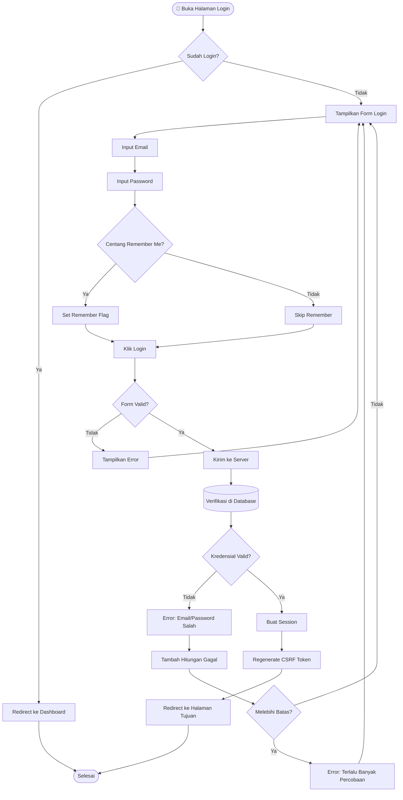

---

### 10. Register

**URL:** `/register`

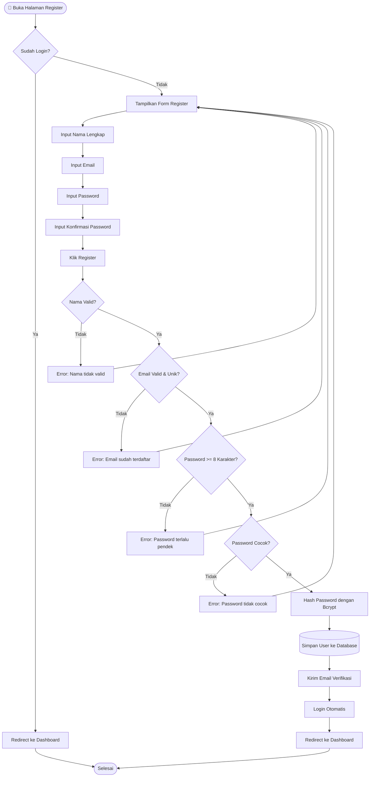

---

## Halaman Admin

---

### 11. Dashboard Admin

**URL:** `/admin`

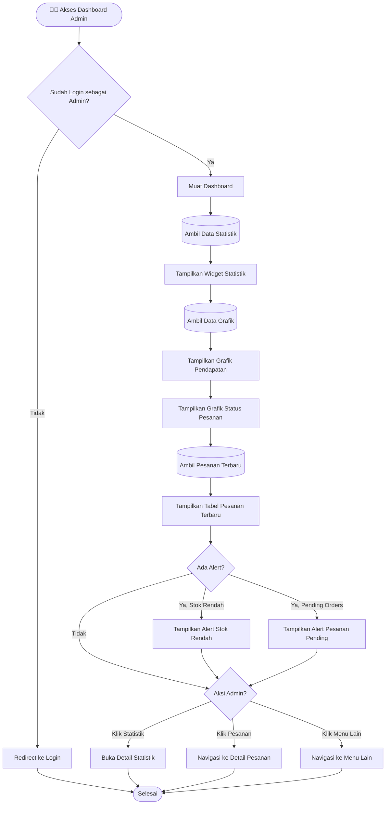

---

### 12. Manajemen Produk

**URL:** `/admin/products`

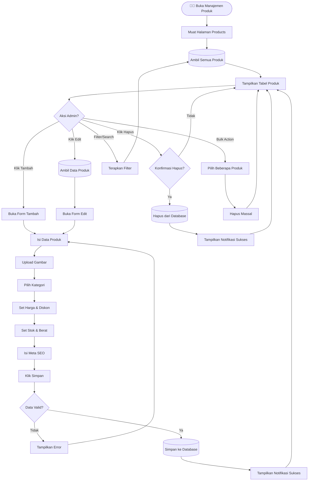

---

### 13. Manajemen Kategori

**URL:** `/admin/categories`

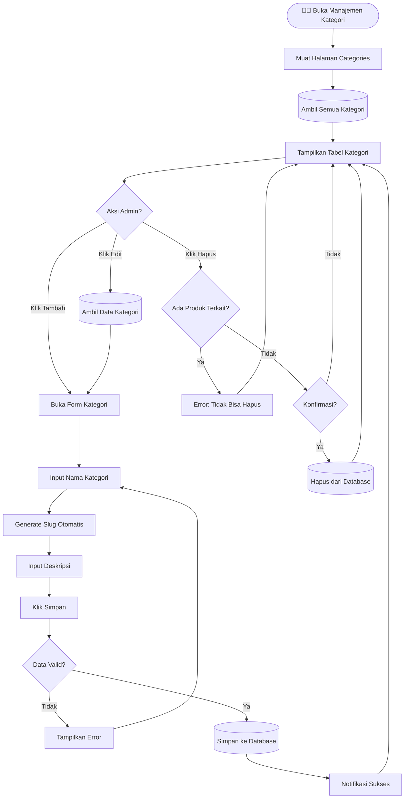

---

### 14. Manajemen Pesanan

**URL:** `/admin/orders`

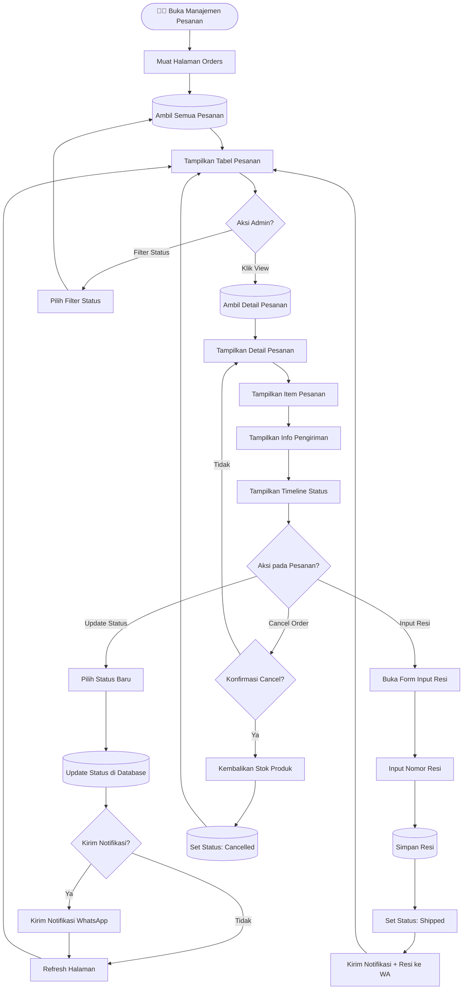

---

### 15. Manajemen Artikel

**URL:** `/admin/articles`

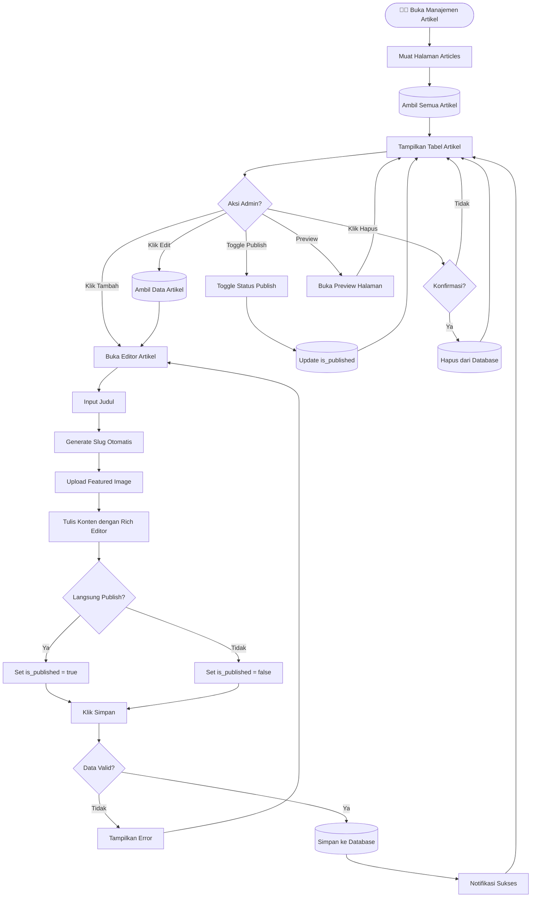

---

### 16. Moderasi Review

**URL:** `/admin/reviews`

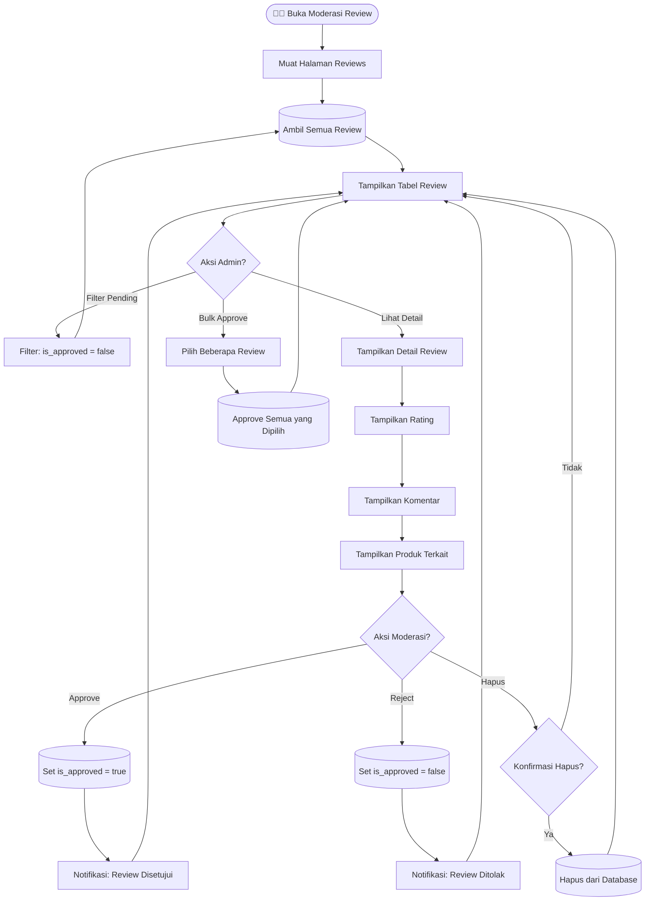

---

### 17. Pengaturan Sistem

**URL:** `/admin/settings`

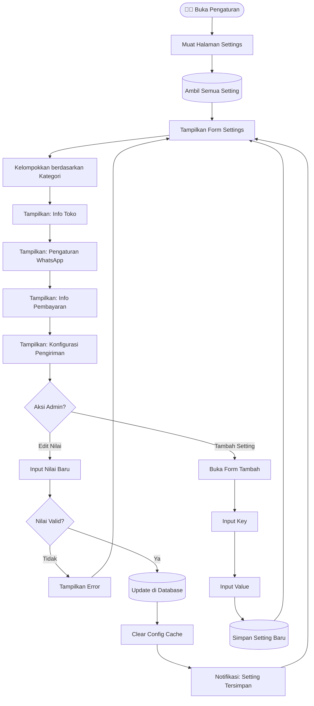

---

## 📝 Catatan

### Legenda Simbol

| Simbol | Makna |
|:-------|:------|
| `([...])` | Start/End node |
| `[...]` | Process/Action |
| `{...}` | Decision/Condition |
| `[(...)` | Database operation |
| `-->` | Alur normal |
| `-->|label|` | Alur dengan kondisi |

### Teknologi yang Digunakan

- **Diagram Tool**: Mermaid.js
- **Flowchart Type**: flowchart TD (Top-Down)
- **Compatible with**: GitHub, GitLab, Notion, Obsidian

---

*Dokumentasi ini dibuat untuk keperluan Tugas Akhir/Skripsi*  
**Universitas Ichsan Sidenreng Rappang** © 2026
