# Activity Diagram - Platform E-Commerce Ivo Karya

> **Kumpulan Diagram Aktivitas (*Activity Diagram*) untuk Setiap Halaman pada Sistem E-Commerce Ivo Karya**

Activity diagram merupakan salah satu diagram perilaku (*behavioral diagram*) dalam Unified Modeling Language (UML) yang digunakan untuk memodelkan alur kerja (*workflow*) suatu proses bisnis secara visual. Diagram ini menggambarkan urutan aktivitas dari titik awal (*initial node*) hingga titik akhir (*final node*), termasuk percabangan keputusan (*decision node*) dan alur alternatif yang mungkin terjadi dalam interaksi antara aktor dengan sistem.

Pada penelitian ini, activity diagram disusun menggunakan teknik *swimlane* yang membagi aktivitas ke dalam dua partisi utama, yaitu partisi **Aktor** (Pelanggan atau Admin) dan partisi **Sistem**. Pembagian ini bertujuan untuk memperjelas tanggung jawab masing-masing entitas dalam setiap proses yang berlangsung.

---

## Daftar Isi

### Halaman Publik
1. [Landing Page](#1-landing-page)
2. [Katalog Produk](#2-katalog-produk)
3. [Detail Produk](#3-detail-produk)
4. [Keranjang Belanja](#4-keranjang-belanja)
5. [Checkout](#5-checkout)
6. [Pelacakan Pesanan](#6-pelacakan-pesanan)
7. [Daftar Artikel](#7-daftar-artikel)
8. [Detail Artikel](#8-detail-artikel)
9. [Login](#9-login)
10. [Register](#10-register)

### Halaman Admin
11. [Dashboard Admin](#11-dashboard-admin)
12. [Manajemen Produk](#12-manajemen-produk)
13. [Manajemen Kategori](#13-manajemen-kategori)
14. [Manajemen Pesanan](#14-manajemen-pesanan)
15. [Manajemen Artikel](#15-manajemen-artikel)
16. [Moderasi Review](#16-moderasi-review)
17. [Pengaturan Sistem](#17-pengaturan-sistem)

---

## Halaman Publik

---

### 1. Landing Page

**Gambar 4.1** Activity Diagram Landing Page

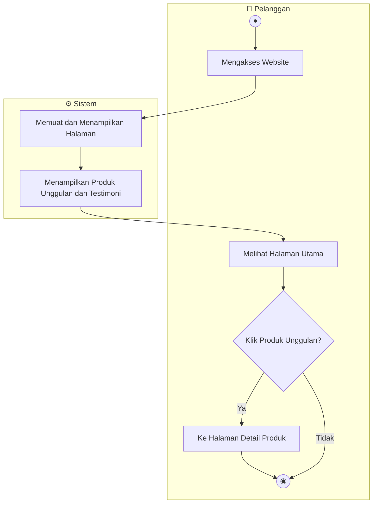
```mermaid
flowchart TD
    subgraph Pelanggan["👤 Pelanggan"]
        P1((●))
        P2[Mengakses Website]
        P3[Melihat Halaman Utama]
        P4{Klik Produk Unggulan?}
        P5[Ke Halaman Detail Produk]
        P6((◉))
    end

    subgraph Sistem["⚙️ Sistem"]
        S1[Memuat dan Menampilkan Halaman]
        S2[Menampilkan Produk Unggulan dan Testimoni]
    end

    P1 --> P2
    P2 --> S1
    S1 --> S2
    S2 --> P3
    P3 --> P4
    P4 -->|Ya| P5
    P5 --> P6
    P4 -->|Tidak| P6
```

**Penjelasan:**
Diagram aktivitas pada Gambar 4.1 mengilustrasikan alur interaksi pengguna saat mengakses halaman utama (*landing page*) platform e-commerce Ivo Karya. Proses dimulai ketika pelanggan mengakses URL utama website. Sistem kemudian memuat seluruh komponen halaman yang mencakup *hero section*, daftar produk unggulan, serta testimoni pelanggan. Setelah halaman ditampilkan, pelanggan memiliki opsi untuk mengklik salah satu produk unggulan yang akan mengarahkan ke halaman detail produk, atau mengakhiri sesi penelusuran.

---

### 2. Katalog Produk

**Gambar 4.2** Activity Diagram Katalog Produk

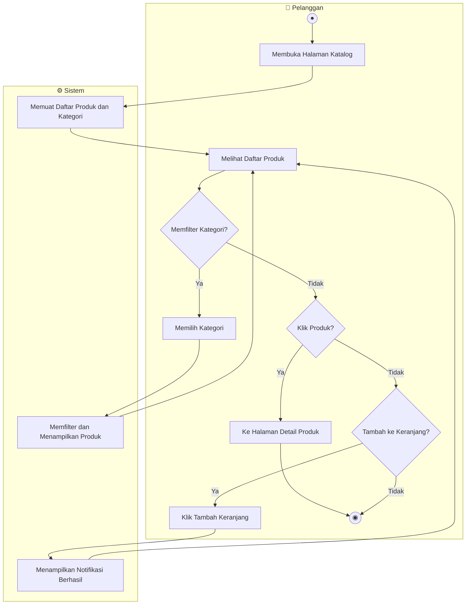
```mermaid
flowchart TD
    subgraph Pelanggan["👤 Pelanggan"]
        P1((●))
        P2[Membuka Halaman Katalog]
        P3[Melihat Daftar Produk]
        P4{Memfilter Kategori?}
        P5[Memilih Kategori]
        P6{Klik Produk?}
        P7[Ke Halaman Detail Produk]
        P8{Tambah ke Keranjang?}
        P9[Klik Tambah Keranjang]
        P10((◉))
    end

    subgraph Sistem["⚙️ Sistem"]
        S1[Memuat Daftar Produk dan Kategori]
        S2[Memfilter dan Menampilkan Produk]
        S3[Menampilkan Notifikasi Berhasil]
    end

    P1 --> P2
    P2 --> S1
    S1 --> P3
    P3 --> P4
    P4 -->|Ya| P5
    P5 --> S2
    S2 --> P3
    P4 -->|Tidak| P6
    P6 -->|Ya| P7
    P7 --> P10
    P6 -->|Tidak| P8
    P8 -->|Ya| P9
    P9 --> S3
    S3 --> P3
    P8 -->|Tidak| P10
```

**Penjelasan:**
Diagram aktivitas pada Gambar 4.2 menggambarkan proses penelusuran katalog produk oleh pelanggan. Saat halaman katalog diakses, sistem memuat seluruh data produk beserta kategori yang tersedia. Pelanggan dapat melakukan penyaringan (*filtering*) berdasarkan kategori tertentu, di mana sistem akan menampilkan ulang daftar produk yang sesuai. Terdapat dua *decision node* utama: pertama, keputusan untuk melihat detail produk yang mengarah ke halaman terpisah; kedua, keputusan untuk menambahkan produk ke keranjang belanja secara langsung dari halaman katalog, yang akan direspons sistem dengan notifikasi keberhasilan.

---

### 3. Detail Produk

**Gambar 4.3** Activity Diagram Detail Produk

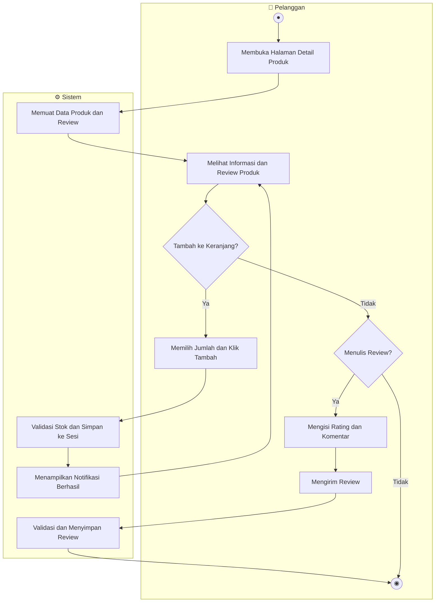
```mermaid
flowchart TD
    subgraph Pelanggan["👤 Pelanggan"]
        P1((●))
        P2[Membuka Halaman Detail Produk]
        P3[Melihat Informasi dan Review Produk]
        P4{Tambah ke Keranjang?}
        P5[Memilih Jumlah dan Klik Tambah]
        P6{Menulis Review?}
        P7[Mengisi Rating dan Komentar]
        P8[Mengirim Review]
        P9((◉))
    end

    subgraph Sistem["⚙️ Sistem"]
        S1[Memuat Data Produk dan Review]
        S2[Validasi Stok dan Simpan ke Sesi]
        S3[Menampilkan Notifikasi Berhasil]
        S4[Validasi dan Menyimpan Review]
    end

    P1 --> P2
    P2 --> S1
    S1 --> P3
    P3 --> P4
    P4 -->|Ya| P5
    P5 --> S2
    S2 --> S3
    S3 --> P3
    P4 -->|Tidak| P6
    P6 -->|Ya| P7
    P7 --> P8
    P8 --> S4
    S4 --> P9
    P6 -->|Tidak| P9
```

**Penjelasan:**
Diagram aktivitas pada Gambar 4.3 memodelkan interaksi pelanggan pada halaman detail produk. Proses diawali dengan pemuatan data produk beserta ulasan (*review*) yang telah disetujui oleh admin. Pelanggan dapat menambahkan produk ke keranjang belanja, di mana sistem terlebih dahulu memvalidasi ketersediaan stok sebelum menyimpan data ke dalam sesi. Selain itu, pelanggan juga memiliki opsi untuk memberikan ulasan berupa *rating* dan komentar yang akan divalidasi sebelum disimpan ke dalam basis data.

---

### 4. Keranjang Belanja

**Gambar 4.4** Activity Diagram Keranjang Belanja

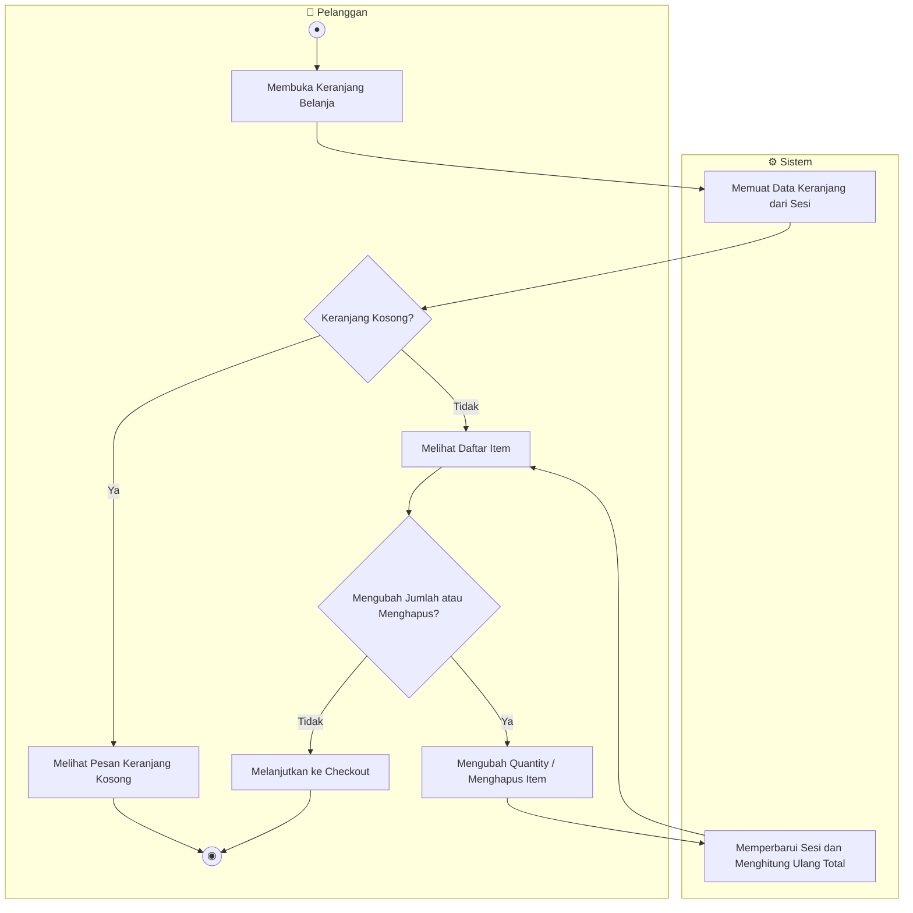
```mermaid
flowchart TD
    subgraph Pelanggan["👤 Pelanggan"]
        P1((●))
        P2[Membuka Keranjang Belanja]
        P3{Keranjang Kosong?}
        P4[Melihat Pesan Keranjang Kosong]
        P5[Melihat Daftar Item]
        P6{Mengubah Jumlah atau Menghapus?}
        P7[Mengubah Quantity / Menghapus Item]
        P8[Melanjutkan ke Checkout]
        P9((◉))
    end

    subgraph Sistem["⚙️ Sistem"]
        S1[Memuat Data Keranjang dari Sesi]
        S2[Memperbarui Sesi dan Menghitung Ulang Total]
    end

    P1 --> P2
    P2 --> S1
    S1 --> P3
    P3 -->|Ya| P4
    P4 --> P9
    P3 -->|Tidak| P5
    P5 --> P6
    P6 -->|Ya| P7
    P7 --> S2
    S2 --> P5
    P6 -->|Tidak| P8
    P8 --> P9
```

**Penjelasan:**
Diagram aktivitas pada Gambar 4.4 mendeskripsikan alur pengelolaan keranjang belanja oleh pelanggan. Ketika halaman dibuka, sistem mengambil data keranjang dari sesi pengguna. Apabila keranjang dalam keadaan kosong, sistem menampilkan pesan informasi dan proses berakhir. Sebaliknya, apabila terdapat item dalam keranjang, pelanggan dapat melakukan modifikasi kuantitas atau penghapusan item. Setiap perubahan akan memicu sistem untuk memperbarui data sesi dan menghitung ulang total belanja. Pelanggan kemudian dapat melanjutkan ke proses *checkout*.

---

### 5. Checkout

**Gambar 4.5** Activity Diagram Checkout

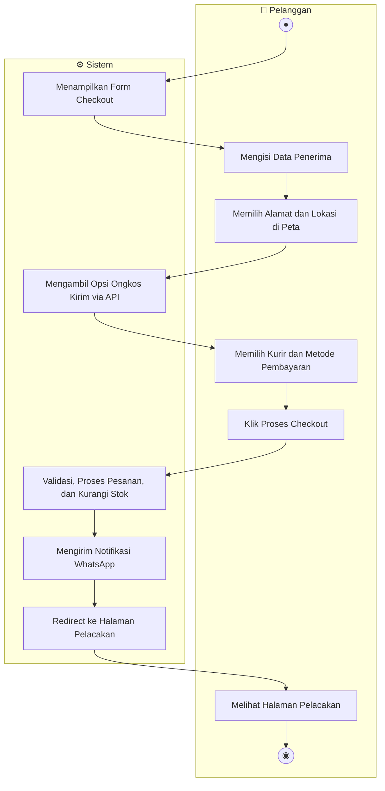
```mermaid
flowchart TD
    subgraph Pelanggan["👤 Pelanggan"]
        P1((●))
        P2[Mengisi Data Penerima]
        P3[Memilih Alamat dan Lokasi di Peta]
        P4[Memilih Kurir dan Metode Pembayaran]
        P5[Klik Proses Checkout]
        P6[Melihat Halaman Pelacakan]
        P7((◉))
    end

    subgraph Sistem["⚙️ Sistem"]
        S1[Menampilkan Form Checkout]
        S2[Mengambil Opsi Ongkos Kirim via API]
        S3[Validasi, Proses Pesanan, dan Kurangi Stok]
        S4[Mengirim Notifikasi WhatsApp]
        S5[Redirect ke Halaman Pelacakan]
    end

    P1 --> S1
    S1 --> P2
    P2 --> P3
    P3 --> S2
    S2 --> P4
    P4 --> P5
    P5 --> S3
    S3 --> S4
    S4 --> S5
    S5 --> P6
    P6 --> P7
```

**Penjelasan:**
Diagram aktivitas pada Gambar 4.5 mengilustrasikan proses *checkout* yang merupakan tahapan kritis dalam transaksi e-commerce. Alur dimulai dengan pengisian data penerima (nama dan nomor telepon), dilanjutkan dengan pemilihan alamat pengiriman melalui peta interaktif. Sistem kemudian mengambil opsi ongkos kirim melalui integrasi API Komerce. Setelah pelanggan memilih kurir dan metode pembayaran, sistem melakukan validasi menyeluruh, memproses pesanan dalam satu transaksi basis data (*database transaction*), mengurangi stok produk, dan mengirimkan notifikasi melalui WhatsApp API. Proses diakhiri dengan pengalihan (*redirect*) ke halaman pelacakan pesanan.

---

### 6. Pelacakan Pesanan

**Gambar 4.6** Activity Diagram Pelacakan Pesanan

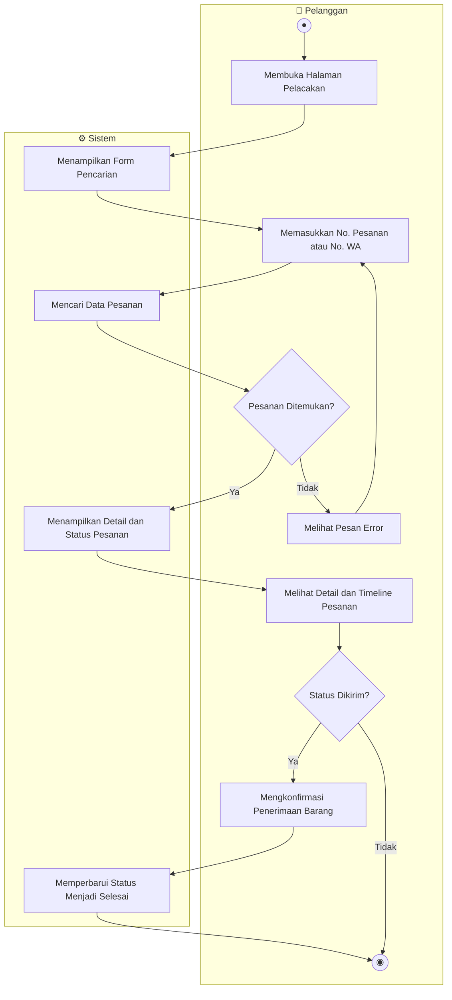
```mermaid
flowchart TD
    subgraph Pelanggan["👤 Pelanggan"]
        P1((●))
        P2[Membuka Halaman Pelacakan]
        P3[Memasukkan No. Pesanan atau No. WA]
        P4{Pesanan Ditemukan?}
        P5[Melihat Pesan Error]
        P6[Melihat Detail dan Timeline Pesanan]
        P7{Status Dikirim?}
        P8[Mengkonfirmasi Penerimaan Barang]
        P9((◉))
    end

    subgraph Sistem["⚙️ Sistem"]
        S1[Menampilkan Form Pencarian]
        S2[Mencari Data Pesanan]
        S3[Menampilkan Detail dan Status Pesanan]
        S4[Memperbarui Status Menjadi Selesai]
    end

    P1 --> P2
    P2 --> S1
    S1 --> P3
    P3 --> S2
    S2 --> P4
    P4 -->|Tidak| P5
    P5 --> P3
    P4 -->|Ya| S3
    S3 --> P6
    P6 --> P7
    P7 -->|Ya| P8
    P8 --> S4
    S4 --> P9
    P7 -->|Tidak| P9
```

**Penjelasan:**
Diagram aktivitas pada Gambar 4.6 menggambarkan mekanisme pelacakan pesanan oleh pelanggan. Proses dimulai dengan pengisian nomor pesanan atau nomor WhatsApp pada form pencarian. Sistem kemudian melakukan pencarian data pesanan pada basis data. Apabila pesanan tidak ditemukan, sistem menampilkan pesan *error* dan pelanggan dapat mencoba kembali (*loop back*). Apabila pesanan ditemukan, sistem menampilkan detail pesanan beserta *timeline* status. Pada kondisi status pesanan telah "Dikirim", pelanggan dapat mengonfirmasi penerimaan barang yang akan mengubah status pesanan menjadi "Selesai".

---

### 7. Daftar Artikel

**Gambar 4.7** Activity Diagram Daftar Artikel

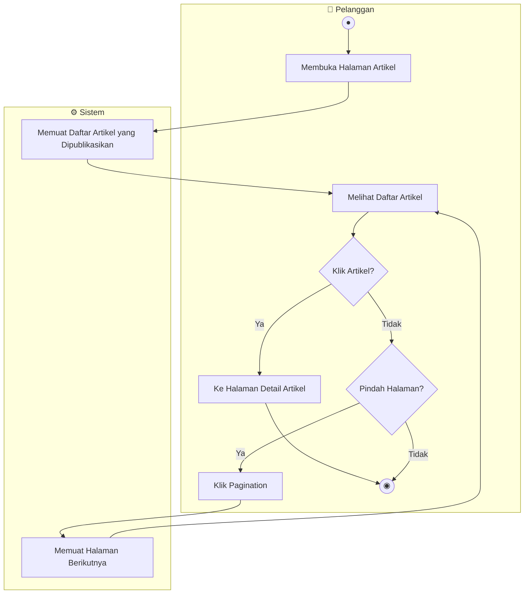
```mermaid
flowchart TD
    subgraph Pelanggan["👤 Pelanggan"]
        P1((●))
        P2[Membuka Halaman Artikel]
        P3[Melihat Daftar Artikel]
        P4{Klik Artikel?}
        P5[Ke Halaman Detail Artikel]
        P6{Pindah Halaman?}
        P7[Klik Pagination]
        P8((◉))
    end

    subgraph Sistem["⚙️ Sistem"]
        S1[Memuat Daftar Artikel yang Dipublikasikan]
        S2[Memuat Halaman Berikutnya]
    end

    P1 --> P2
    P2 --> S1
    S1 --> P3
    P3 --> P4
    P4 -->|Ya| P5
    P5 --> P8
    P4 -->|Tidak| P6
    P6 -->|Ya| P7
    P7 --> S2
    S2 --> P3
    P6 -->|Tidak| P8
```

**Penjelasan:**
Diagram aktivitas pada Gambar 4.7 memodelkan proses penelusuran daftar artikel oleh pelanggan. Sistem memuat artikel-artikel yang berstatus *published* dan menampilkannya dalam format *grid*. Pelanggan memiliki dua opsi utama: mengklik artikel tertentu untuk membaca detail konten, atau berpindah halaman melalui navigasi *pagination*. Penggunaan *pagination* memungkinkan pemuatan data secara bertahap sehingga meningkatkan performa halaman.

---

### 8. Detail Artikel

**Gambar 4.8** Activity Diagram Detail Artikel

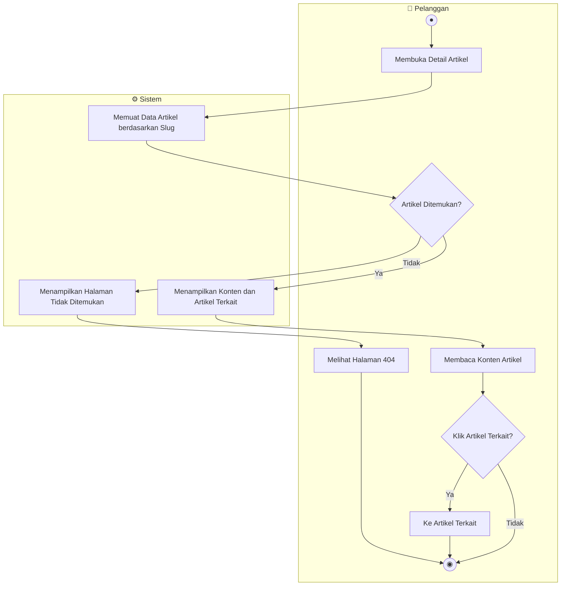
```mermaid
flowchart TD
    subgraph Pelanggan["👤 Pelanggan"]
        P1((●))
        P2[Membuka Detail Artikel]
        P3{Artikel Ditemukan?}
        P4[Melihat Halaman 404]
        P5[Membaca Konten Artikel]
        P6{Klik Artikel Terkait?}
        P7[Ke Artikel Terkait]
        P8((◉))
    end

    subgraph Sistem["⚙️ Sistem"]
        S1[Memuat Data Artikel berdasarkan Slug]
        S2[Menampilkan Halaman Tidak Ditemukan]
        S3[Menampilkan Konten dan Artikel Terkait]
    end

    P1 --> P2
    P2 --> S1
    S1 --> P3
    P3 -->|Tidak| S2
    S2 --> P4
    P4 --> P8
    P3 -->|Ya| S3
    S3 --> P5
    P5 --> P6
    P6 -->|Ya| P7
    P7 --> P8
    P6 -->|Tidak| P8
```

**Penjelasan:**
Diagram aktivitas pada Gambar 4.8 mendeskripsikan alur akses halaman detail artikel. Sistem memuat data artikel berdasarkan parameter *slug* pada URL. Terdapat *decision node* yang menentukan apakah artikel ditemukan atau tidak. Apabila artikel tidak ditemukan, sistem menampilkan halaman 404 (*Not Found*). Apabila artikel berhasil dimuat, sistem menampilkan konten artikel beserta rekomendasi artikel terkait. Pelanggan kemudian dapat memilih untuk membaca artikel terkait lainnya atau mengakhiri sesi.

---

### 9. Login

**Gambar 4.9** Activity Diagram Login

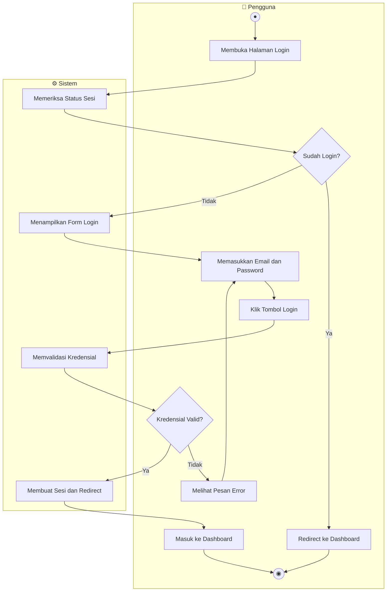
```mermaid
flowchart TD
    subgraph Pengguna["👤 Pengguna"]
        P1((●))
        P2[Membuka Halaman Login]
        P3{Sudah Login?}
        P4[Redirect ke Dashboard]
        P5[Memasukkan Email dan Password]
        P6[Klik Tombol Login]
        P7{Kredensial Valid?}
        P8[Melihat Pesan Error]
        P9[Masuk ke Dashboard]
        P10((◉))
    end

    subgraph Sistem["⚙️ Sistem"]
        S1[Memeriksa Status Sesi]
        S2[Menampilkan Form Login]
        S3[Memvalidasi Kredensial]
        S4[Membuat Sesi dan Redirect]
    end

    P1 --> P2
    P2 --> S1
    S1 --> P3
    P3 -->|Ya| P4
    P4 --> P10
    P3 -->|Tidak| S2
    S2 --> P5
    P5 --> P6
    P6 --> S3
    S3 --> P7
    P7 -->|Tidak| P8
    P8 --> P5
    P7 -->|Ya| S4
    S4 --> P9
    P9 --> P10
```

**Penjelasan:**
Diagram aktivitas pada Gambar 4.9 mengilustrasikan proses autentikasi pengguna melalui halaman login. Proses diawali dengan pemeriksaan status sesi (*session*) oleh sistem. Apabila pengguna telah memiliki sesi aktif, sistem langsung melakukan *redirect* ke halaman dashboard. Apabila belum terautentikasi, sistem menampilkan form login di mana pengguna memasukkan kredensial berupa *email* dan *password*. Sistem kemudian memvalidasi kredensial terhadap data yang tersimpan di basis data. Jika validasi gagal, sistem menampilkan pesan *error* dan pengguna dapat mencoba kembali. Jika validasi berhasil, sistem membuat sesi baru dan mengarahkan pengguna ke halaman dashboard.

---

### 10. Register

**Gambar 4.10** Activity Diagram Register

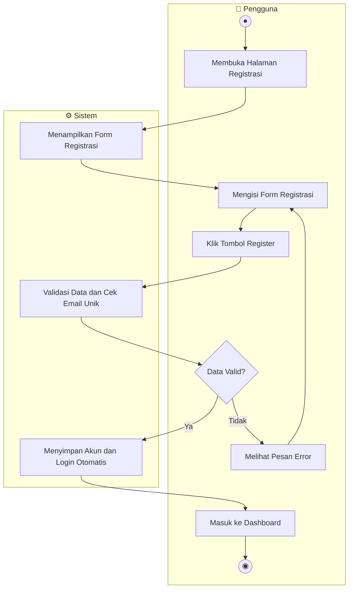
```mermaid
flowchart TD
    subgraph Pengguna["👤 Pengguna"]
        P1((●))
        P2[Membuka Halaman Registrasi]
        P3[Mengisi Form Registrasi]
        P4[Klik Tombol Register]
        P5{Data Valid?}
        P6[Melihat Pesan Error]
        P7[Masuk ke Dashboard]
        P8((◉))
    end

    subgraph Sistem["⚙️ Sistem"]
        S1[Menampilkan Form Registrasi]
        S2[Validasi Data dan Cek Email Unik]
        S3[Menyimpan Akun dan Login Otomatis]
    end

    P1 --> P2
    P2 --> S1
    S1 --> P3
    P3 --> P4
    P4 --> S2
    S2 --> P5
    P5 -->|Tidak| P6
    P6 --> P3
    P5 -->|Ya| S3
    S3 --> P7
    P7 --> P8
```

**Penjelasan:**
Diagram aktivitas pada Gambar 4.10 memodelkan proses registrasi akun baru oleh pengguna. Sistem menampilkan form registrasi yang memuat field nama, email, password, dan konfirmasi password. Setelah pengguna mengisi seluruh field dan menekan tombol registrasi, sistem melakukan serangkaian validasi yang mencakup format data, keunikan alamat email, serta kesesuaian password dengan konfirmasinya. Apabila validasi gagal, sistem menampilkan pesan *error* yang relevan. Apabila seluruh validasi berhasil, sistem menyimpan data akun baru, melakukan *hash* pada password untuk keamanan, dan secara otomatis memasukkan pengguna ke dalam sesi (*auto-login*) sebelum mengarahkan ke halaman dashboard.

---

## Halaman Admin

---

### 11. Dashboard Admin

**Gambar 4.11** Activity Diagram Dashboard Admin

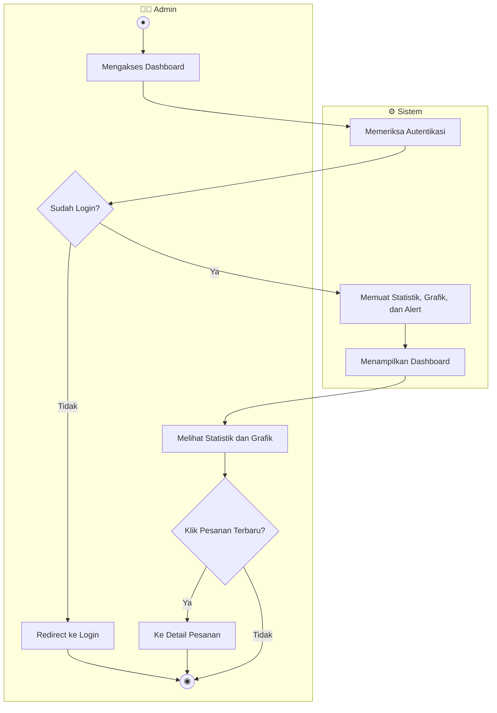
```mermaid
flowchart TD
    subgraph Admin["👨‍💻 Admin"]
        A1((●))
        A2[Mengakses Dashboard]
        A3{Sudah Login?}
        A4[Redirect ke Login]
        A5[Melihat Statistik dan Grafik]
        A6{Klik Pesanan Terbaru?}
        A7[Ke Detail Pesanan]
        A8((◉))
    end

    subgraph Sistem["⚙️ Sistem"]
        S1[Memeriksa Autentikasi]
        S2[Memuat Statistik, Grafik, dan Alert]
        S3[Menampilkan Dashboard]
    end

    A1 --> A2
    A2 --> S1
    S1 --> A3
    A3 -->|Tidak| A4
    A4 --> A8
    A3 -->|Ya| S2
    S2 --> S3
    S3 --> A5
    A5 --> A6
    A6 -->|Ya| A7
    A7 --> A8
    A6 -->|Tidak| A8
```

**Penjelasan:**
Diagram aktivitas pada Gambar 4.11 mendeskripsikan alur akses halaman dashboard admin. Proses dimulai dengan pemeriksaan autentikasi (*authentication check*) oleh *middleware* sistem. Apabila admin belum terautentikasi, sistem melakukan *redirect* ke halaman login. Apabila autentikasi berhasil, sistem memuat data statistik penjualan, grafik performa, serta peringatan (*alert*) stok rendah. Admin dapat meninjau ringkasan data dan memilih untuk melihat detail pesanan terbaru.

---

### 12. Manajemen Produk

**Gambar 4.12** Activity Diagram Manajemen Produk

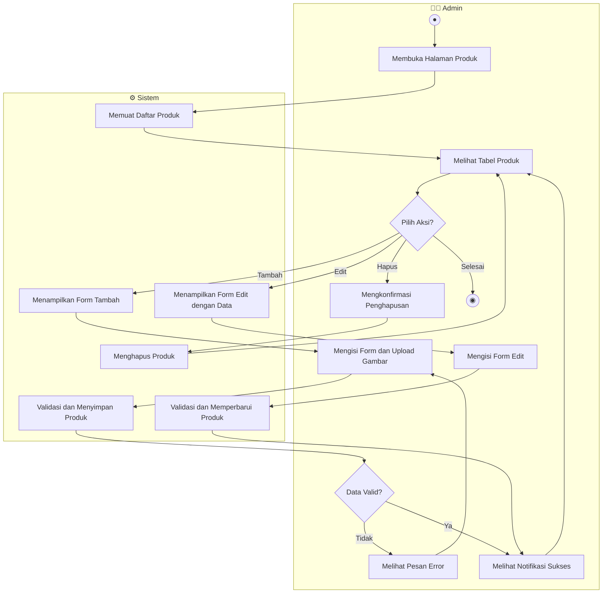
```mermaid
flowchart TD
    subgraph Admin["👨‍💻 Admin"]
        A1((●))
        A2[Membuka Halaman Produk]
        A3[Melihat Tabel Produk]
        A4{Pilih Aksi?}
        A5[Mengisi Form dan Upload Gambar]
        A6{Data Valid?}
        A7[Melihat Pesan Error]
        A8[Melihat Notifikasi Sukses]
        A9[Mengisi Form Edit]
        A10[Mengkonfirmasi Penghapusan]
        A11((◉))
    end

    subgraph Sistem["⚙️ Sistem"]
        S1[Memuat Daftar Produk]
        S2[Menampilkan Form Tambah]
        S3[Validasi dan Menyimpan Produk]
        S4[Menampilkan Form Edit dengan Data]
        S5[Validasi dan Memperbarui Produk]
        S6[Menghapus Produk]
    end

    A1 --> A2
    A2 --> S1
    S1 --> A3
    A3 --> A4
    A4 -->|Tambah| S2
    S2 --> A5
    A5 --> S3
    S3 --> A6
    A6 -->|Tidak| A7
    A7 --> A5
    A6 -->|Ya| A8
    A8 --> A3
    A4 -->|Edit| S4
    S4 --> A9
    A9 --> S5
    S5 --> A8
    A4 -->|Hapus| A10
    A10 --> S6
    S6 --> A3
    A4 -->|Selesai| A11
```

**Penjelasan:**
Diagram aktivitas pada Gambar 4.12 mengilustrasikan proses manajemen produk yang mencakup operasi CRUD (*Create, Read, Update, Delete*). Admin dapat menambahkan produk baru dengan mengisi form dan mengunggah gambar, mengedit data produk yang sudah ada, atau menghapus produk setelah konfirmasi. Pada proses penambahan dan pengeditan, sistem melakukan validasi data terlebih dahulu. Apabila validasi gagal, pesan *error* ditampilkan dan admin dapat memperbaiki input. Apabila berhasil, sistem menyimpan perubahan dan menampilkan notifikasi sukses sebelum kembali ke daftar produk.

---

### 13. Manajemen Kategori

**Gambar 4.13** Activity Diagram Manajemen Kategori

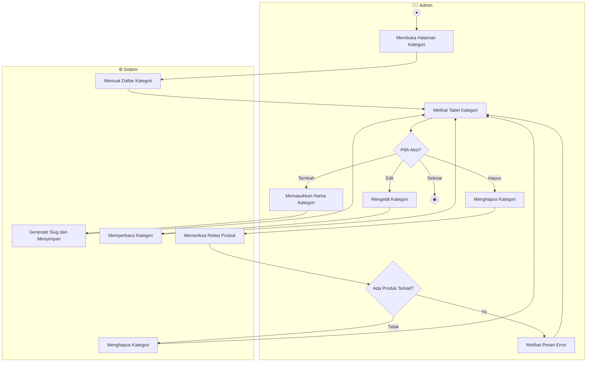
```mermaid
flowchart TD
    subgraph Admin["👨‍💻 Admin"]
        A1((●))
        A2[Membuka Halaman Kategori]
        A3[Melihat Tabel Kategori]
        A4{Pilih Aksi?}
        A5[Memasukkan Nama Kategori]
        A6[Mengedit Kategori]
        A7[Menghapus Kategori]
        A8{Ada Produk Terkait?}
        A9[Melihat Pesan Error]
        A10((◉))
    end

    subgraph Sistem["⚙️ Sistem"]
        S1[Memuat Daftar Kategori]
        S2[Generate Slug dan Menyimpan]
        S3[Memperbarui Kategori]
        S4[Memeriksa Relasi Produk]
        S5[Menghapus Kategori]
    end

    A1 --> A2
    A2 --> S1
    S1 --> A3
    A3 --> A4
    A4 -->|Tambah| A5
    A5 --> S2
    S2 --> A3
    A4 -->|Edit| A6
    A6 --> S3
    S3 --> A3
    A4 -->|Hapus| A7
    A7 --> S4
    S4 --> A8
    A8 -->|Ya| A9
    A9 --> A3
    A8 -->|Tidak| S5
    S5 --> A3
    A4 -->|Selesai| A10
```

**Penjelasan:**
Diagram aktivitas pada Gambar 4.13 memodelkan proses manajemen kategori produk. Admin dapat menambahkan kategori baru, di mana sistem secara otomatis men-*generate* *slug* dari nama kategori. Pada proses penghapusan, sistem terlebih dahulu memeriksa apakah terdapat produk yang berelasi dengan kategori tersebut. Apabila ditemukan relasi, sistem menampilkan pesan *error* dan mencegah penghapusan untuk menjaga integritas referensial (*referential integrity*) basis data. Mekanisme ini merupakan implementasi dari *foreign key constraint* yang memastikan konsistensi data antar-tabel.

---

### 14. Manajemen Pesanan

**Gambar 4.14** Activity Diagram Manajemen Pesanan

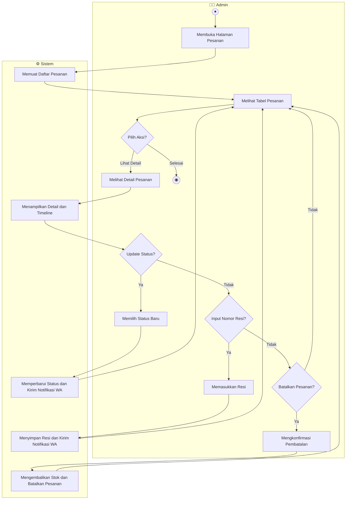
```mermaid
flowchart TD
    subgraph Admin["👨‍💻 Admin"]
        A1((●))
        A2[Membuka Halaman Pesanan]
        A3[Melihat Tabel Pesanan]
        A4{Pilih Aksi?}
        A5[Melihat Detail Pesanan]
        A6{Update Status?}
        A7[Memilih Status Baru]
        A8{Input Nomor Resi?}
        A9[Memasukkan Resi]
        A10{Batalkan Pesanan?}
        A11[Mengkonfirmasi Pembatalan]
        A12((◉))
    end

    subgraph Sistem["⚙️ Sistem"]
        S1[Memuat Daftar Pesanan]
        S2[Menampilkan Detail dan Timeline]
        S3[Memperbarui Status dan Kirim Notifikasi WA]
        S4[Menyimpan Resi dan Kirim Notifikasi WA]
        S5[Mengembalikan Stok dan Batalkan Pesanan]
    end

    A1 --> A2
    A2 --> S1
    S1 --> A3
    A3 --> A4
    A4 -->|Lihat Detail| A5
    A5 --> S2
    S2 --> A6
    A6 -->|Ya| A7
    A7 --> S3
    S3 --> A3
    A6 -->|Tidak| A8
    A8 -->|Ya| A9
    A9 --> S4
    S4 --> A3
    A8 -->|Tidak| A10
    A10 -->|Ya| A11
    A11 --> S5
    S5 --> A3
    A10 -->|Tidak| A3
    A4 -->|Selesai| A12
```

**Penjelasan:**
Diagram aktivitas pada Gambar 4.14 mendeskripsikan proses manajemen pesanan yang merupakan komponen vital dalam operasional e-commerce. Admin dapat melihat detail pesanan beserta *timeline* status, memperbarui status pesanan (misalnya dari "Diproses" ke "Dikemas"), memasukkan nomor resi pengiriman, atau membatalkan pesanan. Setiap perubahan status dan input resi secara otomatis memicu pengiriman notifikasi kepada pelanggan melalui WhatsApp API. Pada proses pembatalan, sistem melakukan pengembalian stok produk (*stock restoration*) untuk menjaga akurasi data inventori.

---

### 15. Manajemen Artikel

**Gambar 4.15** Activity Diagram Manajemen Artikel

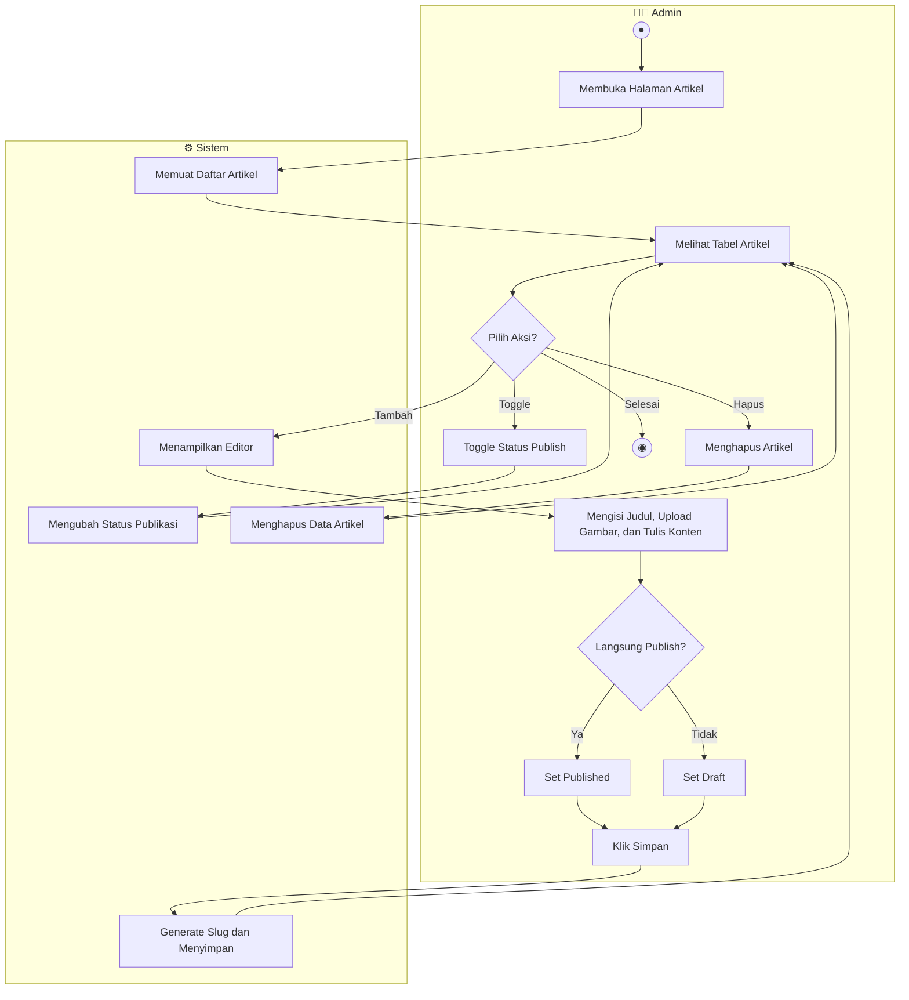
```mermaid
flowchart TD
    subgraph Admin["👨‍💻 Admin"]
        A1((●))
        A2[Membuka Halaman Artikel]
        A3[Melihat Tabel Artikel]
        A4{Pilih Aksi?}
        A5[Mengisi Judul, Upload Gambar, dan Tulis Konten]
        A6{Langsung Publish?}
        A7[Set Published]
        A8[Set Draft]
        A9[Klik Simpan]
        A10[Toggle Status Publish]
        A11[Menghapus Artikel]
        A12((◉))
    end

    subgraph Sistem["⚙️ Sistem"]
        S1[Memuat Daftar Artikel]
        S2[Menampilkan Editor]
        S3[Generate Slug dan Menyimpan]
        S4[Mengubah Status Publikasi]
        S5[Menghapus Data Artikel]
    end

    A1 --> A2
    A2 --> S1
    S1 --> A3
    A3 --> A4
    A4 -->|Tambah| S2
    S2 --> A5
    A5 --> A6
    A6 -->|Ya| A7
    A6 -->|Tidak| A8
    A7 --> A9
    A8 --> A9
    A9 --> S3
    S3 --> A3
    A4 -->|Toggle| A10
    A10 --> S4
    S4 --> A3
    A4 -->|Hapus| A11
    A11 --> S5
    S5 --> A3
    A4 -->|Selesai| A12
```

**Penjelasan:**
Diagram aktivitas pada Gambar 4.15 mengilustrasikan proses manajemen artikel pada panel admin. Admin dapat membuat artikel baru melalui editor yang menyediakan field judul, *featured image*, dan area penulisan konten. Sebelum menyimpan, admin memilih status publikasi (*published* atau *draft*). Sistem secara otomatis men-*generate slug* dari judul artikel untuk keperluan URL *friendly*. Selain itu, admin dapat mengubah status publikasi artikel yang sudah ada melalui fitur *toggle*, atau menghapus artikel secara permanen dari basis data.

---

### 16. Moderasi Review

**Gambar 4.16** Activity Diagram Moderasi Review

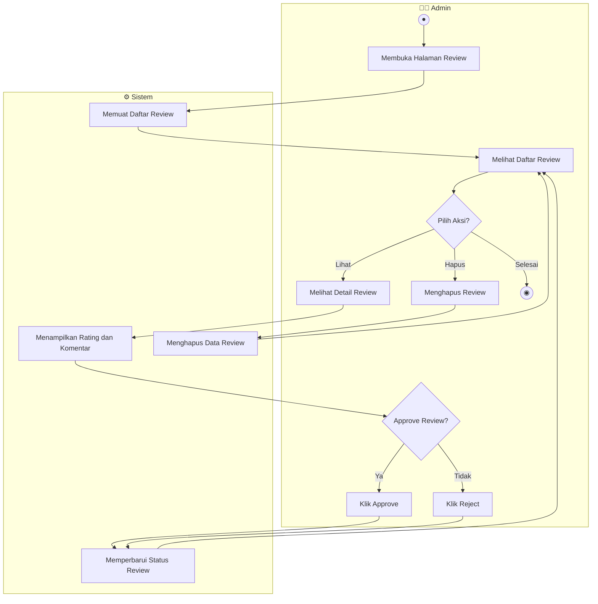
```mermaid
flowchart TD
    subgraph Admin["👨‍💻 Admin"]
        A1((●))
        A2[Membuka Halaman Review]
        A3[Melihat Daftar Review]
        A4{Pilih Aksi?}
        A5[Melihat Detail Review]
        A6{Approve Review?}
        A7[Klik Approve]
        A8[Klik Reject]
        A9[Menghapus Review]
        A10((◉))
    end

    subgraph Sistem["⚙️ Sistem"]
        S1[Memuat Daftar Review]
        S2[Menampilkan Rating dan Komentar]
        S3[Memperbarui Status Review]
        S4[Menghapus Data Review]
    end

    A1 --> A2
    A2 --> S1
    S1 --> A3
    A3 --> A4
    A4 -->|Lihat| A5
    A5 --> S2
    S2 --> A6
    A6 -->|Ya| A7
    A7 --> S3
    S3 --> A3
    A6 -->|Tidak| A8
    A8 --> S3
    A4 -->|Hapus| A9
    A9 --> S4
    S4 --> A3
    A4 -->|Selesai| A10
```

**Penjelasan:**
Diagram aktivitas pada Gambar 4.16 memodelkan proses moderasi ulasan (*review*) produk oleh admin. Seluruh ulasan yang dikirimkan pelanggan memerlukan persetujuan admin sebelum ditampilkan secara publik. Admin melihat detail ulasan yang mencakup *rating* dan komentar, kemudian memutuskan untuk menyetujui (*approve*) atau menolak (*reject*). Mekanisme moderasi ini merupakan implementasi *content moderation* yang bertujuan menjaga kualitas dan kesesuaian konten yang ditampilkan pada platform.

---

### 17. Pengaturan Sistem

**Gambar 4.17** Activity Diagram Pengaturan Sistem

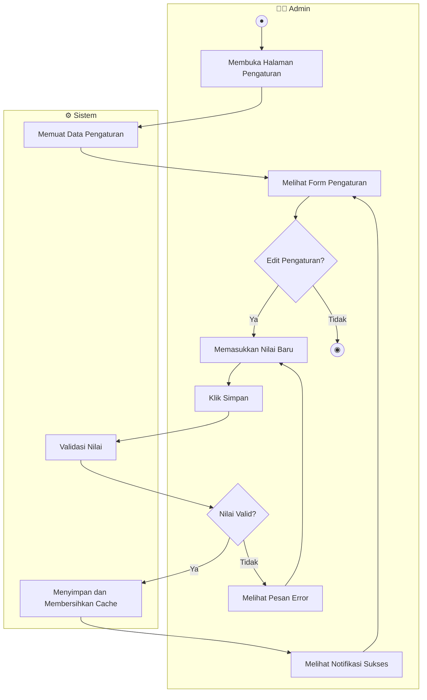
```mermaid
flowchart TD
    subgraph Admin["👨‍💻 Admin"]
        A1((●))
        A2[Membuka Halaman Pengaturan]
        A3[Melihat Form Pengaturan]
        A4{Edit Pengaturan?}
        A5[Memasukkan Nilai Baru]
        A6[Klik Simpan]
        A7{Nilai Valid?}
        A8[Melihat Pesan Error]
        A9[Melihat Notifikasi Sukses]
        A10((◉))
    end

    subgraph Sistem["⚙️ Sistem"]
        S1[Memuat Data Pengaturan]
        S2[Validasi Nilai]
        S3[Menyimpan dan Membersihkan Cache]
    end

    A1 --> A2
    A2 --> S1
    S1 --> A3
    A3 --> A4
    A4 -->|Ya| A5
    A5 --> A6
    A6 --> S2
    S2 --> A7
    A7 -->|Tidak| A8
    A8 --> A5
    A7 -->|Ya| S3
    S3 --> A9
    A9 --> A3
    A4 -->|Tidak| A10
```

**Penjelasan:**
Diagram aktivitas pada Gambar 4.17 mendeskripsikan proses pengelolaan pengaturan sistem oleh admin. Halaman ini menampilkan berbagai parameter konfigurasi yang dikelompokkan berdasarkan fungsinya. Admin dapat mengubah nilai pengaturan, di mana sistem terlebih dahulu memvalidasi kesesuaian nilai yang dimasukkan. Apabila validasi gagal, pesan *error* ditampilkan. Apabila berhasil, sistem menyimpan perubahan ke basis data dan melakukan pembersihan *cache* konfigurasi (*cache clearing*) untuk memastikan perubahan segera berlaku pada seluruh komponen sistem.

---

## Legenda Simbol

| Simbol | Makna | Keterangan |
|:-------|:------|:-----------|
| `((●))` | *Initial Node* | Titik awal dari alur aktivitas |
| `((◉))` | *Final Node* | Titik akhir dari alur aktivitas |
| `[...]` | *Activity/Action* | Aktivitas atau tindakan yang dilakukan |
| `{...}` | *Decision Node* | Percabangan keputusan dengan dua atau lebih alternatif |
| `subgraph` | *Swimlane/Partition* | Partisi yang menunjukkan tanggung jawab aktor |

---

*Dokumentasi ini disusun sebagai bagian dari Tugas Akhir/Skripsi*
**Universitas Ichsan Sidenreng Rappang** © 2026
