# 📊 Activity Diagrams - Platform E-Commerce Ivo Karya

> **Kumpulan Diagram Aktivitas dengan Swimlane untuk Setiap Halaman**

---

## 📋 Daftar Isi

### Halaman Publik
1. [Landing Page](#1-landing-page)
2. [Katalog Produk](#2-katalog-produk)
3. [Detail Produk](#3-detail-produk)
4. [Keranjang Belanja](#4-keranjang-belanja)
5. [Checkout](#5-checkout)
6. [Pelacakan Pesanan](#6-pelacakan-pesanan)
7. [Daftar Artikel](#7-daftar-artikel)
8. [Detail Artikel](#8-detail-artikel)
9. [Login](#9-login)
10. [Register](#10-register)

### Halaman Admin
11. [Dashboard Admin](#11-dashboard-admin)
12. [Manajemen Produk](#12-manajemen-produk)
13. [Manajemen Kategori](#13-manajemen-kategori)
14. [Manajemen Pesanan](#14-manajemen-pesanan)
15. [Manajemen Artikel](#15-manajemen-artikel)
16. [Moderasi Review](#16-moderasi-review)
17. [Pengaturan Sistem](#17-pengaturan-sistem)

---

## Halaman Publik

---

### 1. Landing Page

**URL:** `/`

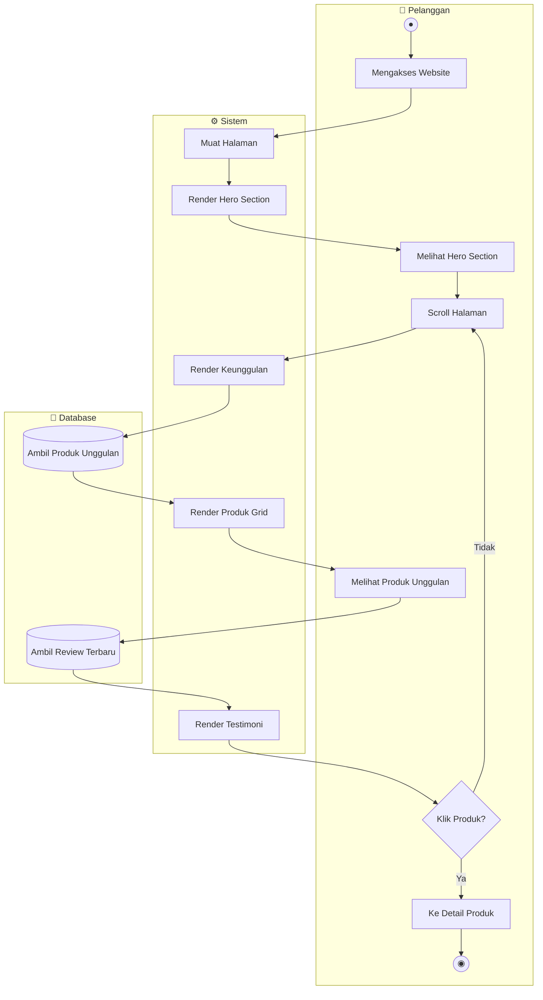
```mermaid
flowchart TD
    subgraph Pelanggan["👤 Pelanggan"]
        P1((●))
        P2[Mengakses Website]
        P3[Melihat Hero Section]
        P4[Scroll Halaman]
        P5[Melihat Produk Unggulan]
        P6{Klik Produk?}
        P7[Ke Detail Produk]
        P8((◉))
    end
    
    subgraph Sistem["⚙️ Sistem"]
        S1[Muat Halaman]
        S2[Render Hero Section]
        S3[Render Keunggulan]
        S4[Render Produk Grid]
        S5[Render Testimoni]
    end
    
    subgraph Database["💾 Database"]
        D1[(Ambil Produk Unggulan)]
        D2[(Ambil Review Terbaru)]
    end
    
    P1 --> P2
    P2 --> S1
    S1 --> S2
    S2 --> P3
    P3 --> P4
    P4 --> S3
    S3 --> D1
    D1 --> S4
    S4 --> P5
    P5 --> D2
    D2 --> S5
    S5 --> P6
    P6 -->|Ya| P7
    P6 -->|Tidak| P4
    P7 --> P8
```

---

### 2. Katalog Produk

**URL:** `/katalog`

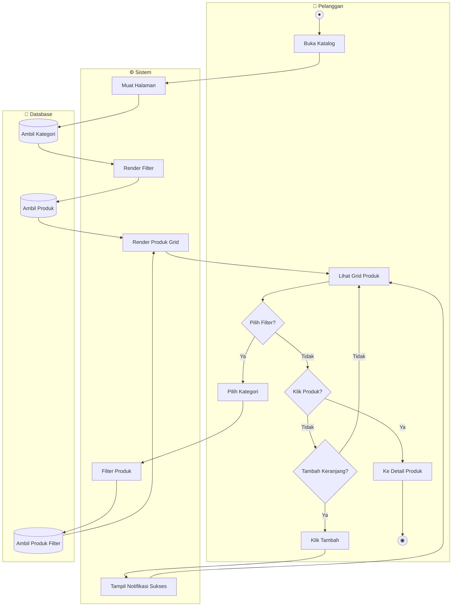
```mermaid
flowchart TD
    subgraph Pelanggan["👤 Pelanggan"]
        P1((●))
        P2[Buka Katalog]
        P3[Lihat Grid Produk]
        P4{Pilih Filter?}
        P5[Pilih Kategori]
        P6{Klik Produk?}
        P7[Ke Detail Produk]
        P8{Tambah Keranjang?}
        P9[Klik Tambah]
        P10((◉))
    end
    
    subgraph Sistem["⚙️ Sistem"]
        S1[Muat Halaman]
        S2[Render Filter]
        S3[Render Produk Grid]
        S4[Filter Produk]
        S5[Tampil Notifikasi Sukses]
    end
    
    subgraph Database["💾 Database"]
        D1[(Ambil Kategori)]
        D2[(Ambil Produk)]
        D3[(Ambil Produk Filter)]
    end
    
    P1 --> P2
    P2 --> S1
    S1 --> D1
    D1 --> S2
    S2 --> D2
    D2 --> S3
    S3 --> P3
    P3 --> P4
    P4 -->|Ya| P5
    P5 --> S4
    S4 --> D3
    D3 --> S3
    P4 -->|Tidak| P6
    P6 -->|Ya| P7
    P7 --> P10
    P6 -->|Tidak| P8
    P8 -->|Ya| P9
    P9 --> S5
    S5 --> P3
    P8 -->|Tidak| P3
```

---

### 3. Detail Produk

**URL:** `/product/{slug}`

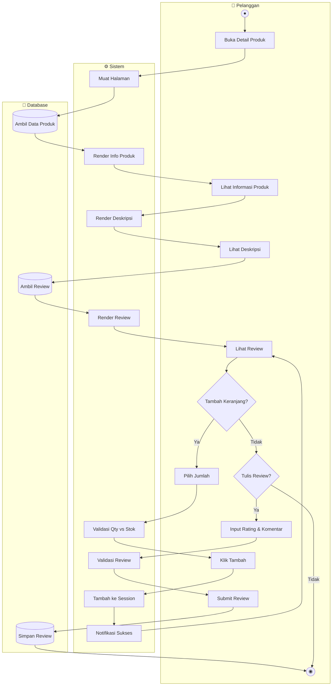
```mermaid
flowchart TD
    subgraph Pelanggan["👤 Pelanggan"]
        P1((●))
        P2[Buka Detail Produk]
        P3[Lihat Informasi Produk]
        P4[Lihat Deskripsi]
        P5[Lihat Review]
        P6{Tambah Keranjang?}
        P7[Pilih Jumlah]
        P8[Klik Tambah]
        P9{Tulis Review?}
        P10[Input Rating & Komentar]
        P11[Submit Review]
        P12((◉))
    end
    
    subgraph Sistem["⚙️ Sistem"]
        S1[Muat Halaman]
        S2[Render Info Produk]
        S3[Render Deskripsi]
        S4[Render Review]
        S5[Validasi Qty vs Stok]
        S6[Tambah ke Session]
        S7[Notifikasi Sukses]
        S8[Validasi Review]
    end
    
    subgraph Database["💾 Database"]
        D1[(Ambil Data Produk)]
        D2[(Ambil Review)]
        D3[(Simpan Review)]
    end
    
    P1 --> P2
    P2 --> S1
    S1 --> D1
    D1 --> S2
    S2 --> P3
    P3 --> S3
    S3 --> P4
    P4 --> D2
    D2 --> S4
    S4 --> P5
    P5 --> P6
    P6 -->|Ya| P7
    P7 --> S5
    S5 --> P8
    P8 --> S6
    S6 --> S7
    S7 --> P5
    P6 -->|Tidak| P9
    P9 -->|Ya| P10
    P10 --> S8
    S8 --> P11
    P11 --> D3
    D3 --> P12
    P9 -->|Tidak| P12
```

---

### 4. Keranjang Belanja

**URL:** `/cart`

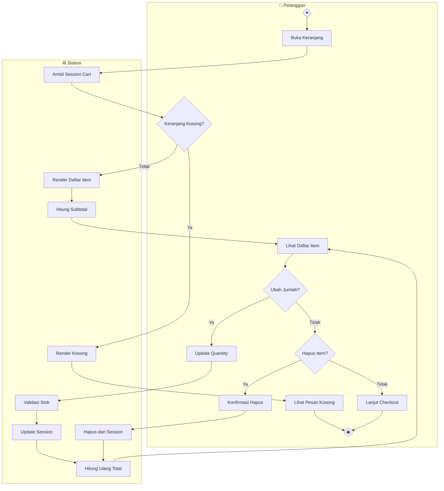
```mermaid
flowchart TD
    subgraph Pelanggan["👤 Pelanggan"]
        P1((●))
        P2[Buka Keranjang]
        P3{Keranjang Kosong?}
        P4[Lihat Pesan Kosong]
        P5[Lihat Daftar Item]
        P6{Ubah Jumlah?}
        P7[Update Quantity]
        P8{Hapus Item?}
        P9[Konfirmasi Hapus]
        P10[Lanjut Checkout]
        P11((◉))
    end
    
    subgraph Sistem["⚙️ Sistem"]
        S1[Ambil Session Cart]
        S2[Render Kosong]
        S3[Render Daftar Item]
        S4[Hitung Subtotal]
        S5[Validasi Stok]
        S6[Update Session]
        S7[Hapus dari Session]
        S8[Hitung Ulang Total]
    end
    
    P1 --> P2
    P2 --> S1
    S1 --> P3
    P3 -->|Ya| S2
    S2 --> P4
    P4 --> P11
    P3 -->|Tidak| S3
    S3 --> S4
    S4 --> P5
    P5 --> P6
    P6 -->|Ya| P7
    P7 --> S5
    S5 --> S6
    S6 --> S8
    S8 --> P5
    P6 -->|Tidak| P8
    P8 -->|Ya| P9
    P9 --> S7
    S7 --> S8
    P8 -->|Tidak| P10
    P10 --> P11
```

---

### 5. Checkout

**URL:** `/cart` (Form Checkout)

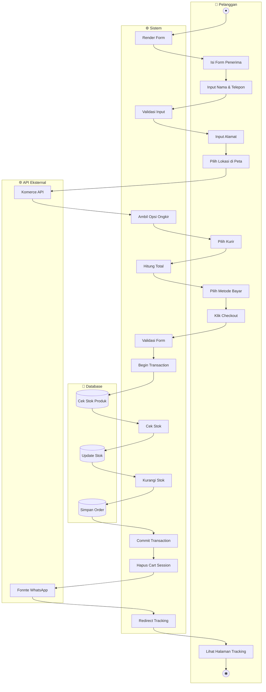
```mermaid
flowchart TD
    subgraph Pelanggan["👤 Pelanggan"]
        P1((●))
        P2[Isi Form Penerima]
        P3[Input Nama & Telepon]
        P4[Input Alamat]
        P5[Pilih Lokasi di Peta]
        P6[Pilih Kurir]
        P7[Pilih Metode Bayar]
        P8[Klik Checkout]
        P9[Lihat Halaman Tracking]
        P10((◉))
    end
    
    subgraph Sistem["⚙️ Sistem"]
        S1[Render Form]
        S2[Validasi Input]
        S3[Ambil Opsi Ongkir]
        S4[Hitung Total]
        S5[Validasi Form]
        S6[Begin Transaction]
        S7[Cek Stok]
        S8[Kurangi Stok]
        S9[Commit Transaction]
        S10[Hapus Cart Session]
        S11[Redirect Tracking]
    end
    
    subgraph Database["💾 Database"]
        D1[(Cek Stok Produk)]
        D2[(Update Stok)]
        D3[(Simpan Order)]
    end
    
    subgraph API["🌐 API Eksternal"]
        A1[Komerce API]
        A2[Fonnte WhatsApp]
    end
    
    P1 --> S1
    S1 --> P2
    P2 --> P3
    P3 --> S2
    S2 --> P4
    P4 --> P5
    P5 --> A1
    A1 --> S3
    S3 --> P6
    P6 --> S4
    S4 --> P7
    P7 --> P8
    P8 --> S5
    S5 --> S6
    S6 --> D1
    D1 --> S7
    S7 --> D2
    D2 --> S8
    S8 --> D3
    D3 --> S9
    S9 --> S10
    S10 --> A2
    A2 --> S11
    S11 --> P9
    P9 --> P10
```

---

### 6. Pelacakan Pesanan

**URL:** `/track`

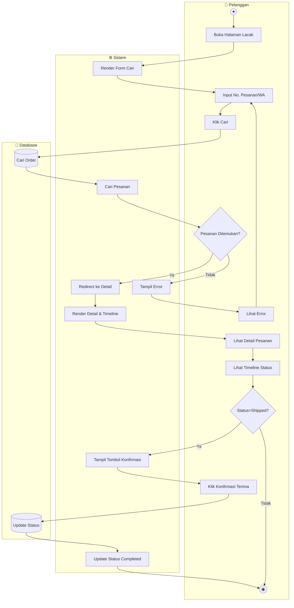
```mermaid
flowchart TD
    subgraph Pelanggan["👤 Pelanggan"]
        P1((●))
        P2[Buka Halaman Lacak]
        P3[Input No. Pesanan/WA]
        P4[Klik Cari]
        P5{Pesanan Ditemukan?}
        P6[Lihat Error]
        P7[Lihat Detail Pesanan]
        P8[Lihat Timeline Status]
        P9{Status=Shipped?}
        P10[Klik Konfirmasi Terima]
        P11((◉))
    end
    
    subgraph Sistem["⚙️ Sistem"]
        S1[Render Form Cari]
        S2[Cari Pesanan]
        S3[Tampil Error]
        S4[Redirect ke Detail]
        S5[Render Detail & Timeline]
        S6[Tampil Tombol Konfirmasi]
        S7[Update Status Completed]
    end
    
    subgraph Database["💾 Database"]
        D1[(Cari Order)]
        D2[(Update Status)]
    end
    
    P1 --> P2
    P2 --> S1
    S1 --> P3
    P3 --> P4
    P4 --> D1
    D1 --> S2
    S2 --> P5
    P5 -->|Tidak| S3
    S3 --> P6
    P6 --> P3
    P5 -->|Ya| S4
    S4 --> S5
    S5 --> P7
    P7 --> P8
    P8 --> P9
    P9 -->|Ya| S6
    S6 --> P10
    P10 --> D2
    D2 --> S7
    S7 --> P11
    P9 -->|Tidak| P11
```

---

### 7. Daftar Artikel

**URL:** `/articles`

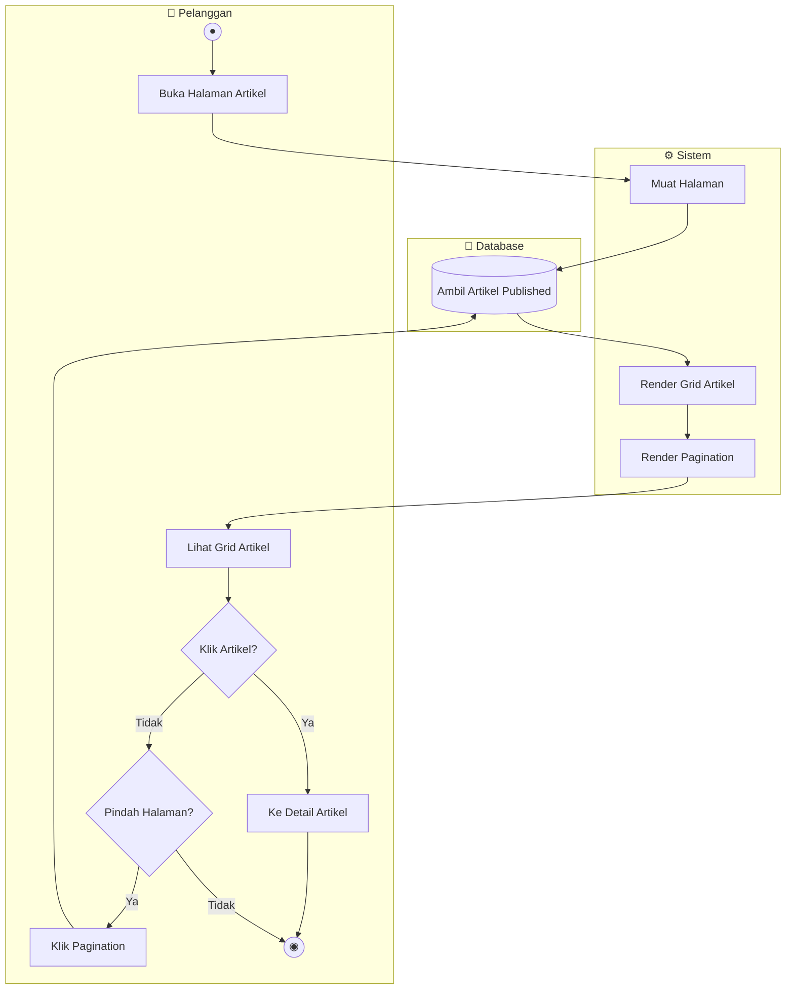
```mermaid
flowchart TD
    subgraph Pelanggan["👤 Pelanggan"]
        P1((●))
        P2[Buka Halaman Artikel]
        P3[Lihat Grid Artikel]
        P4{Klik Artikel?}
        P5[Ke Detail Artikel]
        P6{Pindah Halaman?}
        P7[Klik Pagination]
        P8((◉))
    end
    
    subgraph Sistem["⚙️ Sistem"]
        S1[Muat Halaman]
        S2[Render Grid Artikel]
        S3[Render Pagination]
    end
    
    subgraph Database["💾 Database"]
        D1[(Ambil Artikel Published)]
    end
    
    P1 --> P2
    P2 --> S1
    S1 --> D1
    D1 --> S2
    S2 --> S3
    S3 --> P3
    P3 --> P4
    P4 -->|Ya| P5
    P5 --> P8
    P4 -->|Tidak| P6
    P6 -->|Ya| P7
    P7 --> D1
    P6 -->|Tidak| P8
```

---

### 8. Detail Artikel

**URL:** `/articles/{slug}`

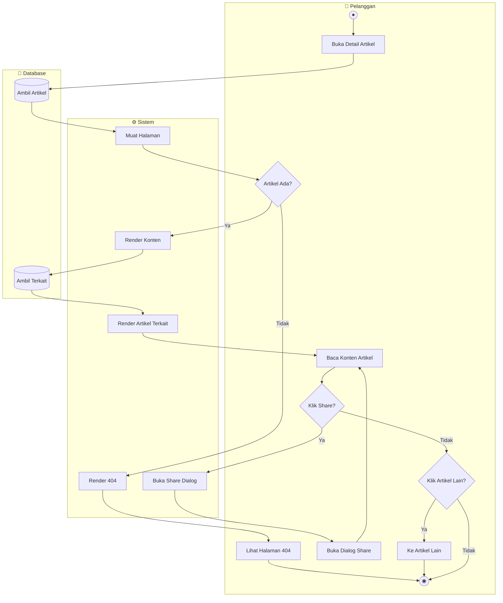
```mermaid
flowchart TD
    subgraph Pelanggan["👤 Pelanggan"]
        P1((●))
        P2[Buka Detail Artikel]
        P3{Artikel Ada?}
        P4[Lihat Halaman 404]
        P5[Baca Konten Artikel]
        P6{Klik Share?}
        P7[Buka Dialog Share]
        P8{Klik Artikel Lain?}
        P9[Ke Artikel Lain]
        P10((◉))
    end
    
    subgraph Sistem["⚙️ Sistem"]
        S1[Muat Halaman]
        S2[Render 404]
        S3[Render Konten]
        S4[Render Artikel Terkait]
        S5[Buka Share Dialog]
    end
    
    subgraph Database["💾 Database"]
        D1[(Ambil Artikel)]
        D2[(Ambil Terkait)]
    end
    
    P1 --> P2
    P2 --> D1
    D1 --> S1
    S1 --> P3
    P3 -->|Tidak| S2
    S2 --> P4
    P4 --> P10
    P3 -->|Ya| S3
    S3 --> D2
    D2 --> S4
    S4 --> P5
    P5 --> P6
    P6 -->|Ya| S5
    S5 --> P7
    P7 --> P5
    P6 -->|Tidak| P8
    P8 -->|Ya| P9
    P9 --> P10
    P8 -->|Tidak| P10
```

---

### 9. Login

**URL:** `/login`

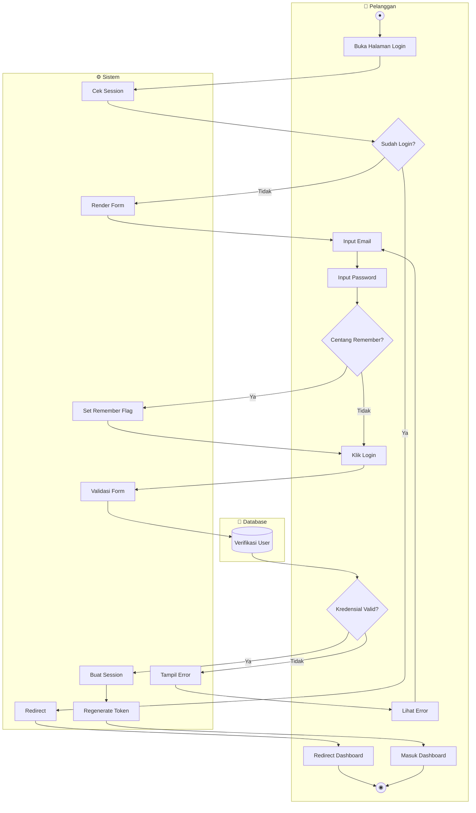
```mermaid
flowchart TD
    subgraph Pelanggan["👤 Pelanggan"]
        P1((●))
        P2[Buka Halaman Login]
        P3{Sudah Login?}
        P4[Redirect Dashboard]
        P5[Input Email]
        P6[Input Password]
        P7{Centang Remember?}
        P8[Klik Login]
        P9{Kredensial Valid?}
        P10[Lihat Error]
        P11[Masuk Dashboard]
        P12((◉))
    end
    
    subgraph Sistem["⚙️ Sistem"]
        S1[Cek Session]
        S2[Render Form]
        S3[Set Remember Flag]
        S4[Validasi Form]
        S5[Tampil Error]
        S6[Buat Session]
        S7[Regenerate Token]
        S8[Redirect]
    end
    
    subgraph Database["💾 Database"]
        D1[(Verifikasi User)]
    end
    
    P1 --> P2
    P2 --> S1
    S1 --> P3
    P3 -->|Ya| S8
    S8 --> P4
    P4 --> P12
    P3 -->|Tidak| S2
    S2 --> P5
    P5 --> P6
    P6 --> P7
    P7 -->|Ya| S3
    S3 --> P8
    P7 -->|Tidak| P8
    P8 --> S4
    S4 --> D1
    D1 --> P9
    P9 -->|Tidak| S5
    S5 --> P10
    P10 --> P5
    P9 -->|Ya| S6
    S6 --> S7
    S7 --> P11
    P11 --> P12
```

---

### 10. Register

**URL:** `/register`

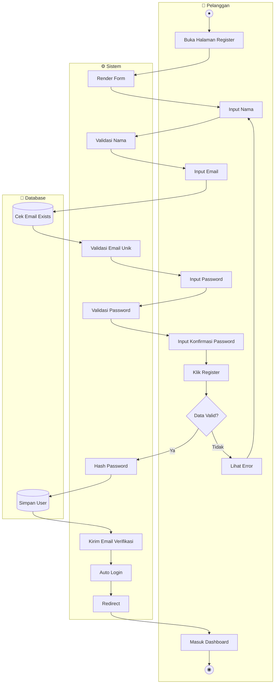
```mermaid
flowchart TD
    subgraph Pelanggan["👤 Pelanggan"]
        P1((●))
        P2[Buka Halaman Register]
        P3[Input Nama]
        P4[Input Email]
        P5[Input Password]
        P6[Input Konfirmasi Password]
        P7[Klik Register]
        P8{Data Valid?}
        P9[Lihat Error]
        P10[Masuk Dashboard]
        P11((◉))
    end
    
    subgraph Sistem["⚙️ Sistem"]
        S1[Render Form]
        S2[Validasi Nama]
        S3[Validasi Email Unik]
        S4[Validasi Password]
        S5[Hash Password]
        S6[Kirim Email Verifikasi]
        S7[Auto Login]
        S8[Redirect]
    end
    
    subgraph Database["💾 Database"]
        D1[(Cek Email Exists)]
        D2[(Simpan User)]
    end
    
    P1 --> P2
    P2 --> S1
    S1 --> P3
    P3 --> S2
    S2 --> P4
    P4 --> D1
    D1 --> S3
    S3 --> P5
    P5 --> S4
    S4 --> P6
    P6 --> P7
    P7 --> P8
    P8 -->|Tidak| P9
    P9 --> P3
    P8 -->|Ya| S5
    S5 --> D2
    D2 --> S6
    S6 --> S7
    S7 --> S8
    S8 --> P10
    P10 --> P11
```

---

## Halaman Admin

---

### 11. Dashboard Admin

**URL:** `/admin`

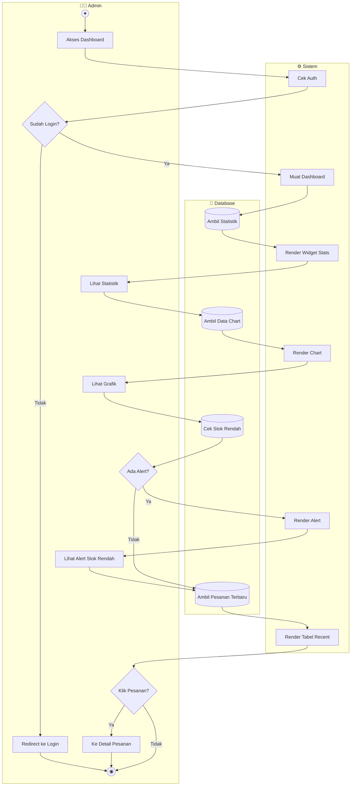
```mermaid
flowchart TD
    subgraph Admin["👨‍💻 Admin"]
        A1((●))
        A2[Akses Dashboard]
        A3{Sudah Login?}
        A4[Redirect ke Login]
        A5[Lihat Statistik]
        A6[Lihat Grafik]
        A7{Ada Alert?}
        A8[Lihat Alert Stok Rendah]
        A9{Klik Pesanan?}
        A10[Ke Detail Pesanan]
        A11((◉))
    end
    
    subgraph Sistem["⚙️ Sistem"]
        S1[Cek Auth]
        S2[Muat Dashboard]
        S3[Render Widget Stats]
        S4[Render Chart]
        S5[Render Alert]
        S6[Render Tabel Recent]
    end
    
    subgraph Database["💾 Database"]
        D1[(Ambil Statistik)]
        D2[(Ambil Data Chart)]
        D3[(Ambil Pesanan Terbaru)]
        D4[(Cek Stok Rendah)]
    end
    
    A1 --> A2
    A2 --> S1
    S1 --> A3
    A3 -->|Tidak| A4
    A4 --> A11
    A3 -->|Ya| S2
    S2 --> D1
    D1 --> S3
    S3 --> A5
    A5 --> D2
    D2 --> S4
    S4 --> A6
    A6 --> D4
    D4 --> A7
    A7 -->|Ya| S5
    S5 --> A8
    A8 --> D3
    A7 -->|Tidak| D3
    D3 --> S6
    S6 --> A9
    A9 -->|Ya| A10
    A10 --> A11
    A9 -->|Tidak| A11
```

---

### 12. Manajemen Produk

**URL:** `/admin/products`

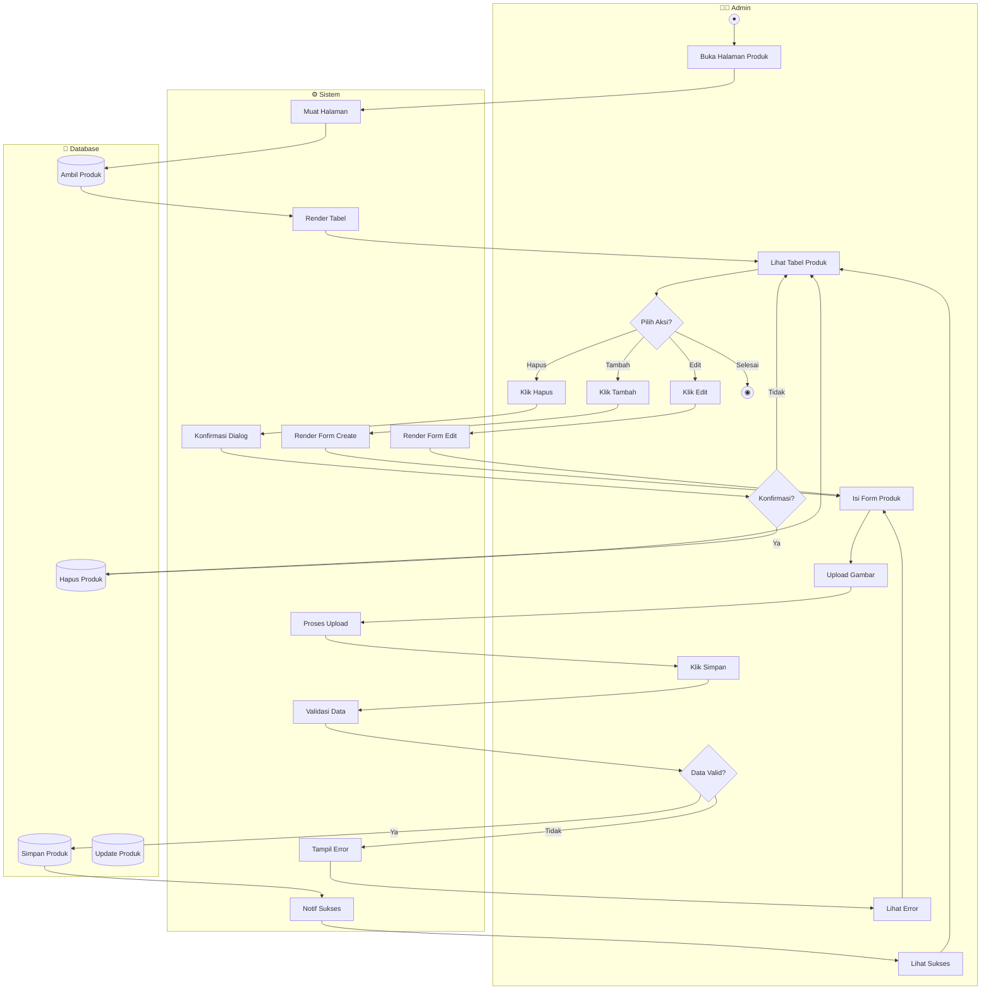
```mermaid
flowchart TD
    subgraph Admin["👨‍💻 Admin"]
        A1((●))
        A2[Buka Halaman Produk]
        A3[Lihat Tabel Produk]
        A4{Pilih Aksi?}
        A5[Klik Tambah]
        A6[Isi Form Produk]
        A7[Upload Gambar]
        A8[Klik Simpan]
        A9{Data Valid?}
        A10[Lihat Error]
        A11[Lihat Sukses]
        A12[Klik Edit]
        A13[Klik Hapus]
        A14{Konfirmasi?}
        A15((◉))
    end
    
    subgraph Sistem["⚙️ Sistem"]
        S1[Muat Halaman]
        S2[Render Tabel]
        S3[Render Form Create]
        S4[Proses Upload]
        S5[Validasi Data]
        S6[Tampil Error]
        S7[Notif Sukses]
        S8[Render Form Edit]
        S9[Konfirmasi Dialog]
    end
    
    subgraph Database["💾 Database"]
        D1[(Ambil Produk)]
        D2[(Simpan Produk)]
        D3[(Update Produk)]
        D4[(Hapus Produk)]
    end
    
    A1 --> A2
    A2 --> S1
    S1 --> D1
    D1 --> S2
    S2 --> A3
    A3 --> A4
    A4 -->|Tambah| A5
    A5 --> S3
    S3 --> A6
    A6 --> A7
    A7 --> S4
    S4 --> A8
    A8 --> S5
    S5 --> A9
    A9 -->|Tidak| S6
    S6 --> A10
    A10 --> A6
    A9 -->|Ya| D2
    D2 --> S7
    S7 --> A11
    A11 --> A3
    A4 -->|Edit| A12
    A12 --> S8
    S8 --> A6
    A4 -->|Hapus| A13
    A13 --> S9
    S9 --> A14
    A14 -->|Ya| D4
    D4 --> A3
    A14 -->|Tidak| A3
    A4 -->|Selesai| A15
```

---

### 13. Manajemen Kategori

**URL:** `/admin/categories`

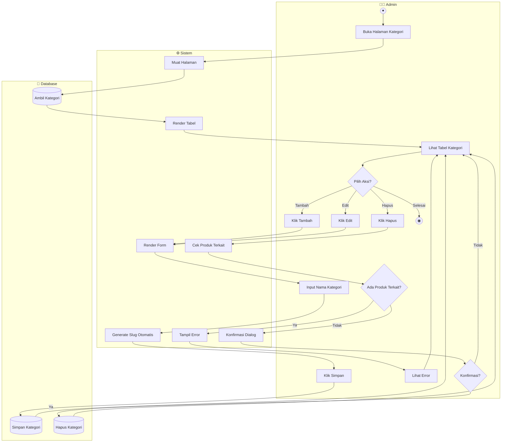
```mermaid
flowchart TD
    subgraph Admin["👨‍💻 Admin"]
        A1((●))
        A2[Buka Halaman Kategori]
        A3[Lihat Tabel Kategori]
        A4{Pilih Aksi?}
        A5[Klik Tambah]
        A6[Input Nama Kategori]
        A7[Klik Simpan]
        A8[Klik Edit]
        A9[Klik Hapus]
        A10{Ada Produk Terkait?}
        A11[Lihat Error]
        A12{Konfirmasi?}
        A13((◉))
    end
    
    subgraph Sistem["⚙️ Sistem"]
        S1[Muat Halaman]
        S2[Render Tabel]
        S3[Render Form]
        S4[Generate Slug Otomatis]
        S5[Cek Produk Terkait]
        S6[Tampil Error]
        S7[Konfirmasi Dialog]
    end
    
    subgraph Database["💾 Database"]
        D1[(Ambil Kategori)]
        D2[(Simpan Kategori)]
        D3[(Hapus Kategori)]
    end
    
    A1 --> A2
    A2 --> S1
    S1 --> D1
    D1 --> S2
    S2 --> A3
    A3 --> A4
    A4 -->|Tambah| A5
    A5 --> S3
    S3 --> A6
    A6 --> S4
    S4 --> A7
    A7 --> D2
    D2 --> A3
    A4 -->|Edit| A8
    A8 --> S3
    A4 -->|Hapus| A9
    A9 --> S5
    S5 --> A10
    A10 -->|Ya| S6
    S6 --> A11
    A11 --> A3
    A10 -->|Tidak| S7
    S7 --> A12
    A12 -->|Ya| D3
    D3 --> A3
    A12 -->|Tidak| A3
    A4 -->|Selesai| A13
```

---

### 14. Manajemen Pesanan

**URL:** `/admin/orders`

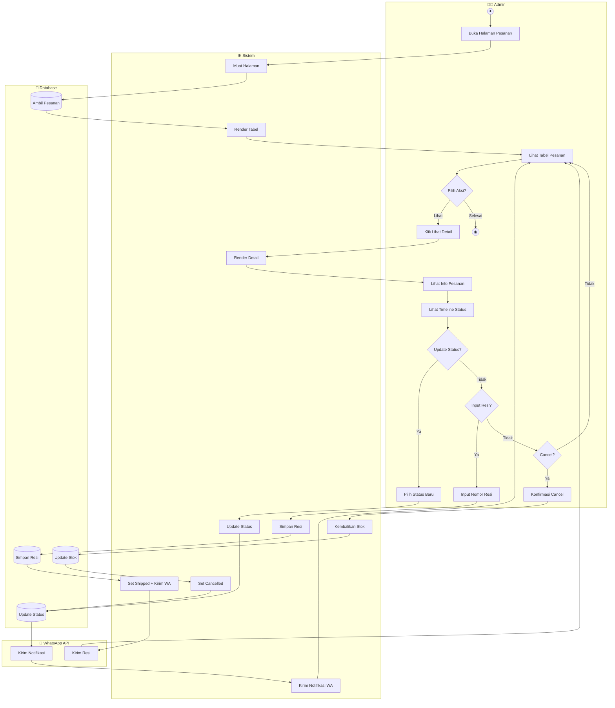
```mermaid
flowchart TD
    subgraph Admin["👨‍💻 Admin"]
        A1((●))
        A2[Buka Halaman Pesanan]
        A3[Lihat Tabel Pesanan]
        A4{Pilih Aksi?}
        A5[Klik Lihat Detail]
        A6[Lihat Info Pesanan]
        A7[Lihat Timeline Status]
        A8{Update Status?}
        A9[Pilih Status Baru]
        A10{Input Resi?}
        A11[Input Nomor Resi]
        A12{Cancel?}
        A13[Konfirmasi Cancel]
        A14((◉))
    end
    
    subgraph Sistem["⚙️ Sistem"]
        S1[Muat Halaman]
        S2[Render Tabel]
        S3[Render Detail]
        S4[Update Status]
        S5[Kirim Notifikasi WA]
        S6[Simpan Resi]
        S7[Set Shipped + Kirim WA]
        S8[Kembalikan Stok]
        S9[Set Cancelled]
    end
    
    subgraph Database["💾 Database"]
        D1[(Ambil Pesanan)]
        D2[(Update Status)]
        D3[(Simpan Resi)]
        D4[(Update Stok)]
    end
    
    subgraph WhatsApp["📱 WhatsApp API"]
        W1[Kirim Notifikasi]
        W2[Kirim Resi]
    end
    
    A1 --> A2
    A2 --> S1
    S1 --> D1
    D1 --> S2
    S2 --> A3
    A3 --> A4
    A4 -->|Lihat| A5
    A5 --> S3
    S3 --> A6
    A6 --> A7
    A7 --> A8
    A8 -->|Ya| A9
    A9 --> S4
    S4 --> D2
    D2 --> W1
    W1 --> S5
    S5 --> A3
    A8 -->|Tidak| A10
    A10 -->|Ya| A11
    A11 --> S6
    S6 --> D3
    D3 --> S7
    S7 --> W2
    W2 --> A3
    A10 -->|Tidak| A12
    A12 -->|Ya| A13
    A13 --> S8
    S8 --> D4
    D4 --> S9
    S9 --> D2
    A12 -->|Tidak| A3
    A4 -->|Selesai| A14
```

---

### 15. Manajemen Artikel

**URL:** `/admin/articles`

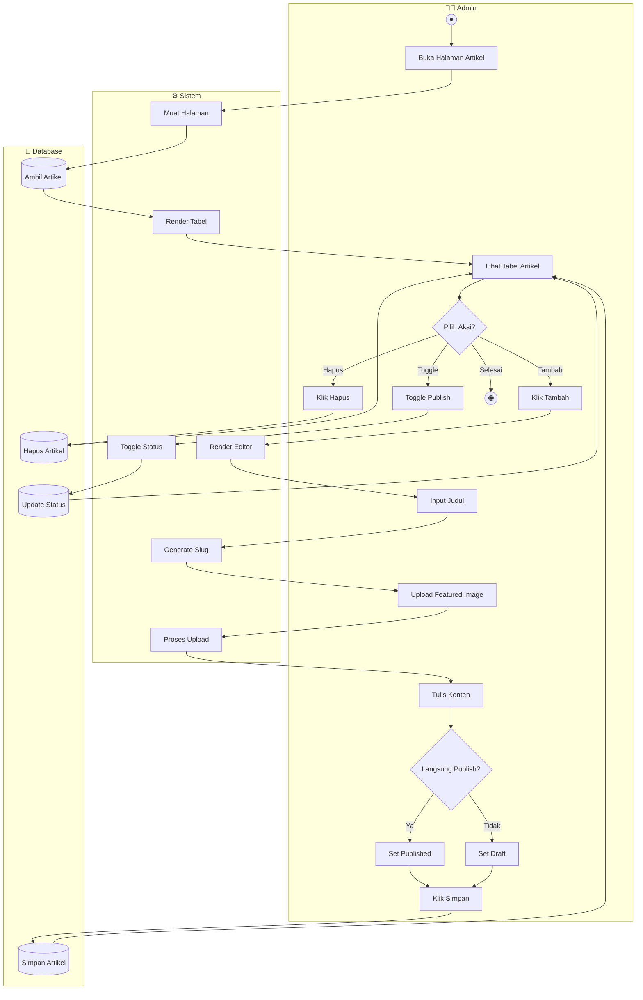
```mermaid
flowchart TD
    subgraph Admin["👨‍💻 Admin"]
        A1((●))
        A2[Buka Halaman Artikel]
        A3[Lihat Tabel Artikel]
        A4{Pilih Aksi?}
        A5[Klik Tambah]
        A6[Input Judul]
        A7[Upload Featured Image]
        A8[Tulis Konten]
        A9{Langsung Publish?}
        A10[Set Published]
        A11[Set Draft]
        A12[Klik Simpan]
        A13[Toggle Publish]
        A14[Klik Hapus]
        A15((◉))
    end
    
    subgraph Sistem["⚙️ Sistem"]
        S1[Muat Halaman]
        S2[Render Tabel]
        S3[Render Editor]
        S4[Generate Slug]
        S5[Proses Upload]
        S6[Toggle Status]
    end
    
    subgraph Database["💾 Database"]
        D1[(Ambil Artikel)]
        D2[(Simpan Artikel)]
        D3[(Update Status)]
        D4[(Hapus Artikel)]
    end
    
    A1 --> A2
    A2 --> S1
    S1 --> D1
    D1 --> S2
    S2 --> A3
    A3 --> A4
    A4 -->|Tambah| A5
    A5 --> S3
    S3 --> A6
    A6 --> S4
    S4 --> A7
    A7 --> S5
    S5 --> A8
    A8 --> A9
    A9 -->|Ya| A10
    A9 -->|Tidak| A11
    A10 --> A12
    A11 --> A12
    A12 --> D2
    D2 --> A3
    A4 -->|Toggle| A13
    A13 --> S6
    S6 --> D3
    D3 --> A3
    A4 -->|Hapus| A14
    A14 --> D4
    D4 --> A3
    A4 -->|Selesai| A15
```

---

### 16. Moderasi Review

**URL:** `/admin/reviews`

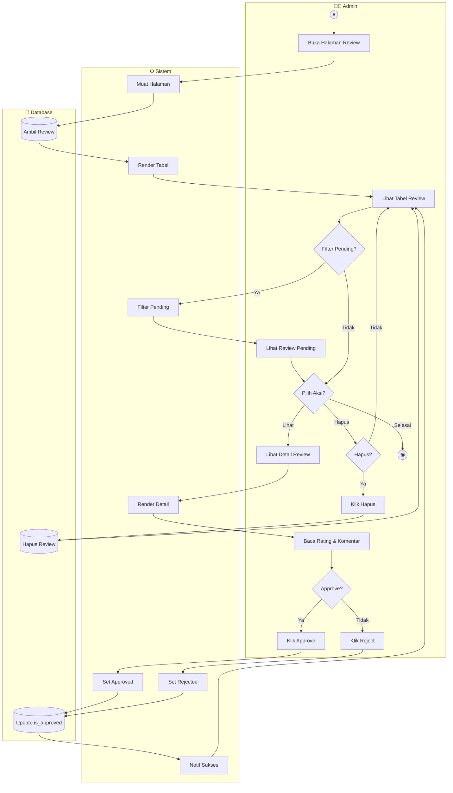
```mermaid
flowchart TD
    subgraph Admin["👨‍💻 Admin"]
        A1((●))
        A2[Buka Halaman Review]
        A3[Lihat Tabel Review]
        A4{Filter Pending?}
        A5[Lihat Review Pending]
        A6{Pilih Aksi?}
        A7[Lihat Detail Review]
        A8[Baca Rating & Komentar]
        A9{Approve?}
        A10[Klik Approve]
        A11[Klik Reject]
        A12{Hapus?}
        A13[Klik Hapus]
        A14((◉))
    end
    
    subgraph Sistem["⚙️ Sistem"]
        S1[Muat Halaman]
        S2[Render Tabel]
        S3[Filter Pending]
        S4[Render Detail]
        S5[Set Approved]
        S6[Set Rejected]
        S7[Notif Sukses]
    end
    
    subgraph Database["💾 Database"]
        D1[(Ambil Review)]
        D2[(Update is_approved)]
        D3[(Hapus Review)]
    end
    
    A1 --> A2
    A2 --> S1
    S1 --> D1
    D1 --> S2
    S2 --> A3
    A3 --> A4
    A4 -->|Ya| S3
    S3 --> A5
    A5 --> A6
    A4 -->|Tidak| A6
    A6 -->|Lihat| A7
    A7 --> S4
    S4 --> A8
    A8 --> A9
    A9 -->|Ya| A10
    A10 --> S5
    S5 --> D2
    D2 --> S7
    S7 --> A3
    A9 -->|Tidak| A11
    A11 --> S6
    S6 --> D2
    A6 -->|Hapus| A12
    A12 -->|Ya| A13
    A13 --> D3
    D3 --> A3
    A12 -->|Tidak| A3
    A6 -->|Selesai| A14
```

---

### 17. Pengaturan Sistem

**URL:** `/admin/settings`

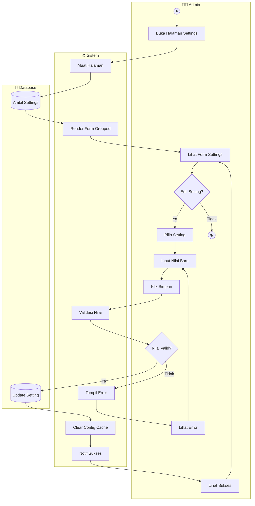
```mermaid
flowchart TD
    subgraph Admin["👨‍💻 Admin"]
        A1((●))
        A2[Buka Halaman Settings]
        A3[Lihat Form Settings]
        A4{Edit Setting?}
        A5[Pilih Setting]
        A6[Input Nilai Baru]
        A7[Klik Simpan]
        A8{Nilai Valid?}
        A9[Lihat Error]
        A10[Lihat Sukses]
        A11((◉))
    end
    
    subgraph Sistem["⚙️ Sistem"]
        S1[Muat Halaman]
        S2[Render Form Grouped]
        S3[Validasi Nilai]
        S4[Tampil Error]
        S5[Clear Config Cache]
        S6[Notif Sukses]
    end
    
    subgraph Database["💾 Database"]
        D1[(Ambil Settings)]
        D2[(Update Setting)]
    end
    
    A1 --> A2
    A2 --> S1
    S1 --> D1
    D1 --> S2
    S2 --> A3
    A3 --> A4
    A4 -->|Ya| A5
    A5 --> A6
    A6 --> A7
    A7 --> S3
    S3 --> A8
    A8 -->|Tidak| S4
    S4 --> A9
    A9 --> A6
    A8 -->|Ya| D2
    D2 --> S5
    S5 --> S6
    S6 --> A10
    A10 --> A3
    A4 -->|Tidak| A11
```

---

## 📝 Legenda Simbol

| Simbol | Makna |
|:-------|:------|
| `((●))` | Start Node (Titik Mulai) |
| `((◉))` | End Node (Titik Selesai) |
| `[...]` | Activity/Action |
| `{...}` | Decision (Keputusan) |
| `[(...)` | Database Operation |
| `subgraph` | Swimlane/Partition |

---

*Dokumentasi ini dibuat untuk keperluan Tugas Akhir/Skripsi*  
**Universitas Ichsan Sidenreng Rappang** © 2026
