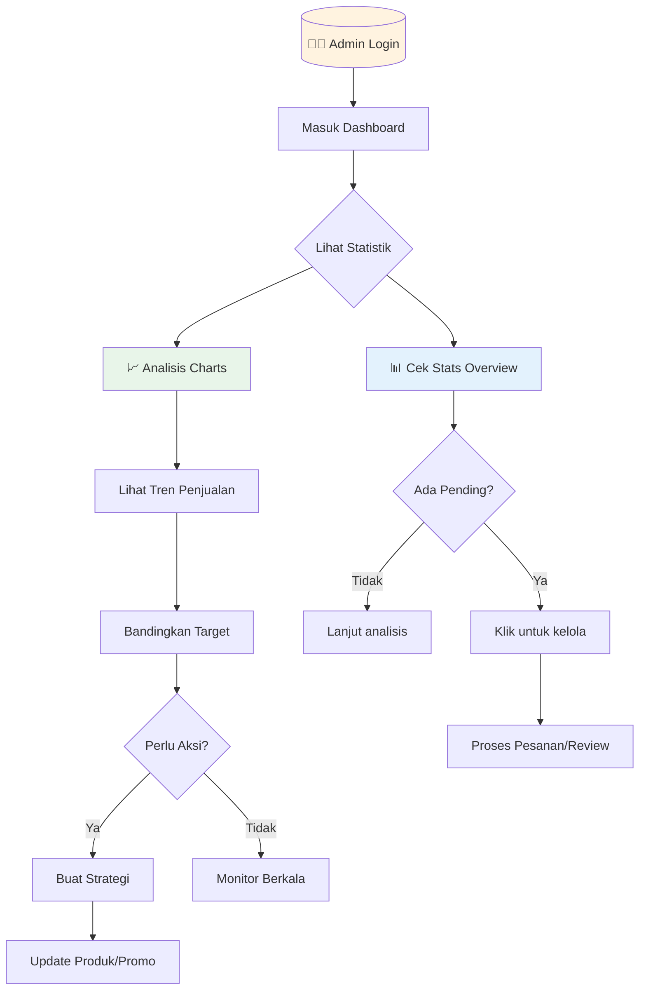
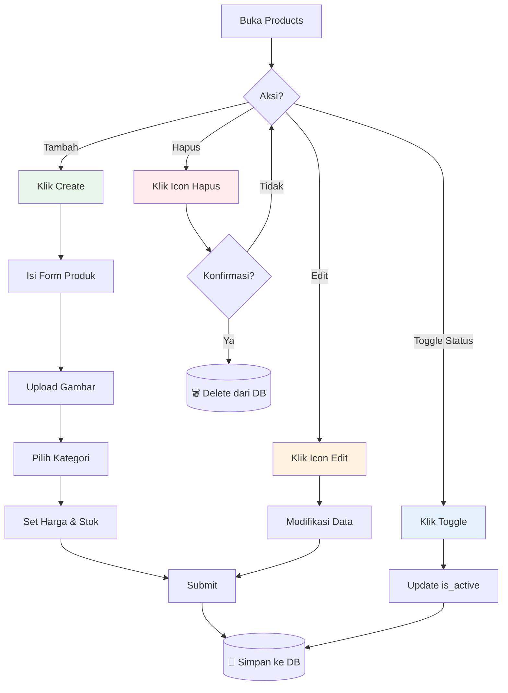
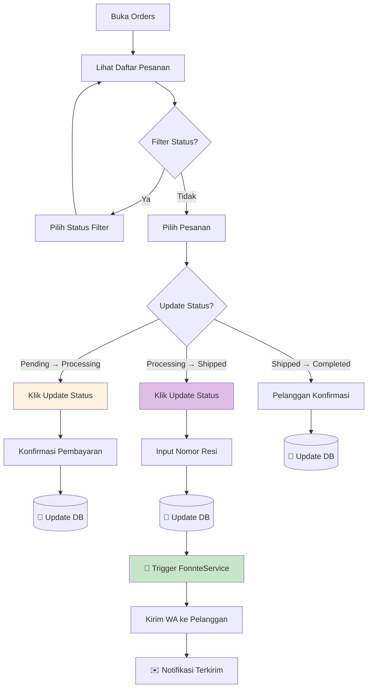
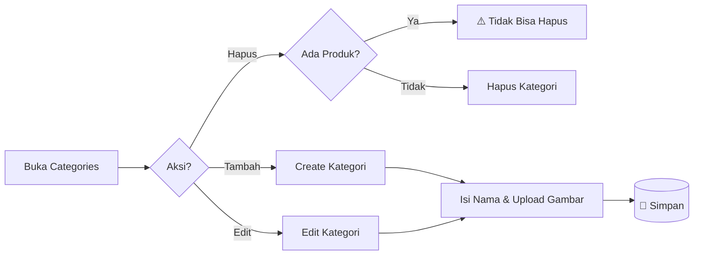
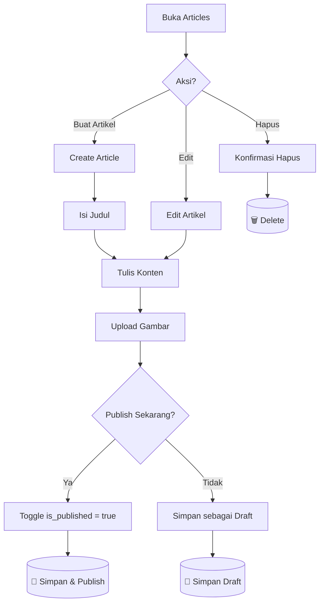
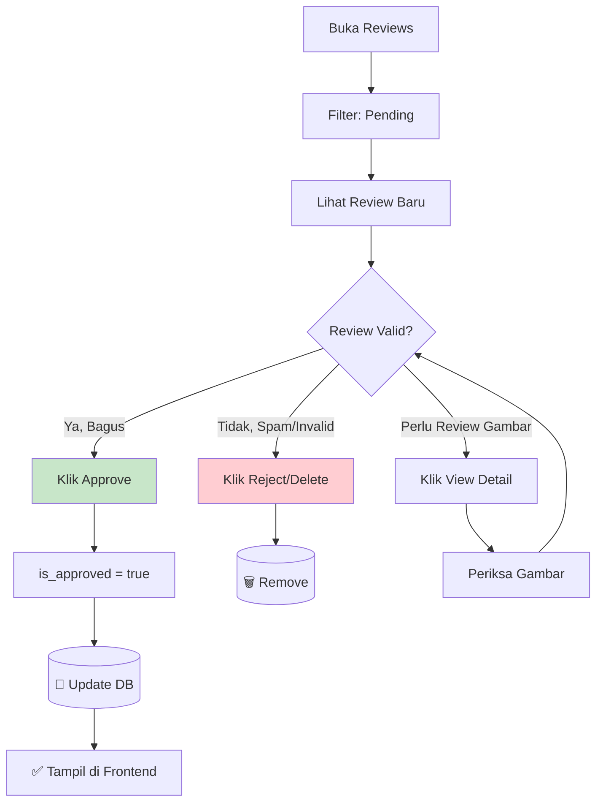
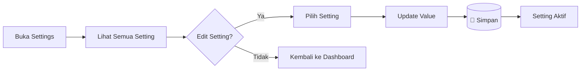
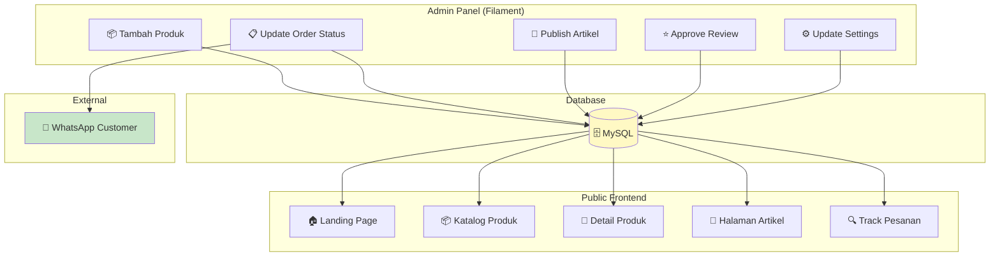

# 📊 Panduan Dashboard Admin

> **Platform E-Commerce Ivo Karya** - Dokumentasi Lengkap Panel Administrasi Filament v3

---

## 📋 Ringkasan Halaman Admin

| No | Halaman | URL | Kategori | Fitur Khusus |
|:--:|:--------|:----|:---------|:-------------|
| 1 | Dashboard | `/admin` | MAIN | Charts, Stats Overview, Analytics |
| 2 | Products | `/admin/products` | DATA | CRUD Produk, Manajemen Stok |
| 3 | Orders | `/admin/orders` | DATA | Manajemen Pesanan, Notifikasi WA |
| 4 | Categories | `/admin/categories` | DATA | CRUD Kategori Produk |
| 5 | Articles | `/admin/articles` | CONTENT | CMS Blog/Artikel |
| 6 | Reviews | `/admin/reviews` | CONTENT | Moderasi Ulasan Pelanggan |
| 7 | Settings | `/admin/settings` | SYSTEM | Konfigurasi Sistem |

---

## 1. 📈 Dashboard Utama

**URL**: `/admin`

### A. Fungsi Utama

1. **Monitoring Bisnis Real-time**: Dashboard menyajikan ringkasan statistik bisnis secara langsung, memungkinkan pemilik usaha untuk melihat performa penjualan tanpa perlu membuka laporan manual.

2. **Visualisasi Data Penjualan**: Grafik interaktif menampilkan tren penjualan bulanan, perbandingan target vs aktual, dan distribusi status pesanan untuk pengambilan keputusan berbasis data.

3. **Alert Sistem**: Widget menampilkan jumlah pesanan pending dan review yang menunggu moderasi, memastikan admin tidak melewatkan tugas penting.

4. **Quick Access**: Dari dashboard, admin dapat langsung mengakses semua modul pengelolaan data melalui sidebar navigasi.

### B. Fitur yang Tersedia (Widgets)

| Widget | Deskripsi | Teknologi |
|:-------|:----------|:----------|
| **Stats Overview** | 4 kartu statistik: Total Pesanan, Pendapatan, Pesanan Pending, Review Pending | Filament StatsOverviewWidget |
| **Monthly Sales Chart** | Grafik garis pendapatan bulanan 12 bulan terakhir | Filament ChartWidget (Line) |
| **Production vs Sales** | Perbandingan target produksi 50kg vs penjualan aktual | Filament ChartWidget (Bar) |
| **Order Status Chart** | Pie chart distribusi status pesanan | Filament ChartWidget (Pie) |
| **Customer Growth** | Grafik pertumbuhan pelanggan baru per bulan | Filament ChartWidget (Line) |

### C. Diagram Alur Kerja

---

## 2. 📦 Manajemen Produk

**URL**: `/admin/products`

### A. Fungsi Utama

1. **CRUD Produk Lengkap**: Menambah, melihat, mengedit, dan menghapus produk dengan form yang terstruktur. Setiap field telah divalidasi untuk mencegah input tidak valid.

2. **Manajemen Stok**: Tracking stok real-time dengan field khusus untuk berat produk (gram). Sistem otomatis menghitung total berat pesanan saat checkout.

3. **SEO-Friendly Slug**: Slug URL otomatis di-generate dari nama produk untuk optimasi mesin pencari dan URL yang mudah dibaca.

4. **Upload Gambar**: Fitur upload gambar produk dengan preview, mendukung format JPG, PNG, dan WebP.

5. **Toggle Aktif/Nonaktif**: Produk dapat dengan cepat diaktifkan atau dinonaktifkan tanpa menghapus data.

### B. Fitur yang Tersedia

| Fitur | Deskripsi | Teknologi |
|:------|:----------|:----------|
| Data Table | Tabel interaktif dengan sorting, filtering, search | Filament Table |
| Bulk Actions | Hapus massal, toggle status massal | Filament BulkActions |
| Create Form | Form pembuatan produk dengan validasi | Filament Form |
| Edit Form | Form edit dengan pre-populated data | Filament Form |
| Image Upload | Upload gambar dengan preview | Filament FileUpload |
| Category Select | Dropdown kategori dengan search | Filament Select |

### C. Diagram Alur Kerja

---

## 3. 📋 Manajemen Pesanan

**URL**: `/admin/orders`

### A. Fungsi Utama

1. **Tracking Status Pesanan**: Memantau seluruh lifecycle pesanan dari `pending` hingga `completed`. Status ditampilkan dengan badge berwarna untuk identifikasi cepat.

2. **Update Status dengan Notifikasi Otomatis**: Saat admin mengubah status ke `shipped`, sistem otomatis mengirim notifikasi WhatsApp berisi nomor resi ke pelanggan melalui Fonnte API.

3. **Detail Pesanan Lengkap**: Melihat data pelanggan, daftar item yang dipesan (dalam format JSON), total harga, berat, dan alamat pengiriman.

4. **Input Nomor Resi**: Field khusus untuk memasukkan tracking number yang akan dikirim ke pelanggan.

5. **Filter Status**: Memfilter pesanan berdasarkan status untuk fokus pada pesanan yang perlu diproses.

### B. Fitur yang Tersedia

| Fitur | Deskripsi | Teknologi |
|:------|:----------|:----------|
| Status Badge | Badge berwarna (Pending=Kuning, Processing=Biru, Shipped=Ungu, Completed=Hijau) | Filament Badge |
| Quick Actions | Update status langsung dari tabel | Filament Actions |
| Tracking Input | Field untuk nomor resi pengiriman | Filament TextInput |
| Order Items View | Tampilan daftar item dalam pesanan | Filament Repeater |
| Date Filter | Filter berdasarkan tanggal pesanan | Filament Filter |
| Export | Ekspor data pesanan ke Excel/CSV | Filament Export |

### C. Diagram Alur Kerja

---

## 4. 🏷️ Manajemen Kategori

**URL**: `/admin/categories`

### A. Fungsi Utama

1. **Organisasi Produk**: Mengelompokkan produk ke dalam kategori untuk navigasi yang lebih mudah bagi pelanggan.

2. **CRUD Sederhana**: Interface minimalis untuk menambah, edit, dan hapus kategori.

3. **Gambar Kategori**: Upload gambar representatif untuk setiap kategori.

4. **Slug Otomatis**: URL-friendly slug di-generate dari nama kategori.

### B. Fitur yang Tersedia

| Fitur | Deskripsi | Teknologi |
|:------|:----------|:----------|
| Data Table | Daftar kategori dengan jumlah produk | Filament Table |
| Image Upload | Upload gambar kategori | Filament FileUpload |
| Auto Slug | Generate slug dari nama | Filament TextInput |
| Product Count | Menampilkan jumlah produk per kategori | Relationship Count |

### C. Diagram Alur Kerja

---

## 5. 📝 Manajemen Artikel

**URL**: `/admin/articles`

### A. Fungsi Utama

1. **Content Management System**: Platform blogging sederhana untuk mempublikasikan artikel tentang produk, tips, atau berita UMKM.

2. **Rich Text Editor**: Editor WYSIWYG untuk menulis konten dengan formatting (bold, italic, heading, list, link).

3. **Draft & Publish**: Toggle untuk menyimpan artikel sebagai draft atau langsung dipublikasikan.

4. **Featured Image**: Upload gambar utama artikel untuk tampilan di listing.

### B. Fitur yang Tersedia

| Fitur | Deskripsi | Teknologi |
|:------|:----------|:----------|
| Rich Editor | Editor teks dengan toolbar formatting | Filament RichEditor |
| Toggle Publish | Switch untuk status publikasi | Filament Toggle |
| Image Upload | Upload featured image | Filament FileUpload |
| Slug Generator | Auto-generate dari judul | Filament TextInput |
| Preview | Preview artikel sebelum publish | Custom Action |

### C. Diagram Alur Kerja

---

## 6. ⭐ Moderasi Ulasan

**URL**: `/admin/reviews`

### A. Fungsi Utama

1. **Quality Control**: Semua ulasan pelanggan harus dimoderasi sebelum tampil di halaman produk. Ini mencegah spam dan konten tidak pantas.

2. **Approve/Reject**: Admin dapat menyetujui atau menolak ulasan dengan satu klik.

3. **Support Guest Review**: Sistem mendukung ulasan dari guest (tanpa login) dengan field `customer_name` terpisah.

4. **View Attached Images**: Pelanggan dapat menyertakan foto produk, yang bisa direview oleh admin.

### B. Fitur yang Tersedia

| Fitur | Deskripsi | Teknologi |
|:------|:----------|:----------|
| Status Filter | Filter: Pending, Approved, Rejected | Filament Filter |
| Quick Approve | Tombol approve langsung dari tabel | Filament Action |
| Rating Display | Tampilan rating bintang | Filament TextColumn |
| Image Preview | Preview gambar yang di-upload | Filament ImageColumn |
| Product Link | Link ke produk yang direview | Filament Relationship |

### C. Diagram Alur Kerja

---

## 7. ⚙️ Pengaturan Sistem

**URL**: `/admin/settings`

### A. Fungsi Utama

1. **Konfigurasi Dinamis**: Mengubah pengaturan sistem tanpa edit kode. Data disimpan dalam tabel key-value untuk fleksibilitas.

2. **WhatsApp Number**: Menyimpan nomor WhatsApp bisnis untuk notifikasi.

3. **Bank Account Info**: Informasi rekening bank untuk instruksi pembayaran di invoice.

4. **API Keys**: Menyimpan kunci API eksternal (Fonnte) secara aman.

### B. Fitur yang Tersedia

| Fitur | Deskripsi | Teknologi |
|:------|:----------|:----------|
| Key-Value Editor | Form untuk mengedit setting | Filament Form |
| Sensitive Data | Masking untuk data sensitif | Filament PasswordInput |
| Grouped Settings | Pengelompokan setting berdasarkan tipe | Filament Sections |

### C. Diagram Alur Kerja

---

## 📊 Diagram Alur Data Global

Bagaimana data dari Admin Panel mengalir ke halaman publik:

---

  <em>Dokumentasi ini dibuat untuk keperluan akademis (Tugas Akhir/Skripsi)</em>

