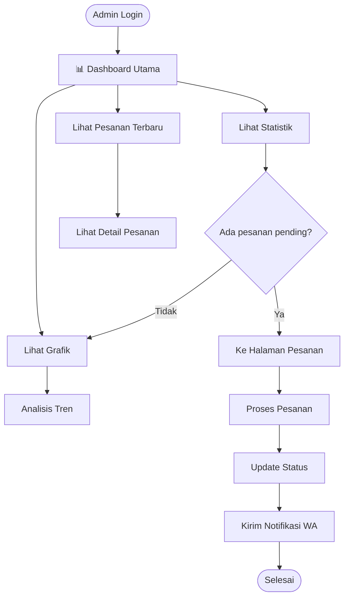
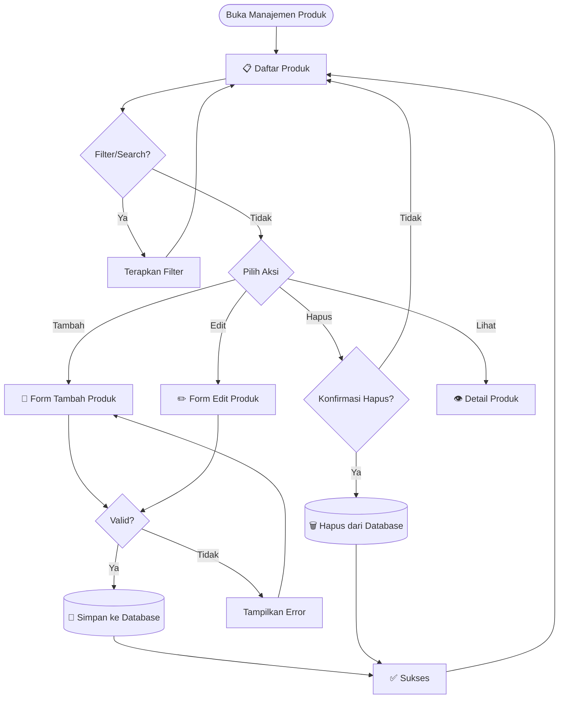
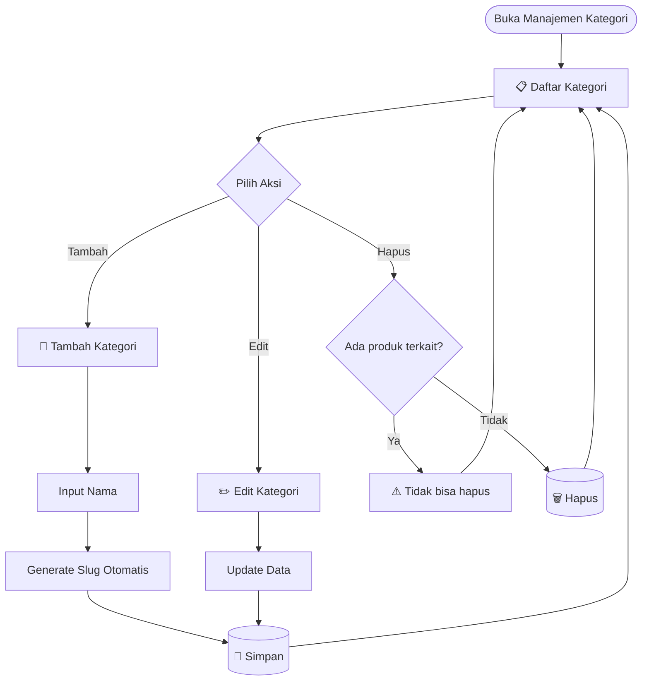
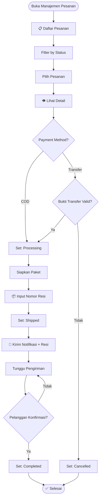
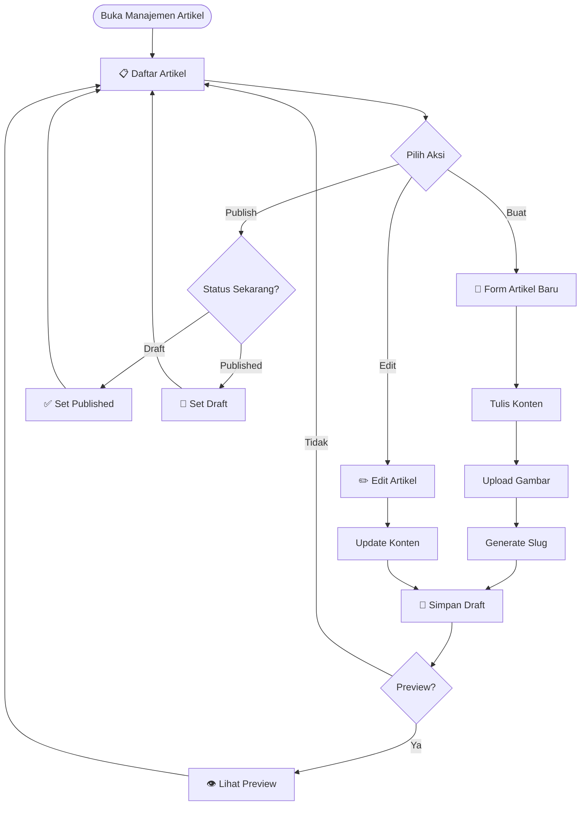
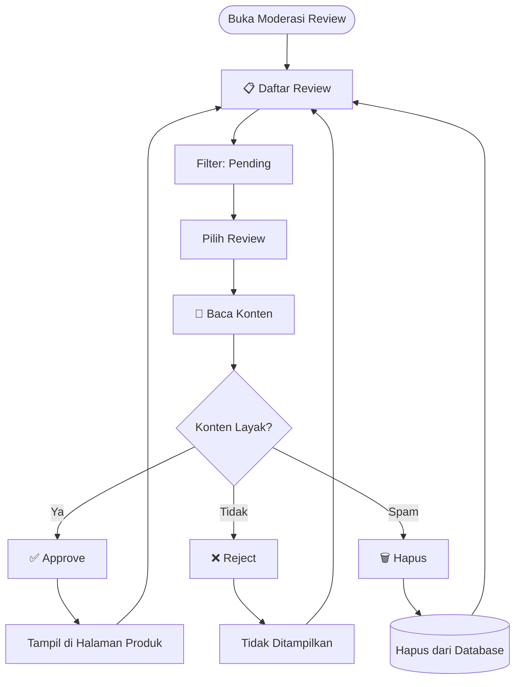
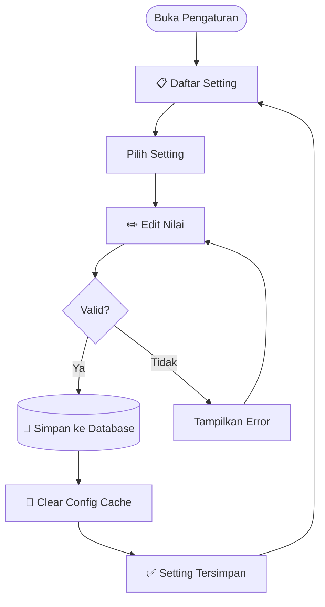
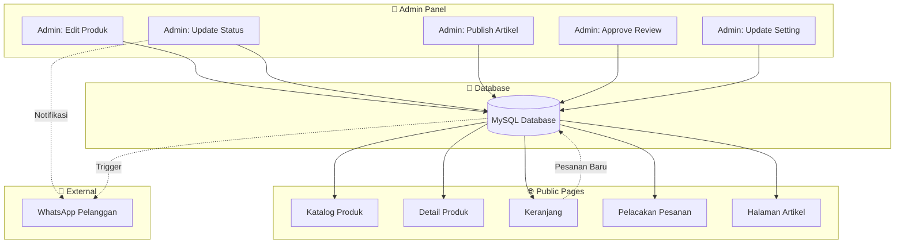

# 📊 Panduan Dashboard Admin Ivo Karya

> **Dokumentasi Lengkap Panel Admin Filament v3**

---

## 📋 Daftar Isi

1. [Ringkasan Halaman Admin](#ringkasan-halaman-admin)
2. [Dashboard Utama](#1--dashboard-utama)
3. [Manajemen Produk](#2--manajemen-produk)
4. [Manajemen Kategori](#3--manajemen-kategori)
5. [Manajemen Pesanan](#4--manajemen-pesanan)
6. [Manajemen Artikel](#5--manajemen-artikel)
7. [Moderasi Review](#6--moderasi-review)
8. [Pengaturan Sistem](#7--pengaturan-sistem)
9. [Diagram Alur Data Global](#diagram-alur-data-global)

---

## Ringkasan Halaman Admin

| No | Halaman | URL | Kategori | Fitur Khusus |
|:---|:--------|:----|:---------|:-------------|
| 1 | Dashboard | `/admin` | MAIN | Widget statistik, grafik penjualan |
| 2 | Produk | `/admin/products` | DATA | CRUD, upload gambar, SEO meta |
| 3 | Kategori | `/admin/categories` | DATA | CRUD, auto-slug |
| 4 | Pesanan | `/admin/orders` | DATA | Status tracking, notifikasi WA |
| 5 | Artikel | `/admin/articles` | CONTENT | Rich editor, publish toggle |
| 6 | Review | `/admin/reviews` | CONTENT | Moderasi, approve/reject |
| 7 | Pengaturan | `/admin/settings` | SYSTEM | Konfigurasi dinamis |

---

## 1. 📊 Dashboard Utama

**URL**: `/admin`

### A. Fungsi Utama

1. **Monitoring Real-time**: Dashboard menampilkan statistik penjualan terkini secara real-time, memungkinkan admin memantau performa bisnis tanpa perlu membuka laporan terpisah.

2. **Visualisasi Data**: Grafik interaktif menampilkan tren pendapatan bulanan dan distribusi status pesanan, membantu pengambilan keputusan berbasis data.

3. **Quick Overview**: Widget ringkasan menampilkan metrik kunci seperti total pendapatan, jumlah pesanan pending, dan pertumbuhan pelanggan.

4. **Action Center**: Akses cepat ke pesanan yang memerlukan tindakan segera (pending payment, ready to ship).

5. **Performance Tracking**: Perbandingan target produksi 50kg vs penjualan aktual untuk monitoring gap.

### B. Fitur yang Tersedia

| Fitur | Deskripsi | Teknologi |
|:------|:----------|:----------|
| **Stats Overview** | 4 kartu statistik (Pendapatan, Pesanan, Pending, Customer) | Filament Widget |
| **Monthly Revenue Chart** | Grafik garis pendapatan 6 bulan terakhir | Chart.js via Filament |
| **Order Status Distribution** | Pie chart status pesanan | Chart.js via Filament |
| **Recent Orders Table** | 5 pesanan terbaru dengan aksi cepat | Filament Table |
| **Low Stock Alert** | Notifikasi produk dengan stok < 10 | Custom Widget |

### C. Diagram Alur Kerja

---

## 2. 📦 Manajemen Produk

**URL**: `/admin/products`

### A. Fungsi Utama

1. **CRUD Produk**: Menambah, mengedit, melihat, dan menghapus produk dengan antarmuka yang intuitif. Form validasi memastikan data konsisten.

2. **Manajemen Stok**: Tracking stok real-time dengan warning otomatis saat stok menipis. Stok terintegrasi dengan sistem checkout.

3. **Pricing Flexibility**: Mendukung harga normal dan harga diskon. Sistem otomatis menghitung persentase diskon.

4. **SEO Optimization**: Field meta title dan description untuk optimasi mesin pencari. Preview snippet seperti tampil di Google.

5. **Media Management**: Upload dan crop gambar produk langsung dari dashboard dengan kompresi otomatis.

### B. Fitur yang Tersedia

| Fitur | Deskripsi | Teknologi |
|:------|:----------|:----------|
| **Data Table** | Tabel produk dengan sort, filter, search | Filament Table |
| **Create/Edit Form** | Form validasi multi-field | Filament Forms |
| **Image Upload** | Upload dengan preview & crop | Filament FileUpload |
| **Category Selector** | Dropdown kategori dengan search | Filament Select |
| **Rich Description** | WYSIWYG editor untuk deskripsi | Filament RichEditor |
| **Bulk Actions** | Hapus/Archive multiple produk | Filament Bulk Actions |
| **Export** | Export ke CSV/Excel | Filament Export |

### C. Diagram Alur Kerja

### D. Fields Produk

| Field | Tipe | Required | Validasi |
|:------|:-----|:---------|:---------|
| name | string | ✅ | max:255 |
| slug | string | ✅ | unique, auto-generate |
| category_id | foreign key | ✅ | exists:categories |
| description | text | ❌ | - |
| price | decimal | ✅ | min:0 |
| discount_price | decimal | ❌ | lt:price |
| stock | integer | ✅ | min:0 |
| weight | integer | ✅ | min:1 (gram) |
| image | file | ❌ | image, max:2MB |
| meta_title | string | ❌ | max:60 |
| meta_description | string | ❌ | max:160 |

---

## 3. 🏷️ Manajemen Kategori

**URL**: `/admin/categories`

### A. Fungsi Utama

1. **Organisasi Produk**: Mengelompokkan produk berdasarkan jenis (Abon Ikan, Abon Sapi, Paket Hemat) untuk navigasi yang lebih mudah.

2. **Auto-Slug Generation**: Sistem otomatis membuat URL-friendly slug dari nama kategori untuk SEO-friendly URLs.

3. **Hierarchical Structure**: Mendukung kategori parent-child untuk struktur yang lebih kompleks di masa depan.

4. **Product Counter**: Menampilkan jumlah produk di setiap kategori untuk gambaran distribusi inventaris.

### B. Fitur yang Tersedia

| Fitur | Deskripsi | Teknologi |
|:------|:----------|:----------|
| **Simple CRUD** | Create, Read, Update, Delete | Filament Resource |
| **Auto Slug** | Generate slug dari nama | Spatie Sluggable |
| **Product Count** | Kolom jumlah produk | Eloquent withCount |
| **Inline Edit** | Edit langsung di tabel | Filament Inline Actions |

### C. Diagram Alur Kerja

---

## 4. 📋 Manajemen Pesanan

**URL**: `/admin/orders`

### A. Fungsi Utama

1. **Order Tracking**: Melacak status setiap pesanan dari pending hingga completed dengan timeline visual.

2. **Status Management**: Update status pesanan (Pending → Processing → Shipped → Completed) dengan satu klik.

3. **WhatsApp Notification**: Mengirim notifikasi otomatis ke pelanggan saat status berubah via Fonnte API.

4. **Resi Integration**: Input nomor resi pengiriman yang otomatis dikirim ke pelanggan.

5. **Payment Verification**: Verifikasi pembayaran untuk metode transfer bank.

6. **Order Details**: Melihat detail lengkap pesanan termasuk items, alamat, dan riwayat status.

### B. Fitur yang Tersedia

| Fitur | Deskripsi | Teknologi |
|:------|:----------|:----------|
| **Order Table** | Tabel dengan filter status | Filament Table |
| **Status Badges** | Badge warna per status | Filament Badge Column |
| **Quick Actions** | Update status, input resi | Filament Actions |
| **WA Notification** | Kirim notifikasi WhatsApp | FonnteService |
| **Timeline View** | Riwayat perubahan status | Custom View |
| **Payment Method** | Filter by COD/Transfer | Filament Filter |
| **Export Orders** | Export ke Excel | Filament Export |

### C. Status Pesanan

| Status | Warna | Deskripsi | Trigger WA |
|:-------|:------|:----------|:-----------|
| `pending` | 🟡 Yellow | Menunggu pembayaran | ❌ |
| `processing` | 🔵 Blue | Diproses admin | ✅ |
| `shipped` | 🟣 Purple | Dalam pengiriman | ✅ + Resi |
| `completed` | 🟢 Green | Selesai | ❌ |
| `cancelled` | 🔴 Red | Dibatalkan | ✅ |

### D. Diagram Alur Kerja

---

## 5. 📝 Manajemen Artikel

**URL**: `/admin/articles`

### A. Fungsi Utama

1. **Content Management**: Membuat dan mengelola artikel blog untuk SEO dan engagement pelanggan.

2. **Rich Text Editor**: WYSIWYG editor dengan format text, gambar, dan embed media.

3. **Publish Control**: Toggle publish/draft untuk artikel yang belum siap dipublikasikan.

4. **SEO Friendly**: Auto-generate slug dari judul dengan format URL-friendly.

5. **Featured Image**: Upload gambar utama dengan crop dan resize otomatis.

### B. Fitur yang Tersedia

| Fitur | Deskripsi | Teknologi |
|:------|:----------|:----------|
| **Article CRUD** | Create, Read, Update, Delete | Filament Resource |
| **Rich Editor** | WYSIWYG content editor | Filament RichEditor |
| **Image Upload** | Featured image | Filament FileUpload |
| **Publish Toggle** | Draft/Published status | Filament Toggle |
| **Preview** | Preview sebelum publish | Custom Action |
| **Auto Slug** | Generate dari judul | Spatie Sluggable |

### C. Diagram Alur Kerja

---

## 6. ⭐ Moderasi Review

**URL**: `/admin/reviews`

### A. Fungsi Utama

1. **Content Moderation**: Memoderasi review pelanggan sebelum ditampilkan di halaman produk.

2. **Approval System**: Approve atau reject review berdasarkan kebijakan konten.

3. **Spam Prevention**: Filter review spam atau inappropriate content.

4. **Rating Overview**: Melihat distribusi rating per produk.

5. **Guest Reviews**: Mendukung review dari guest (tanpa akun) dengan nama pelanggan.

### B. Fitur yang Tersedia

| Fitur | Deskripsi | Teknologi |
|:------|:----------|:----------|
| **Review Table** | Tabel dengan filter status | Filament Table |
| **Quick Approve** | Approve dengan satu klik | Filament Action |
| **Bulk Approve** | Approve multiple review | Filament Bulk Action |
| **Rating Stars** | Tampilan rating visual | Custom Column |
| **Product Link** | Link ke produk terkait | Filament Relation |
| **Customer Info** | Info pelanggan/guest | Filament Column |

### C. Status Review

| Status | Tampil di Publik | Aksi Admin |
|:-------|:-----------------|:-----------|
| `pending` | ❌ | Approve / Reject |
| `approved` | ✅ | Revoke Approval |
| `rejected` | ❌ | Re-approve |

### D. Diagram Alur Kerja

---

## 7. ⚙️ Pengaturan Sistem

**URL**: `/admin/settings`

### A. Fungsi Utama

1. **Dynamic Configuration**: Mengubah konfigurasi sistem tanpa edit kode (no-code).

2. **WhatsApp Settings**: Mengatur nomor WhatsApp admin dan token Fonnte.

3. **Bank Account Info**: Mengatur info rekening untuk pembayaran transfer.

4. **Store Information**: Mengatur nama toko, alamat, dan informasi bisnis.

5. **Shipping Settings**: Mengatur origin city dan API key untuk ongkir.

### B. Fitur yang Tersedia

| Fitur | Deskripsi | Teknologi |
|:------|:----------|:----------|
| **Key-Value Store** | Simpan konfigurasi dinamis | Setting Model |
| **Grouped Settings** | Grup berdasarkan kategori | Filament Sections |
| **Secret Fields** | Mask untuk API keys | Filament Password |
| **Validation** | Validasi format data | Filament Rules |
| **Cache Refresh** | Clear cache setelah update | Custom Action |

### C. Konfigurasi yang Tersedia

| Key | Deskripsi | Contoh Nilai |
|:----|:----------|:-------------|
| `store_name` | Nama toko | Ivo Karya |
| `store_phone` | Nomor telepon | 081234567890 |
| `whatsapp_number` | Nomor WA admin | 6281234567890 |
| `fonnte_token` | Token API Fonnte | abc123xyz |
| `bank_bca` | Rekening BCA | 1234567890 |
| `bank_bri` | Rekening BRI | 0987654321 |
| `shipping_origin` | Origin city ID | 398 |
| `rajaongkir_key` | API Key RajaOngkir | xxx |

### D. Diagram Alur Kerja

---

## Diagram Alur Data Global

### Bagaimana Data Admin Mengalir ke Halaman Publik

---

## 📝 Catatan Teknis

### Akses Admin Panel

1. **URL**: `/admin` atau `/admin/login`
2. **Default Credentials**: Dibuat via seeder atau registrasi
3. **Middleware**: `auth`, `verified`
4. **Authorization**: Filament Shield (opsional)

### Best Practices

1. ✅ Selalu backup database sebelum operasi bulk
2. ✅ Gunakan preview sebelum publish artikel
3. ✅ Moderasi review secara berkala
4. ✅ Monitor stok produk via dashboard
5. ✅ Update setting via panel, bukan langsung di database

---

*Dokumentasi ini dibuat untuk keperluan Tugas Akhir/Skripsi*  
**Universitas Ichsan Sidenreng Rappang** © 2026
