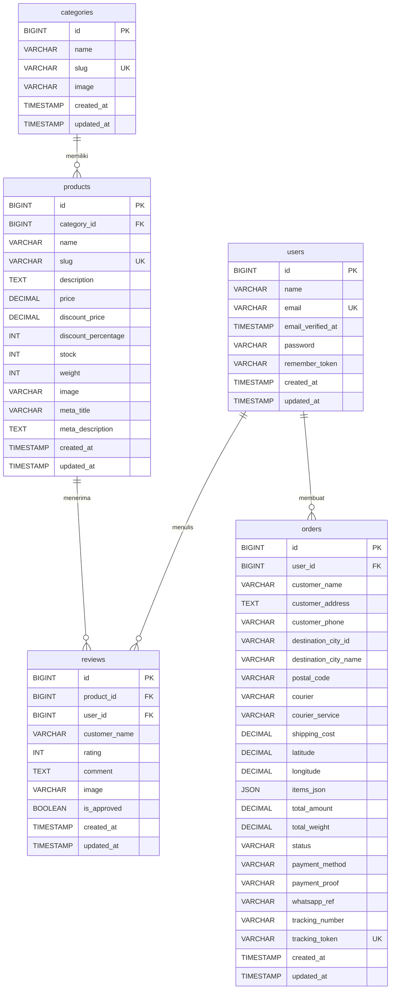
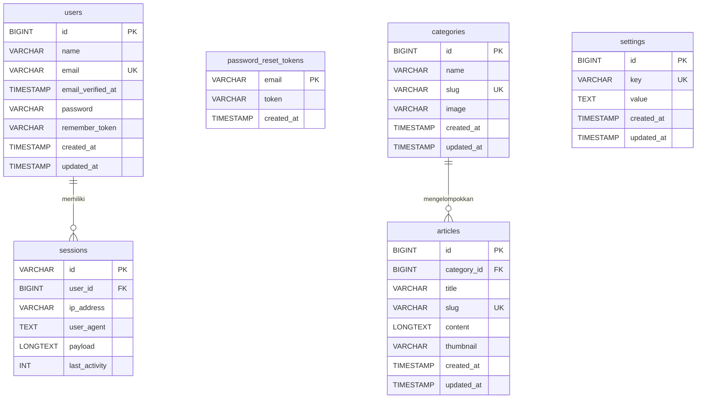

# BAB III: PERANCANGAN BASIS DATA

---

## 3.1 Gambaran Umum

Sistem informasi e-commerce Ivo Karya dibangun di atas fondasi basis data relasional (*Relational Database Management System*/RDBMS) menggunakan **MySQL** sebagai mesin penyimpanan data utama. MySQL dipilih karena kematangannya sebagai sistem manajemen basis data *open-source*, dukungan yang luas terhadap ekosistem PHP, keandalan dalam menangani transaksi konkuren, serta kompatibilitasnya yang penuh dengan *framework* Laravel. Pengelolaan skema dan operasi basis data di sisi aplikasi dilakukan melalui **Eloquent ORM** (*Object-Relational Mapping*), yang merupakan komponen bawaan *framework* Laravel dengan paradigma *ActiveRecord*. Eloquent memungkinkan pengembang berinteraksi dengan tabel-tabel basis data melalui representasi kelas PHP (*Model*), sehingga meningkatkan keterbacaan kode dan mengurangi risiko kesalahan sintaksis SQL mentah.

Skema basis data sistem ini terdiri atas **14 tabel** yang dikelompokkan ke dalam tiga domain fungsional utama: (1) **Domain Manajemen Pengguna & Sesi**, yang mencakup tabel `users`, `password_reset_tokens`, dan `sessions`; (2) **Domain Operasional Bisnis (E-Commerce)**, yang mencakup tabel `products`, `categories`, `orders`, `reviews`, dan `settings`; serta (3) **Domain Manajemen Konten & Infrastruktur**, yang mencakup tabel `articles`, `cache`, `cache_locks`, `jobs`, `job_batches`, dan `failed_jobs`. Pemisahan domain ini mencerminkan prinsip *separation of concerns* yang bertujuan menjaga agar setiap kelompok tabel memiliki tanggung jawab yang jelas dan tidak saling tumpang tindih secara fungsional.

Mekanisme migrasi (*database migration*) Laravel digunakan secara konsisten untuk mendefinisikan dan memversi skema basis data. Setiap perubahan struktur tabel—baik penambahan kolom, perubahan tipe data, maupun penambahan indeks—dicatat sebagai berkas migrasi tersendiri yang dilacak oleh tabel `migrations` internal Laravel. Pendekatan ini menjamin bahwa skema basis data dapat direproduksi secara identik di seluruh *environment* (pengembangan, pengujian, dan produksi) hanya dengan menjalankan perintah `php artisan migrate`.

---

## 3.2 Entity Relationship Diagram (ERD)

### 3.2.1 ERD Domain Operasional Bisnis

Diagram berikut menggambarkan relasi antar-entitas pada domain inti bisnis e-commerce, meliputi manajemen produk, kategori, pesanan, dan ulasan.



Diagram di atas memperlihatkan bahwa `categories` berperan sebagai entitas induk (*parent entity*) bagi `products`, di mana satu kategori dapat memiliki nol atau lebih produk. `products` kemudian menjadi entitas sentral yang menghubungkan `reviews` — satu produk dapat menerima nol atau lebih rekam ulasan dari pelanggan. Entitas `users` berperan ganda, baik sebagai pembuat pesanan (`orders`) maupun penulis ulasan (`reviews`), namun kedua relasi ini bersifat *nullable* untuk mengakomodasi skenario transaksi tamu (*guest checkout*) dan ulasan anonim.

### 3.2.2 ERD Domain Manajemen Konten & Pengguna

Diagram berikut menggambarkan relasi pada domain manajemen konten artikel dan infrastruktur sesi pengguna.



Domain kedua ini menampilkan bagaimana entitas `users` dihubungkan dengan `sessions` untuk keperluan manajemen sesi HTTP berbasis basis data. `categories` pada domain ini juga berfungsi sebagai pengelompok untuk `articles`, menjadikan `categories` sebagai entitas bersama lintas domain. Tabel `settings` dan `password_reset_tokens` berdiri sebagai entitas mandiri tanpa relasi *foreign key* ke entitas lain.

---

## 3.3 Spesifikasi Tabel

### 3.3.1 Domain Manajemen Pengguna & Sesi

#### 3.3.1.1 Tabel `users`

Tabel `users` berfungsi sebagai entitas utama dalam domain manajemen pengguna yang menyimpan seluruh rekam data akun yang terdaftar pada sistem, termasuk akun administrator dengan hak akses terhadap panel administrasi berbasis *Filament* serta akun pelanggan terdaftar. Perancangan tabel ini mengimplementasikan prinsip keamanan autentikasi di mana kata sandi (*password*) tidak pernah disimpan dalam bentuk teks biasa (*plain text*), melainkan dalam bentuk *hash* yang dihasilkan secara otomatis oleh mekanisme *hashing* Laravel menggunakan algoritma **Bcrypt**. Pendekatan ini memastikan bahwa meskipun terjadi insiden kebocoran data pada basis data, kata sandi asli pengguna tetap tidak dapat direkonstruksi secara langsung.

Kolom `email` ditetapkan dengan *constraint* `UNIQUE` untuk menjamin bahwa setiap alamat surel hanya dapat terdaftar satu kali dalam sistem, sekaligus berperan sebagai *natural key* yang digunakan dalam proses autentikasi. Kolom `email_verified_at` bersifat *nullable* (*nullable*), di mana nilai `NULL` menunjukkan bahwa pengguna belum menyelesaikan proses verifikasi surel, sementara nilai *timestamp* menunjukkan waktu verifikasi berhasil dilakukan. Kolom `remember_token` digunakan oleh fitur "Ingat Saya" (*remember me*) Laravel untuk menyimpan token sesi persisten yang memungkinkan pengguna tetap masuk meskipun sesi *browser* telah ditutup.

Tabel `users` memiliki relasi *one-to-many* dengan tabel `orders` dan `reviews`, menjadikannya sebagai *parent entity* bagi kedua tabel tersebut. Namun, kedua *foreign key* di tabel anak bersifat *nullable*, sehingga penghapusan rekam data pengguna tidak secara otomatis menghapus riwayat pesanan atau ulasan terkait—desain ini melindungi integritas data historis bisnis.

| No | Kolom | Tipe Data | Constraint | Keterangan |
|----|-------|-----------|------------|------------|
| 1 | `id` | `BIGINT UNSIGNED` | `PRIMARY KEY`, `AUTO_INCREMENT` | Identifikasi unik pengguna, dihasilkan otomatis |
| 2 | `name` | `VARCHAR(255)` | `NOT NULL` | Nama lengkap pengguna |
| 3 | `email` | `VARCHAR(255)` | `NOT NULL`, `UNIQUE` | Alamat surel unik, digunakan sebagai kredensial login |
| 4 | `email_verified_at` | `TIMESTAMP` | `NULLABLE` | Waktu verifikasi surel; `NULL` berarti belum terverifikasi |
| 5 | `password` | `VARCHAR(255)` | `NOT NULL` | *Hash* Bcrypt dari kata sandi pengguna |
| 6 | `remember_token` | `VARCHAR(100)` | `NULLABLE` | Token sesi persisten untuk fitur *remember me* |
| 7 | `created_at` | `TIMESTAMP` | `NULLABLE` | Waktu rekam data dibuat (dikelola otomatis oleh Laravel) |
| 8 | `updated_at` | `TIMESTAMP` | `NULLABLE` | Waktu rekam data terakhir diperbarui (dikelola otomatis) |

**Relasi:**
- `(tidak ada FK keluar)` — Tabel ini adalah *parent* yang direferensi oleh `orders.user_id` dan `reviews.user_id`

---

#### 3.3.1.2 Tabel `password_reset_tokens`

Tabel `password_reset_tokens` dirancang khusus untuk menunjang fitur pemulihan akses (*password reset*) yang disediakan oleh sistem autentikasi Laravel. Ketika seorang pengguna meminta tautan pemulihan kata sandi, sistem akan menghasilkan sebuah token acak kriptografis yang kemudian disimpan dalam tabel ini bersama dengan alamat surel yang bersangkutan. Token tersebut kemudian dikirimkan ke alamat surel pengguna melalui notifikasi, dan pengguna harus menyertakannya dalam permintaan pengaturan ulang kata sandi untuk membuktikan kepemilikan atas akun tersebut.

Kolom `email` dipilih sebagai *primary key* alih-alih menggunakan kolom `id` auto-increment. Keputusan desain ini didasarkan pada kebutuhan fungsional bahwa dalam setiap waktu, hanya boleh ada satu token pemulihan aktif per alamat surel—penggunaan `email` sebagai *primary key* secara implisit memastikan bahwa setiap permintaan pemulihan baru akan menimpa (*upsert*) token lama untuk alamat surel yang sama. Tabel ini tidak memiliki kolom `updated_at` karena setiap perubahan pada rekam data token selalu merupakan penggantian total (*replace*), bukan pembaruan parsial.

| No | Kolom | Tipe Data | Constraint | Keterangan |
|----|-------|-----------|------------|------------|
| 1 | `email` | `VARCHAR(255)` | `PRIMARY KEY` | Alamat surel pengguna, sekaligus kunci utama tabel |
| 2 | `token` | `VARCHAR(255)` | `NOT NULL` | Token kriptografis acak untuk verifikasi pemulihan |
| 3 | `created_at` | `TIMESTAMP` | `NULLABLE` | Waktu token dibuat; digunakan untuk validasi kedaluwarsa |

---

#### 3.3.1.3 Tabel `sessions`

Tabel `sessions` merupakan implementasi mekanisme manajemen sesi (*session management*) berbasis basis data (*database driver*) yang disediakan oleh Laravel. Penggunaan basis data sebagai *driver* sesi dipilih karena memberikan keunggulan dibandingkan penyimpanan sesi berbasis berkas (*file-based session*), terutama dalam hal skalabilitas pada lingkungan *multi-server* dan kemudahan pemantauan sesi aktif melalui panel administrasi. Setiap kali pengguna mengakses aplikasi, Laravel secara otomatis membuat atau memperbarui rekam sesi yang bersesuaian di tabel ini.

Kolom `id` menggunakan tipe `VARCHAR` alih-alih `BIGINT` karena identifikasi sesi Laravel dihasilkan sebagai string alfanumerik acak yang panjangnya ditentukan oleh konfigurasi *session driver*. Kolom `payload` bertipe `LONGTEXT` untuk menampung keseluruhan data sesi yang diserialisasi (*serialized*) dalam format PHP, yang dapat mencakup data autentikasi, *flash message*, token CSRF, dan data aplikasi lainnya. Kolom `last_activity` menyimpan *Unix timestamp* (bilangan *integer*) yang digunakan oleh mekanisme pembersihan sesi kedaluwarsa (*session garbage collection*) Laravel.

| No | Kolom | Tipe Data | Constraint | Keterangan |
|----|-------|-----------|------------|------------|
| 1 | `id` | `VARCHAR(255)` | `PRIMARY KEY` | Identifikasi sesi unik dalam format string alfanumerik |
| 2 | `user_id` | `BIGINT UNSIGNED` | `NULLABLE`, `INDEX`, `FOREIGN KEY → users.id` | Referensi ke pengguna terautentikasi; `NULL` untuk sesi tamu |
| 3 | `ip_address` | `VARCHAR(45)` | `NULLABLE` | Alamat IP klien; panjang 45 karakter mendukung format IPv6 |
| 4 | `user_agent` | `TEXT` | `NULLABLE` | String identifikasi *browser*/klien HTTP |
| 5 | `payload` | `LONGTEXT` | `NOT NULL` | Data sesi terserialisasi dalam format PHP |
| 6 | `last_activity` | `INT` | `NOT NULL`, `INDEX` | *Unix timestamp* aktivitas terakhir, digunakan untuk GC sesi |

**Relasi:**
- `user_id` → `users.id` (*Many-to-One*): Satu pengguna dapat memiliki banyak rekam sesi aktif secara bersamaan (misalnya dari berbagai perangkat)

---

### 3.3.2 Domain Operasional Bisnis (E-Commerce)

#### 3.3.2.1 Tabel `categories`

Tabel `categories` berperan sebagai entitas klasifikasi yang digunakan bersama oleh dua entitas lain dalam sistem, yaitu `products` dan `articles`. Perancangan tabel ini mengikuti prinsip *normalisasi* tingkat pertama dan ketiga, di mana data kategori dipisahkan ke dalam tabelnya sendiri daripada disimpan sebagai kolom *enum* di dalam tabel produk. Pendekatan ini memberikan fleksibilitas yang jauh lebih besar karena administrator dapat menambahkan, mengubah, atau menghapus kategori tanpa harus mengubah skema basis data.

Kolom `slug` merupakan versi ramah-URL (*URL-friendly*) dari nama kategori yang dihasilkan secara otomatis oleh aplikasi menggunakan fungsi *slugify* (misalnya "Abon Ikan" menjadi `abon-ikan`). *Constraint* `UNIQUE` pada kolom `slug` menjamin bahwa setiap kategori memiliki URL yang unik dan dapat dijadikan sebagai *natural identifier* dalam sistem perutean (*routing*) Laravel, menghindari ketergantungan penuh pada ID numerik dalam URL publik. Kolom `image` bersifat *nullable* untuk mengakomodasi kondisi di mana sebuah kategori baru dibuat sebelum gambar representatifnya tersedia.

| No | Kolom | Tipe Data | Constraint | Keterangan |
|----|-------|-----------|------------|------------|
| 1 | `id` | `BIGINT UNSIGNED` | `PRIMARY KEY`, `AUTO_INCREMENT` | Identifikasi unik kategori |
| 2 | `name` | `VARCHAR(255)` | `NOT NULL` | Nama kategori yang ditampilkan kepada pengguna |
| 3 | `slug` | `VARCHAR(255)` | `NOT NULL`, `UNIQUE` | Versi URL-*friendly* dari nama kategori |
| 4 | `image` | `VARCHAR(255)` | `NULLABLE` | Jalur relatif berkas gambar representatif kategori |
| 5 | `created_at` | `TIMESTAMP` | `NULLABLE` | Waktu rekam data dibuat |
| 6 | `updated_at` | `TIMESTAMP` | `NULLABLE` | Waktu rekam data terakhir diperbarui |

**Relasi:**
- `(tidak ada FK keluar)` — Tabel ini direferensi oleh `products.category_id` dan `articles.category_id`

---

#### 3.3.2.2 Tabel `products`

Tabel `products` merupakan entitas sentral dalam domain operasional bisnis yang menyimpan seluruh rekam data produk yang diperjualbelikan melalui platform e-commerce Ivo Karya. Setiap rekam produk mencakup informasi dasar perdagangan (nama, harga, stok), atribut logistik (berat), metadata SEO (*Search Engine Optimization*), serta informasi diskon. Kolom `weight` dengan tipe `INT` menyimpan berat produk dalam satuan gram, yang digunakan secara kritis dalam kalkulasi biaya pengiriman melalui integrasi dengan API eksternal layanan kurir.

Arsitektur harga pada tabel ini dirancang untuk mendukung dua skenario: harga normal melalui kolom `price`, dan harga setelah diskon melalui kolom `discount_price` yang bersifat *nullable*. Kolom `discount_percentage` menyimpan nilai persentase diskon sebagai representasi terpisah untuk keperluan tampilan antarmuka (misalnya *badge* "Hemat 20%"), meskipun secara teknis nilainya dapat diturunkan dari selisih `price` dan `discount_price`. Redudansi yang disengaja (*intentional redundancy*) ini adalah keputusan desain pragmatis untuk menghindari kalkulasi ulang pada setiap permintaan halaman. Kolom `meta_title` dan `meta_description` bersifat *nullable* dan digunakan oleh panel Filament untuk mengoptimalkan tampilan halaman produk di mesin pencari.

Kolom `category_id` merupakan *foreign key* yang merujuk ke tabel `categories` dengan perilaku `nullOnDelete`, artinya jika sebuah kategori dihapus dari sistem, maka kolom `category_id` pada seluruh produk yang termasuk dalam kategori tersebut akan diubah secara otomatis menjadi `NULL` alih-alih menghapus rekam produk tersebut. Keputusan desain ini melindungi integritas data produk dari penghapusan kategori yang tidak disengaja, dan produk tanpa kategori masih dapat dikelola melalui panel administrasi.

| No | Kolom | Tipe Data | Constraint | Keterangan |
|----|-------|-----------|------------|------------|
| 1 | `id` | `BIGINT UNSIGNED` | `PRIMARY KEY`, `AUTO_INCREMENT` | Identifikasi unik produk |
| 2 | `category_id` | `BIGINT UNSIGNED` | `NULLABLE`, `FOREIGN KEY → categories.id` | Referensi kategori; `NULL` jika kategori dihapus |
| 3 | `name` | `VARCHAR(255)` | `NOT NULL` | Nama produk |
| 4 | `slug` | `VARCHAR(255)` | `NOT NULL`, `UNIQUE` | Versi URL-*friendly* dari nama produk |
| 5 | `description` | `TEXT` | `NULLABLE` | Deskripsi lengkap produk |
| 6 | `meta_title` | `VARCHAR(255)` | `NULLABLE` | Judul halaman untuk keperluan SEO |
| 7 | `meta_description` | `TEXT` | `NULLABLE` | Deskripsi meta untuk keperluan SEO |
| 8 | `price` | `DECIMAL(10,2)` | `NOT NULL` | Harga normal produk dalam satuan Rupiah |
| 9 | `discount_price` | `DECIMAL(10,2)` | `NULLABLE` | Harga setelah diskon; `NULL` berarti tidak ada diskon aktif |
| 10 | `discount_percentage` | `INT` | `NULLABLE` | Persentase diskon untuk keperluan tampilan antarmuka |
| 11 | `stock` | `INT` | `NOT NULL` | Jumlah stok produk yang tersedia |
| 12 | `weight` | `INT` | `NOT NULL` | Berat produk dalam satuan gram, digunakan kalkulasi ongkir |
| 13 | `image` | `VARCHAR(255)` | `NULLABLE` | Jalur relatif berkas gambar utama produk |
| 14 | `created_at` | `TIMESTAMP` | `NULLABLE` | Waktu rekam data dibuat |
| 15 | `updated_at` | `TIMESTAMP` | `NULLABLE` | Waktu rekam data terakhir diperbarui |

**Relasi:**
- `category_id` → `categories.id` (*Many-to-One*): Setiap produk termasuk dalam satu kategori; penghapusan kategori meng-*null*-kan kolom ini

---

#### 3.3.2.3 Tabel `orders`

Tabel `orders` merupakan entitas terkompleks dalam sistem yang merekam seluruh transaksi pemesanan yang dilakukan oleh pelanggan, baik pelanggan terdaftar maupun tamu. Kompleksitas tabel ini mencerminkan kekayaan alur bisnis e-commerce yang mencakup data pelanggan, detail pengiriman, informasi kurir, bukti pembayaran, dan mekanisme pelacakan pesanan. Desain ini diperkaya secara inkremental melalui serangkaian migrasi tambahan yang menambahkan kolom-kolom baru seiring dengan berkembangnya kebutuhan bisnis selama fase pengembangan.

Kolom `user_id` bersifat *nullable* untuk mendukung fitur *guest checkout*, di mana pelanggan dapat melakukan pemesanan tanpa terlebih dahulu mendaftarkan akun. Data identitas pelanggan seperti `customer_name`, `customer_address`, dan `customer_phone` disimpan secara redundan di dalam tabel `orders` meskipun data tersebut mungkin juga tersedia di tabel `users`. Keputusan desain *snapshot* ini sangat penting untuk menjaga integritas historis transaksi—jika pengguna mengubah nama atau alamatnya di kemudian hari, riwayat pesanan lama tetap mencatat informasi yang valid pada saat transaksi terjadi.

Kolom `items_json` bertipe `JSON` merupakan keputusan desain yang patut dicermati. Alih-alih membuat tabel terpisah `order_items` untuk merekam detail setiap item dalam pesanan (pola normalisasi tradisional), sistem menyimpan seluruh daftar item beserta detail harga dan kuantitas dalam satu kolom JSON. Pendekatan ini menyederhanakan kueri pembacaan data pesanan sekaligus mempertahankan *snapshot* harga pada saat transaksi terjadi, namun dengan konsekuensi bahwa data di dalam JSON tidak dapat diindeks atau dikueri secara efisien untuk keperluan analitik agregasi per produk. Kolom `tracking_token` merupakan token unik 32 karakter heksadesimal yang dihasilkan secara otomatis oleh *model boot* Eloquent menggunakan fungsi `bin2hex(random_bytes(16))`, digunakan sebagai kunci publik yang aman untuk fitur pelacakan pesanan tanpa mengekspos ID numerik internal.

Sistem pengiriman terintegrasi melalui API kurir tercermin dari keberadaan kolom `destination_city_id`, `destination_city_name`, `postal_code`, `courier`, `courier_service`, dan `shipping_cost`. Kolom `latitude` dan `longitude` dengan presisi tujuh angka desimal (`DECIMAL(10,7)`) menyimpan koordinat geografis lokasi pengiriman yang diperoleh melalui fitur peta interaktif pada antarmuka pemesanan.

| No | Kolom | Tipe Data | Constraint | Keterangan |
|----|-------|-----------|------------|------------|
| 1 | `id` | `BIGINT UNSIGNED` | `PRIMARY KEY`, `AUTO_INCREMENT` | Identifikasi unik pesanan |
| 2 | `user_id` | `BIGINT UNSIGNED` | `NULLABLE`, `FOREIGN KEY → users.id` | Referensi akun pembeli; `NULL` untuk pesanan tamu |
| | **Data Pelanggan** | | | |
| 3 | `customer_name` | `VARCHAR(255)` | `NULLABLE` | *Snapshot* nama pelanggan pada saat transaksi |
| 4 | `customer_address` | `TEXT` | `NULLABLE` | *Snapshot* alamat pengiriman lengkap |
| 5 | `customer_phone` | `VARCHAR(255)` | `NULLABLE` | Nomor telepon/WhatsApp pelanggan |
| | **Data Pengiriman** | | | |
| 6 | `destination_city_id` | `VARCHAR(255)` | `NULLABLE` | ID kota tujuan dari API layanan kurir |
| 7 | `destination_city_name` | `VARCHAR(255)` | `NULLABLE` | Nama kota tujuan pengiriman |
| 8 | `postal_code` | `VARCHAR(255)` | `NULLABLE` | Kode pos tujuan pengiriman |
| 9 | `courier` | `VARCHAR(255)` | `NULLABLE` | Kode kurir yang dipilih (contoh: `jne`, `pos`, `tiki`) |
| 10 | `courier_service` | `VARCHAR(255)` | `NULLABLE` | Kode layanan kurir (contoh: `REG`, `YES`, `OKE`) |
| 11 | `shipping_cost` | `DECIMAL(12,2)` | `NOT NULL`, `DEFAULT 0` | Biaya pengiriman dalam satuan Rupiah |
| 12 | `latitude` | `DECIMAL(10,7)` | `NULLABLE` | Koordinat lintang lokasi pengiriman (presisi ~1.1 cm) |
| 13 | `longitude` | `DECIMAL(10,7)` | `NULLABLE` | Koordinat bujur lokasi pengiriman (presisi ~1.1 cm) |
| | **Data Transaksi** | | | |
| 14 | `items_json` | `JSON` | `NULLABLE` | *Snapshot* daftar item pesanan dalam format JSON |
| 15 | `total_amount` | `DECIMAL(10,2)` | `NOT NULL` | Total nilai transaksi termasuk biaya pengiriman |
| 16 | `total_weight` | `DECIMAL(10,2)` | `NULLABLE` | Total berat pesanan dalam satuan gram |
| 17 | `status` | `VARCHAR(255)` | `NOT NULL`, `DEFAULT 'pending'` | Status pesanan: `pending`, `processing`, `shipped`, `completed`, `cancelled` |
| 18 | `payment_method` | `VARCHAR(255)` | `NOT NULL`, `DEFAULT 'transfer'` | Metode pembayaran yang dipilih pelanggan |
| 19 | `payment_proof` | `VARCHAR(255)` | `NULLABLE` | Jalur berkas bukti transfer pembayaran yang diunggah |
| 20 | `whatsapp_ref` | `VARCHAR(255)` | `NULLABLE` | Referensi konfirmasi melalui WhatsApp |
| 21 | `tracking_number` | `VARCHAR(255)` | `NULLABLE` | Nomor resi pengiriman dari pihak kurir |
| 22 | `tracking_token` | `VARCHAR(255)` | `NULLABLE`, `UNIQUE` | Token unik 32-hex untuk URL pelacakan publik |
| 23 | `created_at` | `TIMESTAMP` | `NULLABLE` | Waktu pesanan dibuat |
| 24 | `updated_at` | `TIMESTAMP` | `NULLABLE` | Waktu status pesanan terakhir diperbarui |

**Relasi:**
- `user_id` → `users.id` (*Many-to-One*): Satu pengguna dapat memiliki banyak pesanan; penghapusan pengguna men-*set* kolom ini ke `NULL` (cascade nullable)

---

#### 3.3.2.4 Tabel `reviews`

Tabel `reviews` menyimpan rekam data ulasan dan penilaian yang diberikan oleh pelanggan terhadap produk yang telah mereka beli. Keberadaan tabel ini memberikan dimensi kepercayaan sosial (*social proof*) pada platform e-commerce, di mana pelanggan prospektif dapat membaca pengalaman pembeli sebelumnya sebelum mengambil keputusan pembelian. Setiap rekam ulasan mengandung skor penilaian numerik, komentar naratif opsional, dan optimalnya bukti gambar pendukung.

Salah satu keputusan desain yang signifikan pada tabel ini adalah menjadikan `user_id` sebagai kolom *nullable*, yang diimplementasikan melalui migrasi tambahan (`make_reviews_user_nullable_and_add_name`). Dengan tambahan kolom `customer_name` yang juga *nullable*, sistem mengakomodasi dua skenario ulasan: (1) ulasan terhubung ke akun pengguna terdaftar melalui `user_id`, dan (2) ulasan dari tamu anonim yang hanya menyertakan nama melalui `customer_name`. Logika di lapisan aplikasi menentukan bahwa paling tidak salah satu dari kedua kolom tersebut harus terisi. Kolom `is_approved` bertipe `BOOLEAN` dengan *default* `false` mengimplementasikan alur moderasi konten (*content moderation*), di mana seluruh ulasan baru masuk dalam status "menunggu persetujuan" dan hanya akan ditampilkan kepada publik setelah disetujui oleh administrator melalui panel Filament.

| No | Kolom | Tipe Data | Constraint | Keterangan |
|----|-------|-----------|------------|------------|
| 1 | `id` | `BIGINT UNSIGNED` | `PRIMARY KEY`, `AUTO_INCREMENT` | Identifikasi unik ulasan |
| 2 | `product_id` | `BIGINT UNSIGNED` | `NOT NULL`, `FOREIGN KEY → products.id` | Referensi produk yang diulas; ulasan terhapus jika produk dihapus |
| 3 | `user_id` | `BIGINT UNSIGNED` | `NULLABLE`, `FOREIGN KEY → users.id` | Referensi akun penulis ulasan; `NULL` untuk ulasan tamu |
| 4 | `customer_name` | `VARCHAR(255)` | `NULLABLE` | Nama peninjau untuk ulasan tamu anonim |
| 5 | `rating` | `INT` | `NOT NULL` | Skor penilaian numerik (umumnya skala 1–5) |
| 6 | `comment` | `TEXT` | `NULLABLE` | Narasi komentar ulasan; opsional |
| 7 | `image` | `VARCHAR(255)` | `NULLABLE` | Jalur berkas gambar pendukung ulasan |
| 8 | `is_approved` | `TINYINT(1)` | `NOT NULL`, `DEFAULT 0` | Status moderasi: `0` = menunggu, `1` = disetujui |
| 9 | `created_at` | `TIMESTAMP` | `NULLABLE` | Waktu ulasan dikirimkan |
| 10 | `updated_at` | `TIMESTAMP` | `NULLABLE` | Waktu ulasan terakhir diperbarui |

**Relasi:**
- `product_id` → `products.id` (*Many-to-One*): Satu produk dapat memiliki banyak ulasan; penghapusan produk men-*cascade* penghapusan ulasan terkait
- `user_id` → `users.id` (*Many-to-One*): Satu pengguna dapat menulis banyak ulasan; penghapusan pengguna men-*cascade* penghapusan ulasan terkait

---

#### 3.3.2.5 Tabel `settings`

Tabel `settings` mengimplementasikan pola desain *key-value store* yang memungkinkan administrator sistem untuk menyimpan dan mengelola parameter konfigurasi aplikasi secara dinamis melalui panel administrasi, tanpa memerlukan pengubahan kode sumber atau berkas konfigurasi. Ini merupakan pendekatan yang umum dalam pengembangan aplikasi web modern untuk menangani konfigurasi yang frekuensi perubahannya tergolong rendah hingga sedang, namun perlu dimodifikasi oleh pengguna non-teknis.

Contoh rekam data yang lazim disimpan dalam tabel ini mencakup: nama toko, nomor WhatsApp pemilik, rekening bank untuk pembayaran transfer, *markup* persentase ongkir, dan pesan sambutan pada halaman utama. Kolom `key` ditetapkan dengan *constraint* `UNIQUE` untuk menjamin tidak ada duplikasi konfigurasi dengan nama yang sama, sekaligus memfasilitasi kueri pencarian konfigurasi secara efisien menggunakan klausul `WHERE key = 'nama_konfigurasi'`. Kolom `value` bertipe `TEXT` untuk mengakomodasi nilai konfigurasi yang berpotensi berpanjang, seperti teks deskripsi atau konten HTML singkat.

| No | Kolom | Tipe Data | Constraint | Keterangan |
|----|-------|-----------|------------|------------|
| 1 | `id` | `BIGINT UNSIGNED` | `PRIMARY KEY`, `AUTO_INCREMENT` | Identifikasi unik rekam konfigurasi |
| 2 | `key` | `VARCHAR(255)` | `NOT NULL`, `UNIQUE` | Kunci konfigurasi unik (contoh: `whatsapp_number`, `bank_account`) |
| 3 | `value` | `TEXT` | `NULLABLE` | Nilai konfigurasi; `NULL` diperbolehkan untuk konfigurasi opsional |
| 4 | `created_at` | `TIMESTAMP` | `NULLABLE` | Waktu rekam konfigurasi dibuat |
| 5 | `updated_at` | `TIMESTAMP` | `NULLABLE` | Waktu rekam konfigurasi terakhir diperbarui |

---

### 3.3.3 Domain Manajemen Konten & Infrastruktur

#### 3.3.3.1 Tabel `articles`

Tabel `articles` menyediakan fondasi bagi modul CMS (*Content Management System*) sederhana yang memungkinkan administrator untuk mempublikasikan artikel informatif, panduan perawatan produk, atau konten pemasaran langsung melalui panel Filament. Keberadaan modul ini memperkaya pengalaman pengguna situs dan berkontribusi pada optimasi mesin pencari (*SEO*) melalui konten yang relevan dan rutin diperbarui.

Kolom `slug` yang bersifat `UNIQUE` memainkan peran ganda: sebagai pengidentifikasi ramah-URL dalam sistem perutean Laravel dan sebagai kunci pencegah duplikasi konten. Kolom `content` bertipe `LONGTEXT` dipilih untuk mengakomodasi artikel dengan konten yang potensial sangat panjang dan mungkin mengandung markup HTML yang disisipkan melalui editor teks kaya (*rich text editor*) pada panel administrasi. Kolom `category_id` yang bersifat *nullable* dengan perilaku `nullOnDelete` mengikuti pola yang sama dengan tabel `products`, memastikan bahwa penghapusan sebuah kategori tidak menyebabkan hilangnya konten artikel yang telah dipublikasikan.

| No | Kolom | Tipe Data | Constraint | Keterangan |
|----|-------|-----------|------------|------------|
| 1 | `id` | `BIGINT UNSIGNED` | `PRIMARY KEY`, `AUTO_INCREMENT` | Identifikasi unik artikel |
| 2 | `title` | `VARCHAR(255)` | `NOT NULL` | Judul artikel yang ditampilkan kepada pembaca |
| 3 | `slug` | `VARCHAR(255)` | `NOT NULL`, `UNIQUE` | Versi URL-*friendly* dari judul artikel |
| 4 | `content` | `LONGTEXT` | `NOT NULL` | Isi konten artikel lengkap, dapat berisi markup HTML |
| 5 | `thumbnail` | `VARCHAR(255)` | `NULLABLE` | Jalur berkas gambar *thumbnail* artikel |
| 6 | `category_id` | `BIGINT UNSIGNED` | `NULLABLE`, `FOREIGN KEY → categories.id` | Referensi kategori; `NULL` jika kategori dihapus |
| 7 | `created_at` | `TIMESTAMP` | `NULLABLE` | Waktu artikel dipublikasikan/dibuat |
| 8 | `updated_at` | `TIMESTAMP` | `NULLABLE` | Waktu artikel terakhir diperbarui |

**Relasi:**
- `category_id` → `categories.id` (*Many-to-One*): Satu kategori dapat mengelompokkan banyak artikel; penghapusan kategori meng-*null*-kan kolom ini

---

#### 3.3.3.2 Tabel-Tabel Infrastruktur Laravel

Selain tabel-tabel fungsional bisnis, sistem juga memanfaatkan sejumlah tabel infrastruktur yang dihasilkan dan dikelola sepenuhnya oleh *framework* Laravel. Tabel-tabel ini tidak berisi logika bisnis secara langsung, tetapi menyediakan layanan sistem yang esensial bagi operasional aplikasi.

**Tabel `cache` dan `cache_locks`:** Kedua tabel ini digunakan oleh *driver* cache berbasis basis data Laravel. Tabel `cache` menyimpan pasangan kunci-nilai (*key-value pairs*) data yang di-*cache* beserta waktu kedaluwarsanya. Tabel `cache_locks` mendukung mekanisme *atomic lock* yang digunakan untuk mencegah kondisi *race condition* (*race condition*) pada operasi-operasi kritis yang memerlukan eksekusi tunggal.

**Tabel `jobs`, `job_batches`, dan `failed_jobs`:** Ketiga tabel ini mendukung sistem antrian pekerjaan (*job queue*) Laravel. Tabel `jobs` menyimpan pekerjaan yang menunggu untuk dieksekusi secara asinkron (misalnya: pengiriman surel notifikasi, kalkulasi kompleks). Tabel `job_batches` merekam status kumpulan pekerjaan (*batch jobs*) yang diproses secara paralel. Tabel `failed_jobs` secara otomatis menyimpan rekam pekerjaan yang gagal dieksekusi beserta informasi galat dan *payload*-nya, memungkinkan pelacakan dan pengeksekusian ulang pekerjaan yang gagal.

---

## 3.4 Ringkasan Relasi Antar-Tabel

Tabel berikut merangkum seluruh relasi *foreign key* yang terdefinisi dalam skema basis data sistem Ivo Karya.

| No | Tabel Asal | Kolom FK | Tabel Tujuan | Kolom Referensi | Kardinalitas | Keterangan |
|----|------------|----------|--------------|-----------------|--------------|------------|
| 1 | `sessions` | `user_id` | `users` | `id` | Many-to-One | Satu pengguna dapat memiliki banyak sesi aktif; nilai dapat `NULL` untuk sesi tamu |
| 2 | `products` | `category_id` | `categories` | `id` | Many-to-One | Setiap produk termasuk satu kategori; penghapusan kategori men-*set* `NULL` |
| 3 | `orders` | `user_id` | `users` | `id` | Many-to-One | Satu pengguna dapat membuat banyak pesanan; nilai dapat `NULL` untuk tamu |
| 4 | `reviews` | `product_id` | `products` | `id` | Many-to-One | Satu produk dapat memiliki banyak ulasan; *cascade delete* aktif |
| 5 | `reviews` | `user_id` | `users` | `id` | Many-to-One | Satu pengguna dapat menulis banyak ulasan; *cascade delete* aktif |
| 6 | `articles` | `category_id` | `categories` | `id` | Many-to-One | Satu kategori dapat mengelompokkan banyak artikel; penghapusan kategori men-*set* `NULL` |

Dari keseluruhan enam relasi *foreign key* yang terdefinisi, terdapat dua pola *referential action* yang diterapkan secara berbeda berdasarkan pertimbangan bisnis. Pola pertama adalah **`nullOnDelete`** (nilai FK di-*set* `NULL` saat rekam tujuan dihapus), diterapkan pada relasi `products.category_id → categories.id`, `articles.category_id → categories.id`, dan `orders.user_id → users.id`. Pola ini dipilih untuk melindungi data utama (produk, artikel, pesanan) dari penghapusan tidak sengaja yang dipicu oleh penghapusan data terkait. Pola kedua adalah **`cascadeOnDelete`** (rekam anak ikut dihapus saat rekam induk dihapus), diterapkan pada relasi `reviews.product_id → products.id` dan `reviews.user_id → users.id`, karena ulasan tanpa produk atau tanpa pengguna pemilik tidak memiliki makna dan justru akan menjadi *orphaned records* yang tidak berguna.

---

## 3.5 Indeks Basis Data

| No | Tabel | Kolom | Jenis Indeks | Keterangan |
|----|-------|-------|--------------|------------|
| 1 | `users` | `id` | Primary Key Index | Indeks utama tabel; digunakan di seluruh kueri relasi |
| 2 | `users` | `email` | Unique Index | Mempercepat pencarian akun berdasarkan surel saat login |
| 3 | `password_reset_tokens` | `email` | Primary Key Index | Kolom `email` sekaligus berfungsi sebagai kunci utama |
| 4 | `sessions` | `id` | Primary Key Index | Identifikasi sesi unik berbasis string |
| 5 | `sessions` | `user_id` | Non-Unique Index | Mempercepat pencarian semua sesi milik satu pengguna |
| 6 | `sessions` | `last_activity` | Non-Unique Index | Mempercepat proses *garbage collection* sesi kedaluwarsa |
| 7 | `categories` | `id` | Primary Key Index | Indeks utama; direferensi oleh `products` dan `articles` |
| 8 | `categories` | `slug` | Unique Index | Mempercepat kueri routing berbasis slug URL |
| 9 | `products` | `id` | Primary Key Index | Indeks utama; direferensi oleh `reviews` |
| 10 | `products` | `slug` | Unique Index | Mempercepat kueri routing halaman detail produk |
| 11 | `products` | `category_id` | Non-Unique Index | Mempercepat kueri produk berdasarkan kategori |
| 12 | `orders` | `id` | Primary Key Index | Indeks utama tabel pesanan |
| 13 | `orders` | `tracking_token` | Unique Index | Mempercepat kueri pelacakan pesanan via token publik |
| 14 | `orders` | `user_id` | Non-Unique Index | Mempercepat kueri riwayat pesanan per pengguna |
| 15 | `reviews` | `id` | Primary Key Index | Indeks utama tabel ulasan |
| 16 | `reviews` | `product_id` | Non-Unique Index | Mempercepat kueri semua ulasan untuk satu produk |
| 17 | `reviews` | `user_id` | Non-Unique Index | Mempercepat kueri semua ulasan yang ditulis satu pengguna |
| 18 | `articles` | `id` | Primary Key Index | Indeks utama tabel artikel |
| 19 | `articles` | `slug` | Unique Index | Mempercepat kueri routing halaman detail artikel |
| 20 | `articles` | `category_id` | Non-Unique Index | Mempercepat kueri artikel berdasarkan kategori |
| 21 | `settings` | `id` | Primary Key Index | Indeks utama tabel konfigurasi |
| 22 | `settings` | `key` | Unique Index | Mempercepat kueri pengambilan nilai konfigurasi berdasarkan kunci |

Secara keseluruhan, sistem ini mendefinisikan **22 indeks** yang terdiri dari 9 *Primary Key Index*, 7 *Unique Index*, dan 6 *Non-Unique Index*. Seluruh kolom *foreign key* secara otomatis memperoleh *Non-Unique Index* oleh mekanisme Laravel, yang merupakan praktik terbaik dalam perancangan RDBMS untuk mengoptimalkan performa operasi `JOIN` dan pengecekan integritas referensial. *Unique Index* pada kolom-kolom `slug` di tabel `products`, `categories`, dan `articles` memberikan manfaat ganda berupa penegakan *constraint* keunikan data dan akselerasi kueri perutean (*routing*) berbasis URL yang merupakan operasi yang sangat sering dilakukan pada aplikasi web publik.

---

## 3.6 Konfigurasi Koneksi Basis Data

### 3.6.1 Konfigurasi melalui Variabel Lingkungan

Sistem ini mengikuti prinsip *twelve-factor app* dalam hal konfigurasi koneksi basis data, yaitu memisahkan konfigurasi yang bergantung pada *environment* dari kode sumber aplikasi. Seluruh parameter koneksi basis data didefinisikan melalui variabel lingkungan (*environment variables*) yang disimpan dalam berkas `.env` di *root* proyek. Berkas ini **tidak pernah** disertakan dalam repositori *version control* (Git) karena mengandung informasi sensitif seperti kata sandi basis data.

Laravel membaca variabel-variabel ini dan meneruskannya ke berkas konfigurasi `config/database.php` menggunakan fungsi helper `env()`. Penggunaan *environment variable* memastikan bahwa kode sumber yang sama dapat digunakan di semua *environment* (pengembangan, pengujian, produksi) hanya dengan mengubah berkas `.env` yang bersangkutan, tanpa memodifikasi kode aplikasi.

### 3.6.2 Format Konfigurasi

Berikut adalah format variabel lingkungan yang digunakan untuk koneksi basis data pada masing-masing *environment*:

**Environment Pengembangan (Development):**
```env
DB_CONNECTION=mysql
DB_HOST=127.0.0.1
DB_PORT=3306
DB_DATABASE=ivo_karya_dev
DB_USERNAME=root
DB_PASSWORD=
```

**Environment Produksi (Production):**
```env
DB_CONNECTION=mysql
DB_HOST=<hostname-server-database>
DB_PORT=3306
DB_DATABASE=ivo_karya_prod
DB_USERNAME=<username-db-produksi>
DB_PASSWORD=<password-db-produksi-yang-kuat>
```

Variabel `DB_CONNECTION` menentukan *driver* basis data yang digunakan (`mysql` untuk MySQL). Laravel mendukung berbagai *driver* lain seperti `pgsql` (PostgreSQL), `sqlite`, dan `sqlsrv` (SQL Server). Variabel `DB_HOST` menentukan alamat server basis data—pada *environment* pengembangan, nilai `127.0.0.1` merujuk ke server *localhost*, sedangkan pada produksi, nilainya berupa *hostname* atau alamat IP server basis data eksternal. Port standar MySQL `3306` digunakan secara *default*.

### 3.6.3 Manajemen Koneksi dan Sesi Basis Data

Laravel mengelola *connection pooling* dan *lifecycle* koneksi basis data secara otomatis melalui komponen `Illuminate\Database`. Setiap permintaan HTTP (*request*) yang masuk ke aplikasi akan mendapatkan koneksi basis data dari *pool* yang tersedia, menggunakan kembali koneksi yang ada jika memungkinkan untuk meminimalkan *overhead* pembuatan koneksi baru (*connection overhead*).

Pada konteks panel administrasi berbasis **Filament**, manajemen sesi menggunakan mekanisme *session driver* berbasis basis data (`SESSION_DRIVER=database`), di mana data sesi disimpan dalam tabel `sessions`. Setiap permintaan yang terautentikasi akan memperbarui kolom `last_activity` pada rekam sesi yang bersangkutan, dan proses *garbage collection* akan membersihkan rekam sesi yang telah kedaluwarsa secara periodik. Pendekatan ini memberikan keunggulan berupa kemampuan melihat sesi aktif secara *real-time* dan memungkinkan fitur "keluarkan sesi lain" (*logout other sessions*) yang mengakses dan menghapus rekam sesi spesifik langsung dari basis data.

Untuk operasi baca/tulis (*read/write*) yang intensif, sistem mendukung konfigurasi koneksi terpisah melalui parameter `read` dan `write` di `config/database.php`, yang memungkinkan *query* baca diarahkan ke *replica server* sementara *query* tulis tetap diarahkan ke *primary server*. Namun, pada *deployment* saat ini, konfigurasi ini menggunakan satu server tunggal untuk keduanya.

---

*Dokumen ini dibuat secara otomatis berdasarkan analisis berkas migrasi Laravel yang terdapat dalam direktori `database/migrations` proyek Ivo Karya.*
