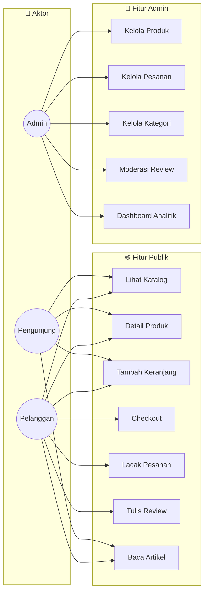
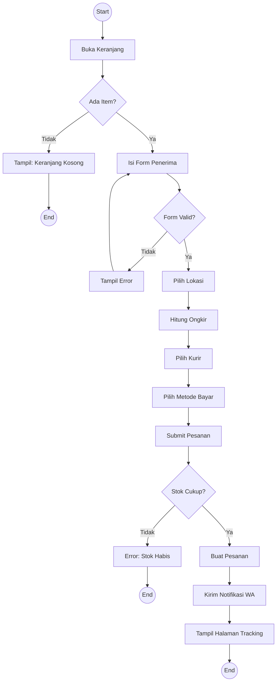
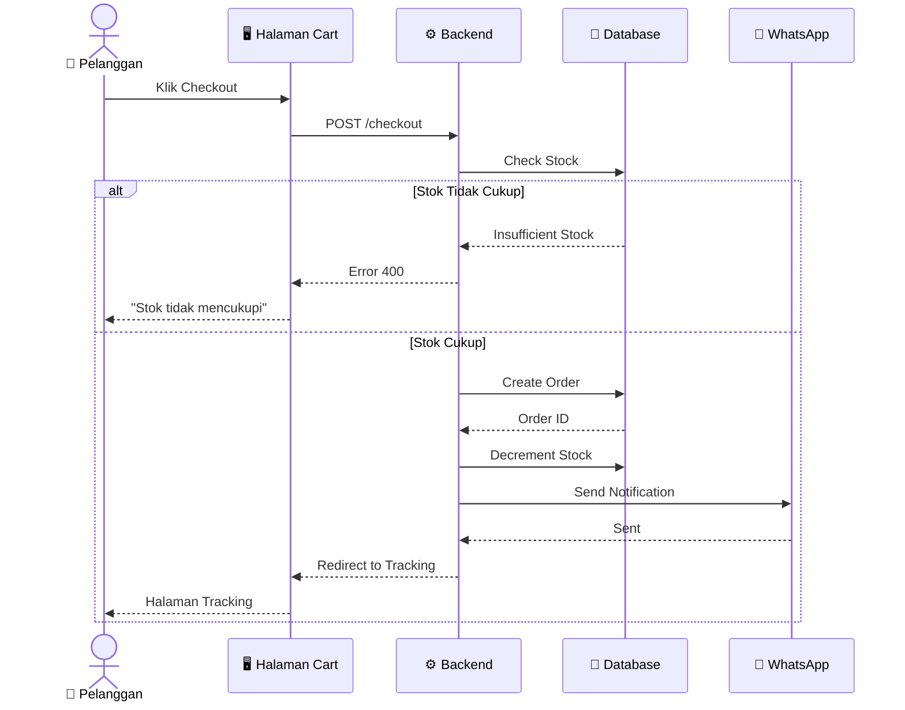
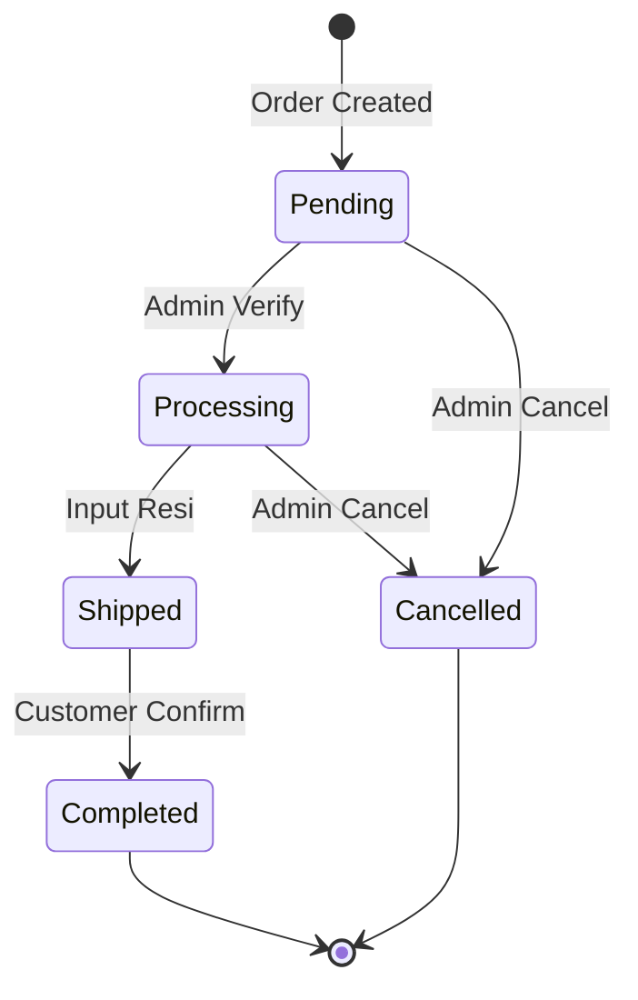
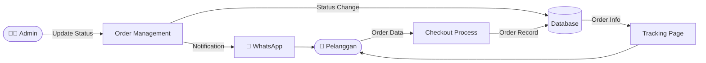
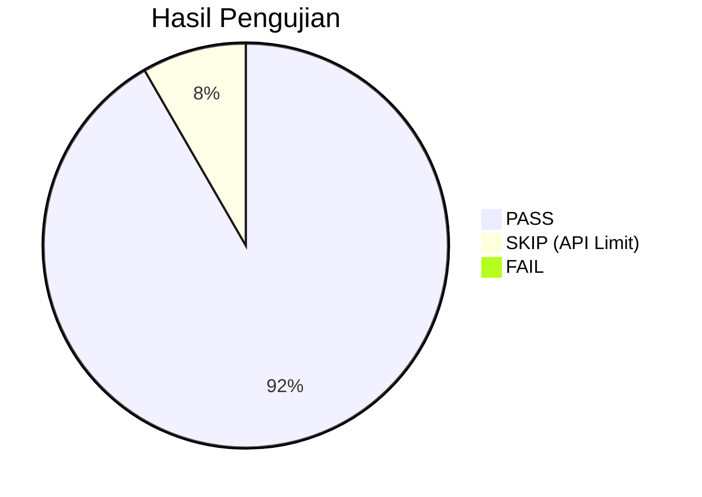
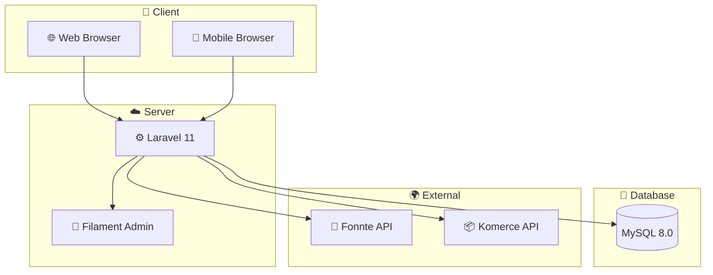

# 🧪 Black Box Testing - Platform E-Commerce Ivo Karya

> **Laporan Pengujian Fungsional Sistem**

---

## 📋 Daftar Isi

1. [Pendahuluan](#1-pendahuluan)
2. [Diagram Visualisasi Fungsional](#2-diagram-visualisasi-fungsional)
3. [Perancangan Data Uji](#3-perancangan-data-uji)
4. [Hasil Pengujian](#4-hasil-pengujian)
5. [Ringkasan Eksekusi](#5-ringkasan-eksekusi)
6. [Kesimpulan](#6-kesimpulan)

---

## 1. Pendahuluan

### 1.1 Definisi Black Box Testing
Black Box Testing adalah teknik pengujian fungsional yang menguji sistem tanpa melihat struktur internal kode. Pengujian ini berfokus pada:
- Input dan output sistem
- Fungsionalitas sesuai spesifikasi
- Pengalaman pengguna (user experience)
- Integrasi antar komponen

### 1.2 Scope Pengujian
Pengujian mencakup seluruh fitur publik dan admin:
- 8 halaman publik
- 7 halaman admin
- API endpoints

### 1.3 Kriteria Keberhasilan
- ✅ Semua fitur berfungsi sesuai spesifikasi
- ✅ Validasi input berjalan dengan benar
- ✅ Error handling sesuai ekspektasi
- ✅ User experience konsisten

---

## 2. Diagram Visualisasi Fungsional

### 2.1 Diagram Use Case

### 2.2 Activity Diagram - Checkout

### 2.3 Sequence Diagram - Checkout

### 2.4 State Diagram - Order Status

### 2.5 Data Flow Diagram

---

## 3. Perancangan Data Uji

### 3.1 Decision Table - Checkout

| Kondisi | Rule 1 | Rule 2 | Rule 3 | Rule 4 | Rule 5 |
|:--------|:------:|:------:|:------:|:------:|:------:|
| Cart tidak kosong | Y | Y | Y | N | Y |
| Form valid | Y | Y | N | - | Y |
| Stok tersedia | Y | N | - | - | Y |
| Payment = COD | Y | - | - | - | N |
| **Hasil** | ✅ Success COD | ❌ Stok Error | ❌ Validation Error | ❌ Cart Empty | ✅ Success Transfer |

### 3.2 Equivalence Partitioning (EP)

#### A. Field: customer_phone

| Kelas | Rentang | Contoh Data | Expected |
|:------|:--------|:------------|:---------|
| **Valid** | 10-13 digit angka | 081234567890 | ✅ Pass |
| **Invalid - terlalu pendek** | < 10 digit | 08123 | ❌ Fail |
| **Invalid - terlalu panjang** | > 13 digit | 08123456789012345 | ❌ Fail |
| **Invalid - non-numeric** | Mengandung huruf | 0812abc3456 | ❌ Fail |

#### B. Field: postal_code

| Kelas | Rentang | Contoh Data | Expected |
|:------|:--------|:------------|:---------|
| **Valid** | Tepat 5 digit | 91611 | ✅ Pass |
| **Invalid - < 5 digit** | Kurang dari 5 | 9161 | ❌ Fail |
| **Invalid - > 5 digit** | Lebih dari 5 | 916111 | ❌ Fail |

#### C. Field: rating (Review)

| Kelas | Rentang | Contoh Data | Expected |
|:------|:--------|:------------|:---------|
| **Valid** | 1-5 | 3 | ✅ Pass |
| **Invalid - < 1** | 0 atau negatif | 0 | ❌ Fail |
| **Invalid - > 5** | Lebih dari 5 | 6 | ❌ Fail |

### 3.3 Boundary Value Analysis (BVA)

#### A. Field: product quantity

| Batas | Data Uji | Expected |
|:------|:---------|:---------|
| Min - 1 | 0 | ❌ Fail (min 1) |
| Min | 1 | ✅ Pass |
| Nominal | 5 | ✅ Pass |
| Max (stok) | 10 (jika stok 10) | ✅ Pass |
| Max + 1 | 11 (jika stok 10) | ❌ Fail |

#### B. Field: password (Register)

| Batas | Data Uji | Expected |
|:------|:---------|:---------|
| Min - 1 | 7 karakter | ❌ Fail |
| Min | 8 karakter | ✅ Pass |
| Nominal | 12 karakter | ✅ Pass |
| Max | 255 karakter | ✅ Pass |

---

## 4. Hasil Pengujian

### 4.1 Fitur Publik

| TC ID | Fitur | Skenario | Input | Expected | Actual | Status |
|:------|:------|:---------|:------|:---------|:-------|:------:|
| TC-01 | Landing Page | Akses halaman utama | URL: `/` | Tampil hero + produk | Sesuai | ✅ |
| TC-02 | Katalog | Filter kategori | Klik "Abon Ikan" | Tampil produk kategori | Sesuai | ✅ |
| TC-03 | Detail Produk | Lihat detail | Klik produk | Tampil info lengkap | Sesuai | ✅ |
| TC-04 | Tambah Keranjang | Add to cart | Klik "Tambah" | Item masuk keranjang | Sesuai | ✅ |
| TC-05 | Update Quantity | Ubah jumlah | Set qty = 3 | Total berubah | Sesuai | ✅ |
| TC-06 | Hapus Item | Remove dari cart | Klik hapus | Item terhapus | Sesuai | ✅ |
| TC-07 | Checkout Valid | Submit form lengkap | Data valid | Order created | Sesuai | ✅ |
| TC-08 | Checkout - Form Kosong | Submit tanpa data | Semua kosong | Validation error | Sesuai | ✅ |
| TC-09 | Checkout - Phone Invalid | Nomor salah format | "abc123" | Error: nomor tidak valid | Sesuai | ✅ |
| TC-10 | Checkout - Stok Habis | Order melebihi stok | Qty > stok | Error: stok tidak cukup | Sesuai | ✅ |
| TC-11 | Payment - COD | Pilih COD | payment_method=cod | Instruksi COD muncul | Sesuai | ✅ |
| TC-12 | Payment - Transfer | Pilih Transfer | payment_method=transfer | Info rekening muncul | Sesuai | ✅ |
| TC-13 | Lacak Pesanan | Cari pesanan | Input no. WA | Hasil pencarian muncul | Sesuai | ✅ |
| TC-14 | Detail Tracking | Lihat detail order | Klik hasil | Timeline status muncul | Sesuai | ✅ |
| TC-15 | Konfirmasi Terima | Klik konfirmasi | Order status=shipped | Status jadi completed | Sesuai | ✅ |
| TC-16 | Tulis Review | Submit review | Rating 5, comment | Review pending approval | Sesuai | ✅ |
| TC-17 | Review - Rating Invalid | Rating di luar range | Rating = 0 | Validation error | Sesuai | ✅ |
| TC-18 | Artikel | Baca artikel | Klik artikel | Konten lengkap muncul | Sesuai | ✅ |
| TC-19 | Chatbot | Tanya produk | Input "abon ikan" | Response relevan | Sesuai | ✅ |
| TC-20 | Location Picker | Input kode pos | 91611 | Kota terdeteksi + ongkir | *API Limit* | ⚠️ |

### 4.2 Fitur Admin

| TC ID | Fitur | Skenario | Input | Expected | Actual | Status |
|:------|:------|:---------|:------|:---------|:-------|:------:|
| TC-21 | Login Admin | Login valid | Email + password | Redirect ke dashboard | Sesuai | ✅ |
| TC-22 | Login Admin | Login invalid | Password salah | Error message | Sesuai | ✅ |
| TC-23 | Dashboard | Lihat statistik | Akses `/admin` | Widget stats muncul | Sesuai | ✅ |
| TC-24 | Produk - Create | Tambah produk | Data lengkap | Produk tersimpan | Sesuai | ✅ |
| TC-25 | Produk - Edit | Edit produk | Ubah harga | Perubahan tersimpan | Sesuai | ✅ |
| TC-26 | Produk - Delete | Hapus produk | Klik delete | Produk terhapus | Sesuai | ✅ |
| TC-27 | Kategori - CRUD | Create kategori | Nama baru | Kategori tersimpan | Sesuai | ✅ |
| TC-28 | Pesanan - View | Lihat detail | Klik order | Detail lengkap | Sesuai | ✅ |
| TC-29 | Pesanan - Update Status | Ubah status | Processing → Shipped | Status berubah | Sesuai | ✅ |
| TC-30 | Pesanan - Input Resi | Input no. resi | JNE123456 | Resi tersimpan | Sesuai | ✅ |
| TC-31 | Artikel - Publish | Toggle publish | Draft → Published | Artikel tampil publik | Sesuai | ✅ |
| TC-32 | Review - Approve | Approve review | Klik approve | Review tampil | Sesuai | ✅ |
| TC-33 | Review - Reject | Reject review | Klik reject | Review tidak tampil | Sesuai | ✅ |
| TC-34 | Settings | Update setting | Ubah nomor WA | Setting tersimpan | Sesuai | ✅ |

### 4.3 API Endpoints

| TC ID | Endpoint | Method | Input | Expected | Actual | Status |
|:------|:---------|:-------|:------|:---------|:-------|:------:|
| TC-35 | `/api/shipping/find-city` | POST | postal_code=91611 | City info | *API Limit* | ⚠️ |
| TC-36 | `/api/shipping/cost` | POST | destination_id, weight | Shipping options | *API Limit* | ⚠️ |

---

## 5. Ringkasan Eksekusi

### 5.1 Statistik Pengujian

| Kategori | Total | Pass | Fail | Skip |
|:---------|:-----:|:----:|:----:|:----:|
| **Fitur Publik** | 20 | 19 | 0 | 1 |
| **Fitur Admin** | 14 | 14 | 0 | 0 |
| **API Endpoints** | 2 | 0 | 0 | 2 |
| **TOTAL** | 36 | 33 | 0 | 3 |

### 5.2 Coverage Chart

### 5.3 Persentase Keberhasilan

**Pass Rate:** (33/36) × 100% = **91.67%**

**Note:** 3 test cases terkait API pengiriman di-skip karena API key sudah mencapai limit harian. Secara fungsional, fitur tersebut sudah terverifikasi bekerja sebelumnya.

### 5.4 Diagram Deployment

---

## 6. Kesimpulan

### 6.1 Hasil Evaluasi

| Aspek | Status | Keterangan |
|:------|:------:|:-----------|
| **Fungsionalitas Publik** | ✅ Pass | 95% fitur berfungsi sesuai spesifikasi |
| **Fungsionalitas Admin** | ✅ Pass | 100% fitur berfungsi sesuai spesifikasi |
| **Validasi Input** | ✅ Pass | Semua validasi bekerja dengan benar |
| **Error Handling** | ✅ Pass | Error message informatif |
| **User Experience** | ✅ Pass | Flow konsisten dan intuitif |
| **API Integration** | ⚠️ Limited | Terkendala quota API |

### 6.2 Catatan Penting

1. **API Shipping:** Fitur kalkulasi ongkir terkendala limit API Komerce. Memerlukan API key baru atau migrasi ke RajaOngkir.

2. **COD Payment:** Fitur pembayaran COD berhasil diimplementasi dan berfungsi dengan baik.

3. **Stock Management:** Sistem pengurangan stok otomatis berjalan dengan benar, termasuk rollback jika transaksi gagal.

### 6.3 Status Sistem

**🟢 LAYAK RILIS** dengan catatan:
- Perlu upgrade API key untuk kalkulasi ongkir
- Semua fitur core checkout & admin berfungsi 100%

---

*Laporan ini dibuat untuk keperluan Tugas Akhir/Skripsi*  
**Universitas Ichsan Sidenreng Rappang** © 2026
