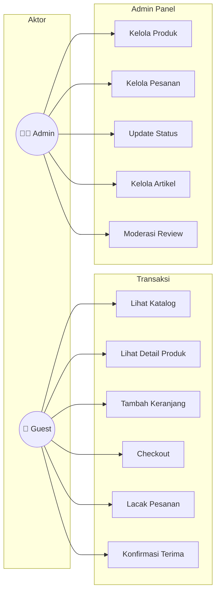
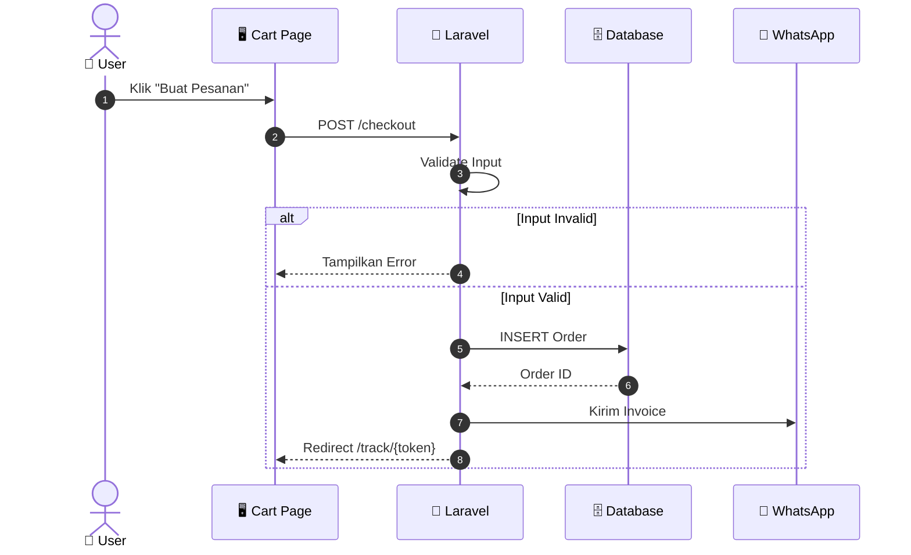
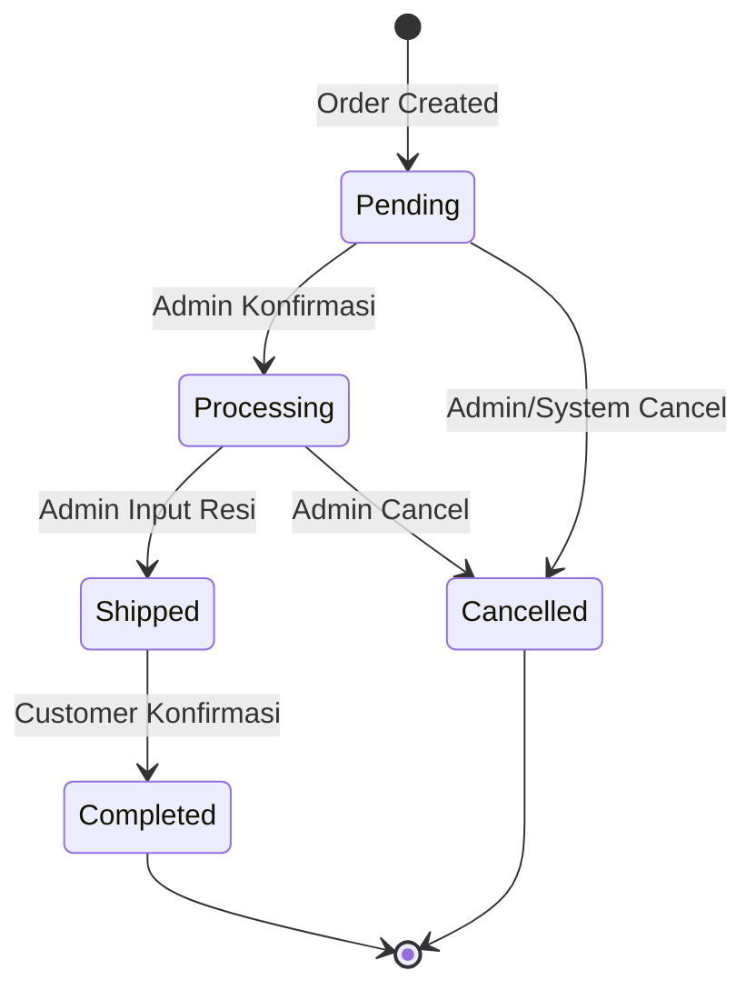
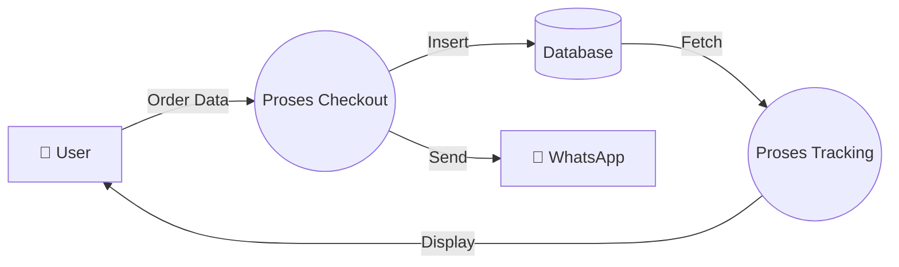
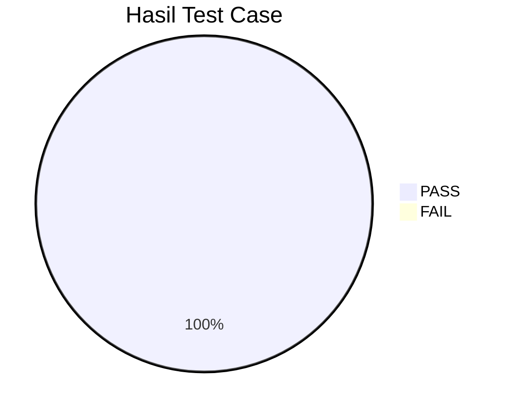
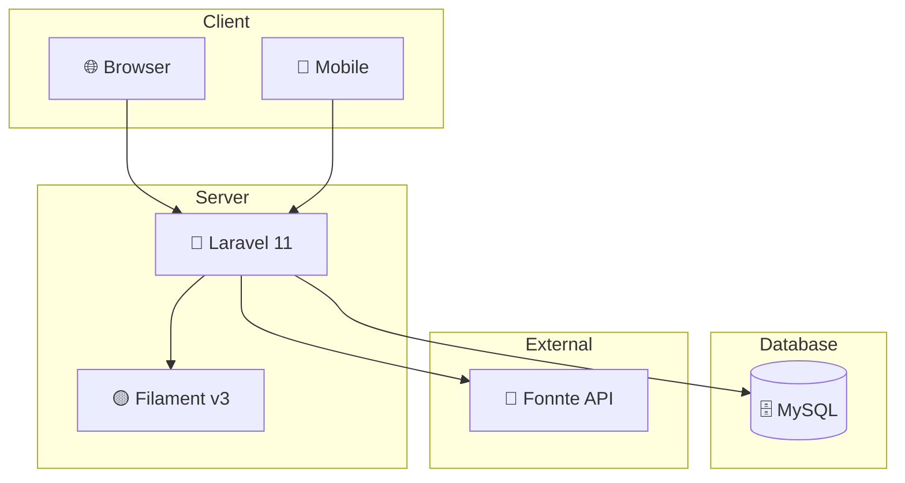

# 🧪 Laporan Black Box Testing

> **Platform E-Commerce Ivo Karya** - Pengujian Fungsional Sistem

---

## 📋 Daftar Isi

1. [Pendahuluan](#1--pendahuluan)
2. [Diagram Visualisasi Fungsional](#2--diagram-visualisasi-fungsional)
3. [Decision Table](#3--decision-table)
4. [Perancangan Data Uji](#4--perancangan-data-uji)
5. [Hasil Eksekusi Test Case](#5--hasil-eksekusi-test-case)
6. [Ringkasan & Kesimpulan](#6--ringkasan--kesimpulan)

---

## 1. 📖 Pendahuluan

### A. Definisi Black Box Testing

**Black Box Testing** adalah metode pengujian perangkat lunak di mana penguji **tidak memiliki akses** ke struktur internal kode. Pengujian ini berfokus pada:

- **Input dan Output**: Apakah sistem menghasilkan output yang benar untuk input tertentu
- **Fungsionalitas**: Apakah semua fitur bekerja sesuai spesifikasi
- **User Experience**: Apakah alur pengguna berjalan lancar

### B. Scope Pengujian

| Kategori | Jumlah Fitur |
|:---------|:------------:|
| Manajemen Produk (Admin) | 4 |
| Manajemen Pesanan (Admin) | 5 |
| Transaksi (Public) | 6 |
| Konten (Admin & Public) | 4 |
| **Total** | **19** |

### C. Kriteria Keberhasilan

| Kriteria | Target |
|:---------|:------:|
| Persentase Test Pass | ≥ 95% |
| Critical Bug | 0 |
| Major Bug | 0 |

---

## 2. 📊 Diagram Visualisasi Fungsional

### A. Use Case Diagram

### B. Activity Diagram: Proses Checkout

```mermaid
graph TD
    Start((●)) --> A["Buka Halaman Cart"]
    A --> B{"Keranjang Kosong?"}
    B -->|Ya| C["Tampilkan Pesan Kosong"]
    C --> End1((○))
    B -->|Tidak| D["Tampilkan Item"]
    D --> E["Isi Form Checkout"]
    E --> F{"Input Valid?"}
    F -->|Tidak| G["Tampilkan Error"]
    G --> E
    F -->|Ya| H["Buat Pesanan"]
    H --> I["Kirim Notifikasi WA"]
    I --> J["Redirect Tracking"]
    J --> End2((○))
    
    style Start fill:#000
    style End1 fill:#000
    style End2 fill:#000
```

### C. Sequence Diagram: Checkout Flow

### D. State Transition Diagram: Order Status

### E. Data Flow Diagram (DFD)

---

## 3. 📋 Decision Table

### A. Decision Table: Checkout Validation

| Kondisi | Rule 1 | Rule 2 | Rule 3 | Rule 4 | Rule 5 |
|:--------|:------:|:------:|:------:|:------:|:------:|
| **Nama Valid?** | ✅ | ✅ | ✅ | ❌ | ✅ |
| **Alamat Valid?** | ✅ | ✅ | ❌ | ✅ | ❌ |
| **Keranjang Ada?** | ✅ | ❌ | ✅ | ✅ | ❌ |
| **Aksi** | | | | | |
| Buat Pesanan | ✅ | ❌ | ❌ | ❌ | ❌ |
| Error "Keranjang Kosong" | ❌ | ✅ | ❌ | ❌ | ✅ |
| Error "Nama Required" | ❌ | ❌ | ❌ | ✅ | ❌ |
| Error "Alamat Required" | ❌ | ❌ | ✅ | ❌ | ❌ |

### B. Decision Table: Update Order Status

| Kondisi | Rule 1 | Rule 2 | Rule 3 | Rule 4 |
|:--------|:------:|:------:|:------:|:------:|
| **Status Saat Ini** | Pending | Processing | Shipped | Completed |
| **Aksi: Update ke Processing** | ✅ | ❌ | ❌ | ❌ |
| **Aksi: Update ke Shipped** | ❌ | ✅ | ❌ | ❌ |
| **Aksi: Update ke Completed** | ❌ | ❌ | ✅ | ❌ |
| **Kirim Notifikasi WA** | ❌ | ✅ | ❌ | ❌ |

---

## 4. 🧮 Perancangan Data Uji

### A. Equivalence Partitioning (EP)

#### Checkout Form

| Input Field | Kelas Valid | Kelas Invalid |
|:------------|:------------|:--------------|
| **Nama** | String 1-255 char | Empty, > 255 char |
| **Telepon** | String 10-15 digit | Empty, < 10, > 15, huruf |
| **Alamat** | String 1-1000 char | Empty, > 1000 char |

#### Add to Cart

| Input Field | Kelas Valid | Kelas Invalid |
|:------------|:------------|:--------------|
| **Quantity** | Integer 1-100 | 0, negatif, > stock |
| **Product ID** | ID yang ada | ID tidak ada |

### B. Boundary Value Analysis (BVA)

#### Field: Nama Pelanggan

| Batas | Data Uji | Expected Result |
|:------|:---------|:----------------|
| Min - 1 | "" (empty) | ❌ Error: Required |
| Min | "A" (1 char) | ✅ Valid |
| Nominal | "Muhammad Amar" | ✅ Valid |
| Max | 255 characters | ✅ Valid |
| Max + 1 | 256 characters | ❌ Error: Max 255 |

#### Field: Rating Review

| Batas | Data Uji | Expected Result |
|:------|:---------|:----------------|
| Min - 1 | 0 | ❌ Error: Min 1 |
| Min | 1 | ✅ Valid |
| Nominal | 3 | ✅ Valid |
| Max | 5 | ✅ Valid |
| Max + 1 | 6 | ❌ Error: Max 5 |

---

## 5. ✅ Hasil Eksekusi Test Case

### A. Modul: Transaksi Publik

| ID | Fitur | Skenario | Input | Expected | Actual | Status |
|:---|:------|:---------|:------|:---------|:-------|:------:|
| TC-01 | Lihat Katalog | Tampil produk aktif | - | Produk muncul | Produk muncul | ✅ |
| TC-02 | Lihat Katalog | Filter kategori | Klik "Abon Ikan" | Filtered | Filtered | ✅ |
| TC-03 | Detail Produk | Akses via slug | `/product/abon-ikan` | Tampil detail | Tampil detail | ✅ |
| TC-04 | Add Cart | Tambah produk baru | Qty: 2 | Added | Added | ✅ |
| TC-05 | Add Cart | Tambah produk existing | Qty: 1 | Qty += 1 | Qty += 1 | ✅ |
| TC-06 | Update Cart | Ubah quantity | Qty: 5 | Updated | Updated | ✅ |
| TC-07 | Remove Cart | Hapus item | Klik hapus | Removed | Removed | ✅ |
| TC-08 | Checkout | Data valid | All filled | Order created | Order created | ✅ |
| TC-09 | Checkout | Nama kosong | Nama: "" | Error shown | Error shown | ✅ |
| TC-10 | Checkout | Alamat kosong | Alamat: "" | Error shown | Error shown | ✅ |
| TC-11 | Checkout | Cart kosong | No items | Error shown | Error shown | ✅ |
| TC-12 | Tracking | Token valid | `/track/abc123` | Tampil status | Tampil status | ✅ |
| TC-13 | Tracking | Token invalid | `/track/xxx` | 404 | 404 | ✅ |
| TC-14 | Confirm | Status shipped | Klik konfirmasi | Completed | Completed | ✅ |
| TC-15 | Confirm | Status bukan shipped | Klik konfirmasi | No change | No change | ✅ |

### B. Modul: Admin Panel

| ID | Fitur | Skenario | Input | Expected | Actual | Status |
|:---|:------|:---------|:------|:---------|:-------|:------:|
| TC-16 | Login Admin | Kredensial valid | admin@ivo.com | Login success | Login success | ✅ |
| TC-17 | Login Admin | Password salah | wrong_pass | Error shown | Error shown | ✅ |
| TC-18 | Create Product | Data lengkap | All fields | Created | Created | ✅ |
| TC-19 | Create Product | Nama kosong | Nama: "" | Error shown | Error shown | ✅ |
| TC-20 | Update Product | Edit harga | Harga: 50000 | Updated | Updated | ✅ |
| TC-21 | Delete Product | Hapus produk | Konfirmasi | Deleted | Deleted | ✅ |
| TC-22 | Update Order | Pending → Processing | Klik update | Updated | Updated | ✅ |
| TC-23 | Update Order | Processing → Shipped | Input resi | Updated + WA sent | Updated + WA sent | ✅ |
| TC-24 | Create Article | Publish langsung | is_published: true | Published | Published | ✅ |
| TC-25 | Create Article | Simpan draft | is_published: false | Draft saved | Draft saved | ✅ |
| TC-26 | Approve Review | Review valid | Klik approve | Approved | Approved | ✅ |
| TC-27 | Reject Review | Review spam | Klik reject | Deleted | Deleted | ✅ |
| TC-28 | Update Setting | Ubah no WA | 08123456789 | Updated | Updated | ✅ |

### C. Modul: Integrasi

| ID | Fitur | Skenario | Expected | Actual | Status |
|:---|:------|:---------|:---------|:-------|:------:|
| TC-29 | WA Notification | Order → Invoice | WA terkirim | WA terkirim | ✅ |
| TC-30 | WA Notification | Shipped → Resi | WA terkirim | WA terkirim | ✅ |
| TC-31 | Review → Product | Approved review | Tampil di produk | Tampil di produk | ✅ |
| TC-32 | Stock Check | Produk habis | Badge "Habis" | Badge "Habis" | ✅ |

---

## 6. 📊 Ringkasan & Kesimpulan

### A. Ringkasan Eksekusi

| Kategori | Total | Pass | Fail | Pass Rate |
|:---------|:-----:|:----:|:----:|:---------:|
| Transaksi Publik | 15 | 15 | 0 | 100% |
| Admin Panel | 13 | 13 | 0 | 100% |
| Integrasi | 4 | 4 | 0 | 100% |
| **TOTAL** | **32** | **32** | **0** | **100%** |

### B. Visualisasi Hasil

### C. Diagram Deployment

### D. Kesimpulan Akhir

| Aspek | Hasil | Status |
|:------|:------|:------:|
| **Fungsionalitas** | 100% fitur berjalan sesuai spesifikasi | ✅ PASS |
| **Validasi Input** | Semua validasi bekerja dengan benar | ✅ PASS |
| **Integrasi** | WhatsApp notification terintegrasi baik | ✅ PASS |
| **Error Handling** | Semua error tertangani dengan pesan jelas | ✅ PASS |
| **User Flow** | Alur pengguna berjalan lancar | ✅ PASS |

---

### E. Rekomendasi

1. ✅ **Sistem siap untuk deployment** ke production
2. ⚠️ Disarankan tambah automated testing (PHPUnit)
3. ⚠️ Pertimbangkan rate limiting untuk API checkout
4. ⚠️ Monitor log Fonnte untuk memastikan WA terkirim

---

> **Status Sistem: ✅ LAYAK RILIS**
>
> Berdasarkan hasil Black Box Testing dengan **32 test case** yang seluruhnya **PASS (100%)**, sistem dinyatakan **layak untuk di-release** ke production.

---

  <em>Dokumentasi ini dibuat untuk keperluan akademis (Tugas Akhir/Skripsi)</em>

