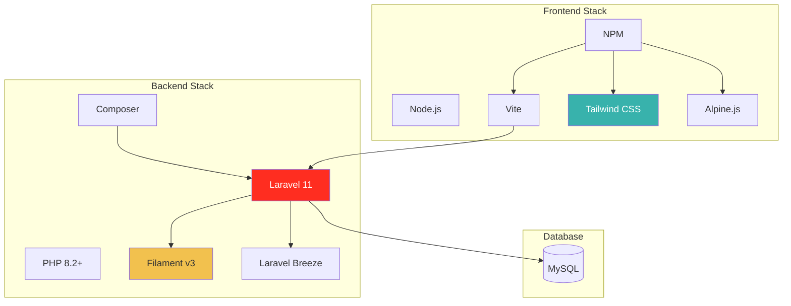

# 📦 Dokumentasi Dependencies

> **Platform E-Commerce Ivo Karya** - Daftar Library dan Package yang Digunakan

---

## 📊 Ringkasan Dependencies

| Kategori | Backend (Composer) | Frontend (NPM) |
|:---------|:------------------:|:--------------:|
| **Core Framework** | 2 | 3 |
| **Admin Panel** | 1 | - |
| **Styling & UI** | - | 3 |
| **Development Tools** | 7 | 3 |
| **Total Packages** | **10** | **9** |

---

## 🔷 Backend Dependencies (Composer)

### 🏗️ Core Framework

| Package | Versi | Fungsi Utama |
|:--------|:------|:-------------|
| **laravel/framework** | ^11.0 | Framework PHP utama. Menyediakan routing, Eloquent ORM, Blade templating, autentikasi, dan semua fitur core Laravel. |
| **laravel/tinker** | ^2.9 | REPL (Read-Eval-Print Loop) untuk Laravel. Memungkinkan eksekusi kode PHP secara interaktif di terminal untuk debugging. |

### 🟡 Admin Panel

| Package | Versi | Fungsi Utama |
|:--------|:------|:-------------|
| **filament/filament** | ^3.2 | Admin panel modern berbasis Livewire. Menyediakan CRUD generator, form builder, table builder, dan dashboard widgets siap pakai. |

### 🛠️ Development Dependencies (require-dev)

| Package | Versi | Kategori | Fungsi Utama |
|:--------|:------|:---------|:-------------|
| **laravel/breeze** | ^2.0 | Auth | Starter kit autentikasi minimalis. Menyediakan login, register, reset password dengan Blade views. |
| **laravel/pail** | ^1.1 | Logging | Log viewer real-time di terminal. Menampilkan log Laravel secara live dengan warna. |
| **laravel/pint** | ^1.13 | Code Style | PHP code style fixer. Otomatis merapikan format kode sesuai standar Laravel. |
| **laravel/sail** | ^1.26 | Docker | Environment development berbasis Docker. Menyediakan MySQL, Redis, Mailhog dalam container. |
| **fakerphp/faker** | ^1.23 | Testing | Library generator data palsu. Digunakan untuk seeding database dan testing. |
| **mockery/mockery** | ^1.6 | Testing | Framework mocking untuk PHP. Digunakan dalam unit testing untuk mock dependencies. |
| **phpunit/phpunit** | ^11.0.1 | Testing | Framework testing unit untuk PHP. Menjalankan automated tests. |
| **nunomaduro/collision** | ^8.1 | CLI | Error handling yang lebih baik untuk CLI. Menampilkan error dengan format yang lebih readable. |

---

## ⚡ Frontend Dependencies (NPM)

### ⚛️ Core Framework

| Package | Versi | Fungsi Utama |
|:--------|:------|:-------------|
| **vite** | ^7.0.7 | Build tool modern pengganti Webpack. Sangat cepat untuk development dengan Hot Module Replacement (HMR). |
| **laravel-vite-plugin** | ^2.0.0 | Plugin resmi Laravel untuk Vite. Mengintegrasikan asset bundling dengan Laravel. |
| **alpinejs** | ^3.4.2 | Framework JavaScript minimalis. Menambahkan interaktivitas reaktif langsung di HTML tanpa kompleksitas SPA. |

### 🎨 Styling & UI

| Package | Versi | Fungsi Utama |
|:--------|:------|:-------------|
| **tailwindcss** | ^3.1.0 | CSS framework utility-first. Menyediakan class-class untuk styling cepat langsung di HTML. |
| **@tailwindcss/forms** | ^0.5.2 | Plugin Tailwind untuk styling form. Memberikan base styling yang konsisten untuk input, select, checkbox. |
| **@tailwindcss/vite** | ^4.0.0 | Plugin Tailwind untuk integrasi optimal dengan Vite. Optimasi build dan HMR. |

### 🛠️ Development Tools

| Package | Versi | Fungsi Utama |
|:--------|:------|:-------------|
| **postcss** | ^8.4.31 | CSS transformer. Diperlukan oleh Tailwind untuk processing CSS. |
| **autoprefixer** | ^10.4.2 | PostCSS plugin. Otomatis menambahkan vendor prefix (-webkit-, -moz-) untuk kompatibilitas browser. |
| **axios** | ^1.11.0 | HTTP client berbasis Promise. Digunakan untuk AJAX requests dari frontend. |
| **concurrently** | ^9.0.1 | Menjalankan multiple commands sekaligus. Digunakan untuk menjalankan Laravel server dan Vite secara bersamaan. |

---

## 📁 Flow Dependencies



---

## 🔐 Security Considerations

### Packages dengan Fokus Keamanan

| Package | Aspek Keamanan |
|:--------|:---------------|
| **laravel/framework** | CSRF protection, password hashing, SQL injection prevention |
| **laravel/breeze** | Secure authentication flows, password reset tokens |
| **filament/filament** | Admin panel with built-in authorization |

### Rekomendasi Update

Jalankan secara berkala:

```bash
# Check outdated packages
composer outdated
npm outdated

# Update dengan aman
composer update --with-all-dependencies
npm update
```

---

## 📋 Kompatibilitas Minimum

| Requirement | Minimum Version | Rekomendasi |
|:------------|:---------------:|:-----------:|
| **PHP** | 8.2 | 8.3 |
| **Node.js** | 18.x | 20.x LTS |
| **MySQL** | 8.0 | 8.0+ |
| **Composer** | 2.x | 2.7+ |
| **NPM** | 9.x | 10.x |

---

## 🔄 Scripts yang Tersedia

### Composer Scripts

| Script | Command | Fungsi |
|:-------|:--------|:-------|
| **Setup** | `composer setup` | Install dependencies, copy .env, generate key, migrate |
| **Dev** | `composer dev` | Jalankan server, queue, logs, vite secara bersamaan |
| **Test** | `composer test` | Clear config dan jalankan PHPUnit tests |

### NPM Scripts

| Script | Command | Fungsi |
|:-------|:--------|:-------|
| **Dev** | `npm run dev` | Jalankan Vite development server dengan HMR |
| **Build** | `npm run build` | Build production assets |

---

## 📊 Ukuran Bundle

| Asset | Type | Estimated Size |
|:------|:-----|---------------:|
| **app.css** | CSS (Tailwind) | ~50-100 KB |
| **app.js** | JS (Alpine + Axios) | ~30-50 KB |
| **Total (gzipped)** | Production | ~30-50 KB |

> 💡 **Note**: Tailwind CSS menggunakan purging di production, sehingga hanya class yang dipakai yang masuk ke bundle final.

---

<p align="center">
  <em>Dokumentasi ini dibuat untuk keperluan akademis (Tugas Akhir/Skripsi)</em>
</p>
