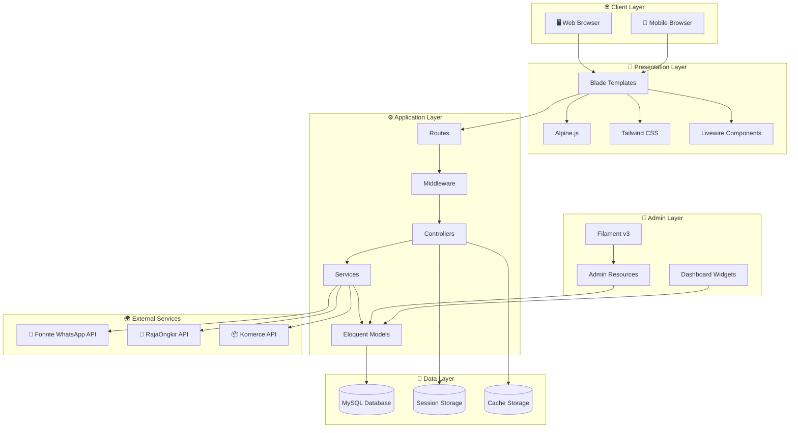
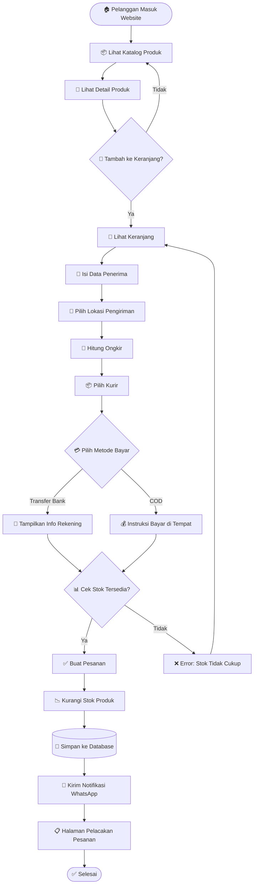
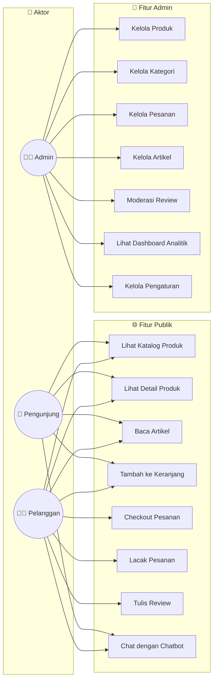
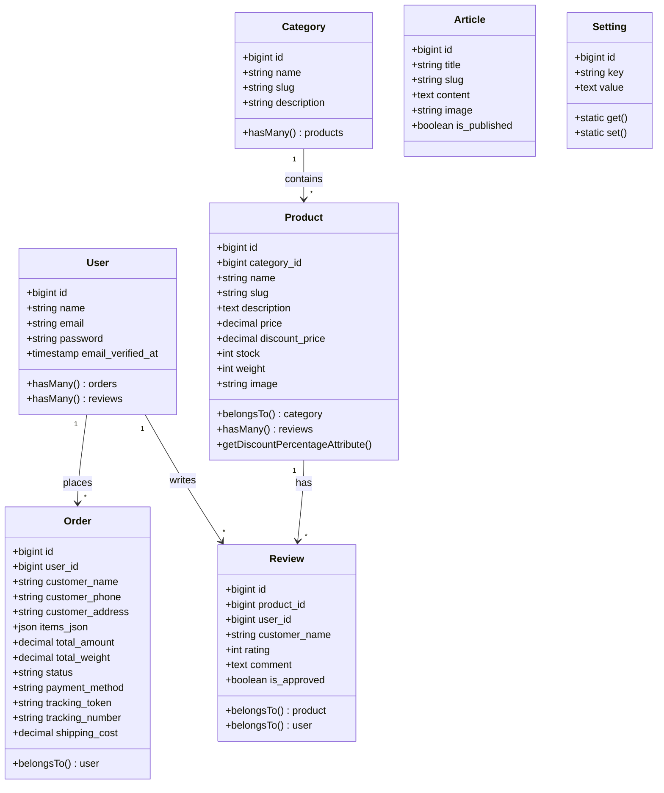
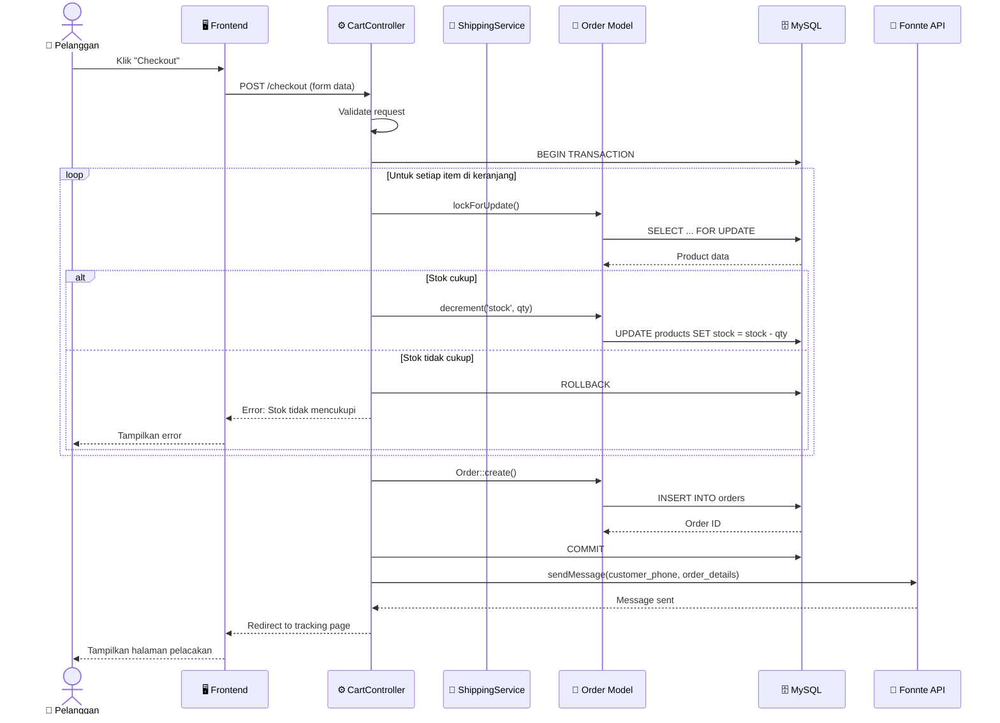
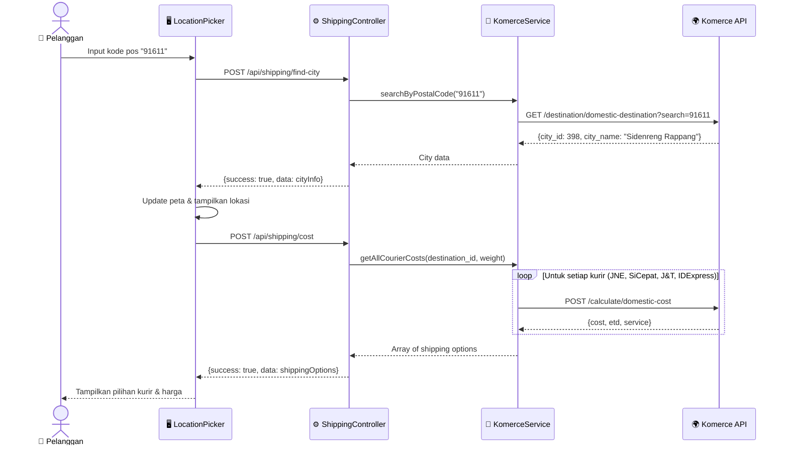
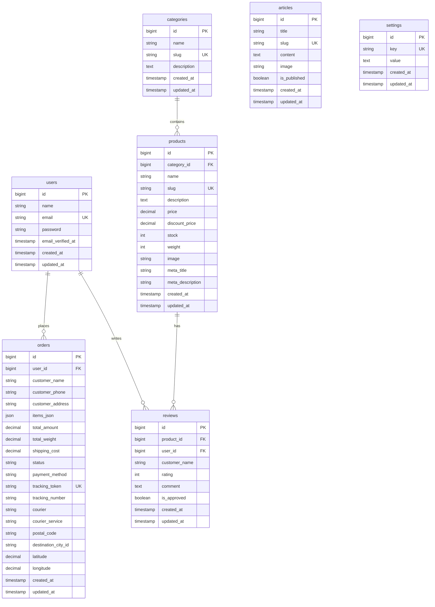

# 🎨 Dokumentasi Design & Arsitektur Sistem

> **Platform E-Commerce Ivo Karya** - Dokumentasi Teknis Lengkap

---

## 📋 Daftar Isi

1. [Diagram Arsitektur](#1-diagram-arsitektur)
2. [Diagram Alur Kerja](#2-diagram-alur-kerja)
3. [Diagram Use Case](#3-diagram-use-case)
4. [Diagram Kelas](#4-diagram-kelas)
5. [Diagram Sequence](#5-diagram-sequence)
6. [Entity Relationship Diagram](#6-entity-relationship-diagram)
7. [Diagram Komponen](#7-diagram-komponen)

---

## 1. Diagram Arsitektur

### 1.1 Deskripsi
Sistem Ivo Karya menggunakan arsitektur **Monolitik Termodulasi** dengan pemisahan yang jelas antara:
- **Frontend Layer**: Blade Templates + Alpine.js + Tailwind CSS
- **Backend Layer**: Laravel 11 dengan Filament Admin Panel
- **Data Layer**: MySQL Database
- **External Services**: WhatsApp Gateway (Fonnte), Shipping API (RajaOngkir/Komerce)

### 1.2 Diagram

### 1.3 Penjelasan Komponen

| Layer | Komponen | Teknologi | Fungsi |
|:------|:---------|:----------|:-------|
| **Client** | Browser | Chrome/Firefox/Safari | Akses web oleh pengguna |
| **Presentation** | Blade | Laravel Blade | Server-side templating |
| **Presentation** | Alpine.js | JavaScript | Interaktivitas frontend |
| **Presentation** | Tailwind | CSS Framework | Styling responsif |
| **Application** | Controllers | PHP | Handle HTTP requests |
| **Application** | Services | PHP | Business logic |
| **Application** | Models | Eloquent ORM | Database abstraction |
| **Admin** | Filament | PHP | Admin panel framework |
| **Data** | MySQL | RDBMS | Penyimpanan data |
| **External** | Fonnte | REST API | WhatsApp notifications |
| **External** | RajaOngkir | REST API | Ongkos kirim |

---

## 2. Diagram Alur Kerja

### 2.1 Deskripsi
Alur kerja sistem menggambarkan perjalanan data dari input pengguna hingga output yang dihasilkan. Berikut adalah alur utama pemesanan produk.

### 2.2 Diagram Alur Pemesanan

### 2.3 Penjelasan Step-by-Step

| Step | Aksi | Komponen Terlibat |
|:-----|:-----|:------------------|
| 1 | Pelanggan mengakses website | `HomeController`, `welcome.blade.php` |
| 2 | Melihat katalog produk | `HomeController@catalog`, `catalog.blade.php` |
| 3 | Tambah ke keranjang | `CartController@add`, Session Storage |
| 4 | Isi form checkout | `cart.blade.php`, Alpine.js validation |
| 5 | Pilih lokasi pengiriman | `LocationPicker` component, Komerce API |
| 6 | Hitung ongkos kirim | `ShippingController`, RajaOngkir/Komerce API |
| 7 | Proses checkout | `CartController@checkout`, DB Transaction |
| 8 | Simpan pesanan | `Order` model, MySQL |
| 9 | Kirim notifikasi | `FonnteService`, WhatsApp API |
| 10 | Tampilkan tracking | `CartController@track`, `track.blade.php` |

---

## 3. Diagram Use Case

### 3.1 Deskripsi
Diagram Use Case menggambarkan interaksi antara aktor (pengguna) dengan fitur-fitur yang tersedia dalam sistem.

### 3.2 Diagram

### 3.3 Penjelasan Aktor

| Aktor | Deskripsi | Hak Akses |
|:------|:----------|:----------|
| **Pengunjung (Guest)** | Pengguna yang belum login | Lihat produk, baca artikel, tambah keranjang, chat |
| **Pelanggan (Customer)** | Pengguna yang melakukan pembelian | Semua fitur publik + checkout + tracking + review |
| **Admin** | Pengelola toko | Full akses admin panel Filament |

---

## 4. Diagram Kelas

### 4.1 Deskripsi
Diagram kelas menggambarkan struktur model/entity dalam sistem beserta relasinya.

### 4.2 Diagram

### 4.3 Penjelasan Kelas Utama

| Kelas | Tanggung Jawab | Atribut Penting |
|:------|:---------------|:----------------|
| **User** | Menyimpan data pengguna | name, email, password |
| **Product** | Menyimpan data produk | name, price, stock, weight |
| **Order** | Menyimpan data pesanan | items_json, total_amount, status, payment_method |
| **Category** | Mengelompokkan produk | name, slug |
| **Review** | Menyimpan ulasan produk | rating, comment, is_approved |
| **Article** | Menyimpan artikel blog | title, content, is_published |
| **Setting** | Konfigurasi dinamis | key, value |

---

## 5. Diagram Sequence

### 5.1 Deskripsi
Diagram sequence menggambarkan interaksi antar objek untuk skenario spesifik dalam urutan waktu.

### 5.2 Sequence: Proses Checkout

### 5.3 Sequence: Kalkulasi Ongkos Kirim

---

## 6. Entity Relationship Diagram

### 6.1 Deskripsi
ERD menggambarkan struktur tabel database dan hubungan antar entitas.

### 6.2 Diagram

### 6.3 Penjelasan Relasi

| Relasi | Tipe | Deskripsi |
|:-------|:-----|:----------|
| `users` → `orders` | One-to-Many | Satu user bisa memiliki banyak pesanan |
| `users` → `reviews` | One-to-Many | Satu user bisa menulis banyak review |
| `categories` → `products` | One-to-Many | Satu kategori memiliki banyak produk |
| `products` → `reviews` | One-to-Many | Satu produk memiliki banyak review |

---

## 7. Diagram Komponen

### 7.1 Deskripsi
Diagram komponen menggambarkan organisasi dan dependensi antar modul dalam sistem.

### 7.2 Diagram

```mermaid
graph TB
    subgraph "📦 Frontend Components"
        NavBar[Public Navbar]
        LocationPicker[Location Picker]
        ChatBot[Chatbot Widget]
        CartModal[Cart Notification]
    end
    
    subgraph "🎮 Controllers"
        HomeCtrl[HomeController]
        CartCtrl[CartController]
        ShipCtrl[ShippingController]
        ArticleCtrl[ArticleController]
        TrackCtrl[TrackOrderController]
    end
    
    subgraph "🔧 Services"
        FonnteService[FonnteService]
        KomerceService[KomerceService]
        RajaOngkirService[RajaOngkirService]
    end
    
    subgraph "📊 Filament Admin"
        ProductRes[ProductResource]
        OrderRes[OrderResource]
        CategoryRes[CategoryResource]
        ArticleRes[ArticleResource]
        ReviewRes[ReviewResource]
        SettingRes[SettingResource]
    end
    
    subgraph "💾 Models"
        User[User Model]
        Product[Product Model]
        Order[Order Model]
        Category[Category Model]
        Review[Review Model]
        Article[Article Model]
    end
    
    NavBar --> HomeCtrl
    LocationPicker --> ShipCtrl
    ChatBot --> HomeCtrl
    
    HomeCtrl --> Product
    CartCtrl --> Order
    CartCtrl --> Product
    ShipCtrl --> KomerceService
    ShipCtrl --> RajaOngkirService
    
    CartCtrl --> FonnteService
    
    ProductRes --> Product
    OrderRes --> Order
    CategoryRes --> Category
    ArticleRes --> Article
    ReviewRes --> Review
```

---

## 📝 Catatan Teknis

### Best Practices yang Diterapkan

1. **Separation of Concerns**: Controller, Service, dan Model terpisah jelas
2. **Database Transactions**: Checkout menggunakan transaction untuk konsistensi data
3. **Row Locking**: Mencegah race condition saat update stok
4. **API Caching**: Response API eksternal di-cache untuk performa
5. **Lazy Loading Prevention**: Eager loading untuk relasi database

### Keputusan Arsitektur

| Keputusan | Alasan |
|:----------|:-------|
| **Monolith vs Microservices** | Monolith dipilih untuk kesederhanaan deployment dan maintenance UMKM |
| **Filament vs Custom Admin** | Filament mempercepat development dengan UI yang sudah jadi |
| **Session-based Cart** | Guest checkout tanpa perlu login |
| **External WhatsApp API** | Fonnte dipilih karena harga terjangkau dan dokumentasi lengkap |

---

*Dokumentasi ini dibuat untuk keperluan Tugas Akhir/Skripsi*  
**Universitas Ichsan Sidenreng Rappang** © 2026
