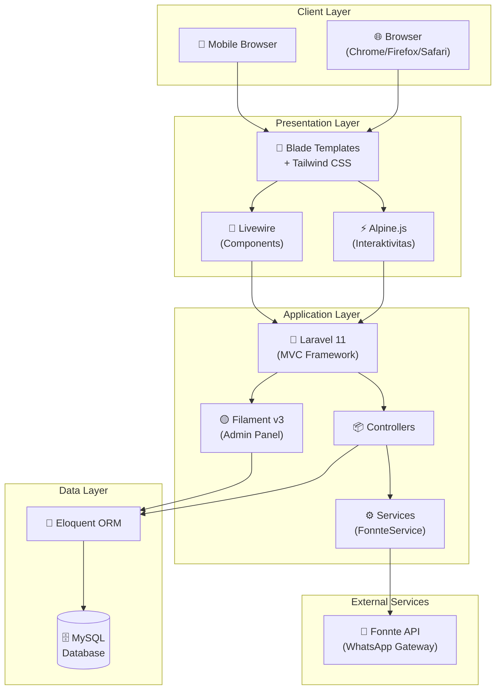
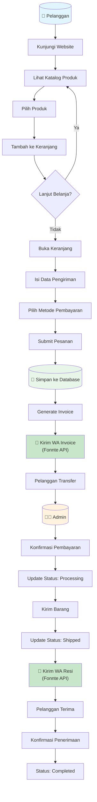
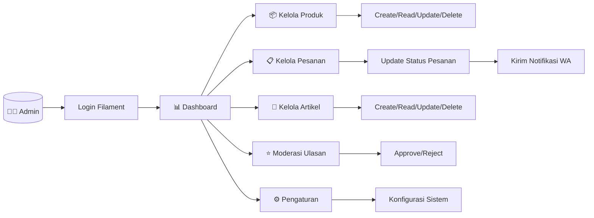
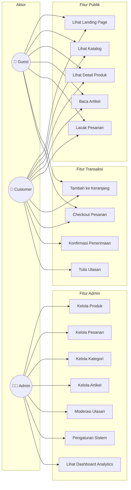
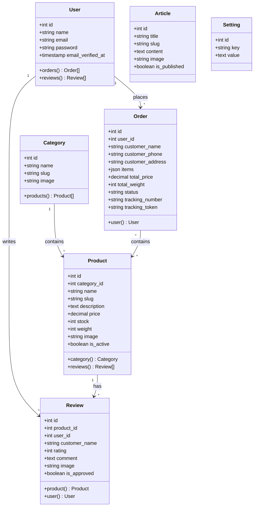
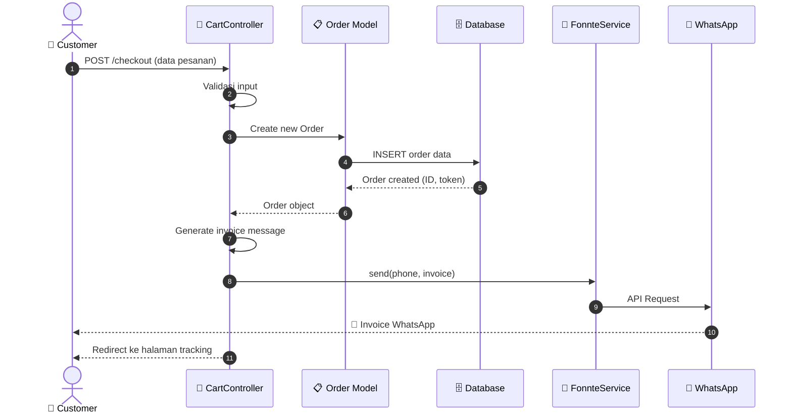
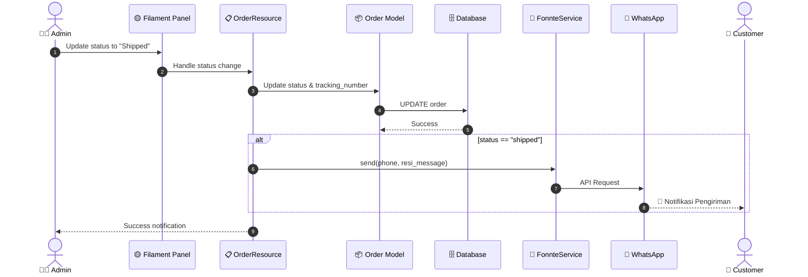
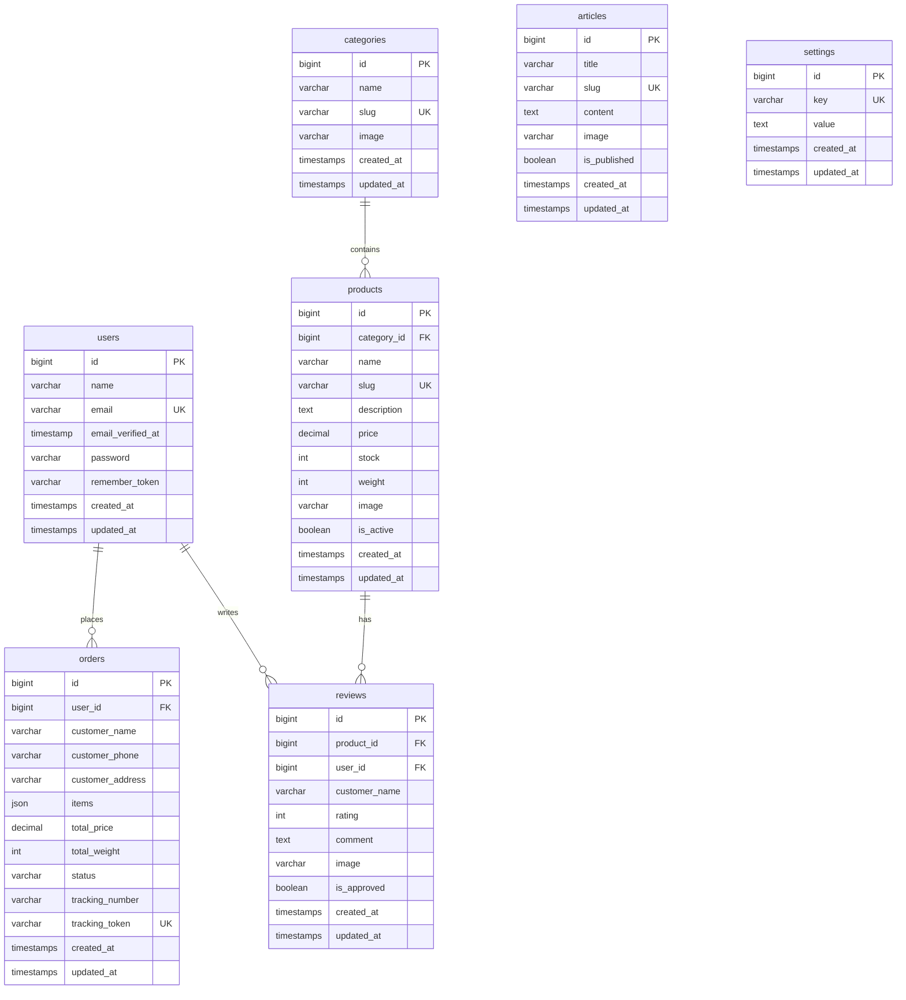

# 🎨 Dokumentasi Design & Arsitektur Sistem

> **Platform E-Commerce Ivo Karya** - Dokumentasi Arsitektur dan Diagram UML

---

## 📋 Daftar Isi

1. [Diagram Arsitektur](#1--diagram-arsitektur)
2. [Diagram Workflow](#2--diagram-workflow)
3. [Diagram Use Case](#3--diagram-use-case)
4. [Diagram Kelas (Class Diagram)](#4--diagram-kelas)
5. [Diagram Sequence](#5--diagram-sequence)
6. [Entity Relationship Diagram (ERD)](#6--entity-relationship-diagram-erd)

---

## 1. 🏗 Diagram Arsitektur

Sistem Ivo Karya mengikuti arsitektur **Monolithic MVC** dengan pemisahan jelas antara frontend publik dan admin panel.

### Penjelasan Komponen

| Layer | Komponen | Deskripsi |
|:------|:---------|:----------|
| **Client** | Browser/Mobile | Antarmuka pengguna mengakses sistem |
| **Presentation** | Blade + Tailwind + Alpine.js | Template engine dengan styling modern dan interaktivitas |
| **Application** | Laravel 11 + Filament v3 | Framework utama dengan admin panel |
| **Data** | Eloquent ORM + MySQL | Abstraksi database dan penyimpanan data |
| **External** | Fonnte API | Integrasi WhatsApp untuk notifikasi |

---

## 2. 🔄 Diagram Workflow

### A. Alur Pemesanan (Order Flow)

### B. Alur Admin Dashboard

---

## 3. 👥 Diagram Use Case

Diagram ini menunjukkan interaksi antara aktor dan fitur sistem.

### Penjelasan Aktor

| Aktor | Deskripsi | Akses |
|:------|:----------|:------|
| **Guest** | Pengunjung tanpa akun | Lihat produk, checkout tanpa login |
| **Customer** | Pelanggan terdaftar | Semua fitur Guest + ulasan + profil |
| **Admin** | Administrator sistem | Full access ke Filament Dashboard |

---

## 4. 📦 Diagram Kelas

Struktur model utama dalam sistem.

---

## 5. 🔀 Diagram Sequence

### A. Sequence: Proses Checkout

### B. Sequence: Update Status Pesanan

---

## 6. 🗃 Entity Relationship Diagram (ERD)

### Penjelasan Tabel

| Entity | Deskripsi | Relasi Utama |
|:-------|:----------|:-------------|
| **users** | Data pengguna/pelanggan terdaftar | Has many Orders, Reviews |
| **categories** | Kategori produk | Has many Products |
| **products** | Data produk yang dijual | Belongs to Category, Has many Reviews |
| **orders** | Data pesanan pelanggan | Belongs to User (nullable untuk guest) |
| **reviews** | Ulasan produk dari pelanggan | Belongs to Product, User |
| **articles** | Konten artikel/blog | Standalone |
| **settings** | Konfigurasi sistem (key-value) | Standalone |

---

## 📌 Catatan Teknis

1. **Guest Checkout**: Kolom `user_id` pada tabel `orders` bersifat nullable untuk mendukung pembelian tanpa login.
2. **Tracking Token**: Setiap pesanan memiliki `tracking_token` unik yang di-hash untuk keamanan pelacakan.
3. **Soft Status**: Status pesanan menggunakan enum: `pending`, `processing`, `shipped`, `completed`, `cancelled`.
4. **JSON Storage**: Kolom `items` pada orders menyimpan snapshot produk saat checkout dalam format JSON.

---

  <em>Dokumentasi ini dibuat untuk keperluan akademis (Tugas Akhir/Skripsi)</em>

