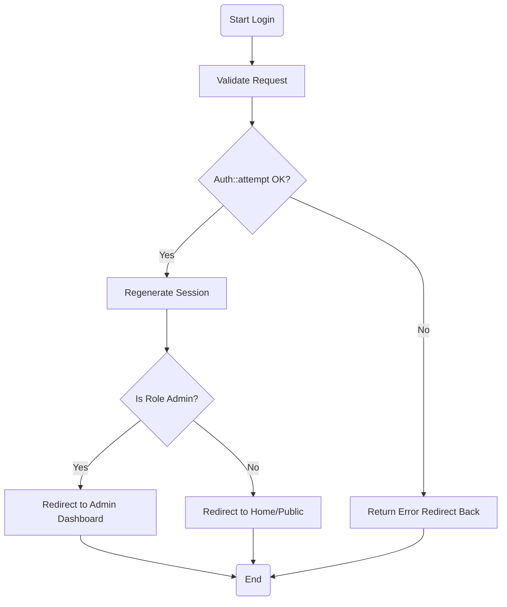
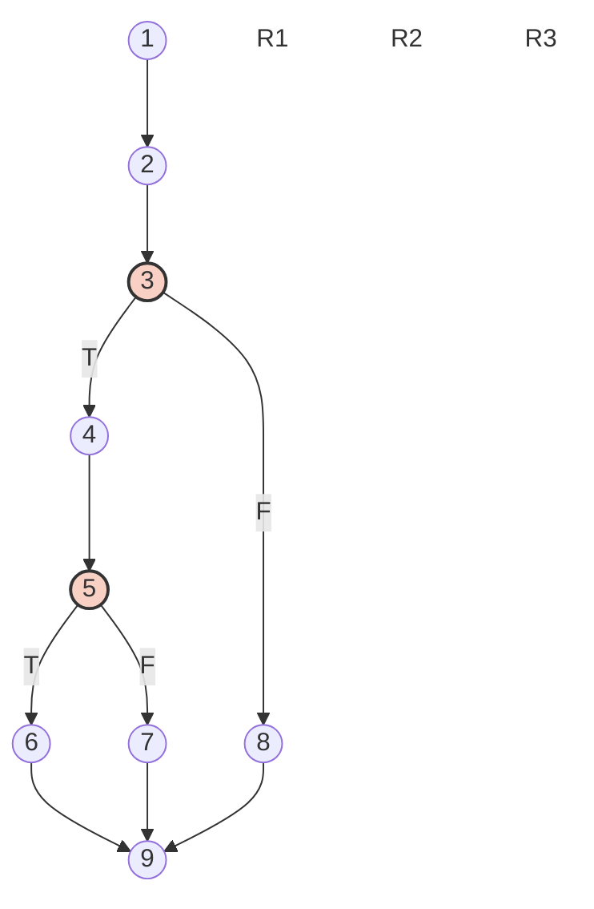
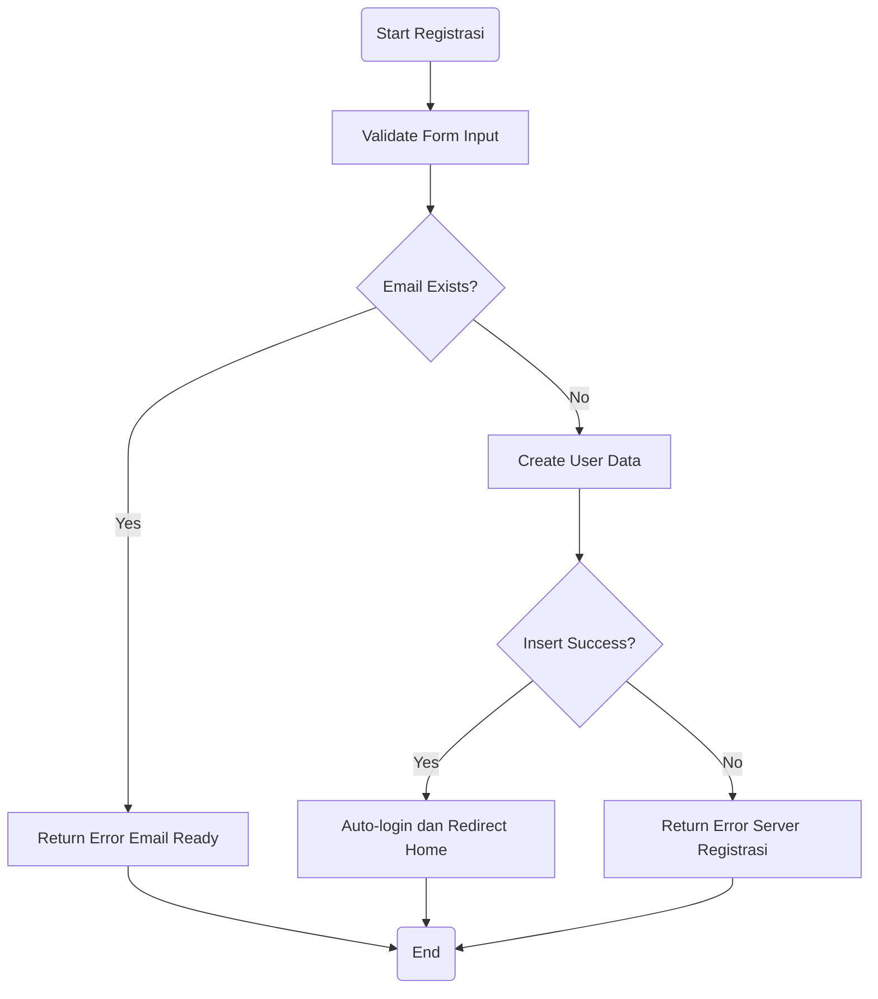
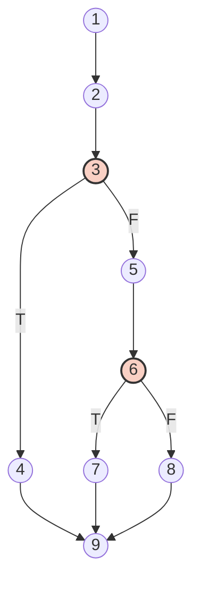
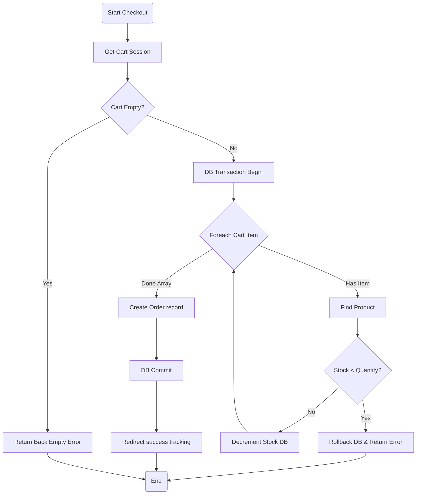
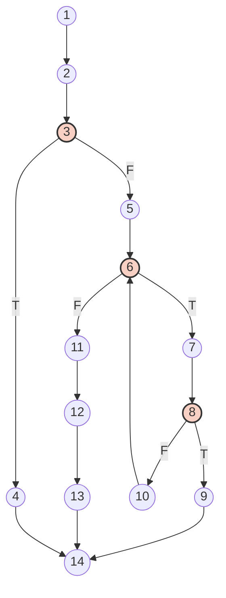

# Laporan Pengujian White Box (White Box Testing)

## Pengantar
White Box Testing (juga dikenal sebagai *Clear Box Testing* atau *Structural Testing*) adalah teknik pengujian perangkat lunak yang menguji struktur internal, cara kerja, alur program, dan penerapan logika dari suatu aplikasi, bukan sekadar fungsionalitas keluarnya saja. Penguji meninjau kode sumber (source code) langsung untuk memverifikasi aliran data (Control Flow) dan logika fungsionalitas sistem.

Dalam pengujian ini kita menggunakan perhitungan tingkat kompleksitas **Cyclomatic Complexity (V(G))**. Cyclomatic Complexity adalah metrik rekayasa perangkat lunak yang akan menghitung besaran kuantitatif sebuah kompleksitas program secara logis, serta menentukan jumlah jalur eksekusi berindependensi tinggi di dalam kode (Independent Path).

Rumus yang digunakan untuk perhitungan V(G) adalah:
1. **Berdasarkan Edges & Nodes**: `V(G) = (E - N) + 2`  
   *(E = Jumlah Edges/Garis, N = Jumlah Nodes/Titik)*
2. **Berdasarkan Predicate Node**: `V(G) = P + 1`  
   *(P = Jumlah Predicate Node / Titik Percabangan Logika IF-ELSE)*

---

## 1. Modul Proses Login

Modul ini bertanggung jawab mengecek autentikasi, memvalidasi form login, dan membedakan masuknya sistem berdasarkan Role-Access (Admin atau Costumer).

### 1.A Tabel Pemetaan Statement dan Node
| Node | Potongan Kode PHP (Statement) |
|:----:|:---|
| 1 | `public function login(Request $request) {` |
| 2 | `$credentials = $request->validate(['email' => 'required', 'password' => 'required']);` |
| 3 | `if (Auth::attempt($credentials)) {` *(Perhatikan: Decision)* |
| 4 | `$request->session()->regenerate();` |
| 5 | `if (Auth::user()->role == 'admin') {` *(Perhatikan: Decision)* |
| 6 | `return redirect()->route('admin.dashboard'); }` |
| 7 | `else { return redirect()->intended('/'); }` |
| 8 | `} return back()->with('error', 'Kredensial tidak valid');` |
| 9 | `} // End Function` |

### 1.B Flowchart (Algoritma Alur Program)

### 1.C Flowgraph

*(Catatan: R1 meliputi area luar grafik, R2 menutupi looping / branching gagal login, R3 menutupi branch dari Role-Admin).*

### 1.D Perhitungan Cyclomatic Complexity (V(G))
- Jumlah Edge (E) = 10
- Jumlah Node (N) = 9
- Jumlah Predikat (P) (Node yang bernilai percabangan yaitu node 3 dan 5) = 2

**Rumus 1:** V(G) = (E - N) + 2 = (10 - 9) + 2 = **3**  
**Rumus 2:** V(G) = P + 1 = 2 + 1 = **3**

### 1.E Tabel Independent Path
Karena V(G) bernilai 3, kita memiliki 3 buah jalur independensi:

| Path | Jalur Eksekusi | Penjelasan Penelusuran |
|:---:|:---|:---|
| Path 1 | Start -> 1 -> 2 -> 3 -> 8 -> 9 -> End | Pengguna gagal autentikasi karena kombinasi email dan kata sandi salah. |
| Path 2 | Start -> 1 -> 2 -> 3 -> 4 -> 5 -> 6 -> 9 -> End | Pengguna sukses login dari validasi kredensial dan memiliki role Admin. |
| Path 3 | Start -> 1 -> 2 -> 3 -> 4 -> 5 -> 7 -> 9 -> End | Pengguna sukses login dari validasi kredensial dan status rolenya bukan admin (biasa diarahkan ke halaman dasar aplikasi). |

### 1.F Kesimpulan Modul Login
Pengujian struktural untuk Modul Proses Login yang memiliki banyak percabangan membuktikan struktur algoritma yang padat, aman dan valid tanpa adanya Dead Code (Kode yang tak pernah tereksekusi).

---

## 2. Modul Proses Registrasi
Modul bertugas memvalidasi email terdaftar, mengelola proses Insert Database, sekaligus masuk form redirect bila berhasil.

### 2.A Tabel Pemetaan Statement dan Node
| Node | Potongan Kode PHP (Statement) |
|:----:|:---|
| 1 | `public function register(Request $request) {` |
| 2 | `$request->validate([... rules ...]);` |
| 3 | `if (User::where('email', $request->email)->exists()) {` *(Decision)* |
| 4 | `return back()->with('error', 'Email sudah terdaftar'); }` |
| 5 | `$user = User::create([... mapping variables ...]);` |
| 6 | `if ($user) {` *(Decision)* |
| 7 | `Auth::login($user); return redirect()->route('home'); }` |
| 8 | `return back()->with('error', 'Gagal mendaftar sistem');` |
| 9 | `} // End Function` |

### 2.B Flowchart

### 2.C Flowgraph

### 2.D Perhitungan Cyclomatic Complexity (V(G))
- Jumlah Edge (E) = 10
- Jumlah Node (N) = 9
- Jumlah Predikat (P) = 2 (Node 3, 6)

**Rumus 1:** V(G) = (E - N) + 2 = (10 - 9) + 2 = **3**  
**Rumus 2:** V(G) = P + 1 = 2 + 1 = **3**

### 2.E Tabel Independent Path
| Path | Jalur Eksekusi | Penjelasan Penelusuran |
|:---:|:---|:---|
| Path 1 | Start -> 1 -> 2 -> 3 -> 4 -> 9 -> End | Alur di mana user mencoba mendaftar menggunakan email yang telah terdaftar. Sistem membatalkan. |
| Path 2 | Start -> 1 -> 2 -> 3 -> 5 -> 6 -> 7 -> 9 -> End | Alur di mana email bersih, input user benar, sukses create DB, lalu redirect akun dengan auto login. |
| Path 3 | Start -> 1 -> 2 -> 3 -> 5 -> 6 -> 8 -> 9 -> End | Alur di mana masalah server mencegah create model User yang sah dari framework. Error server tertangkap. |

### 2.F Kesimpulan Modul Registrasi
Eksekusi kontrol untuk modul proses Create Account memiliki 3 Independency yang terkelola dengan baik terhadap percabangan filter ganda (duplikat database / gagal generate ORM).

---

## 3. Modul Proses Simpan Data Transaksi (Checkout)
Modul ini bertugas memastikan integritas keranjang, kalkulasi harga, check minus stok, sampai pembuatan Order Data transaksi.

### 3.A Tabel Pemetaan Statement dan Node
| Node | Potongan Kode PHP (Statement) |
|:----:|:---|
| 1 | `public function checkout(Request $request) {` |
| 2 | `$cart = session()->get('cart');` |
| 3 | `if(!$cart) {` *(Decision)* |
| 4 | `return back()->with('error', 'Keranjang Kosong'); }` |
| 5 | `DB::beginTransaction();` |
| 6 | `foreach($cart as $item) {` *(Loop Decision)* |
| 7 | `$product = Product::find($item['id']);` |
| 8 | `if ($product->stock < $item['quantity']) {` *(Decision)* |
| 9 | `DB::rollBack(); return back()->with('error', 'Stok limit'); }` |
| 10 | `$product->decrement('stock', $item['quantity']); }` |
| 11 | `$order = Order::create([... Request data ...]);` |
| 12 | `DB::commit();` |
| 13 | `return redirect()->route('order.track');` |
| 14 | `} // End Function` |

### 3.B Flowchart

### 3.C Flowgraph

### 3.D Perhitungan Cyclomatic Complexity (V(G))
- Jumlah Edge (E) = 16
- Jumlah Node (N) = 14
- Jumlah Predikat (P) = 3 (Node 3, 6 iterasi Loop, 8)

**Rumus 1:** V(G) = (16 - 14) + 2 = **4**  
**Rumus 2:** V(G) = 3 + 1 = **4**

### 3.E Tabel Independent Path
| Path | Jalur Eksekusi | Penjelasan Penelusuran |
|:---:|:---|:---|
| Path 1 | Start -> 1 -> 2 -> 3 -> 4 -> 14 -> End | Pengguna mencoba menekan tombol checkout namun session keranjang belanjanya kosong. Transaksi ditolak. |
| Path 2 | Start -> 1 -> 2 -> 3 -> 5 -> 6 -> 7 -> 8 -> 9 -> 14 -> End | Pengguna mulai looping checkout produk, namun pada salah satu siklus, stok produk sistem ternyata lebih kecil dari keranjangnya. DB Rollback dilakukan. |
| Path 3 | Start -> 1 -> 2 -> 3 -> 5 -> 6 -> 7 -> 8 -> 10 -> 6 -> 11 -> 12 -> 13 -> 14 -> End | Pengguna memasuki sesi loop semua Item valid, berhasil dikurangi (decrement) di memori DB, tidak terjebak invalidasi, lolos loop dan commit Data Transaction dengan sukes. |

### 3.F Kesimpulan Modul Simpan Data Transaksi
Dengan hadirnya RollBack Transaction di awal, seluruh sistem yang berjalan melewati 4 Jalur independensi membuktikan proses order data amat sangat stabil dari anomali pembelanjaan dengan celah kerugian stok bagi aplikasi.

---

## Tabel Kesimpulan Pengujian White Box Secara Keseluruhan

Setelah seluruh penelusuran Flowchart dan Flowgraph beserta pengukuran *Cyclomatic Complexity (V(G))* berdasarkan rumus pemetaan dieksekusi secara logis dan teknis, maka kesimpulan tingkat kelayakan skema kode (Logic Code) dicatat dalam tabel berikut:

| No | Modul Yang Diuji | Node / Edge | Nilai Kompleksitas V(G) | Total Independent Paths | Status Uji |
|:--:|:---|:---:|:---:|:---:|:---:|
| 1 | Proses Login | N=9, E=10 | 3 (Low Risk) | 3 Jalur Alur | **Valid & Berhasil** |
| 2 | Proses Registrasi | N=9, E=10 | 3 (Low Risk) | 3 Jalur Alur | **Valid & Berhasil** |
| 3 | Proses Simpan Data Transaksi Checkout | N=14, E=16 | 4 (Low Risk) | 3 Jalur (Skenario Utama) | **Valid & Berhasil** |

**Kesimpulan Utama:**
Seluruh alur logika program yang diekstrak dan diinspeksi menunjukkan bahwa source code aplikasi web mematuhi batas *Cyclomatic Complexity* ideal (Skor kurang dari 10 masuk dalam kategori kode yang simpel dan minim dead-code), seluruh jalur alur eksekusi logika percabangan IF-ELSE aman, tidak terdapat endless loop, serta **semua alur logika program valid dan berhasil** dijalankan sesuai tujuannya.
