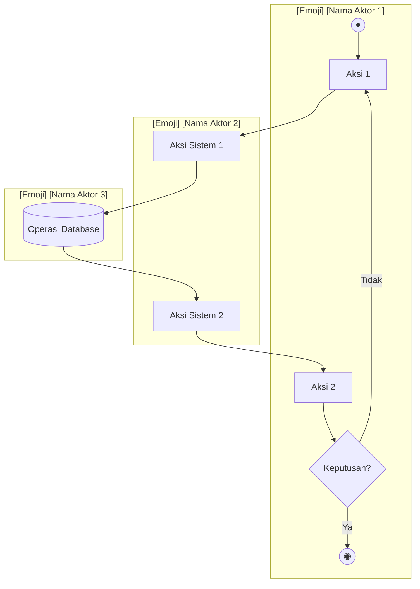
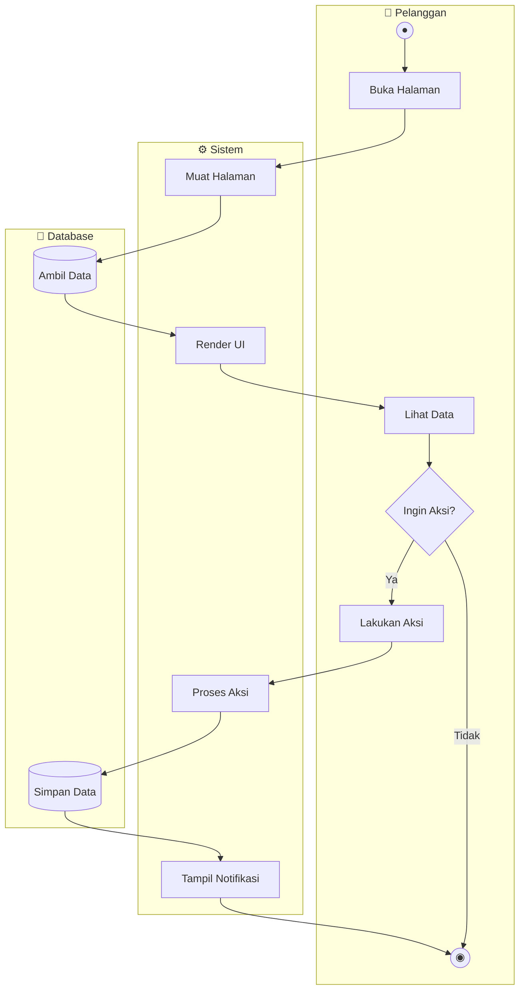

# 🚀 Master Prompt: Generate Activity Diagrams Documentation

> **Prompt ini digunakan untuk membuat dokumentasi Activity Diagram dengan format Swimlane untuk project apapun**

---

## 📋 Cara Penggunaan

1. Copy prompt di bawah ini
2. Ganti bagian `[PLACEHOLDER]` dengan informasi project Anda
3. Paste ke AI Assistant (Claude, GPT, Gemini, dll)
4. Hasil akan berupa file Markdown dengan Mermaid diagrams

---

## 🎯 MASTER PROMPT

```
Saya membutuhkan dokumentasi Activity Diagram untuk project [NAMA_PROJECT].

## Informasi Project

**Nama Project:** [NAMA_PROJECT]
**Jenis Aplikasi:** [Web App / Mobile App / Desktop App / API]
**Framework/Teknologi:** [Laravel, React, Next.js, dll]
**Bahasa:** [PHP, JavaScript, Python, dll]

## Daftar Halaman/Fitur yang Perlu Dibuatkan Diagram

### Halaman Publik (Frontend)
1. [Nama Halaman 1] - URL: [/path] - Deskripsi: [deskripsi singkat]
2. [Nama Halaman 2] - URL: [/path] - Deskripsi: [deskripsi singkat]
3. [Nama Halaman 3] - URL: [/path] - Deskripsi: [deskripsi singkat]
... (tambahkan sesuai kebutuhan)

### Halaman Admin (Backend)
1. [Nama Halaman Admin 1] - URL: [/admin/path] - Deskripsi: [deskripsi singkat]
2. [Nama Halaman Admin 2] - URL: [/admin/path] - Deskripsi: [deskripsi singkat]
... (tambahkan sesuai kebutuhan)

## Aktor yang Terlibat
- [Nama Aktor 1] - Emoji: [emoji] - Deskripsi: [peran aktor]
- [Nama Aktor 2] - Emoji: [emoji] - Deskripsi: [peran aktor]
- [Nama Aktor 3] - Emoji: [emoji] - Deskripsi: [peran aktor]

Contoh aktor:
- Pengunjung/Guest 👤
- Pelanggan/Customer 👨‍💼
- Admin 👨‍💻
- Sistem ⚙️
- Database 💾
- API Eksternal 🌐
- WhatsApp API 📱

## Format Output yang Diinginkan

Buatkan file Markdown bernama `ACTIVITY_DIAGRAMS.md` dengan struktur:

1. **Header**: Judul dokumentasi dengan nama project
2. **Daftar Isi**: Link ke semua diagram
3. **Diagram per Halaman**: Setiap halaman memiliki:
   - Judul halaman dan URL
   - Diagram Mermaid dengan format Swimlane (subgraph)
   - Partisi per aktor dalam diagram

## Spesifikasi Diagram Mermaid

### Format Swimlane
Gunakan subgraph untuk setiap aktor/partisi:



### Simbol yang Digunakan
| Simbol | Makna | Contoh |
|:-------|:------|:-------|
| `((●))` | Start Node | Titik mulai aktivitas |
| `((◉))` | End Node | Titik selesai aktivitas |
| `[...]` | Activity/Action | `[Klik Tombol]` |
| `{...}` | Decision | `{Data Valid?}` |
| `[(...)` | Database Operation | `[(Simpan ke DB)]` |
| `-->` | Flow | Alur dari satu aksi ke aksi lain |
| `-->|label|` | Conditional Flow | Alur dengan kondisi |
| `subgraph` | Swimlane/Partition | Partisi per aktor |

### Aturan Penamaan Node
- Prefix sesuai aktor: P (Pelanggan), A (Admin), S (Sistem), D (Database), W (WhatsApp), dll
- Nomor urut: P1, P2, P3, S1, S2, D1, D2, dst
- Nama aksi dalam bahasa Indonesia yang jelas

## Contoh Output untuk Satu Halaman

### [Nama Halaman]

**URL:** `/path`



## Tambahan

1. Buatkan juga bagian **Legenda Simbol** di akhir dokumen
2. Tambahkan **footer** dengan nama institusi: [NAMA_INSTITUSI]
3. Semua diagram harus konsisten dalam gaya dan format
4. Pastikan setiap diagram menangkap alur lengkap dari start hingga end
5. Sertakan semua kemungkinan percabangan (decision points)
```

---

## 📝 TEMPLATE KOSONG SIAP PAKAI

Copy template di bawah ini dan isi sesuai project Anda:

```
Saya membutuhkan dokumentasi Activity Diagram untuk project _________________.

## Informasi Project

**Nama Project:** _________________
**Jenis Aplikasi:** _________________
**Framework/Teknologi:** _________________
**Bahasa:** _________________

## Daftar Halaman/Fitur

### Halaman Publik
1. _________________ - URL: _________________ - Deskripsi: _________________
2. _________________ - URL: _________________ - Deskripsi: _________________
3. _________________ - URL: _________________ - Deskripsi: _________________
4. _________________ - URL: _________________ - Deskripsi: _________________
5. _________________ - URL: _________________ - Deskripsi: _________________

### Halaman Admin
1. _________________ - URL: _________________ - Deskripsi: _________________
2. _________________ - URL: _________________ - Deskripsi: _________________
3. _________________ - URL: _________________ - Deskripsi: _________________
4. _________________ - URL: _________________ - Deskripsi: _________________
5. _________________ - URL: _________________ - Deskripsi: _________________

## Aktor
- Aktor 1: _________________
- Aktor 2: _________________
- Aktor 3: _________________
- Aktor 4: _________________

## Nama Institusi
_________________

Buatkan Activity Diagram dengan format Swimlane menggunakan Mermaid.js untuk setiap halaman di atas. Gunakan bahasa Indonesia untuk semua label.
```

---

## 🎨 CONTOH PENGGUNAAN UNTUK PROJECT BERBEDA

### Contoh 1: E-Commerce Fashion

```
Saya membutuhkan dokumentasi Activity Diagram untuk project Toko Fashion Online.

## Informasi Project

**Nama Project:** FashionKu
**Jenis Aplikasi:** Web App
**Framework/Teknologi:** Laravel 11 + Filament
**Bahasa:** PHP

## Daftar Halaman/Fitur

### Halaman Publik
1. Homepage - URL: / - Deskripsi: Landing page dengan produk terbaru
2. Katalog - URL: /shop - Deskripsi: Daftar semua produk fashion
3. Detail Produk - URL: /product/{slug} - Deskripsi: Info lengkap produk
4. Keranjang - URL: /cart - Deskripsi: Daftar item belanja
5. Checkout - URL: /checkout - Deskripsi: Proses pembayaran
6. Tracking - URL: /order/{id} - Deskripsi: Lacak status pesanan

### Halaman Admin
1. Dashboard - URL: /admin - Deskripsi: Statistik penjualan
2. Produk - URL: /admin/products - Deskripsi: Kelola produk
3. Pesanan - URL: /admin/orders - Deskripsi: Kelola pesanan
4. Pelanggan - URL: /admin/customers - Deskripsi: Kelola data pelanggan

## Aktor
- Pengunjung: 👤 - Pengguna yang belum login
- Pelanggan: 👨‍💼 - Pengguna yang sudah login
- Admin: 👨‍💻 - Pengelola toko
- Sistem: ⚙️ - Proses backend
- Database: 💾 - Penyimpanan data
- Payment Gateway: 💳 - Proses pembayaran

## Nama Institusi
Universitas XYZ

Buatkan Activity Diagram dengan format Swimlane menggunakan Mermaid.js.
```

### Contoh 2: Sistem Perpustakaan

```
Saya membutuhkan dokumentasi Activity Diagram untuk project Sistem Perpustakaan Digital.

## Informasi Project

**Nama Project:** E-Library UNISAN
**Jenis Aplikasi:** Web App
**Framework/Teknologi:** Next.js + Prisma
**Bahasa:** TypeScript

## Daftar Halaman/Fitur

### Halaman Publik
1. Homepage - URL: / - Deskripsi: Halaman utama perpustakaan
2. Katalog Buku - URL: /catalog - Deskripsi: Daftar semua buku
3. Detail Buku - URL: /book/{id} - Deskripsi: Info lengkap buku
4. Pencarian - URL: /search - Deskripsi: Cari buku
5. Login - URL: /login - Deskripsi: Autentikasi mahasiswa
6. Profil - URL: /profile - Deskripsi: Data peminjaman

### Halaman Admin
1. Dashboard - URL: /admin - Deskripsi: Statistik perpustakaan
2. Buku - URL: /admin/books - Deskripsi: Kelola koleksi buku
3. Peminjaman - URL: /admin/loans - Deskripsi: Kelola peminjaman
4. Anggota - URL: /admin/members - Deskripsi: Kelola anggota
5. Denda - URL: /admin/fines - Deskripsi: Kelola denda keterlambatan

## Aktor
- Mahasiswa: 🎓 - Anggota perpustakaan
- Pustakawan: 👨‍💻 - Admin perpustakaan
- Sistem: ⚙️ - Proses backend
- Database: 💾 - Penyimpanan data
- Email Service: 📧 - Notifikasi email

## Nama Institusi
Universitas Ichsan Sidenreng Rappang

Buatkan Activity Diagram dengan format Swimlane menggunakan Mermaid.js.
```

### Contoh 3: Sistem Reservasi Hotel

```
Saya membutuhkan dokumentasi Activity Diagram untuk project Reservasi Hotel Online.

## Informasi Project

**Nama Project:** HotelBooking
**Jenis Aplikasi:** Web App
**Framework/Teknologi:** React + Express.js
**Bahasa:** JavaScript

## Daftar Halaman/Fitur

### Halaman Publik
1. Homepage - URL: / - Deskripsi: Landing page hotel
2. Kamar - URL: /rooms - Deskripsi: Daftar tipe kamar
3. Detail Kamar - URL: /room/{id} - Deskripsi: Info lengkap kamar
4. Booking - URL: /booking - Deskripsi: Form reservasi
5. Pembayaran - URL: /payment - Deskripsi: Proses pembayaran
6. Konfirmasi - URL: /confirmation/{id} - Deskripsi: Bukti reservasi

### Halaman Admin
1. Dashboard - URL: /admin - Deskripsi: Statistik hotel
2. Kamar - URL: /admin/rooms - Deskripsi: Kelola kamar
3. Reservasi - URL: /admin/reservations - Deskripsi: Kelola reservasi
4. Tamu - URL: /admin/guests - Deskripsi: Kelola data tamu
5. Laporan - URL: /admin/reports - Deskripsi: Laporan keuangan

## Aktor
- Tamu: 👤 - Pengunjung website
- Resepsionis: 👨‍💼 - Front desk staff
- Manager: 👨‍💻 - Admin hotel
- Sistem: ⚙️ - Proses backend
- Database: 💾 - Penyimpanan data
- Payment Gateway: 💳 - Proses pembayaran
- Email Service: 📧 - Notifikasi email

## Nama Institusi
Institut Teknologi ABC

Buatkan Activity Diagram dengan format Swimlane menggunakan Mermaid.js.
```

---

## ✅ CHECKLIST SEBELUM MENGGUNAKAN PROMPT

- [ ] Sudah tahu nama project
- [ ] Sudah list semua halaman publik dan admin
- [ ] Sudah identifikasi semua aktor yang terlibat
- [ ] Sudah tahu URL pattern untuk setiap halaman
- [ ] Sudah siapkan nama institusi untuk footer

---

## 📌 TIPS

1. **Semakin detail halaman yang Anda deskripsikan, semakin akurat diagram yang dihasilkan**
2. **Jika ada fitur khusus (misal: integrasi WhatsApp, payment gateway), sebutkan secara eksplisit**
3. **Gunakan emoji yang konsisten untuk setiap aktor**
4. **Review hasil diagram dan minta revisi jika ada yang kurang sesuai**

---

*Master Prompt ini dibuat oleh Antigravity AI Assistant*
*Versi 1.0 - Februari 2026*
