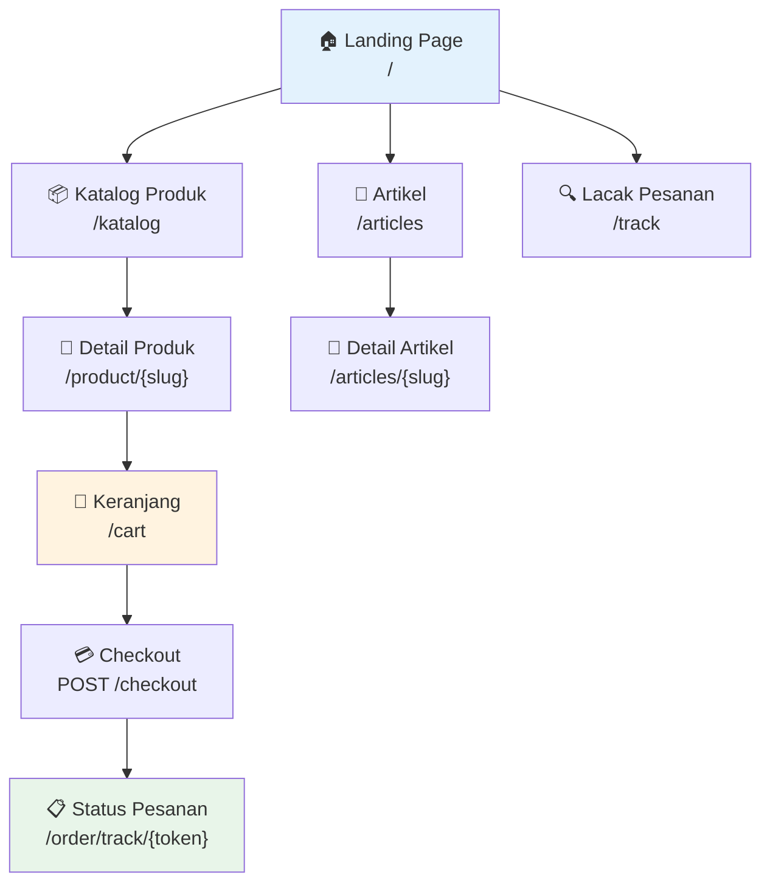
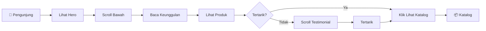
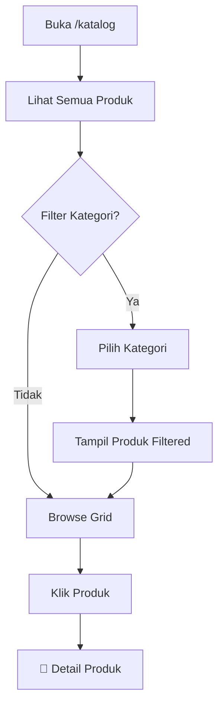
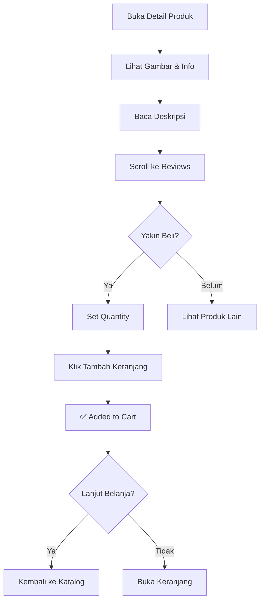
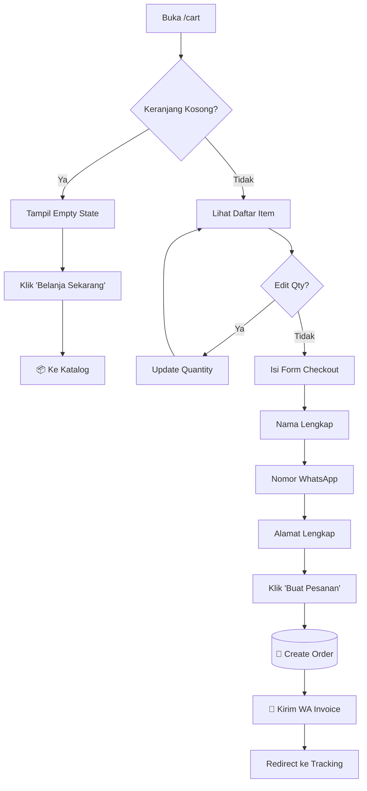
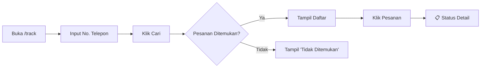
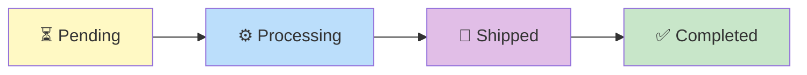
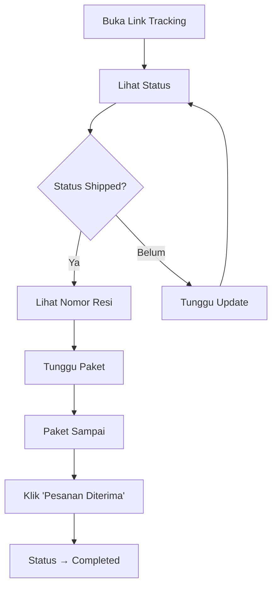

# 🌐 Panduan Halaman Publik

> **Platform E-Commerce Ivo Karya** - Dokumentasi Lengkap Halaman yang Diakses Pelanggan

---

## 📋 Peta Situs (Sitemap)



---

## Ringkasan Halaman Publik

| No | Halaman | URL | Deskripsi Singkat |
|:--:|:--------|:----|:------------------|
| 1 | Landing Page | `/` | Hero section, fitur unggulan, CTA |
| 2 | Katalog Produk | `/katalog` | Grid produk dengan filter kategori |
| 3 | Detail Produk | `/product/{slug}` | Info lengkap, ulasan, add to cart |
| 4 | Keranjang | `/cart` | Daftar item, form checkout |
| 5 | Lacak Pesanan | `/track` | Form input nomor pesanan |
| 6 | Status Pesanan | `/order/track/{token}` | Timeline status pengiriman |
| 7 | Artikel | `/articles` | Daftar artikel/blog |
| 8 | Detail Artikel | `/articles/{slug}` | Konten artikel lengkap |

---

## 1. 🏠 Landing Page

**URL**: `/`

### A. Tujuan Halaman

Landing page adalah wajah utama website yang dirancang untuk memberikan **kesan premium** dan menceritakan kualitas produk Abon Ikan Ivo Karya. Menggunakan konsep **scroll-driven storytelling** yang terinspirasi dari website peluncuran produk Apple.

### B. Komponen UI

| Komponen | Deskripsi | Interaktivitas |
|:---------|:----------|:---------------|
| **Hero Section** | Banner besar dengan tagline dan CTA | Static dengan parallax effect |
| **Feature Highlights** | 3-4 card keunggulan produk | Hover animation |
| **Product Showcase** | Preview produk unggulan | Scroll-triggered animation |
| **About Section** | Cerita tentang Ivo Karya | Glassmorphism cards |
| **Testimonials** | Slider ulasan pelanggan | Auto-slide carousel |
| **CTA Section** | Call-to-action ke katalog | Hover effect button |
| **Footer** | Info kontak, social links, **hidden admin link** | Static |

### C. Data yang Ditampilkan

- **Source**: Produk unggulan dari database (is_active = true)
- **Update Frequency**: Real-time dari database

### D. User Journey



---

## 2. 📦 Katalog Produk

**URL**: `/katalog`

### A. Tujuan Halaman

Menampilkan semua produk dalam **grid layout** yang responsif. Pelanggan dapat memfilter berdasarkan kategori dan melihat harga serta stok secara langsung.

### B. Komponen UI

| Komponen | Deskripsi | Interaktivitas |
|:---------|:----------|:---------------|
| **Page Header** | Judul "Katalog Produk" | Static |
| **Category Filter** | Tombol filter per kategori | Click to filter |
| **Product Grid** | Card produk 3-4 kolom | Hover shadow effect |
| **Product Card** | Gambar, nama, harga, tombol | Klik → Detail produk |
| **Stock Badge** | Indikator stok | Dynamic (merah jika habis) |
| **Pagination** | Navigasi halaman | Click to paginate |

### C. Data yang Ditampilkan

```
GET /katalog
Response: products (paginated), categories
```

### D. User Journey



---

## 3. 📄 Detail Produk

**URL**: `/product/{slug}`

### A. Tujuan Halaman

Halaman ini menyajikan **informasi lengkap** tentang satu produk, termasuk deskripsi, harga, berat, dan **ulasan dari pelanggan lain**. Dilengkapi tombol "Tambah ke Keranjang".

### B. Komponen UI

| Komponen | Deskripsi | Interaktivitas |
|:---------|:----------|:---------------|
| **Product Image** | Gambar produk besar | Zoom on hover |
| **Product Info** | Nama, harga, berat, stok | Static |
| **Description** | Deskripsi lengkap produk | Static |
| **Quantity Selector** | Input jumlah beli | +/- buttons |
| **Add to Cart Button** | Tombol tambah keranjang | Click → add to session |
| **Reviews Section** | Daftar ulasan (approved only) | Static list |
| **Review Form** | Form tulis ulasan | Submit form |
| **Related Products** | Produk lain dari kategori sama | Click → navigate |

### C. Data yang Ditampilkan

```
GET /product/{slug}
Response: product, product.reviews (is_approved), related_products
```

### D. User Journey



---

## 4. 🛒 Keranjang & Checkout

**URL**: `/cart`

### A. Tujuan Halaman

Halaman keranjang menampilkan **semua item** yang akan dibeli dan **form checkout** untuk mengisi data pengiriman. Setelah submit, pesanan dibuat dan invoice dikirim via WhatsApp.

### B. Komponen UI

| Komponen | Deskripsi | Interaktivitas |
|:---------|:----------|:---------------|
| **Cart Items Table** | Daftar produk, qty, subtotal | Edit qty / Remove |
| **Total Section** | Total harga & berat | Auto-calculate |
| **Checkout Form** | Nama, telepon, alamat | Input fields |
| **Payment Info** | Instruksi transfer bank | Static (dari Settings) |
| **Submit Button** | "Buat Pesanan" | POST /checkout |
| **Empty State** | Pesan jika keranjang kosong | Link ke katalog |

### C. Data yang Ditampilkan

- **Cart Items**: Session-based storage
- **Settings**: Rekening bank dari database

### D. User Journey



---

## 5. 🔍 Lacak Pesanan

**URL**: `/track`

### A. Tujuan Halaman

Form sederhana untuk pelanggan **memasukkan nomor telepon** dan mencari pesanan mereka. Sistem akan menampilkan daftar pesanan yang terkait.

### B. Komponen UI

| Komponen | Deskripsi | Interaktivitas |
|:---------|:----------|:---------------|
| **Search Form** | Input nomor telepon | Submit search |
| **Search Button** | "Cari Pesanan" | Click to search |
| **Results List** | Daftar pesanan ditemukan | Click to view detail |
| **No Results** | Pesan jika tidak ditemukan | Static |

### C. User Journey



---

## 6. 📋 Status Pesanan (Order Tracking)

**URL**: `/order/track/{token}`

### A. Tujuan Halaman

Menampilkan **timeline status pesanan** secara visual. Pelanggan bisa melihat progres dari pending hingga completed, termasuk nomor resi jika sudah dikirim.

### B. Komponen UI

| Komponen | Deskripsi | Interaktivitas |
|:---------|:----------|:---------------|
| **Order Header** | ID pesanan, tanggal | Static |
| **Status Timeline** | Visual timeline dengan icons | Dynamic based on status |
| **Order Details** | Daftar item, total, alamat | Static |
| **Tracking Number** | Nomor resi (jika shipped) | Copy button |
| **Confirm Button** | "Pesanan Diterima" | Click (jika shipped) |
| **Invoice Link** | Link download invoice | Click to download |

### C. Status Timeline



### D. User Journey



---

## 7. 📰 Artikel

**URL**: `/articles`

### A. Tujuan Halaman

Menampilkan **daftar artikel/blog** yang dipublikasikan oleh admin. Konten bisa berupa tips, berita UMKM, atau cerita di balik produk.

### B. Komponen UI

| Komponen | Deskripsi | Interaktivitas |
|:---------|:----------|:---------------|
| **Article Grid** | Card artikel dengan thumbnail | Click → detail |
| **Article Card** | Gambar, judul, excerpt | Hover effect |
| **Date Badge** | Tanggal publikasi | Static |

---

## 8. 📖 Detail Artikel

**URL**: `/articles/{slug}`

### A. Tujuan Halaman

Menampilkan **konten lengkap artikel** dengan formatting yang proper.

### B. Komponen UI

| Komponen | Deskripsi | Interaktivitas |
|:---------|:----------|:---------------|
| **Featured Image** | Gambar utama artikel | Static |
| **Title & Meta** | Judul, tanggal, author | Static |
| **Article Content** | Body artikel (rich text) | Static |
| **Share Buttons** | Tombol share sosmed | Click to share |
| **Related Articles** | Artikel lain | Click → navigate |

---

## 📱 Responsivitas

Semua halaman publik didesain **mobile-first** dengan breakpoints:

| Device | Breakpoint | Layout |
|:-------|:-----------|:-------|
| Mobile | < 640px | 1 kolom, menu hamburger |
| Tablet | 640px - 1024px | 2 kolom, sidebar collapsed |
| Desktop | > 1024px | 3-4 kolom, full navigation |

---

## 🔍 SEO Metadata

| Halaman | Title Tag | Meta Description |
|:--------|:----------|:-----------------|
| Landing | "Ivo Karya - Abon Ikan Premium UMKM Sidrap" | "Produk abon ikan dan sapi berkualitas..." |
| Katalog | "Katalog Produk - Ivo Karya" | "Lihat koleksi lengkap produk..." |
| Detail | "{nama_produk} - Ivo Karya" | Dynamic dari deskripsi |
| Artikel | "{judul_artikel} - Blog Ivo Karya" | Excerpt artikel |

---

## ♿ Aksesibilitas

- **ARIA Labels**: Semua tombol dan link memiliki label deskriptif
- **Keyboard Navigation**: Tab order yang logis
- **Color Contrast**: Minimum ratio 4.5:1 untuk teks
- **Alt Text**: Semua gambar memiliki alt text deskriptif

---

<p align="center">
  <em>Dokumentasi ini dibuat untuk keperluan akademis (Tugas Akhir/Skripsi)</em>
</p>
