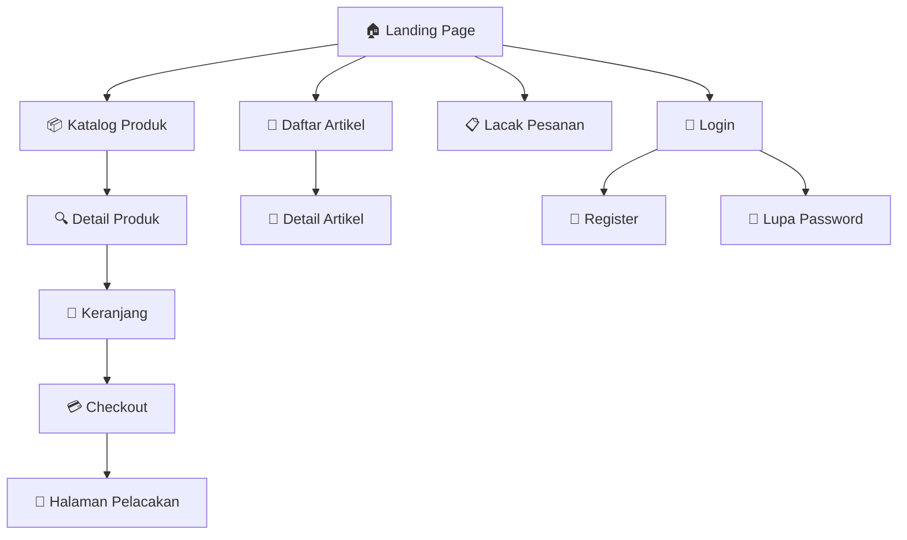
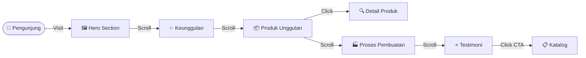
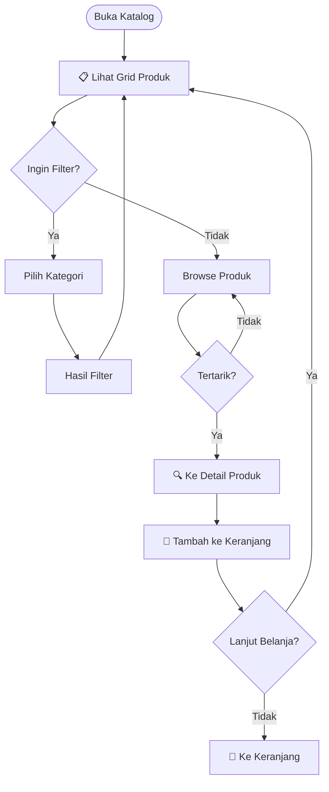
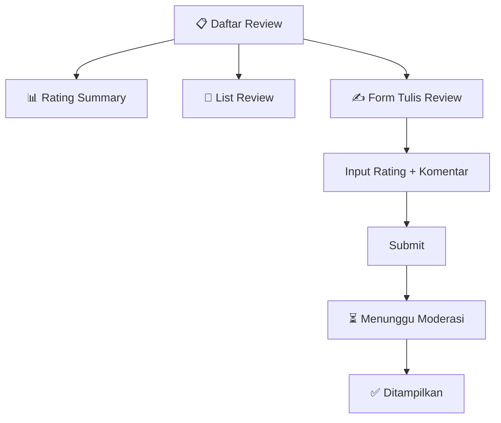
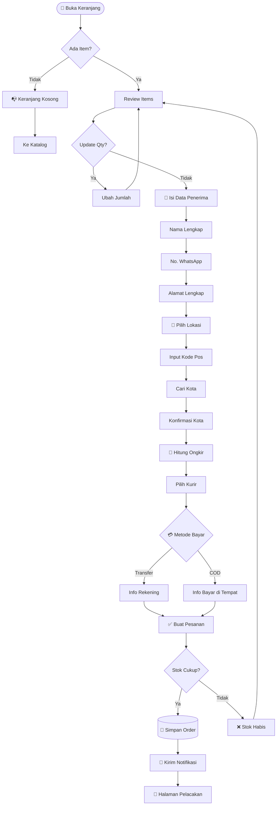
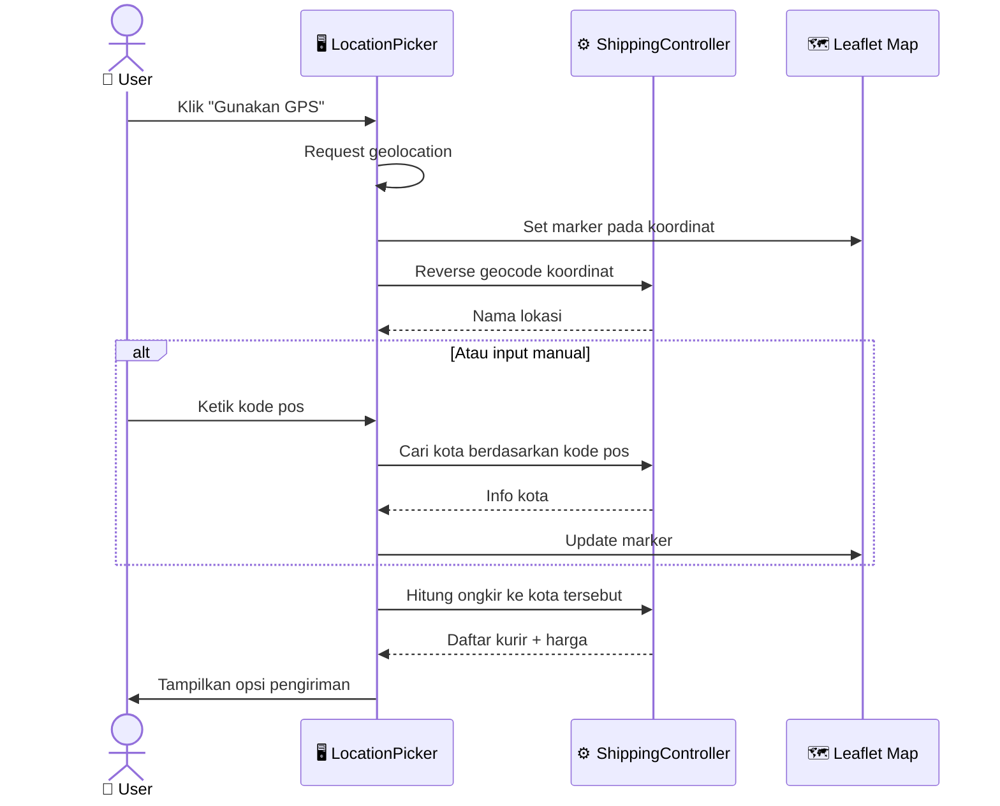
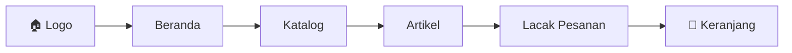
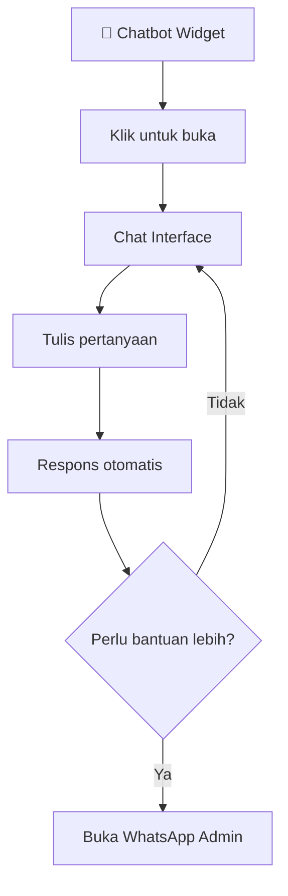

# 🌐 Panduan Halaman Publik Ivo Karya

> **Dokumentasi Lengkap Halaman Website untuk Pengunjung**

---

## 📋 Daftar Isi

1. [Peta Situs](#peta-situs)
2. [Landing Page](#1--landing-page)
3. [Katalog Produk](#2--katalog-produk)
4. [Detail Produk](#3--detail-produk)
5. [Keranjang & Checkout](#4--keranjang--checkout)
6. [Pelacakan Pesanan](#5--pelacakan-pesanan)
7. [Daftar Artikel](#6--daftar-artikel)
8. [Detail Artikel](#7--detail-artikel)
9. [Autentikasi](#8--autentikasi)
10. [Komponen Global](#komponen-global)

---

## Peta Situs



### Ringkasan Halaman

| No | Halaman | URL | Deskripsi |
|:---|:--------|:----|:----------|
| 1 | Landing Page | `/` | Homepage dengan hero, fitur, produk unggulan |
| 2 | Katalog | `/katalog` | Daftar semua produk dengan filter |
| 3 | Detail Produk | `/product/{slug}` | Info lengkap produk + review |
| 4 | Keranjang | `/cart` | Daftar item + checkout form |
| 5 | Pelacakan | `/track` & `/order/track/{token}` | Cari dan lacak pesanan |
| 6 | Daftar Artikel | `/articles` | Blog/artikel list |
| 7 | Detail Artikel | `/articles/{slug}` | Konten artikel lengkap |
| 8 | Login | `/login` | Autentikasi user |

---

## 1. 🏠 Landing Page

**URL**: `/`

### A. Tujuan Halaman
Landing page adalah halaman pertama yang dilihat pengunjung. Dirancang dengan konsep **Apple-style storytelling** untuk menyampaikan nilai brand Ivo Karya sebagai produsen abon premium dari Sidenreng Rappang.

### B. Komponen UI

| Komponen | Deskripsi | Interaktivitas |
|:---------|:----------|:---------------|
| **Hero Section** | Banner besar dengan tagline dan CTA | Animasi fade-in |
| **Value Proposition** | 3 keunggulan utama (Halal, Tanpa Pengawet, Berkualitas) | Static cards |
| **Produk Unggulan** | 3-4 produk terlaris | Hover effect, click to detail |
| **Proses Pembuatan** | Timeline proses produksi | Scroll-triggered animation |
| **Testimoni** | Review pelanggan | Carousel/slider |
| **CTA Section** | Call-to-action ke katalog | Button animasi |
| **Footer** | Link navigasi, sosmed, copyright | Static |

### C. Data yang Ditampilkan

| Data | Sumber | Update Frequency |
|:-----|:-------|:-----------------|
| Produk Unggulan | `products` table (featured=true) | Real-time |
| Review Terbaru | `reviews` table (is_approved=true) | Real-time |
| Info Toko | `settings` table | On change |

### D. User Journey



---

## 2. 📦 Katalog Produk

**URL**: `/katalog`

### A. Tujuan Halaman
Menampilkan seluruh produk yang tersedia dengan kemampuan filter dan sort untuk memudahkan pelanggan menemukan produk yang diinginkan.

### B. Komponen UI

| Komponen | Deskripsi | Interaktivitas |
|:---------|:----------|:---------------|
| **Page Header** | Judul "Katalog Produk" | Static |
| **Category Filter** | Dropdown filter kategori | Dynamic filter |
| **Sort Options** | Sort by harga, nama, terbaru | Dynamic sort |
| **Product Grid** | Grid 3-4 kolom produk | Responsive |
| **Product Card** | Gambar, nama, harga, badge | Hover scale, click |
| **Empty State** | Pesan jika tidak ada produk | Static |
| **Pagination** | Navigasi halaman | Click navigation |

### C. Product Card Elements

```
┌─────────────────────────────┐
│  [📷 Gambar Produk]        │
│  ┌─────┐                    │
│  │SALE │ (jika ada diskon)  │
│  └─────┘                    │
├─────────────────────────────┤
│  Nama Produk                │
│  ⭐⭐⭐⭐⭐ (rating)         │
│  Rp 75.000  Rp 100.000     │
│  [🛒 Tambah] [👁️ Detail]   │
└─────────────────────────────┘
```

### D. User Journey



---

## 3. 🔍 Detail Produk

**URL**: `/product/{slug}`

### A. Tujuan Halaman
Menampilkan informasi lengkap produk termasuk deskripsi, harga, stok, dan review pelanggan untuk membantu keputusan pembelian.

### B. Komponen UI

| Komponen | Deskripsi | Interaktivitas |
|:---------|:----------|:---------------|
| **Product Image** | Gambar produk besar | Zoom on hover |
| **Product Info** | Nama, kategori, rating | Static |
| **Price Section** | Harga, diskon, savings | Static |
| **Stock Status** | Indikator ketersediaan | Dynamic |
| **Add to Cart** | Button + quantity selector | Click action |
| **Description** | Deskripsi lengkap | Expandable |
| **Reviews Section** | Review pelanggan + form | Interactive |
| **Related Products** | Produk terkait | Click navigation |

### C. Review Section



### D. SEO Metadata

| Meta Tag | Value |
|:---------|:------|
| `title` | `{product.meta_title}` atau `{product.name} - Ivo Karya` |
| `description` | `{product.meta_description}` atau deskripsi singkat |
| `og:image` | `{product.image}` |
| `og:type` | `product` |

---

## 4. 🛒 Keranjang & Checkout

**URL**: `/cart`

### A. Tujuan Halaman
Menampilkan item yang ditambahkan ke keranjang dan menyediakan form checkout lengkap untuk menyelesaikan pembelian.

### B. Komponen UI

| Komponen | Deskripsi | Interaktivitas |
|:---------|:----------|:---------------|
| **Cart Items** | Daftar item dengan qty | Update/Remove |
| **Order Summary** | Subtotal, ongkir, total | Dynamic calculation |
| **Customer Form** | Nama, telepon, alamat | Input validation |
| **Location Picker** | Peta + input kode pos | Interactive map |
| **Shipping Options** | Pilihan kurir + harga | Radio selection |
| **Payment Method** | Transfer / COD | Radio selection |
| **Checkout Button** | Submit pesanan | Click action |

### C. Checkout Flow



### D. Location Picker Feature



---

## 5. 📍 Pelacakan Pesanan

**URL**: `/track` dan `/order/track/{token}`

### A. Tujuan Halaman
Memungkinkan pelanggan melacak status pesanan mereka menggunakan nomor pesanan atau WhatsApp.

### B. Komponen UI - Halaman Pencarian (`/track`)

| Komponen | Deskripsi | Interaktivitas |
|:---------|:----------|:---------------|
| **Search Form** | Input nomor pesanan/WA | Submit search |
| **Recent Orders** | Jika sudah pernah order | Click to view |
| **Help Text** | Cara menemukan nomor pesanan | Static |

### C. Komponen UI - Halaman Detail (`/order/track/{token}`)

| Komponen | Deskripsi | Interaktivitas |
|:---------|:----------|:---------------|
| **Order Header** | Nomor pesanan, tanggal | Static |
| **Status Timeline** | Visual progress | Static |
| **Payment Info** | Instruksi bayar (Transfer/COD) | Static |
| **Order Items** | Daftar produk dipesan | Static |
| **Shipping Info** | Alamat, kurir, resi | Copy resi |
| **Confirm Button** | Konfirmasi terima (jika shipped) | Click action |

### D. Status Timeline

```
 [✅] Pesanan Dibuat
      │
 [✅] Pembayaran Dikonfirmasi
      │
 [✅] Diproses
      │
 [🔵] Dikirim (No. Resi: JNE123456)
      │
 [ ] Diterima
```

### E. Payment Instructions

**Transfer Bank:**
```
┌──────────────────────────────────────┐
│ 💳 Instruksi Pembayaran              │
├──────────────────────────────────────┤
│ Silakan transfer ke rekening:        │
│                                      │
│ BCA: 1234-5678-90 a.n Ivo Karya     │
│ BRI: 0987-6543-21 a.n Ivo Karya     │
│                                      │
│ Total: Rp 150.000                    │
│                                      │
│ Kirim bukti transfer ke WA Admin    │
└──────────────────────────────────────┘
```

**COD:**
```
┌──────────────────────────────────────┐
│ 💰 Pembayaran COD                    │
├──────────────────────────────────────┤
│ Siapkan uang tunai sebesar:          │
│                                      │
│ Rp 165.000                           │
│ (Termasuk ongkir)                    │
│                                      │
│ Bayar saat kurir mengantar pesanan  │
└──────────────────────────────────────┘
```

---

## 6. 📰 Daftar Artikel

**URL**: `/articles`

### A. Tujuan Halaman
Menampilkan artikel blog untuk edukasi pelanggan tentang produk, tips memasak, dan informasi UMKM.

### B. Komponen UI

| Komponen | Deskripsi | Interaktivitas |
|:---------|:----------|:---------------|
| **Page Header** | Judul "Artikel & Tips" | Static |
| **Article Grid** | Grid artikel dengan thumbnail | Click navigation |
| **Article Card** | Gambar, judul, excerpt | Hover effect |
| **Pagination** | Navigasi halaman | Click |

### C. Article Card

```
┌─────────────────────────────┐
│  [📷 Featured Image]        │
├─────────────────────────────┤
│  📅 1 Februari 2026         │
│  Judul Artikel yang Menarik │
│  Cuplikan singkat artikel   │
│  yang memberikan gambaran...│
│                             │
│  [Baca Selengkapnya →]      │
└─────────────────────────────┘
```

---

## 7. 📖 Detail Artikel

**URL**: `/articles/{slug}`

### A. Tujuan Halaman
Menampilkan konten artikel lengkap dengan format yang nyaman dibaca.

### B. Komponen UI

| Komponen | Deskripsi | Interaktivitas |
|:---------|:----------|:---------------|
| **Article Header** | Judul, tanggal publish | Static |
| **Featured Image** | Gambar utama | Static |
| **Article Content** | Konten HTML lengkap | Static |
| **Share Buttons** | Share ke sosmed | Click action |
| **Related Articles** | Artikel terkait | Click navigation |
| **Back Link** | Kembali ke daftar | Click navigation |

---

## 8. 🔐 Autentikasi

### A. Halaman Login `/login`

| Komponen | Deskripsi |
|:---------|:----------|
| Email Input | Field email dengan validasi |
| Password Input | Field password dengan toggle show |
| Remember Me | Checkbox untuk sesi panjang |
| Login Button | Submit login |
| Register Link | Link ke halaman register |
| Forgot Password | Link reset password |

### B. Halaman Register `/register`

| Komponen | Deskripsi |
|:---------|:----------|
| Name Input | Nama lengkap |
| Email Input | Email dengan validasi unique |
| Password Input | Minimum 8 karakter |
| Confirm Password | Harus sama dengan password |
| Register Button | Submit registrasi |
| Login Link | Link ke halaman login |

### C. Halaman Lupa Password `/forgot-password`

| Komponen | Deskripsi |
|:---------|:----------|
| Email Input | Email akun yang terdaftar |
| Send Link Button | Kirim link reset |
| Back to Login | Link kembali ke login |

---

## Komponen Global

### A. Navigasi Publik



### B. Footer

| Section | Konten |
|:--------|:-------|
| **Brand** | Logo, tagline, deskripsi singkat |
| **Links** | Beranda, Katalog, Artikel, Lacak |
| **Contact** | WhatsApp, Instagram, Facebook |
| **Copyright** | © 2026 UMKM Ivo Karya |
| **Admin Link** | Link tersembunyi ke `/admin` |

### C. Chatbot Widget

Widget bantuan interaktif yang muncul di pojok kanan bawah semua halaman.

**Fitur:**
- Quick questions (FAQ)
- Link ke WhatsApp admin
- Panduan navigasi



---

## 📱 Responsivitas

### Breakpoints

| Device | Width | Grid Columns |
|:-------|:------|:-------------|
| Mobile | < 640px | 1 kolom |
| Tablet | 640px - 1024px | 2 kolom |
| Desktop | > 1024px | 3-4 kolom |

### Mobile Optimizations

1. ✅ Hamburger menu untuk navigasi
2. ✅ Touch-friendly buttons (min 44px)
3. ✅ Lazy loading images
4. ✅ Simplified checkout form
5. ✅ Fixed bottom cart button

---

## 🔍 SEO Implementation

### Meta Tags per Halaman

| Halaman | Title Pattern | Description |
|:--------|:--------------|:------------|
| Home | Ivo Karya - Abon Ikan & Sapi Khas Sidrap | Deskripsi brand |
| Katalog | Katalog Produk - Ivo Karya | Daftar produk abon |
| Produk | {nama} - Ivo Karya | Deskripsi produk |
| Artikel | {judul} - Blog Ivo Karya | Cuplikan artikel |

### Structured Data

- Product schema untuk halaman produk
- Article schema untuk halaman artikel
- LocalBusiness schema untuk homepage

---

*Dokumentasi ini dibuat untuk keperluan Tugas Akhir/Skripsi*  
**Universitas Ichsan Sidenreng Rappang** © 2026
