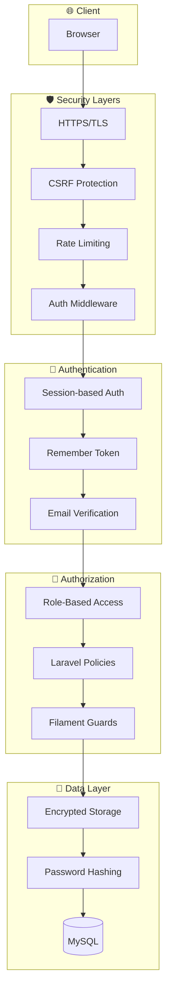
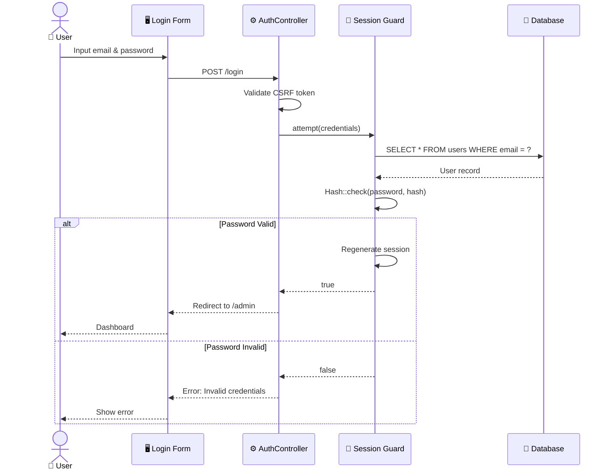

# 🔒 Dokumentasi Keamanan Sistem Ivo Karya

> **Implementasi Security Measures dan Role-Based Access Control**

---

## 📋 Daftar Isi

1. [Arsitektur Keamanan](#1-arsitektur-keamanan)
2. [Autentikasi](#2-autentikasi-authentication)
3. [Otorisasi](#3-otorisasi-authorization)
4. [Validasi Input](#4-validasi-input)
5. [Proteksi Ancaman Umum](#5-proteksi-ancaman-umum)
6. [Konfigurasi CORS](#6-konfigurasi-cors)
7. [Enkripsi Data](#7-enkripsi-data)
8. [Rekomendasi Produksi](#8-rekomendasi-produksi)

---

## 1. Arsitektur Keamanan

### 1.1 Overview



### 1.2 Security Layers Summary

| Layer | Komponen | Fungsi |
|:------|:---------|:-------|
| **Transport** | HTTPS/TLS | Enkripsi data in transit |
| **Request** | CSRF Token | Mencegah cross-site request forgery |
| **Access** | Rate Limiting | Mencegah brute force attack |
| **Session** | Laravel Session | Manajemen sesi pengguna |
| **Identity** | Authentication | Verifikasi identitas pengguna |
| **Permission** | Authorization | Kontrol akses berbasis role |
| **Storage** | Encryption | Enkripsi data sensitif |

---

## 2. Autentikasi (Authentication)

### 2.1 Mekanisme Login

**Endpoint:** `POST /login`



### 2.2 Session Configuration

| Parameter | Nilai | Penjelasan |
|:----------|:------|:-----------|
| **Driver** | `database` | Session disimpan di MySQL |
| **Lifetime** | 120 menit | Durasi sesi aktif |
| **Expire on Close** | false | Sesi bertahan setelah browser ditutup |
| **Encrypt** | false | Session data tidak dienkripsi (opsional) |
| **Same Site** | `lax` | Cookie policy |
| **HTTP Only** | true | Cookie tidak bisa diakses JavaScript |
| **Secure** | false (dev) | Harus true di production (HTTPS) |

### 2.3 Password Policy

```php
// config/auth.php
'passwords' => [
    'users' => [
        'provider' => 'users',
        'table' => 'password_reset_tokens',
        'expire' => 60, // Token berlaku 60 menit
        'throttle' => 60, // Rate limit: 1 request per 60 detik
    ],
],
```

**Hashing Algorithm:**
- **Method**: Bcrypt
- **Rounds**: 12 (configurable via `BCRYPT_ROUNDS`)
- **Auto Rehash**: Enabled

```php
// Proses hashing password
$hashedPassword = Hash::make($plainPassword);

// Verifikasi password
$isValid = Hash::check($plainPassword, $hashedPassword);
```

### 2.4 Remember Me Token

| Aspek | Implementasi |
|:------|:-------------|
| **Storage** | `remember_token` column di `users` table |
| **Duration** | 30 hari (default) |
| **Token Length** | 60 karakter random |
| **Regeneration** | Setiap login baru |

---

## 3. Otorisasi (Authorization)

### 3.1 Definisi Role

| Role | Kode | Deskripsi | Akses |
|:-----|:-----|:----------|:------|
| **Super Admin** | `super_admin` | Akses penuh ke semua fitur | All |
| **Admin** | `admin` | Akses ke manajemen konten | Limited |
| **User** | `user` | Akses ke halaman publik | Public only |
| **Guest** | - | Pengunjung tanpa login | Public only |

### 3.2 Matriks Akses (RBAC Matrix)

| Kemampuan | Super Admin | Admin | User | Guest |
|:----------|:-----------:|:-----:|:----:|:-----:|
| **Akses Admin Panel** | ✅ | ✅ | ❌ | ❌ |
| **Kelola Produk** | ✅ | ✅ | ❌ | ❌ |
| **Kelola Kategori** | ✅ | ✅ | ❌ | ❌ |
| **Kelola Pesanan** | ✅ | ✅ | ❌ | ❌ |
| **Kelola Artikel** | ✅ | ✅ | ❌ | ❌ |
| **Moderasi Review** | ✅ | ✅ | ❌ | ❌ |
| **Kelola Settings** | ✅ | ❌ | ❌ | ❌ |
| **Kelola Users** | ✅ | ❌ | ❌ | ❌ |
| **Lihat Katalog** | ✅ | ✅ | ✅ | ✅ |
| **Tambah Keranjang** | ✅ | ✅ | ✅ | ✅ |
| **Checkout** | ✅ | ✅ | ✅ | ✅ |
| **Tulis Review** | ✅ | ✅ | ✅ | ✅ |
| **Lacak Pesanan** | ✅ | ✅ | ✅ | ✅ |

### 3.3 Middleware Configuration

```php
// app/Http/Kernel.php (Laravel 10) atau bootstrap/app.php (Laravel 11)

// Route Middleware
->withMiddleware(function (Middleware $middleware) {
    $middleware->alias([
        'auth' => \App\Http\Middleware\Authenticate::class,
        'verified' => \App\Http\Middleware\EnsureEmailIsVerified::class,
        'guest' => \App\Http\Middleware\RedirectIfAuthenticated::class,
    ]);
})
```

### 3.4 Protected Routes

| Route Pattern | Required Middleware | Deskripsi |
|:--------------|:-------------------|:----------|
| `/admin/*` | `auth`, Filament Guard | Admin panel |
| `/profile` | `auth` | Halaman profil user |
| `/dashboard` | `auth` | Redirect ke admin |
| `/` - `/track` | - | Halaman publik |

### 3.5 Filament Authorization

```php
// app/Providers/Filament/AdminPanelProvider.php

public function panel(Panel $panel): Panel
{
    return $panel
        ->default()
        ->id('admin')
        ->path('admin')
        ->login()
        ->authGuard('web')
        // Hanya user dengan email tertentu bisa akses
        ->authMiddleware([
            Authenticate::class,
        ]);
}
```

---

## 4. Validasi Input

### 4.1 Frontend Validation (Alpine.js)

```javascript
// Contoh validasi form checkout
x-data="{
    name: '',
    phone: '',
    validate() {
        if (this.name.length < 3) {
            alert('Nama minimal 3 karakter');
            return false;
        }
        if (!/^[0-9]{10,13}$/.test(this.phone)) {
            alert('Nomor telepon tidak valid');
            return false;
        }
        return true;
    }
}"
```

### 4.2 Backend Validation (Laravel)

```php
// CartController.php
$validated = $request->validate([
    'customer_name' => 'required|string|max:255',
    'customer_phone' => 'required|string|regex:/^[0-9]{10,13}$/',
    'customer_address' => 'required|string|max:500',
    'postal_code' => 'required|string|size:5',
    'payment_method' => 'required|in:transfer,cod',
    'courier' => 'required|string',
    'courier_service' => 'required|string',
    'shipping_cost' => 'required|numeric|min:0',
]);
```

### 4.3 Validation Rules Summary

| Field | Rules | Deskripsi |
|:------|:------|:----------|
| `email` | `required\|email\|unique:users` | Format email valid, unik |
| `password` | `required\|min:8\|confirmed` | Min 8 karakter, konfirmasi |
| `phone` | `regex:/^[0-9]{10,13}$/` | Hanya angka, 10-13 digit |
| `postal_code` | `size:5` | Tepat 5 karakter |
| `rating` | `integer\|between:1,5` | Rating 1-5 |
| `price` | `numeric\|min:0` | Angka positif |
| `image` | `image\|mimes:jpg,png\|max:2048` | File gambar, max 2MB |

---

## 5. Proteksi Ancaman Umum

### 5.1 Security Measures Matrix

| Ancaman | Proteksi | Implementasi |
|:--------|:---------|:-------------|
| **SQL Injection** | ORM & Prepared Statements | Eloquent ORM |
| **XSS** | Output Escaping | Blade `{{ }}` auto-escape |
| **CSRF** | Token Verification | `@csrf` directive |
| **Session Hijacking** | Secure Cookies | `HTTP_ONLY`, `SAME_SITE` |
| **Brute Force** | Rate Limiting | `RateLimiter` facade |
| **Mass Assignment** | `$fillable` whitelist | Model protection |
| **File Upload** | Type & Size Validation | Validation rules |

### 5.2 CSRF Protection

```php
// Setiap form harus include CSRF token
<form method="POST" action="/checkout">
    @csrf
    <!-- form fields -->
</form>

// Untuk AJAX requests
<meta name="csrf-token" content="{{ csrf_token() }}">

// JavaScript
axios.defaults.headers.common['X-CSRF-TOKEN'] = 
    document.querySelector('meta[name="csrf-token"]').content;
```

### 5.3 Rate Limiting

```php
// routes/web.php
Route::post('/login', [AuthController::class, 'login'])
    ->middleware('throttle:5,1'); // 5 attempts per minute

// API Routes
Route::prefix('api/shipping')->middleware('throttle:30,1')->group(function () {
    // Shipping API routes
});
```

### 5.4 Mass Assignment Protection

```php
// app/Models/Order.php
class Order extends Model
{
    // Hanya field ini yang bisa di-mass assign
    protected $fillable = [
        'customer_name',
        'customer_phone',
        'customer_address',
        'items_json',
        'total_amount',
        'shipping_cost',
        'status',
        'payment_method',
        'courier',
        // ...
    ];
    
    // Field ini TIDAK boleh di-mass assign
    protected $guarded = [
        'id',
        'tracking_token', // Generated by system
    ];
}
```

---

## 6. Konfigurasi CORS

### 6.1 CORS Settings

```php
// config/cors.php
return [
    'paths' => ['api/*'],
    
    'allowed_methods' => ['GET', 'POST', 'PUT', 'DELETE', 'OPTIONS'],
    
    'allowed_origins' => ['*'], // Restrict in production
    
    'allowed_origins_patterns' => [],
    
    'allowed_headers' => ['Content-Type', 'X-Requested-With', 'X-CSRF-TOKEN'],
    
    'exposed_headers' => [],
    
    'max_age' => 0,
    
    'supports_credentials' => false,
];
```

### 6.2 Production Recommendations

```php
// Production CORS config
'allowed_origins' => [
    'https://ivokarya.com',
    'https://www.ivokarya.com',
],
```

---

## 7. Enkripsi Data

### 7.1 Encryption Key

```env
# .env
APP_KEY=base64:nujGYDIFpz7eSWj91vfyra/ckvwK+xyJIKIanr+/u3k=
```

**⚠️ PENTING:**
- Jangan pernah commit `APP_KEY` ke Git
- Generate key baru untuk setiap environment
- Backup key dengan aman

### 7.2 Data yang Dienkripsi

| Data | Method | Storage |
|:-----|:-------|:--------|
| **Passwords** | Bcrypt hash | `users.password` |
| **Remember Tokens** | Random 60 char | `users.remember_token` |
| **Session Data** | Laravel Encryption | `sessions` table |
| **Password Reset Tokens** | Hash (SHA-256) | `password_reset_tokens` |

### 7.3 Sensitive Data Handling

```php
// Jangan pernah log data sensitif
Log::info('User login', [
    'email' => $user->email,
    // 'password' => $password, // ❌ NEVER LOG PASSWORDS
]);

// Mask sensitive data di responses
return response()->json([
    'user' => [
        'email' => $user->email,
        'password' => '********', // Masked
    ]
]);
```

---

## 8. Rekomendasi Produksi

### 8.1 Checklist Keamanan Production

| Item | Status | Aksi |
|:-----|:------:|:-----|
| **HTTPS Enforcement** | ⬜ | Enable SSL certificate |
| **Secure Cookies** | ⬜ | Set `SESSION_SECURE_COOKIE=true` |
| **Debug Mode Off** | ⬜ | Set `APP_DEBUG=false` |
| **Error Hiding** | ⬜ | Custom error pages |
| **Rate Limiting** | ⬜ | Configure per endpoint |
| **CORS Restriction** | ⬜ | Whitelist only allowed origins |
| **Database Encryption** | ⬜ | Enable MySQL TLS |
| **Backup Strategy** | ⬜ | Daily automated backups |
| **Monitoring** | ⬜ | Setup error tracking (Sentry) |
| **WAF** | ⬜ | Consider Cloudflare |

### 8.2 Environment Variables Production

```env
# Production .env
APP_ENV=production
APP_DEBUG=false
APP_URL=https://ivokarya.com

SESSION_DRIVER=database
SESSION_LIFETIME=120
SESSION_SECURE_COOKIE=true
SESSION_SAME_SITE=strict

# Force HTTPS
FORCE_HTTPS=true
```

### 8.3 Server Hardening

```nginx
# Nginx configuration
server {
    listen 443 ssl http2;
    server_name ivokarya.com;
    
    # SSL Configuration
    ssl_certificate /path/to/cert.pem;
    ssl_certificate_key /path/to/key.pem;
    ssl_protocols TLSv1.2 TLSv1.3;
    
    # Security Headers
    add_header X-Frame-Options "SAMEORIGIN";
    add_header X-Content-Type-Options "nosniff";
    add_header X-XSS-Protection "1; mode=block";
    add_header Strict-Transport-Security "max-age=31536000; includeSubDomains";
    
    # Hide PHP version
    fastcgi_hide_header X-Powered-By;
}
```

### 8.4 Security Headers Summary

| Header | Value | Purpose |
|:-------|:------|:--------|
| `X-Frame-Options` | SAMEORIGIN | Prevent clickjacking |
| `X-Content-Type-Options` | nosniff | Prevent MIME sniffing |
| `X-XSS-Protection` | 1; mode=block | Enable XSS filter |
| `Strict-Transport-Security` | max-age=31536000 | Force HTTPS |
| `Content-Security-Policy` | default-src 'self' | Control resource loading |

---

## 📝 Security Audit Log

### Logging Events

| Event | Log Level | Data Logged |
|:------|:----------|:------------|
| Failed Login | WARNING | IP, email, timestamp |
| Successful Login | INFO | User ID, timestamp |
| Password Change | INFO | User ID, timestamp |
| Admin Action | INFO | User, action, resource |
| Checkout | INFO | Order ID, amount |
| API Error | ERROR | Endpoint, error message |

```php
// Contoh logging
Log::warning('Failed login attempt', [
    'ip' => request()->ip(),
    'email' => $email,
    'user_agent' => request()->userAgent(),
]);
```

---

*Dokumentasi ini dibuat untuk keperluan Tugas Akhir/Skripsi*  
**Universitas Ichsan Sidenreng Rappang** © 2026
