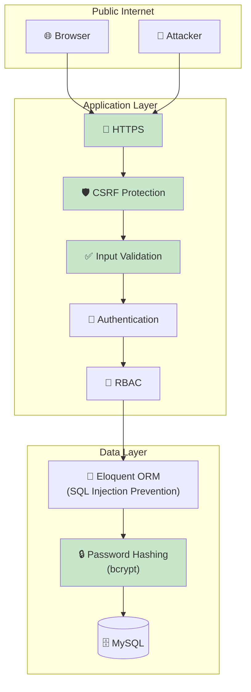
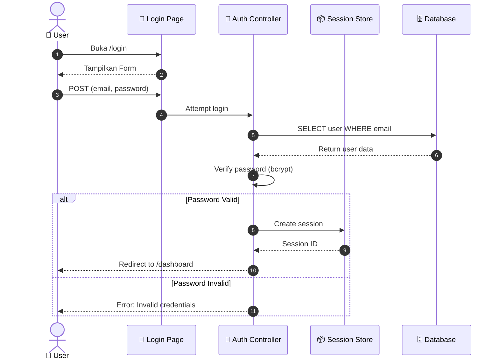
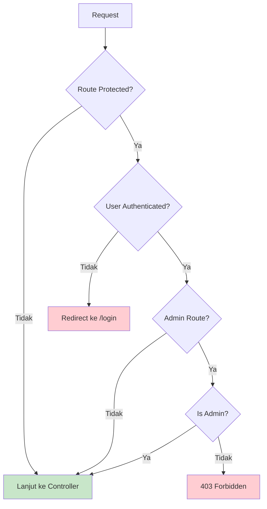
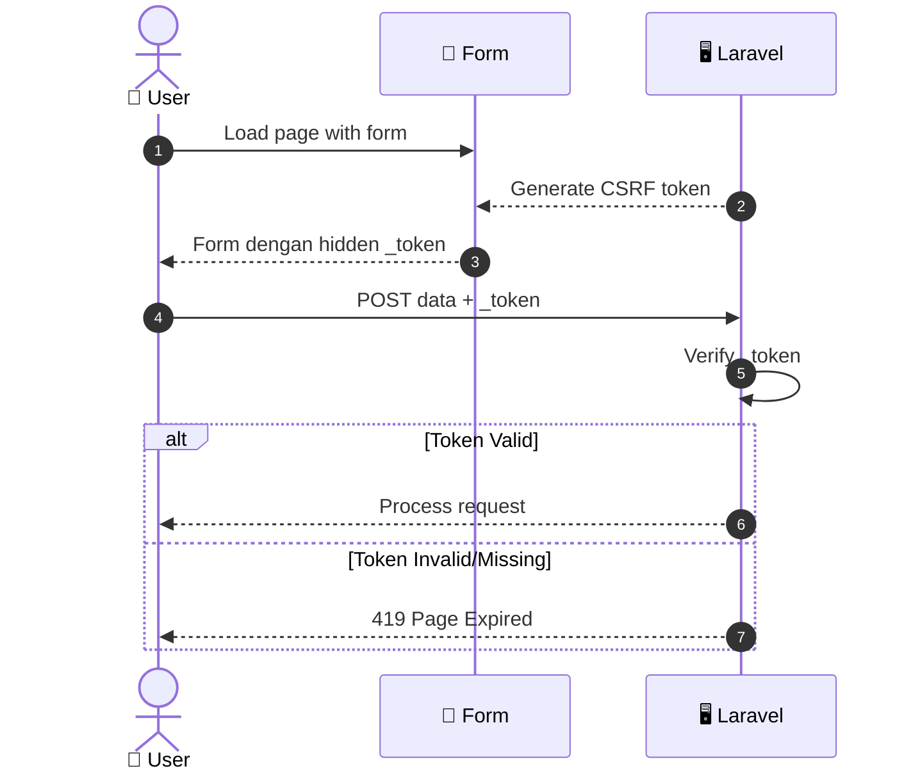
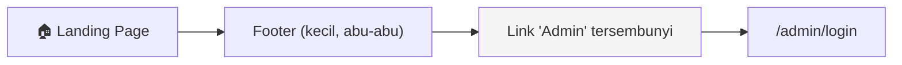
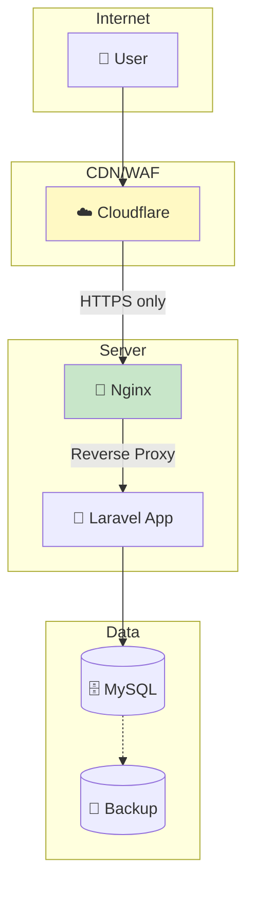

# 🔒 Dokumentasi Keamanan Sistem

> **Platform E-Commerce Ivo Karya** - Arsitektur Keamanan dan Role-Based Access Control

---

## 📋 Daftar Isi

1. [Arsitektur Keamanan](#1--arsitektur-keamanan)
2. [Autentikasi](#2--autentikasi)
3. [Otorisasi (RBAC)](#3--otorisasi-rbac)
4. [Validasi Input](#4--validasi-input)
5. [Proteksi Umum](#5--proteksi-umum)
6. [Konfigurasi CORS](#6--konfigurasi-cors)
7. [Rekomendasi Produksi](#7--rekomendasi-produksi)

---

## 1. 🏰 Arsitektur Keamanan



---

## 2. 🔑 Autentikasi

### A. Mekanisme Login

Sistem menggunakan **Laravel Breeze** untuk autentikasi standar dengan tambahan **Filament Shield** untuk admin panel.



### B. Konfigurasi Password

| Parameter | Nilai | Penjelasan |
|:----------|:------|:-----------|
| **Hashing Algorithm** | bcrypt | Industri standard, slow hash |
| **Salt** | Auto-generated | Built-in di bcrypt |
| **Minimum Length** | 8 karakter | Validasi Laravel default |
| **Complexity** | Tidak dipaksakan | Bisa ditambah via custom rule |

### C. Session Management

| Parameter | Nilai | Penjelasan |
|:----------|:------|:-----------|
| **Driver** | file | Default, bisa diubah ke redis |
| **Lifetime** | 120 menit | Sesuai config/session.php |
| **Encrypt** | true | Session data dienkripsi |
| **HTTP Only** | true | Cookie tidak bisa diakses JS |
| **Same Site** | lax | Proteksi CSRF tambahan |

---

## 3. 👥 Otorisasi (RBAC)

### A. Definisi Role

| Role | Kode | Deskripsi | Akses Panel |
|:-----|:-----|:----------|:------------|
| **Administrator** | admin | Pengelola sistem penuh | Filament Dashboard |
| **Customer** | user | Pelanggan terdaftar | Area member (jika ada) |
| **Guest** | - | Pengunjung tanpa akun | Halaman publik saja |

### B. Matriks Akses (RBAC Matrix)

| Kemampuan | Admin | Customer | Guest |
|:----------|:-----:|:--------:|:-----:|
| **Lihat Landing Page** | ✅ | ✅ | ✅ |
| **Lihat Katalog** | ✅ | ✅ | ✅ |
| **Lihat Detail Produk** | ✅ | ✅ | ✅ |
| **Tambah ke Keranjang** | ✅ | ✅ | ✅ |
| **Checkout Pesanan** | ✅ | ✅ | ✅ |
| **Lacak Pesanan** | ✅ | ✅ | ✅ |
| **Tulis Review** | ✅ | ✅ | ✅ |
| **Konfirmasi Penerimaan** | ✅ | ✅ | ✅ |
| **Akses Filament Dashboard** | ✅ | ❌ | ❌ |
| **Kelola Produk** | ✅ | ❌ | ❌ |
| **Kelola Pesanan** | ✅ | ❌ | ❌ |
| **Kelola Kategori** | ✅ | ❌ | ❌ |
| **Kelola Artikel** | ✅ | ❌ | ❌ |
| **Moderasi Review** | ✅ | ❌ | ❌ |
| **Ubah Settings** | ✅ | ❌ | ❌ |

### C. Protected Routes

| Route | Middleware | Required Role |
|:------|:-----------|:--------------|
| `/admin/*` | `auth`, `verified`, `filament` | Admin |
| `/profile` | `auth` | Authenticated User |
| `/dashboard` | `auth` | Authenticated User |
| `/cart`, `/checkout` | - | Public (Guest OK) |
| `/track/*` | - | Public |

### D. Implementasi Middleware



---

## 4. ✅ Validasi Input

### A. Frontend Validation

| Library | Penggunaan |
|:--------|:-----------|
| **HTML5 Validation** | Required, type, pattern attributes |
| **Alpine.js** | Real-time validation feedback |

### B. Backend Validation

Laravel menggunakan **Form Request** atau inline validation:

```php
// Contoh: Checkout Validation
$validated = $request->validate([
    'customer_name' => 'required|string|max:255',
    'customer_phone' => 'required|string|max:20',
    'customer_address' => 'required|string|max:1000',
]);
```

| Field | Rules | Alasan |
|:------|:------|:-------|
| **customer_name** | required, string, max:255 | Mencegah field kosong & overflow |
| **customer_phone** | required, string, max:20 | Format nomor telepon |
| **customer_address** | required, string, max:1000 | Alamat lengkap tapi dibatasi |
| **rating** (review) | required, integer, min:1, max:5 | Hanya 1-5 bintang |
| **comment** (review) | nullable, string, max:1000 | Optional tapi dibatasi |

---

## 5. 🛡️ Proteksi Umum

### A. Daftar Proteksi

| Ancaman | Proteksi | Implementasi |
|:--------|:---------|:-------------|
| **SQL Injection** | Eloquent ORM | Query builder, not raw SQL |
| **XSS** | Blade escaping | `{{ }}` auto-escapes output |
| **CSRF** | Token verification | `@csrf` directive |
| **Mass Assignment** | `$fillable` / `$guarded` | Model protection |
| **Password Exposure** | bcrypt hashing | `Hash::make()` |
| **Session Hijacking** | Secure cookies | HTTP-only, Same-Site |

### B. CSRF Protection



### C. Hidden Admin Entry

Sebagai langkah keamanan tambahan, link login admin **tidak ditampilkan di navbar**. Admin harus:

1. Mengakses langsung `/admin/login`
2. Atau mengklik link tersembunyi di footer



---

## 6. 🌐 Konfigurasi CORS

Karena ini adalah **monolithic application** (frontend dan backend dalam 1 domain), CORS tidak menjadi concern utama. Namun jika menggunakan API external:

| Setting | Nilai | File |
|:--------|:------|:-----|
| **Allowed Origins** | `*` atau domain spesifik | `config/cors.php` |
| **Allowed Methods** | `GET, POST, PUT, DELETE` | `config/cors.php` |
| **Allowed Headers** | `Content-Type, Authorization` | `config/cors.php` |
| **Supports Credentials** | `true` | `config/cors.php` |

---

## 7. 🚀 Rekomendasi Produksi

### A. Checklist Keamanan Produksi

| Item | Status | Cara Implementasi |
|:-----|:------:|:------------------|
| **Force HTTPS** | 🔲 | Aktifkan di `.env`: `APP_URL=https://...` |
| **Debug Mode Off** | 🔲 | Set `APP_DEBUG=false` |
| **Strong App Key** | 🔲 | Generate dengan `php artisan key:generate` |
| **Database Credentials** | 🔲 | Gunakan strong password |
| **Rate Limiting** | 🔲 | Implementasi di routes/api.php |
| **WAF** | 🔲 | Gunakan Cloudflare atau AWS WAF |
| **Regular Updates** | 🔲 | Update Laravel dan dependencies |
| **Backup Routine** | 🔲 | Backup database harian |
| **Log Monitoring** | 🔲 | Setup Sentry atau Logtail |

### B. Environment Variables Sensitive

| Variable | Contoh | Catatan |
|:---------|:-------|:--------|
| `APP_KEY` | `base64:...` | **JANGAN** commit ke Git |
| `DB_PASSWORD` | `str0ngP@ss` | Gunakan password manager |
| `FONNTE_API_KEY` | `abc123...` | API key WhatsApp |
| `MAIL_PASSWORD` | `smtp_pass` | Jika menggunakan email |

### C. Diagram Deployment Aman



---

## 📊 Ringkasan Keamanan

| Aspek | Implementasi | Level |
|:------|:-------------|:-----:|
| **Autentikasi** | Laravel Breeze + bcrypt | ⭐⭐⭐⭐ |
| **Otorisasi** | Middleware + Filament Guard | ⭐⭐⭐⭐ |
| **Validasi Input** | Form Request + HTML5 | ⭐⭐⭐⭐ |
| **SQL Injection** | Eloquent ORM | ⭐⭐⭐⭐⭐ |
| **XSS** | Blade auto-escape | ⭐⭐⭐⭐⭐ |
| **CSRF** | Token verification | ⭐⭐⭐⭐⭐ |
| **Session Security** | Encrypted, HTTP-only | ⭐⭐⭐⭐ |

---

<p align="center">
  <em>Dokumentasi ini dibuat untuk keperluan akademis (Tugas Akhir/Skripsi)</em>
</p>
