# Dokumentasi Sequence Diagram — WEBSITE IVO KARYA

> **Proyek**: Website Toko Online Ivo Karya  
> **Framework**: Laravel 10 + Filament v3 + Livewire 3  
> **Tanggal Dibuat**: 2 April 2026

---

## Daftar Halaman

| No | Halaman | Route |
|----|---------|-------|
| 1 | [Beranda](#1-beranda-homepage) | `GET /` |
| 2 | [Katalog Produk](#2-katalog-produk) | `GET /katalog` |
| 3 | [Detail Produk](#3-detail-produk) | `GET /product/{slug}` |
| 4 | [Keranjang Belanja](#4-keranjang-belanja) | `GET /cart` |
| 5 | [Checkout & Pembayaran](#5-checkout--pembayaran) | `POST /checkout` |
| 6 | [Lacak Pesanan](#6-lacak-pesanan-token) | `GET /order/track/{token}` |
| 7 | [Cari Pesanan](#7-cari-pesanan) | `GET /track` |
| 8 | [Daftar Artikel](#8-daftar-artikel) | `GET /articles` |
| 9 | [Detail Artikel](#9-detail-artikel) | `GET /articles/{slug}` |
| 10 | [Login](#10-login) | `GET /login` |
| 11 | [Register](#11-register) | `GET /register` |
| 12 | [Lupa / Reset Password](#12-lupa--reset-password) | `GET /forgot-password` |
| 13 | [Profil Pengguna](#13-profil-pengguna) | `GET /profile` |
| 14 | [Admin — Manajemen Produk](#14-admin--manajemen-produk) | `GET /admin/products` |
| 15 | [Admin — Manajemen Pesanan](#15-admin--manajemen-pesanan) | `GET /admin/orders` |
| 16 | [Admin — Manajemen Ulasan](#16-admin--manajemen-ulasan) | `GET /admin/reviews` |
| 17 | [API Shipping](#17-api-shipping) | `/api/shipping/*` |

---

## 1. Beranda (Homepage)

### Penjelasan

Halaman beranda merupakan antarmuka pertama yang ditampilkan kepada pengguna saat mengakses sistem website toko online Ivo Karya. Berdasarkan alur yang dirancang, ketika pengguna mengirimkan permintaan HTTP GET ke rute `/`, sistem akan meneruskan permintaan tersebut kepada `HomeController` melalui mekanisme routing Laravel. Controller kemudian melakukan kueri terhadap tabel produk menggunakan `Product Model`. Apabila pengguna menyertakan parameter `category` pada URL, sistem akan menerapkan kondisi filter menggunakan metode `whereHas` untuk menyaring produk berdasarkan slug kategori yang dimaksud.

Selain data produk, controller juga mengambil tiga artikel terbaru dari tabel artikel melalui `Article Model` dengan memanfaatkan metode `latest()->take(3)->get()`. Seluruh data yang diperoleh kemudian dikirimkan ke berkas tampilan `welcome.blade.php` sebagai variabel yang dapat diakses oleh templat. Hasil akhirnya adalah halaman beranda yang menampilkan daftar produk beserta cuplikan artikel terbaru secara dinamis kepada pengguna.

### Sequence Diagram

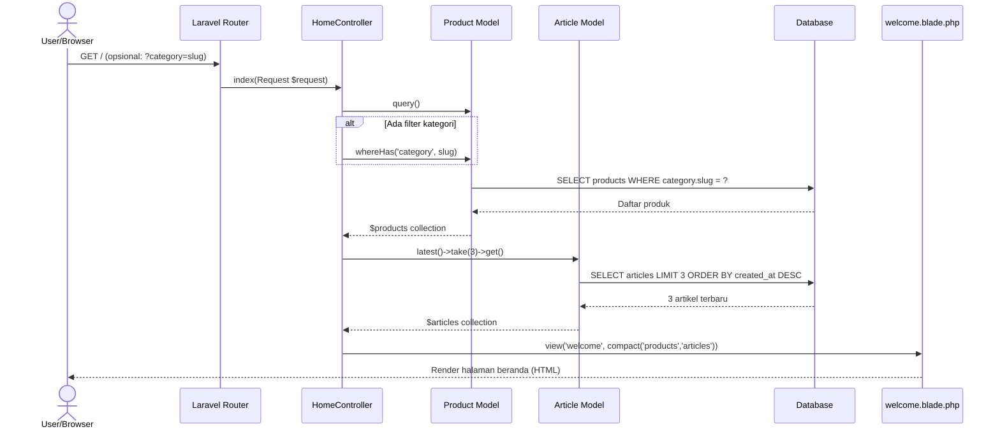

---

## 2. Katalog Produk

### Penjelasan

Halaman katalog produk berfungsi sebagai pusat penjelajahan seluruh produk yang tersedia di toko. Berbeda dengan halaman beranda, halaman ini dirancang secara khusus untuk menampilkan keseluruhan data produk disertai informasi kategorinya melalui mekanisme eager loading (`with('category')`). Ketika pengguna mengakses rute `/katalog`, permintaan diteruskan ke metode `catalog()` pada `HomeController`.

Controller selanjutnya membangun kueri produk dengan memuat relasi kategori secara bersamaan guna menghindari masalah N+1 query. Apabila pengguna menyertakan parameter `category` pada URL, sistem menerapkan filter berbasis slug kategori. Di samping data produk, sistem juga mengambil seluruh data kategori yang tersedia melalui `Category Model` untuk keperluan antarmuka filter yang ditampilkan kepada pengguna. Kedua kumpulan data tersebut kemudian diteruskan ke berkas tampilan `front/catalog.blade.php`, yang merender tampilan grid produk secara dinamis lengkap dengan navigasi filter kategori.

### Sequence Diagram

---

## 3. Detail Produk

### Penjelasan

Halaman detail produk menampilkan informasi lengkap mengenai suatu produk, meliputi nama, deskripsi, harga, ketersediaan stok, dan galeri gambar. Proses diawali saat pengguna mengakses rute `/product/{slug}`, di mana Laravel secara otomatis melakukan resolusi model melalui mekanisme Route Model Binding berdasarkan atribut `slug` pada tabel produk. Hasil resolusi diteruskan langsung ke metode `show()` pada `HomeController` tanpa memerlukan kueri tambahan secara eksplisit.

Keistimewaan halaman ini terletak pada integrasi komponen **Livewire** bernama `ProductReviews` yang memungkinkan pengelolaan ulasan produk secara reaktif tanpa pemuatan ulang halaman (_page reload_). Komponen tersebut melakukan pengambilan data ulasan yang telah disetujui (`is_approved = true`) saat pertama kali dimuat. Ketika pengguna mengirimkan formulir ulasan, sistem melakukan validasi terhadap atribut rating, komentar, serta nama pengguna (khusus bagi pengguna yang tidak terautentikasi). Apabila terdapat berkas gambar yang diunggah, sistem menyimpannya ke direktori penyimpanan publik. Setelah data ulasan berhasil disimpan ke basis data, komponen secara otomatis memperbarui tampilan daftar ulasan tanpa memuat ulang halaman secara keseluruhan.

### Sequence Diagram

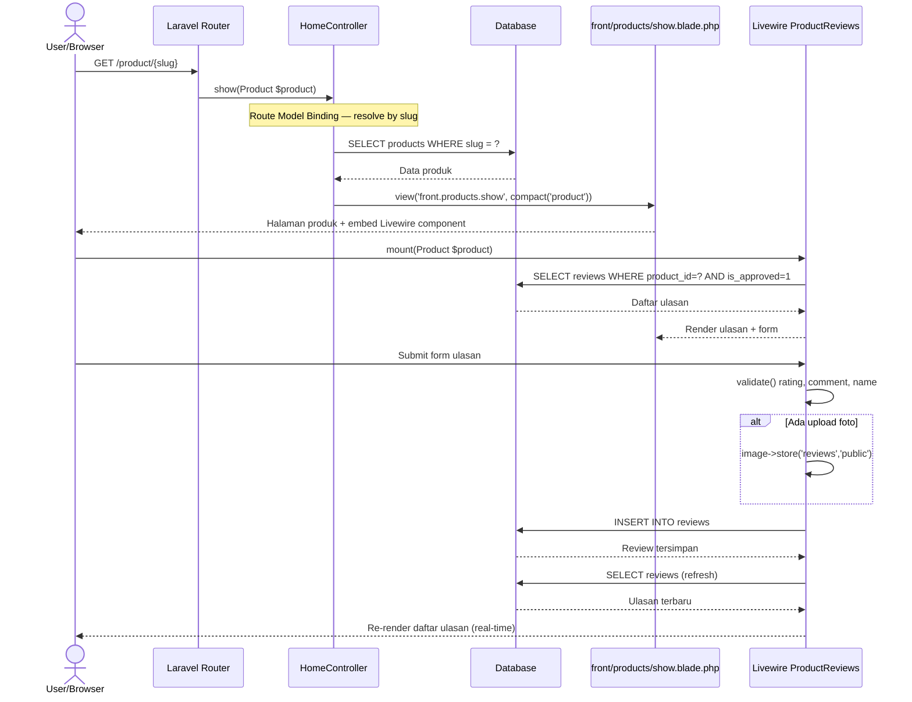

---

## 4. Keranjang Belanja

### Penjelasan

Halaman keranjang belanja dirancang sebagai antarmuka pengelolaan produk yang akan dibeli oleh pengguna sebelum melanjutkan ke proses checkout. Sistem ini mengimplementasikan penyimpanan data keranjang berbasis **sesi PHP** (_session_), sehingga pengguna tidak diwajibkan untuk memiliki akun atau melakukan autentikasi terlebih dahulu. Pendekatan ini bertujuan untuk meminimalkan hambatan dalam pengalaman berbelanja.

Ketika halaman diakses, `CartController` mengambil data keranjang dari sesi dan melakukan proses pembersihan otomatis terhadap item-item yang tidak valid, yakni produk dengan harga nol atau tanpa nama (_ghost items_). Setelah proses validasi, sistem menghitung total harga keseluruhan item dalam keranjang. Pengguna juga dapat menambahkan produk ke keranjang dari halaman lain melalui rute `/cart/add/{product}`, yang mendukung tiga mode respons: respons JSON untuk permintaan berbasis AJAX, pengalihan ke halaman keranjang untuk mode _"Beli Sekarang"_, serta pengalihan kembali ke halaman sebelumnya untuk mode standar. Selain itu, tersedia fitur pembaruan kuantitas dan penghapusan item yang masing-masing menggunakan metode HTTP PATCH dan DELETE.

### Sequence Diagram

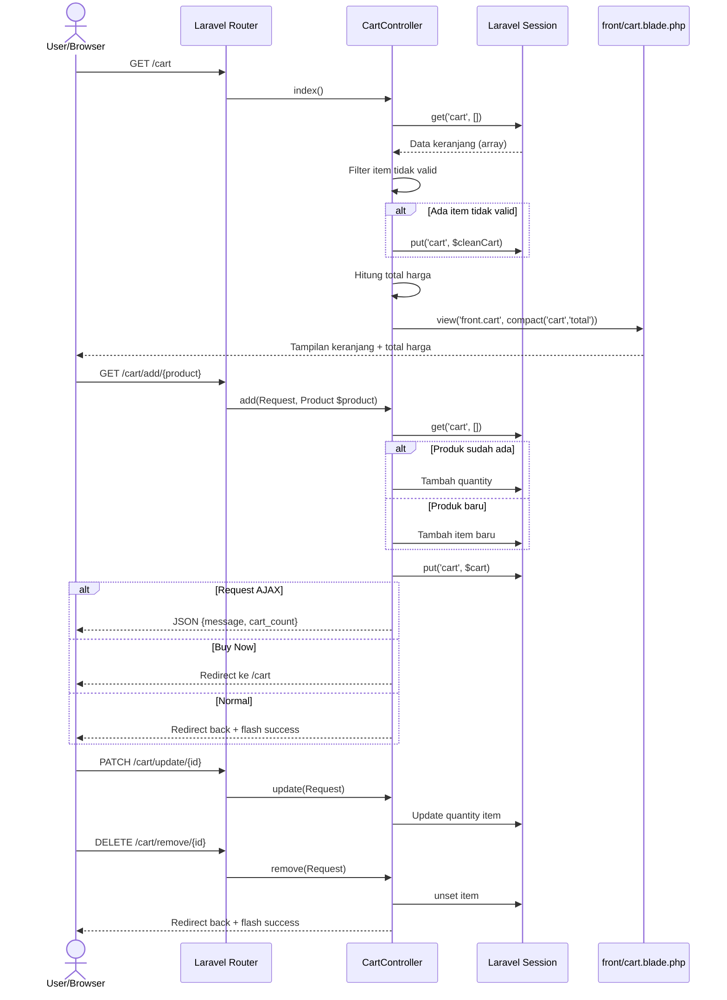

---

## 5. Checkout & Pembayaran

### Penjelasan

Proses checkout merupakan alur paling krusial dalam sistem toko online ini, karena melibatkan operasi basis data yang memerlukan konsistensi dan integritas data secara ketat. Pada tahap ini, pengguna diwajibkan mengisi formulir data pengiriman yang mencakup nama penerima, alamat, kode pos, identitas kota tujuan, pilihan kurir dan layanan pengiriman, serta metode pembayaran (transfer bank atau _cash on delivery_).

Setelah melewati validasi formulir, sistem tidak langsung membuat data pesanan, melainkan terlebih dahulu memulai transaksi basis data menggunakan `DB::beginTransaction()`. Di dalam transaksi tersebut, setiap produk dalam keranjang dikunci baris datanya menggunakan mekanisme `lockForUpdate()` untuk mencegah kondisi _race condition_ pada situasi pembelian bersamaan. Sistem kemudian memverifikasi ketersediaan stok secara satu per satu; apabila ditemukan ketidakcukupan stok atau produk yang tidak lagi tersedia, sistem segera melakukan rollback transaksi dan menampilkan pesan kesalahan kepada pengguna. Jika seluruh validasi stok berhasil, stok produk dikurangi secara atomik, data pesanan dibuat dengan token pelacak unik yang dihasilkan secara otomatis melalui fungsi `bin2hex(random_bytes(16))`, dan transaksi dikonfirmasi (_commit_). Setelah itu, data keranjang pada sesi dihapus dan pengguna dialihkan ke halaman pelacakan pesanan.

### Sequence Diagram

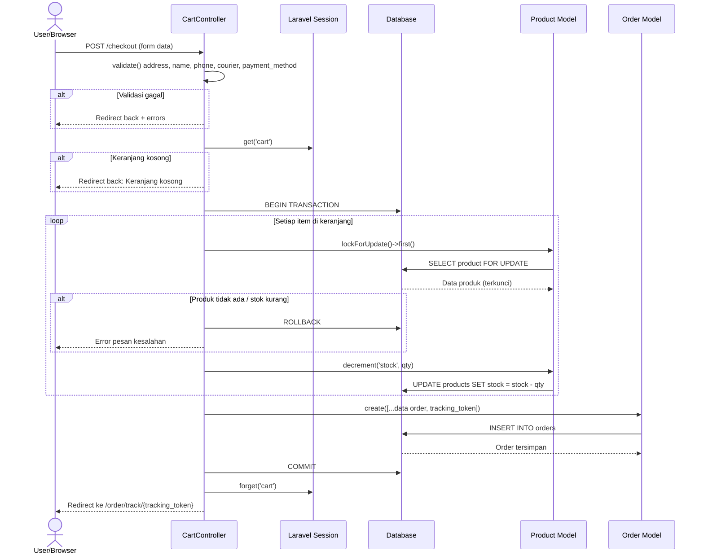

---

## 6. Lacak Pesanan (Token)

### Penjelasan

Halaman pelacakan pesanan berbasis token dirancang untuk memberikan akses kepada pelanggan dalam memantau status pesanan mereka tanpa memerlukan autentikasi akun. Sistem menggunakan token pelacak unik (`tracking_token`) sepanjang 32 karakter heksadesimal yang dihasilkan secara otomatis pada saat pembentukan pesanan. URL pelacakan kemudian disebarkan kepada pelanggan melalui pesan WhatsApp yang dikirim secara otomatis oleh sistem.

Ketika pengguna mengakses rute `/order/track/{token}`, `CartController` melakukan pencarian rekod pesanan berdasarkan nilai token tersebut menggunakan metode `firstOrFail()`. Apabila token tidak ditemukan dalam basis data, sistem secara otomatis menampilkan halaman kesalahan 404. Jika token valid, halaman akan menampilkan seluruh informasi pesanan secara komprehensif, termasuk status pesanan, daftar produk yang dipesan, informasi pengiriman, dan nomor resi apabila telah tersedia. Selain itu, terdapat aksi **konfirmasi penerimaan barang** yang dapat dilakukan oleh pelanggan ketika status pesanan berada pada tahap `shipped`. Konfirmasi tersebut akan mengubah status pesanan menjadi `completed` sebagai penanda bahwa transaksi telah selesai secara keseluruhan.

### Sequence Diagram

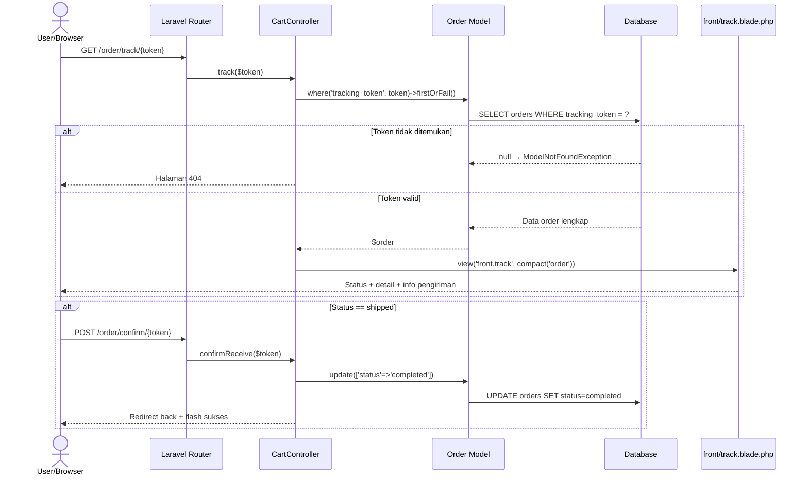

---

## 7. Cari Pesanan

### Penjelasan

Halaman pencarian pesanan menyediakan formulir sederhana yang memungkinkan pelanggan untuk menelusuri status pesanan mereka menggunakan nomor identitas pesanan (_Order ID_). Antarmuka ini berfungsi sebagai alternatif bagi pelanggan yang tidak memiliki tautan pelacakan berbasis token namun masih membutuhkan informasi status pesanan.

Ketika halaman pertama kali diakses tanpa parameter apapun, `TrackOrderController` merender formulir pencarian dengan variabel `$order` bernilai `null`. Setelah pengguna memasukkan nomor pesanan dan mengirimkan formulir melalui parameter URL `?order_id`, controller melakukan pencarian rekod pesanan menggunakan metode `find()` pada `Order Model`. Jika pesanan dengan identitas tersebut tidak ditemukan dalam basis data, sistem menampilkan pesan kesalahan kepada pengguna melalui mekanisme sesi _flash_. Sebaliknya, apabila pesanan berhasil ditemukan, tampilan akan diperbarui untuk menampilkan seluruh detail status pesanan secara langsung pada halaman yang sama.

### Sequence Diagram

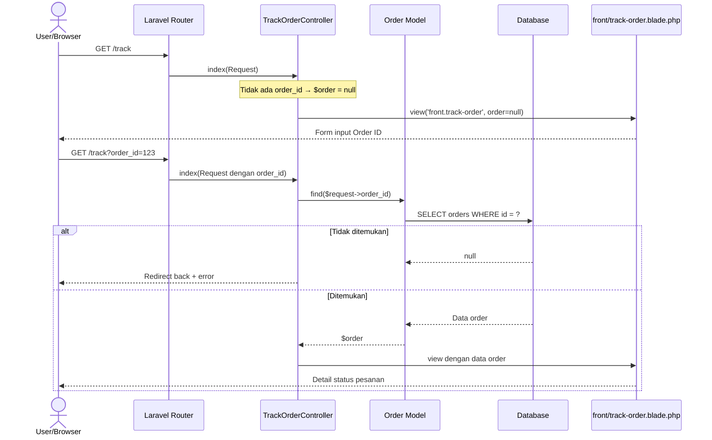

---

## 8. Daftar Artikel

### Penjelasan

Halaman daftar artikel merupakan bagian dari fitur konten pemasaran yang dirancang untuk mendukung strategi optimasi mesin pencari (_Search Engine Optimization_) website toko online Ivo Karya. Halaman ini menampilkan kumpulan artikel yang telah dipublikasikan oleh administrator dalam format grid yang terstruktur dengan navigasi pagination.

Ketika pengguna mengakses rute `/articles`, `ArticleController` melakukan pengambilan data artikel menggunakan metode `with('category')` untuk memuat relasi kategori secara efisien, dikombinasikan dengan pengurutan berdasarkan tanggal terbaru (`latest()`) dan pembatasan hasil menjadi sembilan artikel per halaman menggunakan metode `paginate(9)`. Laravel secara otomatis menangani logika pagination berdasarkan parameter `?page` yang terdapat pada URL. Hasil kueri berupa objek `LengthAwarePaginator` yang kemudian diteruskan ke berkas tampilan untuk dirender sebagai antarmuka yang dilengkapi dengan tautan navigasi antar halaman.

### Sequence Diagram

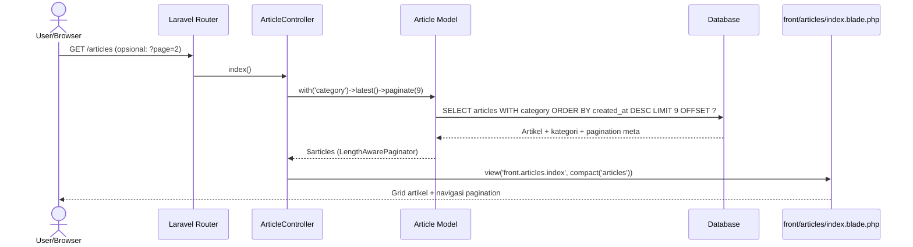

---

## 9. Detail Artikel

### Penjelasan

Halaman detail artikel menampilkan konten lengkap dari sebuah artikel yang dipilih oleh pengguna. Sistem mengimplementasikan mekanisme **Route Model Binding** berbasis atribut `slug` untuk menghasilkan URL yang ramah mesin pencari sekaligus meningkatkan kejelasan alamat halaman bagi pengguna. Dengan mekanisme ini, Laravel secara otomatis melakukan resolusi model `Article` berdasarkan nilai slug yang terdapat pada segmen URL tanpa memerlukan penulisan kueri secara eksplisit di dalam controller.

Ketika pengguna mengakses rute `/articles/{slug}`, router meneruskan permintaan ke metode `show()` pada `ArticleController` beserta objek artikel yang telah terselesaikan. Apabila slug yang dimaksud tidak ditemukan dalam basis data, Laravel secara otomatis merespons dengan kode status HTTP 404. Jika artikel berhasil ditemukan, controller meneruskan objek artikel tersebut ke berkas tampilan `front/articles/show.blade.php` untuk dirender sebagai halaman artikel yang memuat judul, kategori, waktu publikasi, dan konten lengkap artikel.

### Sequence Diagram

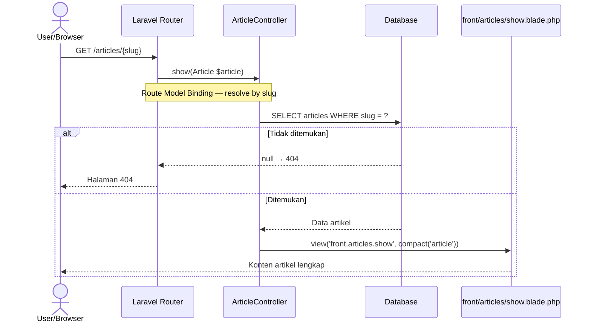

---

## 10. Login

### Penjelasan

Halaman login merupakan gerbang autentikasi yang memungkinkan pengguna terdaftar untuk mengakses fitur-fitur yang memerlukan identitas terverifikasi. Sistem autentikasi pada aplikasi ini dibangun di atas fondasi Laravel Breeze yang menyediakan implementasi autentikasi berbasis sesi (_session-based authentication_) secara lengkap dan aman.

Halaman login hanya dapat diakses oleh pengguna yang belum terautentikasi berkat penerapan _middleware_ `guest`. Ketika pengguna mengirimkan formulir login, `AuthenticatedSessionController` melakukan validasi format masukan, kemudian mendelegasikan proses verifikasi kredensial kepada `Auth Facade` Laravel. Fasad tersebut memverifikasi kecocokan antara surel dan kata sandi yang dimasukkan dengan data yang tersimpan di basis data, di mana kata sandi dibandingkan menggunakan algoritma hashing `bcrypt`. Apabila kredensial tidak valid, sistem mengembalikan pesan kesalahan yang sesuai. Jika autentikasi berhasil, identitas sesi diregenerasi menggunakan metode `regenerate()` guna mencegah serangan _session fixation_. Pengguna selanjutnya dialihkan ke halaman dasbor yang secara otomatis meneruskan akses ke panel administrasi Filament.

### Sequence Diagram

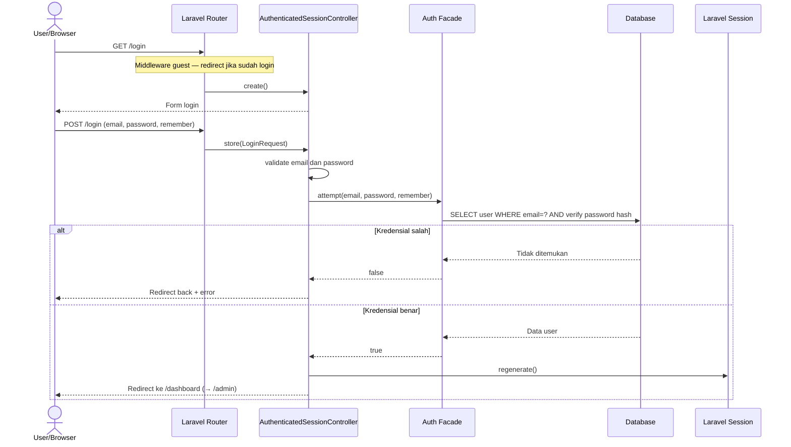

---

## 11. Register

### Penjelasan

Halaman registrasi menyediakan mekanisme pendaftaran akun baru bagi pengguna yang ingin memanfaatkan fitur-fitur yang memerlukan identitas terverifikasi, seperti penulisan ulasan produk. Halaman ini hanya dapat diakses oleh pengguna yang belum terautentikasi, sebagaimana halaman login, melalui perlindungan _middleware_ `guest`.

Ketika pengguna mengirimkan formulir pendaftaran, `RegisteredUserController` melakukan serangkaian validasi terhadap masukan yang diterima, meliputi keunikan surel pada tabel pengguna, konfirmasi kesesuaian kata sandi, dan pemenuhan panjang minimum kata sandi sebesar delapan karakter. Apabila validasi berhasil, controller membuat rekod pengguna baru di basis data dengan kata sandi yang telah melalui proses hashing menggunakan fungsi `Hash::make()` dari Laravel. Setelah rekod berhasil disimpan, pengguna secara otomatis diautentikasi menggunakan metode `Auth::login()` tanpa perlu melalui proses login terpisah. Sistem kemudian mengirimkan notifikasi verifikasi surel kepada alamat yang didaftarkan dan mengalihkan pengguna ke halaman dasbor.

### Sequence Diagram

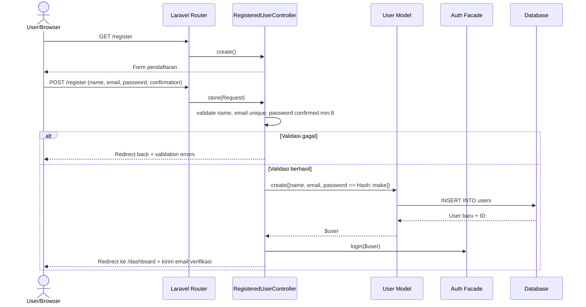

---

## 12. Lupa / Reset Password

### Penjelasan

Fitur pemulihan kata sandi diimplementasikan melalui alur dua tahap yang terstruktur untuk menjamin keamanan proses penggantian kata sandi. Pada tahap pertama, pengguna memasukkan alamat surel pada formulir yang tersedia di rute `/forgot-password`. `PasswordResetLinkController` kemudian memverifikasi keberadaan surel tersebut dalam basis data dan membuat token reset yang unik untuk disimpan pada tabel `password_reset_tokens`.

Sebagai pertimbangan keamanan, sistem selalu menampilkan pesan yang mengindikasikan keberhasilan pengiriman tautan, terlepas dari apakah surel tersebut terdaftar dalam sistem atau tidak. Pendekatan ini bertujuan untuk mencegah enumerasi akun oleh pihak yang tidak berwenang. Tautan reset yang memuat token unik kemudian dikirimkan ke alamat surel pengguna melalui layanan pengiriman surat elektronik. Pada tahap kedua, pengguna mengakses tautan tersebut dan mengisi formulir kata sandi baru. `NewPasswordController` memverifikasi validitas dan masa berlaku token, kemudian memperbarui kata sandi pengguna di basis data setelah token dikonfirmasi sah. Token yang telah digunakan kemudian dihapus untuk mencegah penggunaan ulang.

### Sequence Diagram

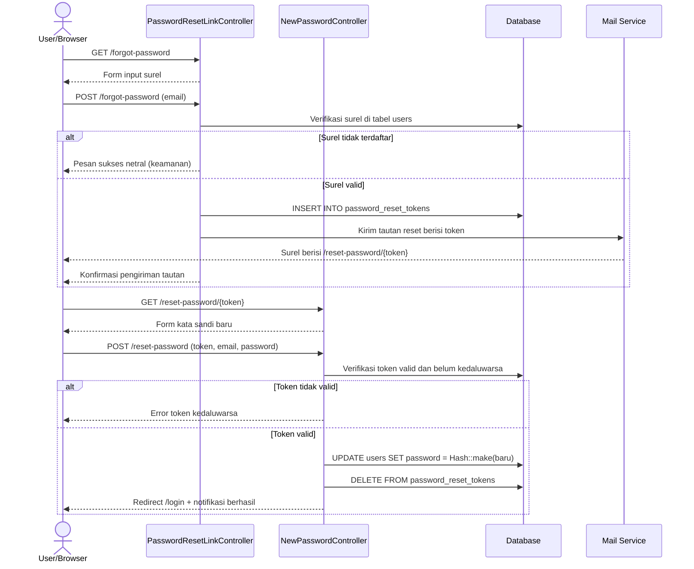

---

## 13. Profil Pengguna

### Penjelasan

Halaman profil pengguna menyediakan antarmuka bagi pengguna yang telah terautentikasi untuk mengelola data akun mereka secara mandiri. Akses ke halaman ini dijaga oleh _middleware_ `auth`, yang secara otomatis mengalihkan pengguna yang belum terautentikasi ke halaman login. Halaman ini mengintegrasikan tiga fungsi utama dalam satu tampilan terpadu.

Fungsi pertama adalah pemutakhiran informasi profil, di mana pengguna dapat mengubah nama dan alamat surel. Apabila surel diubah, atribut `email_verified_at` secara otomatis dikosongkan untuk mengharuskan pengguna melakukan verifikasi ulang terhadap surel baru. Fungsi kedua adalah penggantian kata sandi yang memerlukan verifikasi kata sandi lama sebelum kata sandi baru dapat disimpan. Fungsi ketiga adalah penghapusan akun secara permanen, yang mengharuskan pengguna mengonfirmasi kata sandi mereka sebelum operasi dieksekusi. Proses penghapusan akun mencakup _logout_ dari sesi aktif, penghapusan rekod pengguna dari basis data, serta invalidasi sesi dan pembaruan token CSRF untuk menjaga keamanan sistem.

### Sequence Diagram

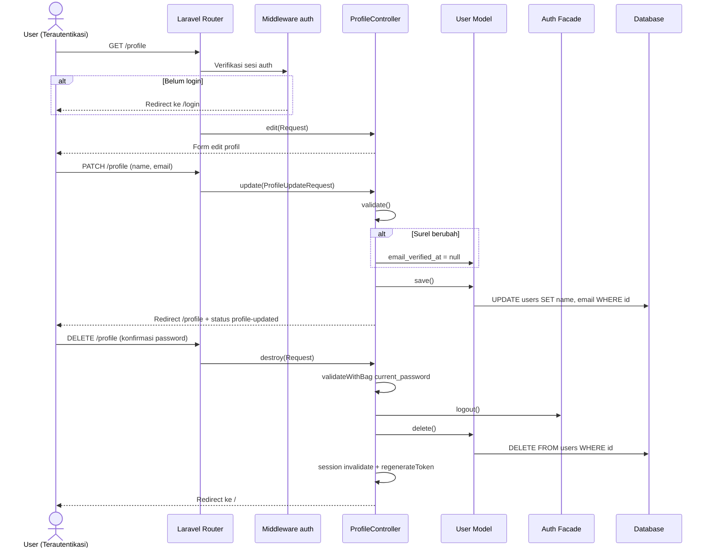

---

## 14. Admin — Manajemen Produk

### Penjelasan

Halaman manajemen produk pada panel administrasi dibangun menggunakan **Filament v3**, sebuah _framework_ antarmuka administrasi berbasis Laravel yang menyediakan komponen CRUD secara deklaratif. Halaman ini hanya dapat diakses oleh pengguna dengan hak akses administrator, dan menampilkan seluruh rekod produk dalam format tabel yang dilengkapi dengan fitur pencarian, pengurutan, dan filter.

Formulir penambahan produk baru diorganisasikan ke dalam tiga tab: tab *General* untuk informasi dasar produk (nama, slug otomatis, kategori, gambar, dan deskripsi), tab *Pricing & Stock* untuk data harga, harga diskon, stok, dan berat produk, serta tab *SEO* untuk pengisian meta judul dan meta deskripsi guna keperluan optimasi mesin pencari. Slug produk dibangkitkan secara otomatis dari nama produk menggunakan fungsi `Str::slug()` pada saat operasi pembuatan. Berkas gambar yang diunggah disimpan ke direktori `products` pada sistem penyimpanan lokal. Tersedia pula aksi khusus _Flash Sale_ yang dapat diaktifkan oleh administrator untuk menandai produk tertentu sebagai produk promosi. Operasi pembaruan data produk mengikuti alur yang serupa dengan pembuatan, namun menggunakan metode HTTP PATCH untuk memperbarui rekod yang telah ada.

### Sequence Diagram

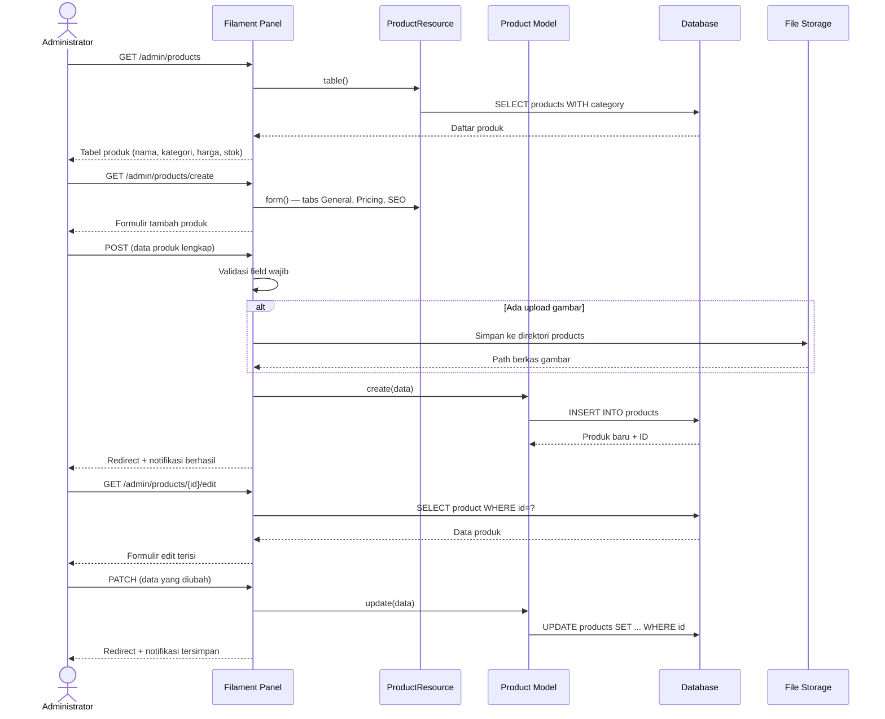

---

## 15. Admin — Manajemen Pesanan

### Penjelasan

Halaman manajemen pesanan merupakan komponen paling vital dalam operasional bisnis toko online Ivo Karya. Halaman ini memungkinkan administrator untuk memantau seluruh pesanan yang masuk dan mengelola perpindahan status pesanan melalui alur yang telah ditetapkan: `pending` → `processing` → `shipped` → `completed`. Setiap transisi status yang signifikan diiringi dengan pengiriman notifikasi otomatis melalui layanan WhatsApp kepada pelanggan menggunakan **FonnteService**.

Pada saat administrator mengonfirmasi pesanan dari status `pending` ke `processing`, sistem secara bersamaan mengambil informasi rekening bank dari tabel pengaturan (_settings_) dan menyusun pesan WhatsApp yang berisi detail pesanan beserta instruksi pembayaran, kemudian mengirimkannya ke nomor telepon pelanggan. Pada tahap berikutnya, ketika administrator memasukkan nomor resi pengiriman, status pesanan diperbarui menjadi `shipped` dan sistem secara otomatis mengirimkan pesan WhatsApp yang memuat nomor resi serta tautan pelacakan pesanan yang unik kepada pelanggan. Mekanisme notifikasi otomatis ini bertujuan untuk meningkatkan transparansi proses pengiriman dan kepuasan pelanggan.

### Sequence Diagram

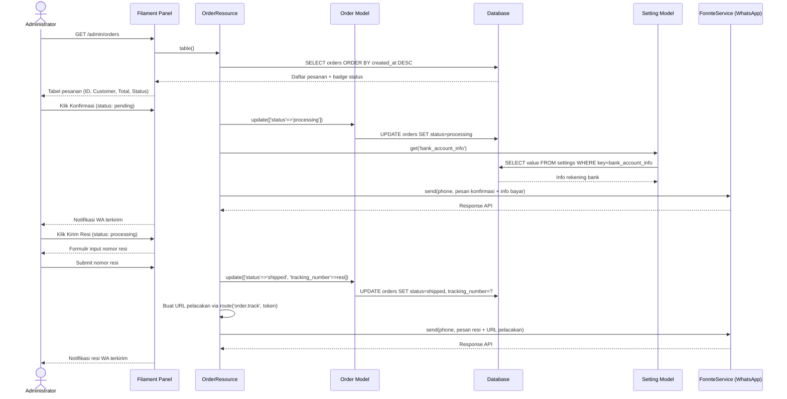

---

## 16. Admin — Manajemen Ulasan

### Penjelasan

Halaman manajemen ulasan pada panel administrasi berfungsi sebagai antarmuka moderasi konten yang memungkinkan administrator untuk meninjau, menyetujui, atau menghapus ulasan produk yang dikirimkan oleh pelanggan. Sistem ulasan pada aplikasi ini menerapkan mekanisme persetujuan (_approval_) sebelum ulasan ditampilkan kepada publik, yang dikendalikan melalui atribut `is_approved` pada tabel ulasan.

Seluruh ulasan, baik yang telah maupun belum mendapat persetujuan, ditampilkan dalam tabel administrasi beserta informasi produk yang diulas, nama pelanggan, nilai rating bintang, isi komentar, dan status persetujuan. Administrator dapat mengubah status persetujuan ulasan secara individual melalui aksi toggle, yang akan memperbarui nilai atribut `is_approved` di basis data. Hanya ulasan dengan nilai `is_approved = true` yang akan ditampilkan pada halaman detail produk yang dapat diakses oleh publik. Selain itu, administrator juga memiliki kewenangan untuk menghapus ulasan secara permanen apabila konten ulasan tersebut dinilai tidak sesuai dengan kebijakan toko.

### Sequence Diagram

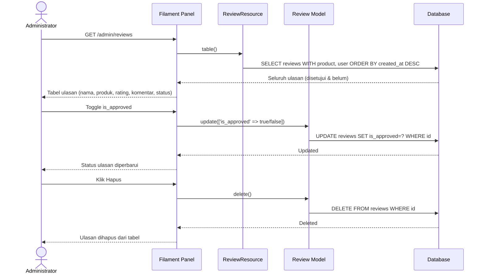

---

## 17. API Shipping

### Penjelasan

Modul API pengiriman merupakan lapisan integrasi antara sistem toko online dengan layanan pihak ketiga **RajaOngkir** yang menyediakan data wilayah administratif Indonesia dan kalkulasi tarif ongkos kirim secara _real-time_. API ini beroperasi pada rute internal dengan prefiks `/api/shipping` dan diakses secara langsung oleh kode JavaScript pada sisi klien melalui permintaan asinkronus (`fetch` / `axios`) dari halaman keranjang belanja.

Sistem menyediakan lima _endpoint_ yang saling berkaitan. Pertama, _endpoint_ pengambilan daftar provinsi yang menginterogasi API RajaOngkir untuk mendapatkan seluruh data provinsi di Indonesia. Kedua, _endpoint_ pengambilan kota berdasarkan identitas provinsi. Ketiga, _endpoint_ pencarian kota berdasarkan kode pos yang mempermudah pengguna dalam mengidentifikasi kota tujuan pengiriman. Keempat, _endpoint_ kalkulasi biaya pengiriman yang menerima parameter asal, tujuan, berat total paket, dan nama kurir untuk menghasilkan daftar layanan beserta tarifnya. Kelima, _endpoint_ _reverse geocoding_ yang mengonversi koordinat GPS (lintang dan bujur) yang diperoleh dari perangkat pengguna menjadi informasi alamat yang dapat dibaca manusia, guna membantu pengisian alamat pengiriman secara otomatis.

### Sequence Diagram

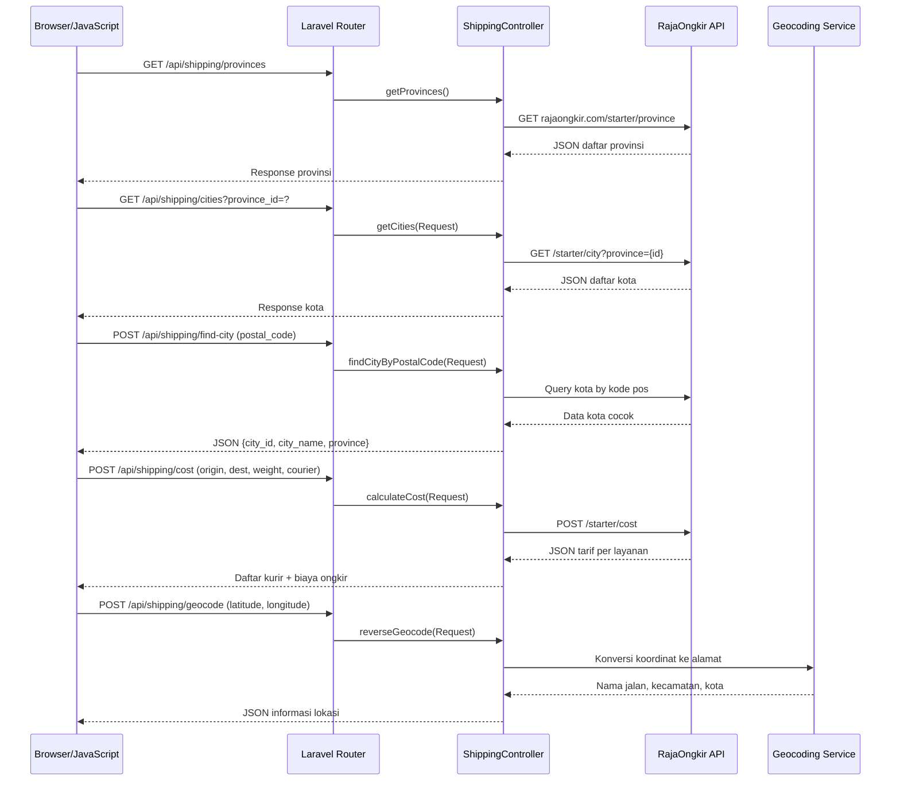

---

## Catatan Teknis

| Aspek | Keterangan |
|-------|-----------|
| **Framework** | Laravel 10 + Filament v3 + Livewire 3 |
| **Autentikasi** | Laravel Breeze (session-based) |
| **Penyimpanan Keranjang** | PHP Session — tidak memerlukan autentikasi |
| **Transaksi Basis Data** | `DB::beginTransaction()` pada proses checkout |
| **Notifikasi WhatsApp** | Fonnte API — dipicu saat konfirmasi & pengiriman resi |
| **Integrasi Ongkir** | RajaOngkir Starter Plan |
| **Komponen Real-time** | Livewire 3 — `ProductReviews` component |
| **Panel Admin** | Filament v3 Resources (Product, Order, Category, Article, Review, Setting) |
| **Penyimpanan Berkas** | Laravel Storage `storage/app/public` |
| **Token Pelacakan** | `bin2hex(random_bytes(16))` — 32 karakter heksadesimal unik |
| **URL Produk & Artikel** | Route Model Binding berbasis `slug` (SEO-friendly) |

---

*Dokumentasi ini disusun berdasarkan hasil analisis mendalam terhadap kode sumber proyek WEBSITE-IVO-KARYA.*  
*Dibuat oleh: Sistem Dokumentasi Antigravity AI — 2 April 2026*
