# Dokumentasi Sequence Diagram — WEBSITE IVO KARYA

> **Proyek**: Website Toko Online Ivo Karya  
> **Framework**: Laravel 10 + Filament v3 + Livewire  
> **Tanggal Dibuat**: 2 April 2026  
> **Deskripsi**: Dokumen ini berisi sequence diagram lengkap untuk setiap halaman dalam sistem, menjelaskan alur interaksi antara User (Browser), Controller, Model, Database, dan layanan eksternal.

---

## Daftar Halaman

| No | Halaman | Route | Keterangan |
|----|---------|-------|------------|
| 1 | [Beranda (Homepage)](#1-beranda-homepage) | `GET /` | Halaman utama toko |
| 2 | [Katalog Produk](#2-katalog-produk) | `GET /katalog` | Daftar semua produk |
| 3 | [Detail Produk](#3-detail-produk) | `GET /product/{slug}` | Halaman detail produk + ulasan |
| 4 | [Keranjang Belanja](#4-keranjang-belanja) | `GET /cart` | Manajemen keranjang |
| 5 | [Checkout & Pembayaran](#5-checkout--pembayaran) | `POST /checkout` | Proses pembuatan order |
| 6 | [Lacak Pesanan (Token)](#6-lacak-pesanan-token) | `GET /order/track/{token}` | Tracking pesanan by token |
| 7 | [Cari Pesanan](#7-cari-pesanan) | `GET /track` | Form pencarian pesanan |
| 8 | [Daftar Artikel](#8-daftar-artikel) | `GET /articles` | Blog / artikel |
| 9 | [Detail Artikel](#9-detail-artikel) | `GET /articles/{slug}` | Halaman baca artikel |
| 10 | [Login](#10-login) | `GET /login` | Autentikasi pengguna |
| 11 | [Register](#11-register) | `GET /register` | Pendaftaran akun baru |
| 12 | [Lupa / Reset Password](#12-lupa--reset-password) | `GET /forgot-password` | Reset password via email |
| 13 | [Profil User](#13-profil-user) | `GET /profile` | Edit profil pengguna |
| 14 | [Admin Panel — Produk](#14-admin-panel--manajemen-produk) | `GET /admin/products` | Kelola produk (Filament) |
| 15 | [Admin Panel — Pesanan](#15-admin-panel--manajemen-pesanan) | `GET /admin/orders` | Kelola dan proses pesanan |
| 16 | [Admin Panel — Ulasan](#16-admin-panel--manajemen-ulasan) | `GET /admin/reviews` | Moderasi ulasan produk |
| 17 | [API Shipping](#17-api-shipping) | `GET/POST /api/shipping/*` | Perhitungan ongkos kirim |

---

## 1. Beranda (Homepage)

### Deskripsi
Halaman pertama yang dilihat pengunjung ketika membuka website. Menampilkan daftar produk terbaru dan 3 artikel terbaru. Mendukung filter produk berdasarkan kategori melalui query string `?category=slug`.

### Aktor
- **User/Browser** — Pengunjung (tamu atau yang sudah login)
- **HomeController** — Mengatur logika halaman
- **Product Model** — Mengambil data produk
- **Article Model** — Mengambil data artikel
- **Database** — Penyimpanan data

### Sequence Diagram

```mermaid
sequenceDiagram
    actor User as User/Browser
    participant Router as Laravel Router
    participant HC as HomeController
    participant ProductM as Product Model
    participant ArticleM as Article Model
    participant DB as Database
    participant View as welcome.blade.php

    User->>Router: GET / (opsional: ?category=slug)
    Router->>HC: index(Request $request)

    HC->>ProductM: query()
    alt Ada filter kategori
        HC->>ProductM: whereHas('category', slug)
    end
    ProductM->>DB: SELECT products WHERE category.slug = ?
    DB-->>ProductM: Daftar produk
    ProductM-->>HC: $products collection

    HC->>ArticleM: latest()->take(3)->get()
    ArticleM->>DB: SELECT articles ORDER BY created_at DESC LIMIT 3
    DB-->>ArticleM: 3 artikel terbaru
    ArticleM-->>HC: $articles collection

    HC->>View: return view('welcome', compact('products', 'articles'))
    View-->>User: Render halaman beranda (HTML)
```

---

## 2. Katalog Produk

### Deskripsi
Halaman yang menampilkan semua produk dalam bentuk grid dengan filter berdasarkan kategori. Berbeda dengan beranda, halaman ini memuat **semua produk** beserta relasi kategori (`with('category')`). Terdapat sidebar atau dropdown filter untuk memilih kategori.

### Aktor
- **User/Browser** — Pengunjung toko
- **HomeController** — Method `catalog()`
- **Product Model** — Data produk + kategori
- **Category Model** — Daftar kategori untuk filter
- **Database** — Penyimpanan data

### Sequence Diagram

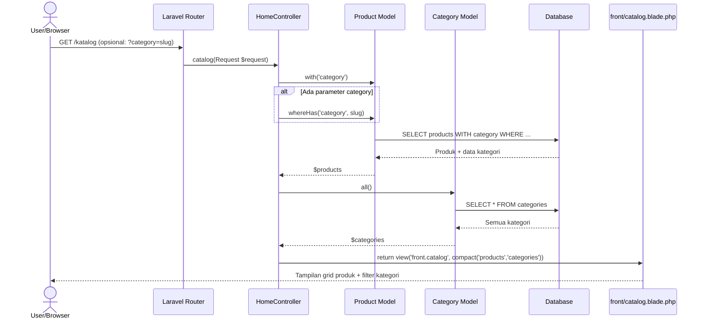
```mermaid
sequenceDiagram
    actor User as User/Browser
    participant Router as Laravel Router
    participant HC as HomeController
    participant ProductM as Product Model
    participant CategoryM as Category Model
    participant DB as Database
    participant View as front/catalog.blade.php

    User->>Router: GET /katalog (opsional: ?category=slug)
    Router->>HC: catalog(Request $request)

    HC->>ProductM: with('category')
    alt Ada parameter category
        HC->>ProductM: whereHas('category', slug)
    end
    ProductM->>DB: SELECT products WITH category WHERE ...
    DB-->>ProductM: Produk + data kategori
    ProductM-->>HC: $products

    HC->>CategoryM: all()
    CategoryM->>DB: SELECT * FROM categories
    DB-->>CategoryM: Semua kategori
    CategoryM-->>HC: $categories

    HC->>View: return view('front.catalog', compact('products','categories'))
    View-->>User: Tampilan grid produk + filter kategori
```

---

## 3. Detail Produk

### Deskripsi
Halaman yang menampilkan detail lengkap sebuah produk: nama, deskripsi, harga, stok, gambar, dan ulasan pelanggan. Menggunakan **Livewire component** (`ProductReviews`) untuk mengelola form ulasan secara real-time tanpa page reload. Pengguna yang login nama-nya diambil otomatis, sedangkan tamu harus mengisi nama secara manual.

### Aktor
- **User/Browser** — Pengunjung / pembeli
- **HomeController** — Method `show()`
- **Product Model** — Data produk
- **ProductReviews (Livewire)** — Komponen ulasan
- **Review Model** — Menyimpan/membaca ulasan
- **Database** — Penyimpanan data

### Sequence Diagram

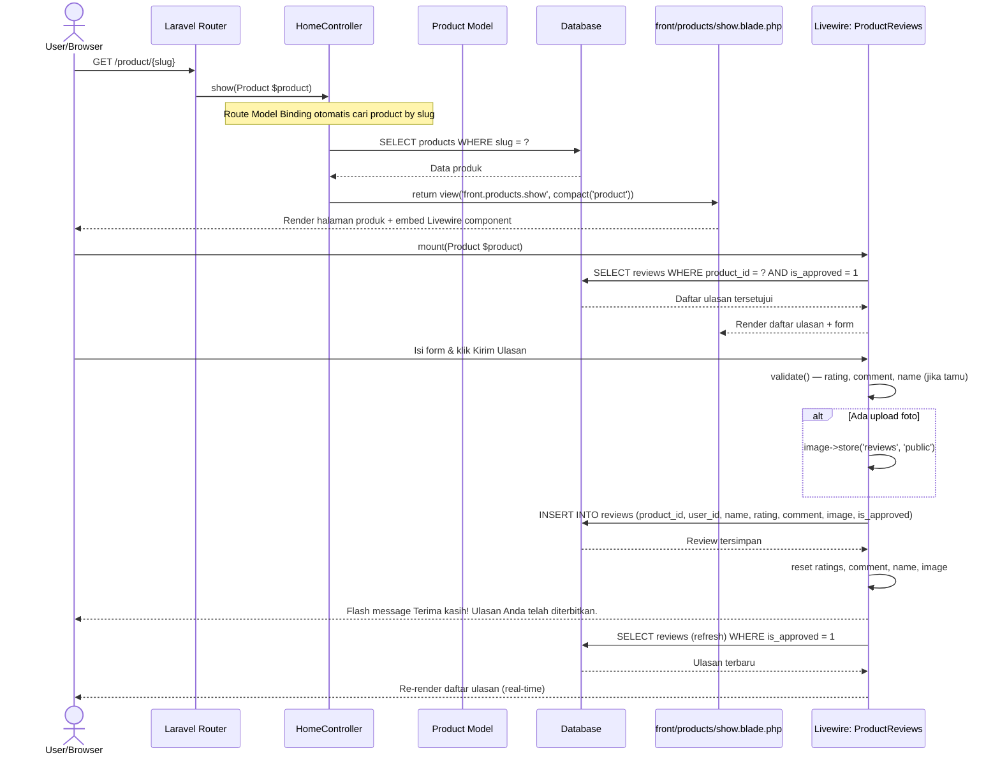
```mermaid
sequenceDiagram
    actor User as User/Browser
    participant Router as Laravel Router
    participant HC as HomeController
    participant ProductM as Product Model
    participant DB as Database
    participant View as front/products/show.blade.php
    participant LW as Livewire: ProductReviews

    User->>Router: GET /product/{slug}
    Router->>HC: show(Product $product)
    Note over HC: Route Model Binding otomatis cari product by slug
    HC->>DB: SELECT products WHERE slug = ?
    DB-->>HC: Data produk
    HC->>View: return view('front.products.show', compact('product'))
    View-->>User: Render halaman produk + embed Livewire component

    User->>LW: mount(Product $product)
    LW->>DB: SELECT reviews WHERE product_id = ? AND is_approved = 1
    DB-->>LW: Daftar ulasan tersetujui
    LW-->>View: Render daftar ulasan + form

    User->>LW: Isi form & klik Kirim Ulasan
    LW->>LW: validate() — rating, comment, name (jika tamu)
    alt Ada upload foto
        LW->>LW: image->store('reviews', 'public')
    end
    LW->>DB: INSERT INTO reviews (product_id, user_id, name, rating, comment, image, is_approved)
    DB-->>LW: Review tersimpan
    LW->>LW: reset ratings, comment, name, image
    LW-->>User: Flash message Terima kasih! Ulasan Anda telah diterbitkan.
    LW->>DB: SELECT reviews (refresh) WHERE is_approved = 1
    DB-->>LW: Ulasan terbaru
    LW-->>User: Re-render daftar ulasan (real-time)
```

---

## 4. Keranjang Belanja

### Deskripsi
Halaman manajemen keranjang belanja. Data keranjang disimpan di **Session** (bukan database), sehingga tidak memerlukan login. Halaman ini juga memiliki fitur pembersihan otomatis untuk menghapus item "ghost" yang harganya nol atau tanpa nama. Pengguna dapat mengubah jumlah atau menghapus item.

### Aktor
- **User/Browser** — Pembeli
- **CartController** — Mengatur logika keranjang
- **Session** — Penyimpanan keranjang sementara

### Sequence Diagram

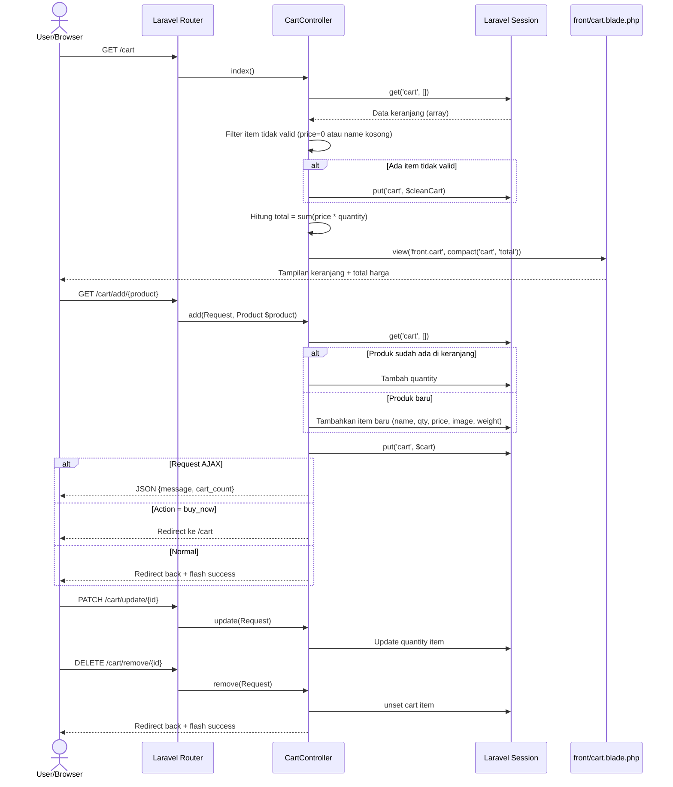
```mermaid
sequenceDiagram
    actor User as User/Browser
    participant Router as Laravel Router
    participant CC as CartController
    participant Session as Laravel Session
    participant View as front/cart.blade.php

    User->>Router: GET /cart
    Router->>CC: index()
    CC->>Session: get('cart', [])
    Session-->>CC: Data keranjang (array)

    CC->>CC: Filter item tidak valid (price=0 atau name kosong)
    alt Ada item tidak valid
        CC->>Session: put('cart', $cleanCart)
    end

    CC->>CC: Hitung total = sum(price * quantity)
    CC->>View: view('front.cart', compact('cart', 'total'))
    View-->>User: Tampilan keranjang + total harga

    User->>Router: GET /cart/add/{product}
    Router->>CC: add(Request, Product $product)
    CC->>Session: get('cart', [])
    alt Produk sudah ada di keranjang
        CC->>Session: Tambah quantity
    else Produk baru
        CC->>Session: Tambahkan item baru (name, qty, price, image, weight)
    end
    CC->>Session: put('cart', $cart)
    alt Request AJAX
        CC-->>User: JSON {message, cart_count}
    else Action = buy_now
        CC-->>User: Redirect ke /cart
    else Normal
        CC-->>User: Redirect back + flash success
    end

    User->>Router: PATCH /cart/update/{id}
    Router->>CC: update(Request)
    CC->>Session: Update quantity item

    User->>Router: DELETE /cart/remove/{id}
    Router->>CC: remove(Request)
    CC->>Session: unset cart item
    CC-->>User: Redirect back + flash success
```

---

## 5. Checkout & Pembayaran

### Deskripsi
Proses paling kritis dalam sistem. Pengguna mengisi formulir data pengiriman (nama, alamat, kota, kode pos, kurir) dan memilih metode pembayaran (transfer bank atau COD). Sistem akan melakukan validasi stok secara **transaksional** (menggunakan `DB::beginTransaction`) untuk memastikan tidak ada race condition. Setelah berhasil, keranjang dikosongkan dan user diarahkan ke halaman tracking dengan token unik.

### Aktor
- **User/Browser** — Pembeli yang melakukan checkout
- **CartController** — Method `checkout()`
- **Product Model** — Validasi & decrement stok
- **Order Model** — Membuat record pesanan baru
- **Session** — Sumber data keranjang
- **Database** — Transaksi penyimpanan

### Sequence Diagram

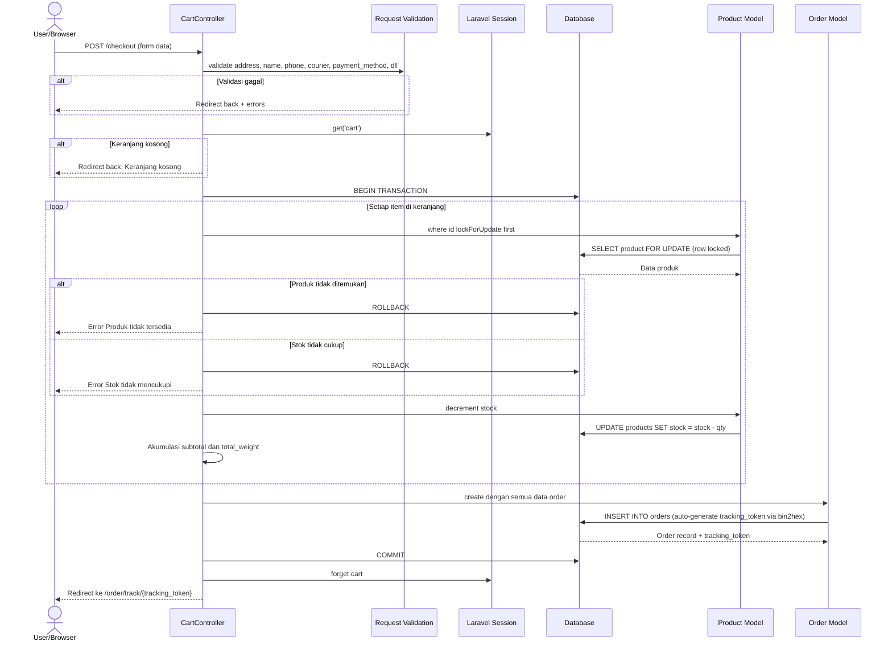
```mermaid
sequenceDiagram
    actor User as User/Browser
    participant CC as CartController
    participant Request as Request Validation
    participant Session as Laravel Session
    participant DB as Database
    participant ProductM as Product Model
    participant OrderM as Order Model

    User->>CC: POST /checkout (form data)
    CC->>Request: validate address, name, phone, courier, payment_method, dll

    alt Validasi gagal
        Request-->>User: Redirect back + errors
    end

    CC->>Session: get('cart')
    alt Keranjang kosong
        CC-->>User: Redirect back: Keranjang kosong
    end

    CC->>DB: BEGIN TRANSACTION

    loop Setiap item di keranjang
        CC->>ProductM: where id lockForUpdate first
        ProductM->>DB: SELECT product FOR UPDATE (row locked)
        DB-->>ProductM: Data produk

        alt Produk tidak ditemukan
            CC->>DB: ROLLBACK
            CC-->>User: Error Produk tidak tersedia
        else Stok tidak cukup
            CC->>DB: ROLLBACK
            CC-->>User: Error Stok tidak mencukupi
        end

        CC->>ProductM: decrement stock
        ProductM->>DB: UPDATE products SET stock = stock - qty
        CC->>CC: Akumulasi subtotal dan total_weight
    end

    CC->>OrderM: create dengan semua data order
    OrderM->>DB: INSERT INTO orders (auto-generate tracking_token via bin2hex)
    DB-->>OrderM: Order record + tracking_token

    CC->>DB: COMMIT
    CC->>Session: forget cart
    CC-->>User: Redirect ke /order/track/{tracking_token}
```

---

## 6. Lacak Pesanan (Token)

### Deskripsi
Halaman yang menampilkan status dan detail pesanan menggunakan **tracking token** unik yang digenerate saat checkout. Halaman ini tidak memerlukan login. Terdapat tombol **"Konfirmasi Terima"** yang dapat diklik jika status pesanan adalah `shipped`, yang akan mengubah status menjadi `completed`.

### Aktor
- **User/Browser** — Pembeli yang ingin cek pesanan
- **CartController** — Method `track()` dan `confirmReceive()`
- **Order Model** — Data pesanan berdasarkan token
- **Database** — Penyimpanan data

### Sequence Diagram

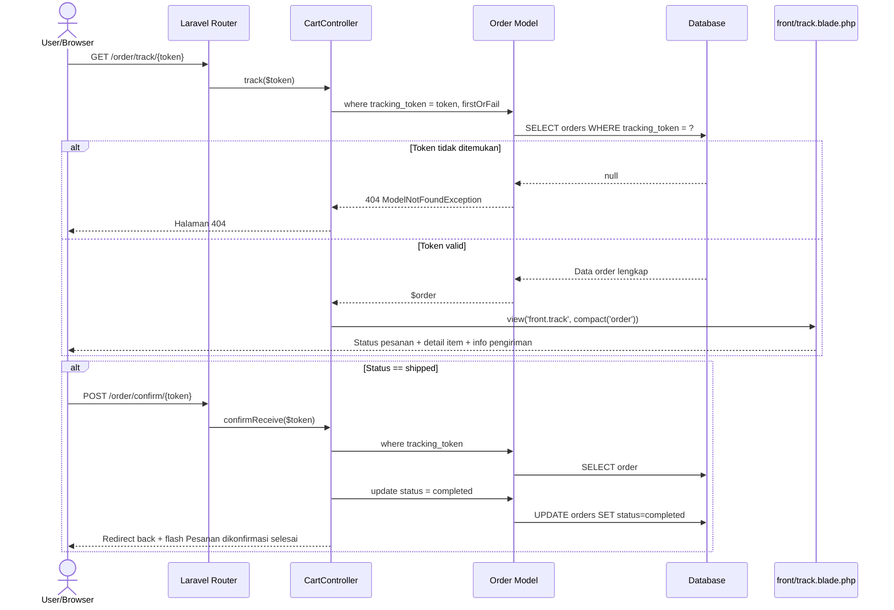
```mermaid
sequenceDiagram
    actor User as User/Browser
    participant Router as Laravel Router
    participant CC as CartController
    participant OrderM as Order Model
    participant DB as Database
    participant View as front/track.blade.php

    User->>Router: GET /order/track/{token}
    Router->>CC: track($token)
    CC->>OrderM: where tracking_token = token, firstOrFail
    OrderM->>DB: SELECT orders WHERE tracking_token = ?

    alt Token tidak ditemukan
        DB-->>OrderM: null
        OrderM-->>CC: 404 ModelNotFoundException
        CC-->>User: Halaman 404
    else Token valid
        DB-->>OrderM: Data order lengkap
        OrderM-->>CC: $order
        CC->>View: view('front.track', compact('order'))
        View-->>User: Status pesanan + detail item + info pengiriman
    end

    alt Status == shipped
        User->>Router: POST /order/confirm/{token}
        Router->>CC: confirmReceive($token)
        CC->>OrderM: where tracking_token
        OrderM->>DB: SELECT order
        CC->>OrderM: update status = completed
        OrderM->>DB: UPDATE orders SET status=completed
        CC-->>User: Redirect back + flash Pesanan dikonfirmasi selesai
    end
```

---

## 7. Cari Pesanan

### Deskripsi
Halaman form pencarian sederhana yang memungkinkan pelanggan mencari status pesanan menggunakan **Order ID**. Jika ID ditemukan, detail pesanan langsung ditampilkan di halaman yang sama.

### Aktor
- **User/Browser** — Pelanggan
- **TrackOrderController** — Logika pencarian
- **Order Model** — Query berdasarkan ID
- **Database** — Penyimpanan data

### Sequence Diagram

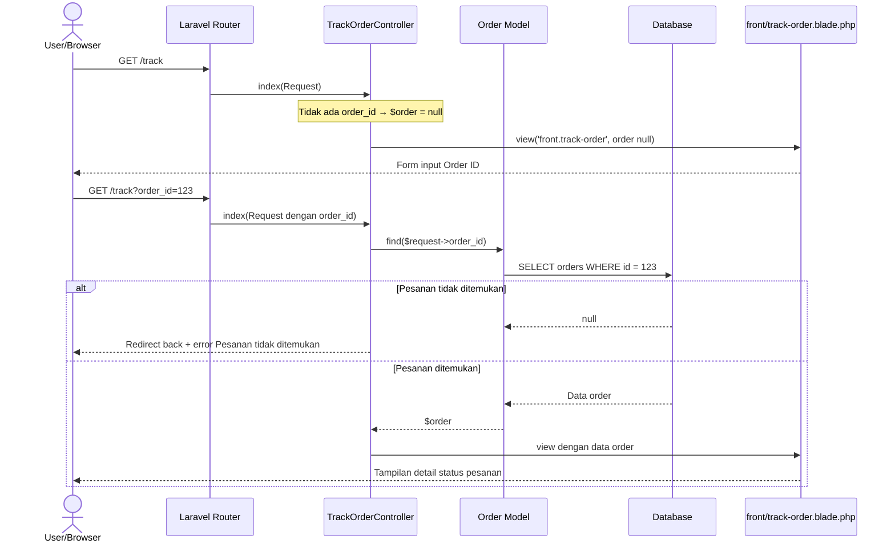
```mermaid
sequenceDiagram
    actor User as User/Browser
    participant Router as Laravel Router
    participant TOC as TrackOrderController
    participant OrderM as Order Model
    participant DB as Database
    participant View as front/track-order.blade.php

    User->>Router: GET /track
    Router->>TOC: index(Request)
    Note over TOC: Tidak ada order_id → $order = null
    TOC->>View: view('front.track-order', order null)
    View-->>User: Form input Order ID

    User->>Router: GET /track?order_id=123
    Router->>TOC: index(Request dengan order_id)
    TOC->>OrderM: find($request->order_id)
    OrderM->>DB: SELECT orders WHERE id = 123

    alt Pesanan tidak ditemukan
        DB-->>OrderM: null
        TOC-->>User: Redirect back + error Pesanan tidak ditemukan
    else Pesanan ditemukan
        DB-->>OrderM: Data order
        OrderM-->>TOC: $order
        TOC->>View: view dengan data order
        View-->>User: Tampilan detail status pesanan
    end
```

---

## 8. Daftar Artikel

### Deskripsi
Halaman blog/artikel toko yang menampilkan daftar artikel dalam format pagination (9 artikel per halaman) dengan relasi kategori. Berfungsi sebagai konten pemasaran dan SEO toko.

### Aktor
- **User/Browser** — Pengunjung
- **ArticleController** — Method `index()`
- **Article Model** — Data artikel + kategori
- **Database** — Penyimpanan data

### Sequence Diagram

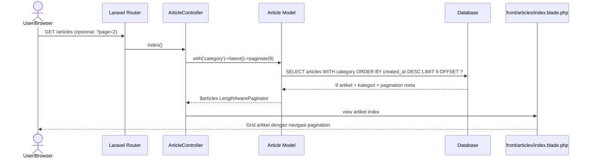
```mermaid
sequenceDiagram
    actor User as User/Browser
    participant Router as Laravel Router
    participant AC as ArticleController
    participant ArticleM as Article Model
    participant DB as Database
    participant View as front/articles/index.blade.php

    User->>Router: GET /articles (opsional: ?page=2)
    Router->>AC: index()
    AC->>ArticleM: with('category')->latest()->paginate(9)
    ArticleM->>DB: SELECT articles WITH category ORDER BY created_at DESC LIMIT 9 OFFSET ?
    DB-->>ArticleM: 9 artikel + kategori + pagination meta
    ArticleM-->>AC: $articles LengthAwarePaginator
    AC->>View: view artikel index
    View-->>User: Grid artikel dengan navigasi pagination
```

---

## 9. Detail Artikel

### Deskripsi
Halaman pembacaan satu artikel lengkap. Menggunakan **Route Model Binding** dengan slug untuk URL yang SEO-friendly. Menampilkan konten artikel, kategori, dan tanggal publikasi.

### Aktor
- **User/Browser** — Pembaca
- **ArticleController** — Method `show()`
- **Article Model** — Data artikel berdasarkan slug
- **Database** — Penyimpanan data

### Sequence Diagram

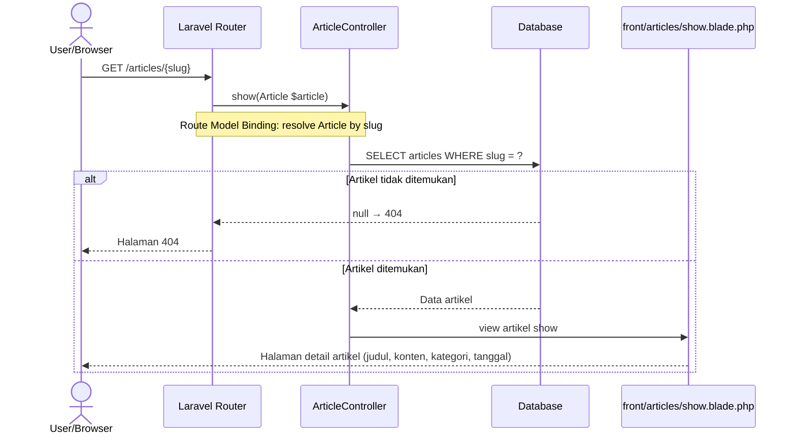
```mermaid
sequenceDiagram
    actor User as User/Browser
    participant Router as Laravel Router
    participant AC as ArticleController
    participant DB as Database
    participant View as front/articles/show.blade.php

    User->>Router: GET /articles/{slug}
    Router->>AC: show(Article $article)
    Note over Router,AC: Route Model Binding: resolve Article by slug
    AC->>DB: SELECT articles WHERE slug = ?

    alt Artikel tidak ditemukan
        DB-->>Router: null → 404
        Router-->>User: Halaman 404
    else Artikel ditemukan
        DB-->>AC: Data artikel
        AC->>View: view artikel show
        View-->>User: Halaman detail artikel (judul, konten, kategori, tanggal)
    end
```

---

## 10. Login

### Deskripsi
Halaman autentikasi pengguna menggunakan sistem bawaan Laravel Breeze. Mendukung opsi "Remember Me" untuk sesi persisten. Setelah login berhasil, sesi diregenerasi untuk keamanan dan pengguna diarahkan ke dashboard (yang di-redirect ke `/admin`).

### Aktor
- **User/Browser** — Calon pengguna
- **AuthenticatedSessionController** — Proses login
- **Auth Facade** — Laravel Authentication
- **Database** — Verifikasi kredensial

### Sequence Diagram

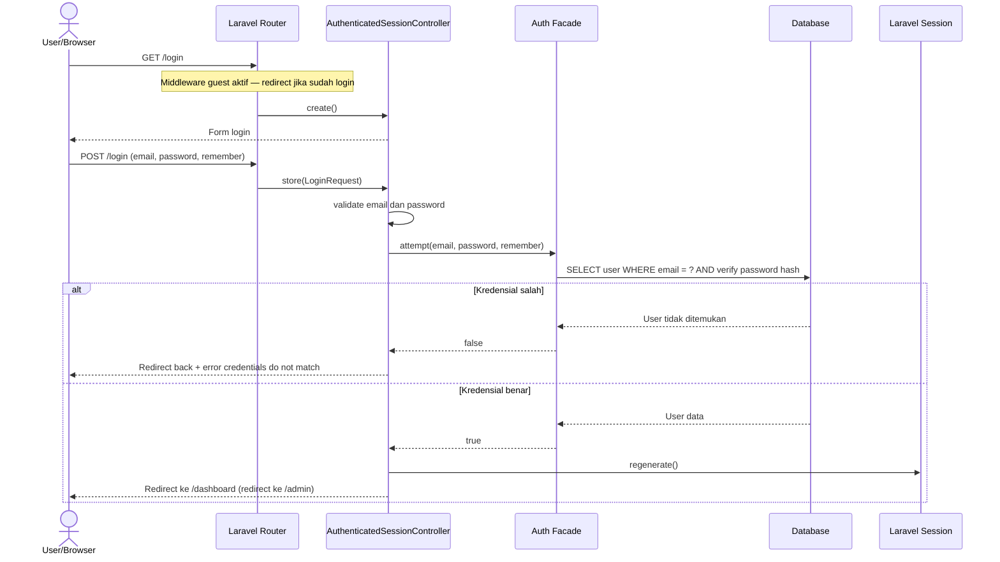
```mermaid
sequenceDiagram
    actor User as User/Browser
    participant Router as Laravel Router
    participant ASC as AuthenticatedSessionController
    participant AuthFacade as Auth Facade
    participant DB as Database
    participant Session as Laravel Session

    User->>Router: GET /login
    Note over Router: Middleware guest aktif — redirect jika sudah login
    Router->>ASC: create()
    ASC-->>User: Form login

    User->>Router: POST /login (email, password, remember)
    Router->>ASC: store(LoginRequest)
    ASC->>ASC: validate email dan password
    ASC->>AuthFacade: attempt(email, password, remember)
    AuthFacade->>DB: SELECT user WHERE email = ? AND verify password hash

    alt Kredensial salah
        DB-->>AuthFacade: User tidak ditemukan
        AuthFacade-->>ASC: false
        ASC-->>User: Redirect back + error credentials do not match
    else Kredensial benar
        DB-->>AuthFacade: User data
        AuthFacade-->>ASC: true
        ASC->>Session: regenerate()
        ASC-->>User: Redirect ke /dashboard (redirect ke /admin)
    end
```

---

## 11. Register

### Deskripsi
Halaman pendaftaran akun baru. Password di-hash menggunakan `bcrypt` sebelum disimpan ke database. Setelah registrasi berhasil, pengguna otomatis login.

### Aktor
- **User/Browser** — Calon pengguna baru
- **RegisteredUserController** — Proses pendaftaran
- **Auth Facade** — Login otomatis
- **User Model** — Membuat user baru
- **Database** — Menyimpan data

### Sequence Diagram

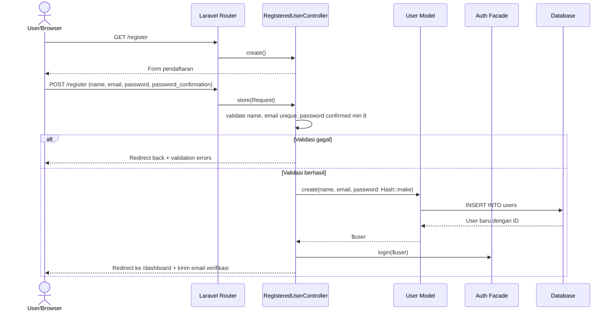
```mermaid
sequenceDiagram
    actor User as User/Browser
    participant Router as Laravel Router
    participant RUC as RegisteredUserController
    participant UserM as User Model
    participant AuthFacade as Auth Facade
    participant DB as Database

    User->>Router: GET /register
    Router->>RUC: create()
    RUC-->>User: Form pendaftaran

    User->>Router: POST /register (name, email, password, password_confirmation)
    Router->>RUC: store(Request)
    RUC->>RUC: validate name, email unique, password confirmed min 8

    alt Validasi gagal
        RUC-->>User: Redirect back + validation errors
    else Validasi berhasil
        RUC->>UserM: create(name, email, password: Hash::make)
        UserM->>DB: INSERT INTO users
        DB-->>UserM: User baru dengan ID
        UserM-->>RUC: $user

        RUC->>AuthFacade: login($user)
        RUC-->>User: Redirect ke /dashboard + kirim email verifikasi
    end
```

---

## 12. Lupa / Reset Password

### Deskripsi
Alur dua langkah untuk memulihkan akses akun. Pertama, pengguna memasukkan email untuk menerima link reset. Kedua, pengguna membuka link dan memasukkan password baru. Token reset disimpan di tabel `password_reset_tokens` dengan masa berlaku terbatas.

### Aktor
- **User/Browser** — Pengguna yang lupa password
- **PasswordResetLinkController** — Kirim email link reset
- **NewPasswordController** — Proses reset password baru
- **Database** — Menyimpan token & update password
- **Mail Service** — Pengiriman email

### Sequence Diagram

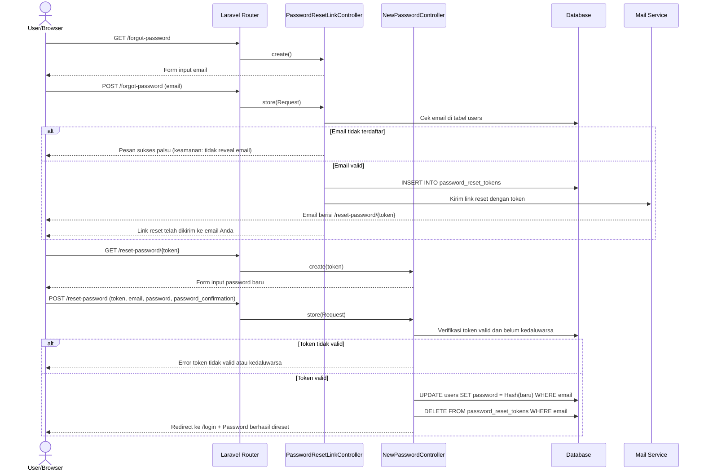
```mermaid
sequenceDiagram
    actor User as User/Browser
    participant Router as Laravel Router
    participant PRLC as PasswordResetLinkController
    participant NPC as NewPasswordController
    participant DB as Database
    participant Email as Mail Service

    User->>Router: GET /forgot-password
    Router->>PRLC: create()
    PRLC-->>User: Form input email

    User->>Router: POST /forgot-password (email)
    Router->>PRLC: store(Request)
    PRLC->>DB: Cek email di tabel users

    alt Email tidak terdaftar
        PRLC-->>User: Pesan sukses palsu (keamanan: tidak reveal email)
    else Email valid
        PRLC->>DB: INSERT INTO password_reset_tokens
        PRLC->>Email: Kirim link reset dengan token
        Email-->>User: Email berisi /reset-password/{token}
        PRLC-->>User: Link reset telah dikirim ke email Anda
    end

    User->>Router: GET /reset-password/{token}
    Router->>NPC: create(token)
    NPC-->>User: Form input password baru

    User->>Router: POST /reset-password (token, email, password, password_confirmation)
    Router->>NPC: store(Request)
    NPC->>DB: Verifikasi token valid dan belum kedaluwarsa

    alt Token tidak valid
        NPC-->>User: Error token tidak valid atau kedaluwarsa
    else Token valid
        NPC->>DB: UPDATE users SET password = Hash(baru) WHERE email
        NPC->>DB: DELETE FROM password_reset_tokens WHERE email
        NPC-->>User: Redirect ke /login + Password berhasil direset
    end
```

---

## 13. Profil User

### Deskripsi
Halaman untuk mengelola data profil pengguna yang sudah login. Memiliki tiga fungsionalitas: (1) melihat & mengubah nama/email, (2) mengubah password, dan (3) menghapus akun. Jika email diubah, status verifikasi email direset.

### Aktor
- **User (terautentikasi)** — Pengguna yang sudah login
- **ProfileController** — Logika edit/update/delete profil
- **Auth Facade** — Sesi autentikasi
- **User Model** — Data pengguna
- **Database** — Penyimpanan

### Sequence Diagram

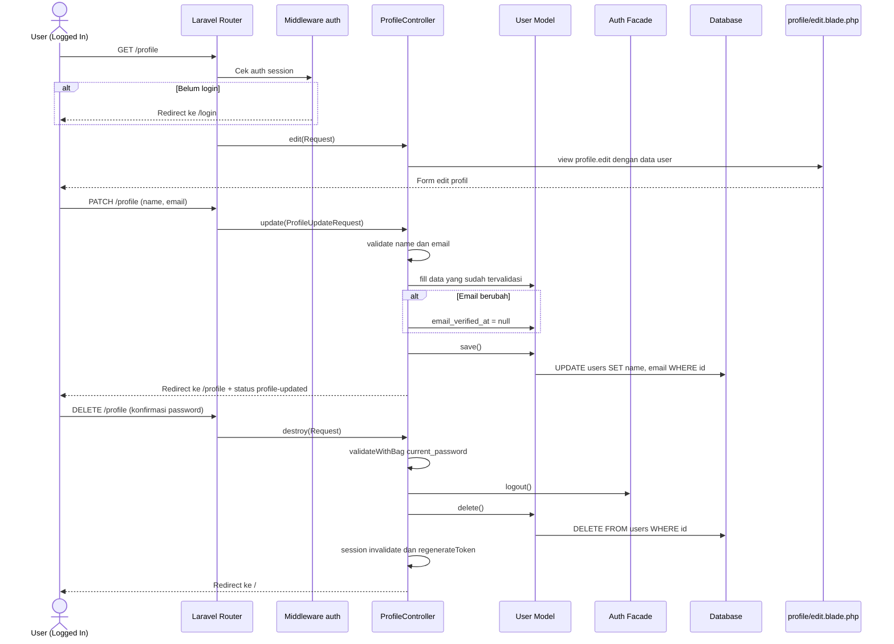
```mermaid
sequenceDiagram
    actor User as User (Logged In)
    participant Router as Laravel Router
    participant Middleware as Middleware auth
    participant PC as ProfileController
    participant UserM as User Model
    participant AuthFacade as Auth Facade
    participant DB as Database
    participant View as profile/edit.blade.php

    User->>Router: GET /profile
    Router->>Middleware: Cek auth session
    alt Belum login
        Middleware-->>User: Redirect ke /login
    end

    Router->>PC: edit(Request)
    PC->>View: view profile.edit dengan data user
    View-->>User: Form edit profil

    User->>Router: PATCH /profile (name, email)
    Router->>PC: update(ProfileUpdateRequest)
    PC->>PC: validate name dan email
    PC->>UserM: fill data yang sudah tervalidasi
    alt Email berubah
        PC->>UserM: email_verified_at = null
    end
    PC->>UserM: save()
    UserM->>DB: UPDATE users SET name, email WHERE id
    PC-->>User: Redirect ke /profile + status profile-updated

    User->>Router: DELETE /profile (konfirmasi password)
    Router->>PC: destroy(Request)
    PC->>PC: validateWithBag current_password
    PC->>AuthFacade: logout()
    PC->>UserM: delete()
    UserM->>DB: DELETE FROM users WHERE id
    PC->>PC: session invalidate dan regenerateToken
    PC-->>User: Redirect ke /
```

---

## 14. Admin Panel — Manajemen Produk

### Deskripsi
Halaman admin (dikelola oleh **Filament v3**) untuk mengelola produk. Admin dapat membuat produk baru dengan informasi: nama, slug (auto-generated dari nama), kategori, gambar, deskripsi, harga, harga diskon, stok, berat, dan meta SEO. Terdapat aksi cepat "Flash Sale" untuk toggle promosi.

### Aktor
- **Admin** — Pengelola toko (harus login sebagai admin)
- **Filament Framework** — UI & CRUD handler
- **ProductResource** — Definisi resource
- **Product Model** — Data produk
- **Database** — Penyimpanan
- **File Storage** — Penyimpanan gambar

### Sequence Diagram

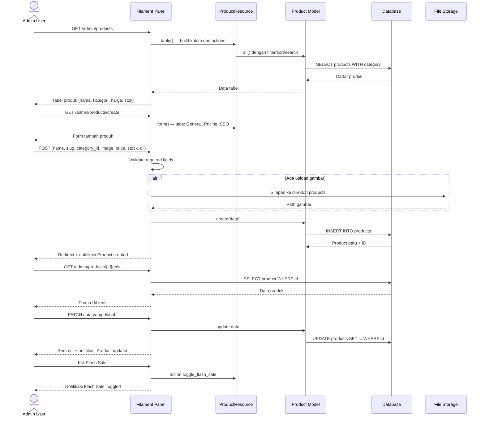
```mermaid
sequenceDiagram
    actor Admin as Admin User
    participant Filament as Filament Panel
    participant PR as ProductResource
    participant ProductM as Product Model
    participant DB as Database
    participant Storage as File Storage

    Admin->>Filament: GET /admin/products
    Filament->>PR: table() — build kolom dan actions
    PR->>ProductM: all() dengan filter/sort/search
    ProductM->>DB: SELECT products WITH category
    DB-->>ProductM: Daftar produk
    ProductM-->>Filament: Data tabel
    Filament-->>Admin: Tabel produk (nama, kategori, harga, stok)

    Admin->>Filament: GET /admin/products/create
    Filament->>PR: form() — tabs: General, Pricing, SEO
    Filament-->>Admin: Form tambah produk

    Admin->>Filament: POST (name, slug, category_id, image, price, stock, dll)
    Filament->>Filament: Validate required fields
    alt Ada upload gambar
        Filament->>Storage: Simpan ke direktori products
        Storage-->>Filament: Path gambar
    end
    Filament->>ProductM: create(data)
    ProductM->>DB: INSERT INTO products
    DB-->>ProductM: Product baru + ID
    Filament-->>Admin: Redirect + notifikasi Product created

    Admin->>Filament: GET /admin/products/{id}/edit
    Filament->>DB: SELECT product WHERE id
    DB-->>Filament: Data produk
    Filament-->>Admin: Form edit terisi

    Admin->>Filament: PATCH data yang diubah
    Filament->>ProductM: update data
    ProductM->>DB: UPDATE products SET ... WHERE id
    Filament-->>Admin: Redirect + notifikasi Product updated

    Admin->>Filament: Klik Flash Sale
    Filament->>PR: action toggle_flash_sale
    Filament-->>Admin: Notifikasi Flash Sale Toggled
```

---

## 15. Admin Panel — Manajemen Pesanan

### Deskripsi
Halaman terpenting dalam proses bisnis. Admin dapat melihat semua pesanan dan mengelola status melalui alur: `pending → processing → shipped → completed`. Setiap perubahan status penting dikirimkan notifikasi **WhatsApp otomatis** ke nomor pelanggan menggunakan **FonnteService**.

### Aktor
- **Admin** — Pengelola toko
- **Filament Framework** — UI & CRUD
- **OrderResource** — Definisi resource
- **Order Model** — Data pesanan
- **FonnteService** — Kirim WhatsApp
- **Setting Model** — Info rekening bank
- **Database** — Penyimpanan

### Sequence Diagram

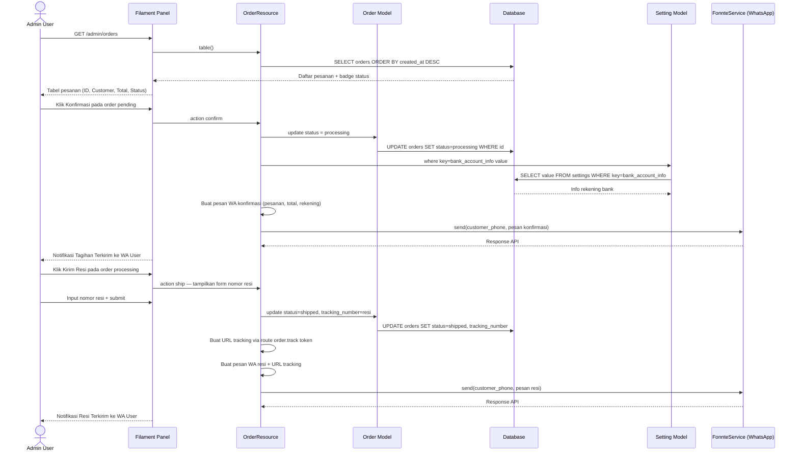
```mermaid
sequenceDiagram
    actor Admin as Admin User
    participant Filament as Filament Panel
    participant OR as OrderResource
    participant OrderM as Order Model
    participant DB as Database
    participant Setting as Setting Model
    participant Fonnte as FonnteService (WhatsApp)

    Admin->>Filament: GET /admin/orders
    Filament->>OR: table()
    OR->>DB: SELECT orders ORDER BY created_at DESC
    DB-->>Filament: Daftar pesanan + badge status
    Filament-->>Admin: Tabel pesanan (ID, Customer, Total, Status)

    Admin->>Filament: Klik Konfirmasi pada order pending
    Filament->>OR: action confirm
    OR->>OrderM: update status = processing
    OrderM->>DB: UPDATE orders SET status=processing WHERE id

    OR->>Setting: where key=bank_account_info value
    Setting->>DB: SELECT value FROM settings WHERE key=bank_account_info
    DB-->>Setting: Info rekening bank
    OR->>OR: Buat pesan WA konfirmasi (pesanan, total, rekening)

    OR->>Fonnte: send(customer_phone, pesan konfirmasi)
    Fonnte-->>OR: Response API
    Filament-->>Admin: Notifikasi Tagihan Terkirim ke WA User

    Admin->>Filament: Klik Kirim Resi pada order processing
    Filament->>OR: action ship — tampilkan form nomor resi
    Admin->>Filament: Input nomor resi + submit

    OR->>OrderM: update status=shipped, tracking_number=resi
    OrderM->>DB: UPDATE orders SET status=shipped, tracking_number

    OR->>OR: Buat URL tracking via route order.track token
    OR->>OR: Buat pesan WA resi + URL tracking
    OR->>Fonnte: send(customer_phone, pesan resi)
    Fonnte-->>OR: Response API
    Filament-->>Admin: Notifikasi Resi Terkirim ke WA User
```

---

## 16. Admin Panel — Manajemen Ulasan

### Deskripsi
Halaman moderasi ulasan produk. Admin dapat melihat semua ulasan yang masuk dan menyetujui atau menghapusnya. Ulasan yang belum disetujui (`is_approved = false`) tidak akan tampil di halaman produk publik.

### Aktor
- **Admin** — Moderator konten
- **Filament Framework** — UI admin panel
- **ReviewResource** — Definisi resource
- **Review Model** — Data ulasan
- **Database** — Penyimpanan

### Sequence Diagram

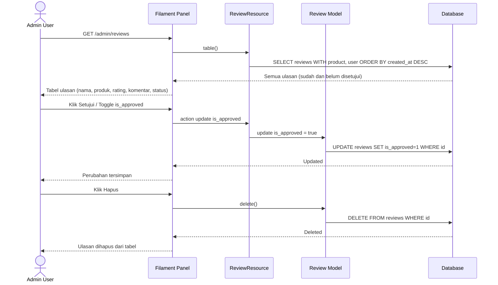
```mermaid
sequenceDiagram
    actor Admin as Admin User
    participant Filament as Filament Panel
    participant RR as ReviewResource
    participant ReviewM as Review Model
    participant DB as Database

    Admin->>Filament: GET /admin/reviews
    Filament->>RR: table()
    RR->>DB: SELECT reviews WITH product, user ORDER BY created_at DESC
    DB-->>Filament: Semua ulasan (sudah dan belum disetujui)
    Filament-->>Admin: Tabel ulasan (nama, produk, rating, komentar, status)

    Admin->>Filament: Klik Setujui / Toggle is_approved
    Filament->>RR: action update is_approved
    RR->>ReviewM: update is_approved = true
    ReviewM->>DB: UPDATE reviews SET is_approved=1 WHERE id
    DB-->>Filament: Updated
    Filament-->>Admin: Perubahan tersimpan

    Admin->>Filament: Klik Hapus
    Filament->>ReviewM: delete()
    ReviewM->>DB: DELETE FROM reviews WHERE id
    DB-->>Filament: Deleted
    Filament-->>Admin: Ulasan dihapus dari tabel
```

---

## 17. API Shipping

### Deskripsi
Endpoint API internal yang digunakan oleh halaman Cart/Checkout untuk menghitung ongkos kirim secara real-time. Mengintegrasikan layanan **RajaOngkir** untuk data wilayah (provinsi & kota) dan kalkulasi biaya pengiriman. Terdapat juga fitur **reverse geocode** untuk mendapatkan alamat dari koordinat GPS.

### Aktor
- **Browser/JavaScript** — Request fetch/axios dari halaman cart
- **ShippingController** — Handler API
- **RajaOngkir API** — Layanan data wilayah & tarif
- **GeoCoding Service** — Reverse geocode koordinat

### Sequence Diagram

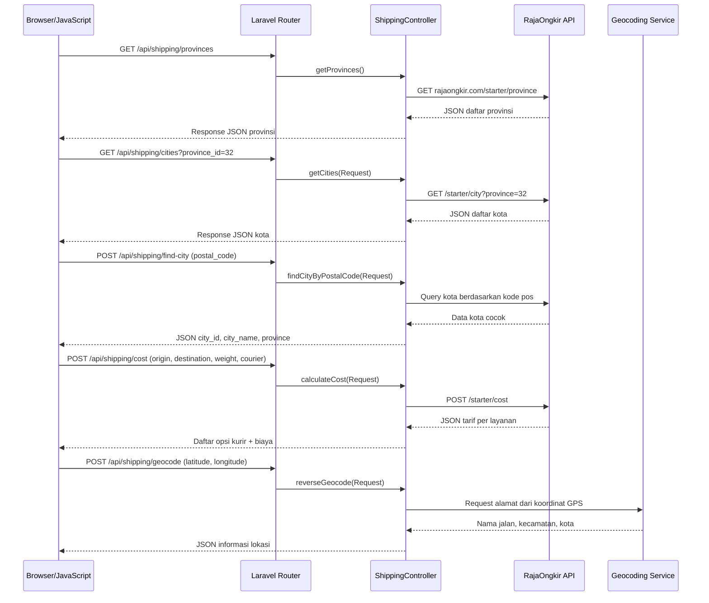
```mermaid
sequenceDiagram
    participant JS as Browser/JavaScript
    participant Router as Laravel Router
    participant SC as ShippingController
    participant RO as RajaOngkir API
    participant Geo as Geocoding Service

    JS->>Router: GET /api/shipping/provinces
    Router->>SC: getProvinces()
    SC->>RO: GET rajaongkir.com/starter/province
    RO-->>SC: JSON daftar provinsi
    SC-->>JS: Response JSON provinsi

    JS->>Router: GET /api/shipping/cities?province_id=32
    Router->>SC: getCities(Request)
    SC->>RO: GET /starter/city?province=32
    RO-->>SC: JSON daftar kota
    SC-->>JS: Response JSON kota

    JS->>Router: POST /api/shipping/find-city (postal_code)
    Router->>SC: findCityByPostalCode(Request)
    SC->>RO: Query kota berdasarkan kode pos
    RO-->>SC: Data kota cocok
    SC-->>JS: JSON city_id, city_name, province

    JS->>Router: POST /api/shipping/cost (origin, destination, weight, courier)
    Router->>SC: calculateCost(Request)
    SC->>RO: POST /starter/cost
    RO-->>SC: JSON tarif per layanan
    SC-->>JS: Daftar opsi kurir + biaya

    JS->>Router: POST /api/shipping/geocode (latitude, longitude)
    Router->>SC: reverseGeocode(Request)
    SC->>Geo: Request alamat dari koordinat GPS
    Geo-->>SC: Nama jalan, kecamatan, kota
    SC-->>JS: JSON informasi lokasi
```

---

## Diagram Alur Sistem Keseluruhan

### Customer Journey (Alur Pembelian)

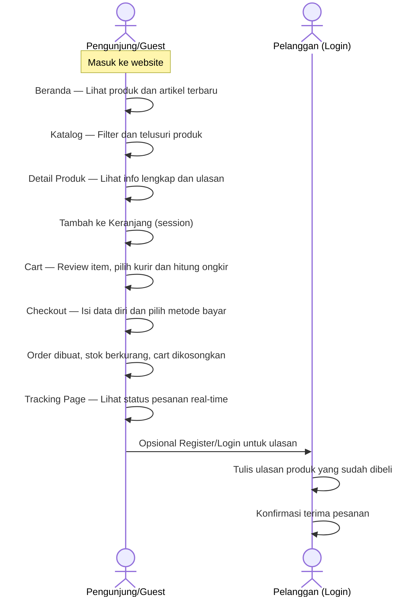
```mermaid
sequenceDiagram
    actor Guest as Pengunjung/Guest
    actor Customer as Pelanggan (Login)

    Note over Guest: Masuk ke website
    Guest->>Guest: Beranda — Lihat produk dan artikel terbaru
    Guest->>Guest: Katalog — Filter dan telusuri produk
    Guest->>Guest: Detail Produk — Lihat info lengkap dan ulasan
    Guest->>Guest: Tambah ke Keranjang (session)
    Guest->>Guest: Cart — Review item, pilih kurir dan hitung ongkir
    Guest->>Guest: Checkout — Isi data diri dan pilih metode bayar
    Guest->>Guest: Order dibuat, stok berkurang, cart dikosongkan
    Guest->>Guest: Tracking Page — Lihat status pesanan real-time
    Guest->>Customer: Opsional Register/Login untuk ulasan
    Customer->>Customer: Tulis ulasan produk yang sudah dibeli
    Customer->>Customer: Konfirmasi terima pesanan
```

### Admin Workflow

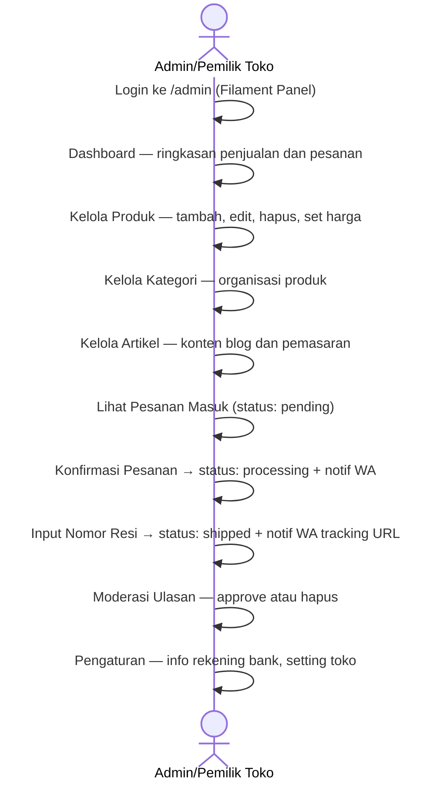
```mermaid
sequenceDiagram
    actor Admin as Admin/Pemilik Toko

    Admin->>Admin: Login ke /admin (Filament Panel)
    Admin->>Admin: Dashboard — ringkasan penjualan dan pesanan
    Admin->>Admin: Kelola Produk — tambah, edit, hapus, set harga
    Admin->>Admin: Kelola Kategori — organisasi produk
    Admin->>Admin: Kelola Artikel — konten blog dan pemasaran
    Admin->>Admin: Lihat Pesanan Masuk (status: pending)
    Admin->>Admin: Konfirmasi Pesanan → status: processing + notif WA
    Admin->>Admin: Input Nomor Resi → status: shipped + notif WA tracking URL
    Admin->>Admin: Moderasi Ulasan — approve atau hapus
    Admin->>Admin: Pengaturan — info rekening bank, setting toko
```

---

## Catatan Teknis

| Aspek | Detail |
|-------|--------|
| **Framework** | Laravel 10 + Filament v3 + Livewire 3 |
| **Autentikasi** | Laravel Breeze (session-based) |
| **Session Cart** | PHP Session — tidak perlu login untuk belanja |
| **Transaksi DB** | `DB::beginTransaction()` pada proses checkout |
| **WhatsApp Notif** | Fonnte API — kirim WA saat konfirmasi dan pengiriman resi |
| **Shipping API** | RajaOngkir Starter Plan (provinsi, kota, tarif) |
| **Real-time Reviews** | Livewire component (ProductReviews) |
| **Admin Panel** | Filament v3 Resources (Product, Order, Category, Article, Review, Setting) |
| **File Storage** | Laravel Storage `storage/app/public` — gambar produk dan ulasan |
| **Tracking Token** | `bin2hex(random_bytes(16))` — 32 karakter hex unik per order |
| **Route Model Binding** | Produk dan artikel diakses by slug (SEO-friendly URL) |

---

*Dokumentasi ini dibuat berdasarkan analisis kode sumber proyek WEBSITE-IVO-KARYA.*  
*Dibuat oleh: Sistem Dokumentasi Antigravity AI — 2 April 2026*
