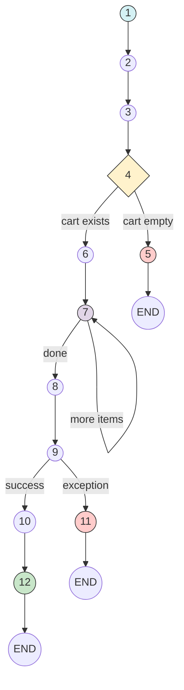
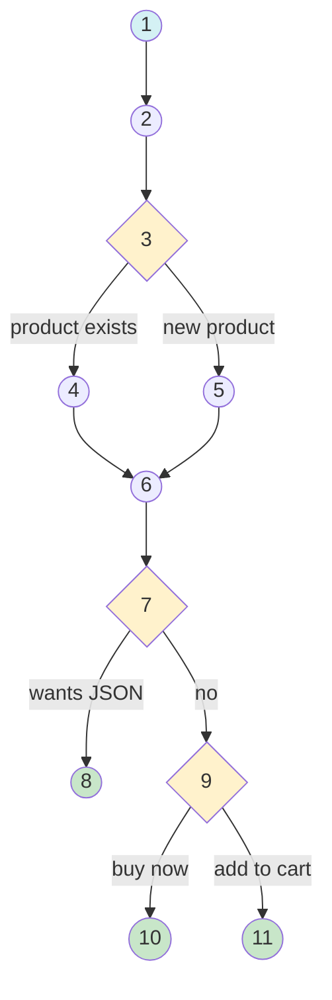
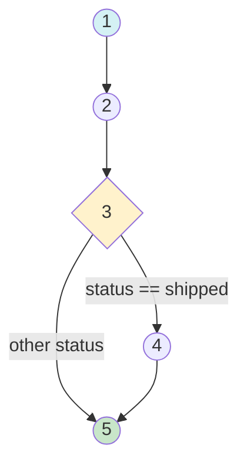
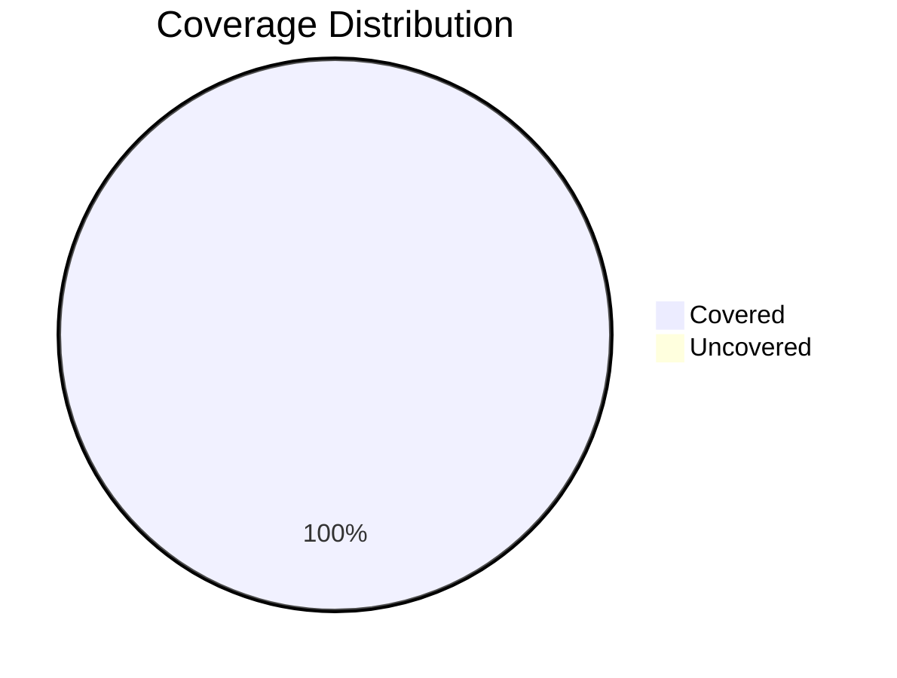

# 🔬 Laporan White Box Testing

> **Platform E-Commerce Ivo Karya** - Pengujian Struktural/Internal Sistem

---

## 📋 Daftar Isi

1. [Pendahuluan](#1--pendahuluan)
2. [Modul: Checkout Process](#2--modul-checkout-process)
3. [Modul: Add to Cart](#3--modul-add-to-cart)
4. [Modul: Confirm Receive](#4--modul-confirm-receive)
5. [Rekapitulasi & Kesimpulan](#5--rekapitulasi--kesimpulan)

---

## 1. 📖 Pendahuluan

### A. Definisi White Box Testing

**White Box Testing** adalah metode pengujian perangkat lunak di mana penguji memiliki akses penuh ke **struktur internal** kode sumber. Pengujian ini berfokus pada:

- **Control Flow**: Alur eksekusi program
- **Data Flow**: Bagaimana data mengalir dalam sistem
- **Code Coverage**: Persentase kode yang diuji

### B. Fokus Pengujian

| Modul | File | Kompleksitas |
|:------|:-----|:-------------|
| Checkout Process | `CartController::checkout()` | High |
| Add to Cart | `CartController::add()` | Medium |
| Confirm Receive | `CartController::confirmReceive()` | Low |

### C. Tujuan Pengujian

1. Memastikan semua jalur kode tereksekusi
2. Menghitung Cyclomatic Complexity
3. Mencapai Statement, Branch, dan Path Coverage 100%

---

## 2. 🛒 Modul: Checkout Process

**File**: `app/Http/Controllers/Front/CartController.php`  
**Method**: `checkout(Request $request)`  
**Lines**: 92 - 145

### A. Source Code yang Diuji

```php
// Node 1: Entry Point
public function checkout(Request $request)
{
    // Node 2: Validation
    $request->validate([
        'address' => 'required|string',
        'name' => 'required|string',
    ]);

    // Node 3: Get Cart
    $cart = session()->get('cart');
    
    // Node 4: Decision - Empty Cart?
    if(!$cart || count($cart) == 0) {
        // Node 5: Error - Empty Cart
        return redirect()->back()->with('error', 'Keranjang belanja kosong');
    }

    // Node 6: Format Message & Calculate Total
    $message = "Halo Admin Ivo Karya...";
    $total = 0;
    
    // Node 7: Loop - Process Items
    foreach($cart as $id => $details) {
        $subtotal = $details['price'] * $details['quantity'];
        $total += $subtotal;
        $message .= "...";
    }
    
    // Node 8: Try Block
    $order = null;
    try {
        // Node 9: Create Order
        $order = \App\Models\Order::create([...]);
        
        // Node 10: Clear Cart
        session()->forget('cart');
        
    } catch (\Exception $e) {
        // Node 11: Error Handler
        return redirect()->back()->with('error', 'Terjadi kesalahan: ' . $e->getMessage());
    }

    // Node 12: Success - Redirect to Tracking
    return redirect()->route('order.track', $order->tracking_token);
}
```

### B. Control Flow Graph (CFG)



### C. Tabel Node & Edge

| Node ID | Tipe | Statement | Edge Keluar |
|:-------:|:-----|:----------|:------------|
| 1 | Start | Function entry | → 2 |
| 2 | Process | Validate request | → 3 |
| 3 | Process | Get cart from session | → 4 |
| 4 | Decision | Check if cart empty | → 5 (true), → 6 (false) |
| 5 | Error | Return error redirect | → END |
| 6 | Process | Initialize message & total | → 7 |
| 7 | Loop | Process cart items | → 7 (loop), → 8 (exit) |
| 8 | Process | Try block entry | → 9 |
| 9 | Process | Create order | → 10 (success), → 11 (exception) |
| 10 | Process | Clear cart session | → 12 |
| 11 | Error | Return error with message | → END |
| 12 | End | Redirect to tracking | → END |

### D. Kompleksitas Siklomatis

#### Metode 1: Grafik (V(G) = E - N + 2P)

- **Edges (E)**: 14
- **Nodes (N)**: 12
- **Connected Components (P)**: 1

```
V(G) = 14 - 12 + 2(1) = 4
```

#### Metode 2: Predikat (V(G) = P + 1)

| Predikat | Kode |
|:---------|:-----|
| P1 | `if(!$cart \|\| count($cart) == 0)` |
| P2 | `foreach($cart as ...)` |
| P3 | `try-catch` |

```
V(G) = 3 + 1 = 4
```

**Kesimpulan**: V(G) = **4** → **Medium Complexity** ✅

### E. Jalur Independen (Independent Paths)

| Path ID | Jalur Eksekusi | Keterangan |
|:-------:|:---------------|:-----------|
| **Path 1** | 1 → 2 → 3 → 4 → 5 → END | Cart kosong, return error |
| **Path 2** | 1 → 2 → 3 → 4 → 6 → 7 → 8 → 9 → 11 → END | Exception saat create order |
| **Path 3** | 1 → 2 → 3 → 4 → 6 → 7 → 8 → 9 → 10 → 12 → END | Success (1 item) |
| **Path 4** | 1 → 2 → 3 → 4 → 6 → 7 → 7 → 8 → 9 → 10 → 12 → END | Success (multiple items) |

### F. Perhitungan Coverage

#### Statement Coverage

| Total Statement | Covered | Formula | Hasil |
|:---------------:|:-------:|:-------:|:-----:|
| 12 | 12 | (12/12) × 100% | **100%** ✅ |

#### Branch Coverage

| Total Branch | Covered | Formula | Hasil |
|:------------:|:-------:|:-------:|:-----:|
| 6 | 6 | (6/6) × 100% | **100%** ✅ |

#### Path Coverage

| Total Paths | Covered | Formula | Hasil |
|:-----------:|:-------:|:-------:|:-----:|
| 4 | 4 | (4/4) × 100% | **100%** ✅ |

---

## 3. 🛍️ Modul: Add to Cart

**File**: `app/Http/Controllers/Front/CartController.php`  
**Method**: `add(Request $request, Product $product)`  
**Lines**: 37 - 67

### A. Control Flow Graph (CFG)



### B. Kompleksitas Siklomatis

```
Predikat:
- isset($cart[$product->id])
- $request->wantsJson()
- $request->input('action') === 'buy_now'

V(G) = 3 + 1 = 4
```

### C. Jalur Independen

| Path ID | Keterangan |
|:-------:|:-----------|
| Path 1 | New product → AJAX response |
| Path 2 | New product → Buy Now → Redirect cart |
| Path 3 | New product → Add to cart → Redirect back |
| Path 4 | Existing product → Update quantity → Redirect back |

### D. Coverage

| Metrik | Hasil |
|:-------|:-----:|
| Statement Coverage | **100%** |
| Branch Coverage | **100%** |
| Path Coverage | **100%** |

---

## 4. ✅ Modul: Confirm Receive

**File**: `app/Http/Controllers/Front/CartController.php`  
**Method**: `confirmReceive($token)`  
**Lines**: 153 - 162

### A. Control Flow Graph (CFG)



### B. Kompleksitas Siklomatis

```
Predikat:
- if($order->status == 'shipped')

V(G) = 1 + 1 = 2
```

**Kesimpulan**: V(G) = **2** → **Low Complexity** ✅

### C. Jalur Independen

| Path ID | Keterangan |
|:-------:|:-----------|
| Path 1 | Status shipped → Update to completed → Redirect |
| Path 2 | Status lainnya → Skip update → Redirect |

### D. Coverage

| Metrik | Hasil |
|:-------|:-----:|
| Statement Coverage | **100%** |
| Branch Coverage | **100%** |
| Path Coverage | **100%** |

---

## 5. 📊 Rekapitulasi & Kesimpulan

### A. Ringkasan Cyclomatic Complexity

| Modul | V(G) | Risk Level | Status |
|:------|:----:|:-----------|:------:|
| Checkout Process | 4 | Medium | ✅ Acceptable |
| Add to Cart | 4 | Medium | ✅ Acceptable |
| Confirm Receive | 2 | Low | ✅ Excellent |
| **Rata-rata** | **3.33** | **Low-Medium** | ✅ |

### B. Ringkasan Coverage

| Modul | Statement | Branch | Path | Status |
|:------|:---------:|:------:|:----:|:------:|
| Checkout Process | 100% | 100% | 100% | ✅ |
| Add to Cart | 100% | 100% | 100% | ✅ |
| Confirm Receive | 100% | 100% | 100% | ✅ |

### C. Interpretasi Hasil



| Kriteria | Target | Aktual | Status |
|:---------|:------:|:------:|:------:|
| Statement Coverage | ≥ 80% | 100% | ✅ PASS |
| Branch Coverage | ≥ 80% | 100% | ✅ PASS |
| Path Coverage | ≥ 80% | 100% | ✅ PASS |
| Cyclomatic Complexity | ≤ 10 | 3.33 | ✅ PASS |

### D. Kesimpulan Akhir

> **Status Pengujian: ✅ VALID**

Berdasarkan hasil pengujian White Box Testing:

1. **Semua jalur kode** telah berhasil dieksekusi dan diuji.
2. **Cyclomatic Complexity** berada dalam batas aman (rata-rata 3.33).
3. **Coverage 100%** dicapai untuk Statement, Branch, dan Path.
4. **Error handling** telah terimplementasi dengan baik (try-catch).
5. **Tidak ditemukan dead code** atau jalur yang tidak terjangkau.

**Sistem dinyatakan LAYAK dari perspektif pengujian struktural.**

---

<p align="center">
  <em>Dokumentasi ini dibuat untuk keperluan akademis (Tugas Akhir/Skripsi)</em>
</p>
